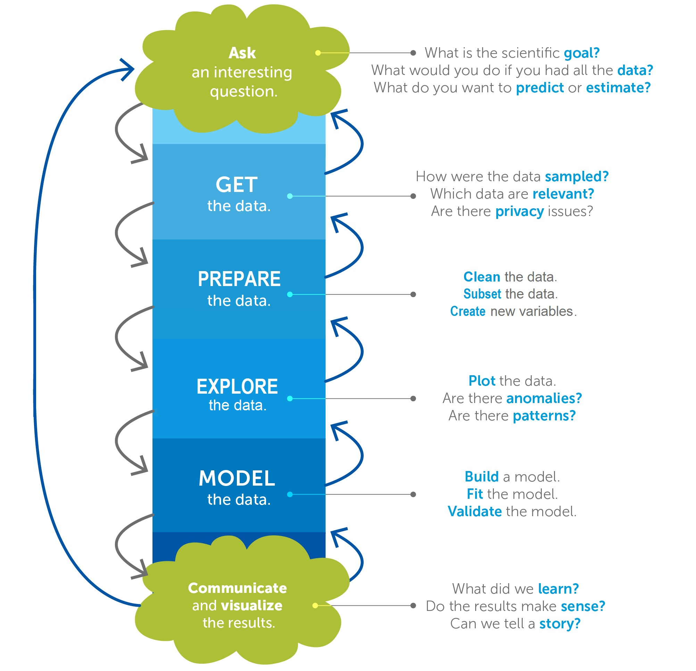
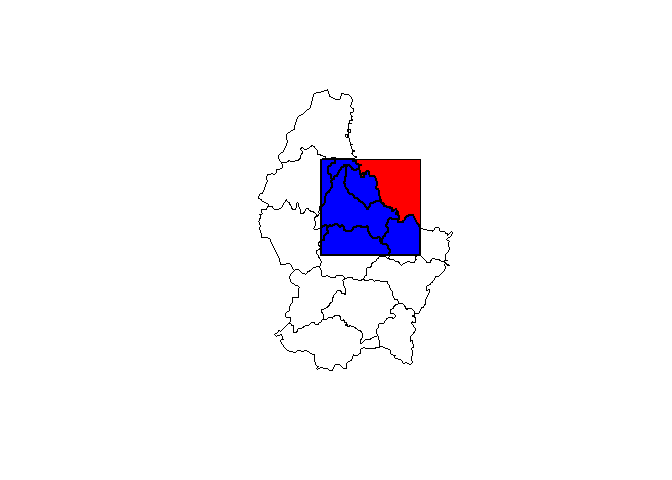
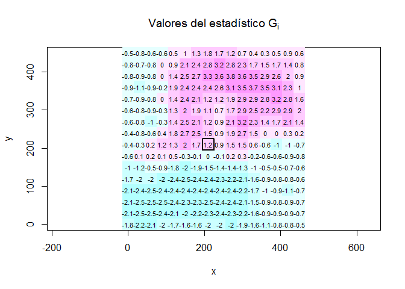
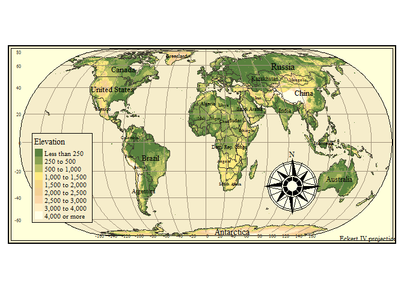

# Intro a Spatial Data Science con R
Alí Santacruz  
Julio 13, 2016  


<br>

Hay una gran cantidad de paquetes de R útiles para trabajar con datos espaciales. Para los ejemplos de este documento se requiere tener instalados los siguientes: 


```r
install.packages(c("rgdal", "raster", "mapview", "ggplot2", "rgl", "spdep", "caret", "tmap", "geospt" "twitteR", "MODISTools"))
```

Este documento fue generado con [RStudio IDE] versión 0.99.1246, actualmente en Preview.

<br>


## The Data Science Process



<br>


#### **1. PLANTEAR las preguntas apropiadas** 

Ver la diapositiva 13 de la **[presentación del webinar]**.

<br>

#### **2. OBTENER los datos**  


*a. Importar capas vector*

En R podemos importar archivos vector con el paquete **[rgdal]** como objetos de clase Spatial___DataFrame:


```r
library(rgdal)
myShp <- readOGR("data/llanos.shp", layer = "llanos")
```

```
## OGR data source with driver: ESRI Shapefile 
## Source: "data/llanos.shp", layer: "llanos"
## with 1 features
## It has 5 fields
```

```r
summary(myShp)
```

```
## Object of class SpatialPolygonsDataFrame
## Coordinates:
##          min        max
## x -73.890084 -67.409803
## y   2.581074   7.104381
## Is projected: FALSE 
## proj4string :
## [+proj=longlat +datum=WGS84 +no_defs +ellps=WGS84 +towgs84=0,0,0]
## Data attributes:
##       cat        Country   ecoregion      AREA             PERIMETER      
##  Min.   :3   Colombia:1   Llanos:1   Min.   :1.533e+11   Min.   :2792892  
##  1st Qu.:3                           1st Qu.:1.533e+11   1st Qu.:2792892  
##  Median :3                           Median :1.533e+11   Median :2792892  
##  Mean   :3                           Mean   :1.533e+11   Mean   :2792892  
##  3rd Qu.:3                           3rd Qu.:1.533e+11   3rd Qu.:2792892  
##  Max.   :3                           Max.   :1.533e+11   Max.   :2792892
```

```r
# Ejemplo KML
# myKML <- readOGR("data/llanos_kml.kml", layer = "llanos_kml")
```

Shapefiles también pueden ser importados con el comando `shapefile` del paquete **[raster]** de manera más simple:


```r
library(raster)
shp <- shapefile("data/llanos.shp")
shp
```

```
## class       : SpatialPolygonsDataFrame 
## features    : 1 
## extent      : -73.89008, -67.4098, 2.581074, 7.104381  (xmin, xmax, ymin, ymax)
## coord. ref. : +proj=longlat +datum=WGS84 +no_defs +ellps=WGS84 +towgs84=0,0,0 
## variables   : 5
## names       : cat,  Country, ecoregion,         AREA, PERIMETER 
## min values  :   3, Colombia,    Llanos, 153281453591,   2792892 
## max values  :   3, Colombia,    Llanos, 153281453591,   2792892
```

```r
spplot(shp)
```

<!-- -->


Podemos generar mapas web para visualizar información geográfica usando paquetes como **[leaflet]** o **[mapview]**. Con  **[mapview]** solo necesitamos una línea de código para crear un mapa web con los elementos básicos:


```r
library(mapview)
mapView(shp)
```

<!--html_preserve--><div id="htmlwidget-6515" style="width:672px;height:480px;" class="leaflet html-widget"></div>
<script type="application/json" data-for="htmlwidget-6515">{"x":{"calls":[{"method":"addProviderTiles","args":["CartoDB.Positron",1,"CartoDB.Positron",{"errorTileUrl":"","noWrap":false,"zIndex":null,"unloadInvisibleTiles":null,"updateWhenIdle":null,"detectRetina":false,"reuseTiles":false}]},{"method":"addProviderTiles","args":["OpenStreetMap",2,"OpenStreetMap",{"errorTileUrl":"","noWrap":false,"zIndex":null,"unloadInvisibleTiles":null,"updateWhenIdle":null,"detectRetina":false,"reuseTiles":false}]},{"method":"addProviderTiles","args":["Esri.WorldImagery",3,"Esri.WorldImagery",{"errorTileUrl":"","noWrap":false,"zIndex":null,"unloadInvisibleTiles":null,"updateWhenIdle":null,"detectRetina":false,"reuseTiles":false}]},{"method":"addProviderTiles","args":["Thunderforest.Landscape",4,"Thunderforest.Landscape",{"errorTileUrl":"","noWrap":false,"zIndex":null,"unloadInvisibleTiles":null,"updateWhenIdle":null,"detectRetina":false,"reuseTiles":false}]},{"method":"addProviderTiles","args":["OpenTopoMap",5,"OpenTopoMap",{"errorTileUrl":"","noWrap":false,"zIndex":null,"unloadInvisibleTiles":null,"updateWhenIdle":null,"detectRetina":false,"reuseTiles":false}]},{"method":"addPolygons","args":[[[{"lng":[-67.8354678429295,-67.8596875926381,-67.8811264893242,-67.8972316457385,-67.9107895417755,-67.9202045983451,-67.9254605545552,-67.9335024877453,-67.9443666077372,-67.9591594933892,-67.9700695462107,-67.9823606014005,-67.9960935115759,-68.0083994865534,-68.0189745985236,-68.0258864835266,-68.0283884816268,-68.0339585915682,-68.0378726050786,-68.0367735699332,-68.0340425782381,-68.0299376249731,-68.0313335471292,-68.0355146080751,-68.0502245128856,-68.0596315228282,-68.0690304861436,-68.0756376051469,-68.0797806122523,-68.0850446150894,-68.0931475685348,-68.0998385065699,-68.109344590608,-68.1176906192456,-68.1243815572806,-68.132476631737,-68.1366655716718,-68.1461336018697,-68.1542055422731,-68.1675414855139,-68.1878204944373,-68.1916656087036,-68.1957625153415,-68.199592542182,-68.2037275026604,-68.2103575880783,-68.2142716015888,-68.221252553474,-68.2293545010909,-68.2374495755473,-68.2535704899396,-68.263000633935,-68.2898404937561,-68.2951125432203,-68.300704613748,-68.3021166291582,-68.3154906262394,-68.3207395416508,-68.3234934997606,-68.3276596409189,-68.3343425323269,-68.3396455948328,-68.3505175938138,-68.3572004852218,-68.3666535956319,-68.3721846459044,-68.3774186415282,-68.3812716347834,-68.3840255928934,-68.3853915078361,-68.3906476316843,-68.394828524992,-68.4015125898665,-68.4137875518023,-68.4246825171979,-68.4300004994915,-68.4342115676508,-68.4356535902744,-68.4329296393779,-68.4371645121423,-68.4399794905073,-68.4438785842301,-68.4495165875873,-68.4534755280988,-68.4590605578279,-68.4628905846684,-68.4642635404098,-68.4670185043481,-68.4695055826606,-68.4736785969795,-68.4764935753445,-68.4779585643829,-68.4780505976798,-68.4819646111903,-68.486129578882,-68.4874805740371,-68.488517583099,-68.4884335964291,-68.489776544957,-68.492538549694,-68.4950256280066,-68.4992065213144,-68.5020214996794,-68.5101165741357,-68.5154186308132,-68.5224155083146,-68.5291515409888,-68.5373005949016,-68.5387194834724,-68.5373916223701,-68.5349275104724,-68.5363546133083,-68.5416565023478,-68.5444035872971,-68.5496446237196,-68.5548705727162,-68.5604095019778,-68.5684586436047,-68.5779186271753,-68.5899045810893,-68.5928645663794,-68.6021046088106,-68.6022264816829,-68.5983426430239,-68.5956114836906,-68.5970535063143,-68.5984645158962,-68.6037675784022,-68.6065676369795,-68.6080165327638,-68.6041486197209,-68.6028215968089,-68.6070324973301,-68.6095655084721,-68.6096035623125,-68.6099245892044,-68.6138535225026,-68.6194075391899,-68.6246566222394,-68.6271205664991,-68.6270986059127,-68.6282655344739,-68.6330715501211,-68.6337885381194,-68.6365505428564,-68.6379695990653,-68.638008491096,-68.6422195592554,-68.647537541549,-68.6503525199141,-68.6532365651613,-68.653259531576,-68.6546856285836,-68.6561045171545,-68.6575245791918,-68.6617125132983,-68.6670155758043,-68.6708905296459,-68.6735615069142,-68.6735304938725,-68.6749036172519,-68.6748804831991,-68.6787415230815,-68.6815565014465,-68.6829755576555,-68.683013611496,-68.6816555755422,-68.6830825107401,-68.688377526619,-68.6939395899334,-68.7019426310927,-68.7058256315614,-68.7113645608229,-68.7152556079187,-68.7289506318918,-68.740905572764,-68.7450866337098,-68.7493136274851,-68.7507175962683,-68.757415575102,-68.7601924996267,-68.7640765059237,-68.7682495202425,-68.7735445361214,-68.7749635923304,-68.7708125385979,-68.7655485357607,-68.7627865310238,-68.7631305243305,-68.7698216300035,-68.7751386064689,-68.7832105468723,-68.7940525386399,-68.7982325937574,-68.8010105241104,-68.8021315198421,-68.8035435352523,-68.7955394882646,-68.7955705013064,-68.8011774916218,-68.8050685387175,-68.8145365689152,-68.8173366274926,-68.8173676405345,-68.8107295084894,-68.8068315882331,-68.8026966277547,-68.7999646302311,-68.7933125842269,-68.7908176269253,-68.7839045684559,-68.7828295055537,-68.7828905258088,-68.7842866156031,-68.7910005200528,-68.7962796103157,-68.8004304964101,-68.8018036197895,-68.8031846221581,-68.8056866202583,-68.8098525937784,-68.8151544828179,-68.8206935797175,-68.8231965836461,-68.8273925643796,-68.8302536432122,-68.8330686215773,-68.838439577499,-68.8398896467497,-68.8399194863251,-68.8413395483624,-68.8480226074084,-68.8535685774687,-68.8560335275568,-68.8615565312023,-68.8682325494496,-68.8721316431725,-68.8763044898532,-68.8777086262745,-68.8777926129444,-68.8844835509795,-68.8872606431422,-68.8895115194229,-68.8953245369186,-68.8995136444916,-68.9009325330624,-68.9034655442044,-68.911827498458,-68.9157185455537,-68.9185256449299,-68.9186015849726,-68.9241944936907,-68.9266964917909,-68.9295116377941,-68.9253535432629,-68.9161835735424,-68.9092555952852,-68.9053725948166,-68.9026416031215,-68.9040985455328,-68.9178165359205,-68.9220125166541,-68.9220354830688,-68.9273605061611,-68.9368365829859,-68.9434896348186,-68.9490356048788,-68.9515305621803,-68.9585036350765,-68.9624255275759,-68.9624865478312,-68.9600375233591,-68.9586865282039,-68.960121510029,-68.9643245315612,-68.9682465916987,-68.971046482638,-68.9724655388469,-68.9780576093746,-68.9833445786265,-68.988601540665,-68.9913554987749,-68.9979785433942,-69.0007175817164,-69.0018085702347,-69.0031966134019,-69.0045544817175,-69.0073164864544,-69.0098184845547,-69.011238546592,-69.0098726316493,-69.0021596043401,-68.9994205660178,-68.9966966151213,-69.0008845492278,-69.0089415698436,-69.0131075433638,-69.0156025006653,-69.0197755149841,-69.0236736028785,-69.0306245475504,-69.0358805037604,-69.0386425084974,-69.0411305926382,-69.0492176204676,-69.0533906347864,-69.0600735261944,-69.0656585559234,-69.0709995046318,-69.0710216328562,-69.0696716435295,-69.0672145724303,-69.0644835807352,-69.0686954870848,-69.0728685014036,-69.080924516191,-69.0861735992406,-69.0889285631788,-69.0928196102745,-69.0942225732293,-69.092857496477,-69.0928725839027,-69.0984644867923,-69.102355533888,-69.105117538625,-69.1078714967349,-69.111755503032,-69.1131365054005,-69.1145555616094,-69.1184844949074,-69.1240695246365,-69.12797549152,-69.1335375548342,-69.138389503311,-69.1448284813363,-69.1462175303319,-69.1591645532648,-69.1735074983539,-69.183792596474,-69.1940916085533,-69.209876576266,-69.2283246422582,-69.2426524999215,-69.2589945289198,-69.2767405267014,-69.293167548198,-69.3047784957635,-69.3088536094532,-69.3081356156265,-69.3190154935964,-69.3312916289986,-69.3456345740877,-69.3558955323266,-69.3592524845515,-69.3660435025106,-69.3742525708501,-69.3845064882904,-69.3892595303094,-69.395393574697,-69.4063566011464,-69.4159396310559,-69.4193265904942,-69.4213565198071,-69.4281926324053,-69.4343645629953,-69.4480515403412,-69.4651645367944,-69.5047836138468,-69.5232776126683,-69.5335385709072,-69.5465395732966,-69.5616145938098,-69.5732656068727,-69.5869296178039,-69.5999145269392,-69.6115645341736,-69.6280445292983,-69.6438065305963,-69.6629865043745,-69.6780776181418,-69.6870425665104,-69.6966395103791,-69.7048334912929,-69.715110542786,-69.7309116037528,-69.7398525798784,-69.7611545162664,-69.7748946348785,-69.788619498427,-69.8036955247684,-69.8153306122151,-69.8372425835168,-69.845458525017,-69.8557285357113,-69.8653415728341,-69.8728945057926,-69.8817595418753,-69.8926695946966,-69.9097975109374,-69.935150588772,-69.9563975398751,-69.9811176163811,-70.0030515482692,-70.0181275746107,-70.0215755543041,-70.0229946105131,-70.0319595588817,-70.0436325325308,-70.0546265720221,-70.0662614918308,-70.0813215925562,-70.0984426356364,-70.1192704915803,-70.1116484917397,-70.11102253121,-70.1193004987937,-70.1364595957143,-70.16519158636,-70.1918795660955,-70.2192764872022,-70.24049359873,-70.2589795509245,-70.2754365796345,-70.2857285509152,-70.2919615017603,-70.2886045495354,-70.2818296248304,-70.2722776079628,-70.2688826018975,-70.2696225563105,-70.2689976016092,-70.2615125620665,-70.2505795428305,-70.2458196276507,-70.242668534968,-70.2637175055179,-70.2918245414623,-70.3103636349231,-70.3213274995628,-70.3349995571211,-70.3459315705288,-70.3562165010109,-70.3617245848687,-70.3699495788243,-70.3822636004289,-70.3925555717096,-70.3967134986027,-70.3878635499456,-70.3687365497956,-70.3571316372004,-70.3551255124925,-70.3634036477144,-70.3908465016505,-70.4161756072418,-70.4428255331369,-70.4701235477861,-70.4810255539804,-70.4995046330143,-70.5173414906263,-70.5269774941638,-70.5434415636725,-70.5619355624941,-70.5804595685291,-70.5908206066919,-70.5915986149454,-70.5992206147861,-70.6081696375387,-70.6100994869275,-70.6101455873951,-70.6126024908562,-70.618118621341,-70.6258085145975,-70.6288375667699,-70.6297986357888,-70.6451495885548,-70.6574245504905,-70.675170548272,-70.7100065760919,-70.7489856110172,-70.8030855992852,-70.8145905995945,-70.8270875143265,-70.8449325862036,-70.8593295107492,-70.8716735395673,-70.8922725695543,-70.9210895526982,-70.940971594687,-70.9519505467525,-71.0014875945655,-71.0329745491495,-71.0549016078769,-71.0782016223457,-71.0967715612101,-71.1030425658957,-71.1003645478287,-71.1059415309307,-71.1142805187696,-71.1171115903888,-71.1232756419898,-71.1308134875224,-71.1383436217042,-71.1445006325065,-71.1513514972543,-71.1581954888415,-71.1670985787647,-71.177368589459,-71.1958615824521,-71.2246245861397,-71.2561185815224,-71.2951505900758,-71.3246005745482,-71.3424075925849,-71.349227611929,-71.3526765974508,-71.3677445771652,-71.3780135820313,-71.385551595202,-71.3841786394605,-71.3718565712289,-71.3595276298367,-71.3571775118222,-71.3609005855781,-71.3759615244938,-71.3971935558093,-71.4218445654331,-71.4492336075509,-71.4738846171748,-71.4923786159964,-71.5136036065131,-71.5560685073342,-71.573875525371,-71.5882565243005,-71.6053775673807,-71.6211315220516,-71.6327744884874,-71.6382295987171,-71.6519246226901,-71.6758955246897,-71.7067105859146,-71.7313686363371,-71.7484965525778,-71.7676694855573,-71.7889095634998,-71.8032835216307,-71.809440532433,-71.8251876139433,-71.8388675504906,-71.8594206476482,-71.8936696069691,-71.9299696179991,-71.9669495690152,-71.9991535115974,-72.0210265908684,-72.0395205896899,-72.0573276077266,-72.0771635492479,-72.0936125313307,-72.1217195672751,-72.1463625302719,-72.1620785987406,-72.1641236154792,-72.1510926058764,-72.1367116069468,-72.1257624944565,-72.1154934895906,-72.1004255098762,-72.077827563618,-72.054550515564,-72.0038835872019,-71.9730755667757,-71.9497985187216,-71.8847425448029,-71.864883636867,-71.8594285266372,-71.8573685901109,-71.8561015816257,-71.8621445985448,-71.8724136034107,-71.8833695890615,-71.8902125748202,-71.8915706107741,-71.8812865184824,-71.8737335855239,-71.8730236383244,-71.8757475892209,-71.8805316442817,-71.8791575150738,-71.8791425952861,-71.8901135007247,-71.9072345438048,-71.9243626276836,-71.946273593157,-71.9640806111936,-71.9859925824953,-72.0024266447905,-72.017494624505,-72.0346144941188,-72.0524215121554,-72.0647506211857,-72.0757066068365,-72.0894085039702,-72.1058345196384,-72.1058195998508,-72.0982815866799,-72.0852586237042,-72.0606076140804,-72.034583648715,-72.0140305515574,-72.0068055186515,-72.0010075885816,-71.9893565755189,-71.9653776268921,-71.8722075762304,-71.8687745163246,-71.8598635474124,-71.8571166301012,-71.858482545044,-71.8639525750614,-71.8646315092192,-71.8502505102897,-71.8358616323711,-71.8269575366195,-71.8207775594025,-71.818756514907,-71.8269116037901,-71.8280185179245,-71.8264155627597,-71.8250426070183,-71.8222735614826,-71.8183825143869,-71.8156055898623,-71.8142245874939,-71.814514601344,-71.8170246460712,-71.818427609026,-71.8198245370105,-71.8212274999654,-71.8198396244363,-71.814559528345,-71.8092725590932,-71.8037036226182,-71.7956236355876,-71.7917255476932,-71.7861705251776,-71.7836836145031,-71.7823026121346,-71.779533566599,-71.7784345314536,-71.7784806319211,-71.7812726438715,-71.7851635233292,-71.7879335746931,-71.7893145770616,-71.7931975775303,-71.797080577999,-71.8040385634694,-71.8093335793484,-71.8160176442229,-71.8188016095461,-71.8215865806977,-71.8254925475812,-71.8243866392752,-71.8188245759608,-71.8174365327937,-71.8177265466438,-71.8216325135272,-71.8311005437249,-71.8472516329687,-71.8837355429545,-71.8904186020005,-71.8973995538857,-71.9026945697646,-71.920242586993,-71.9311065393468,-71.9444656166403,-71.9525375570438,-71.9594955425144,-71.9689716193391,-71.9756545107471,-71.9809565674247,-71.9837495852034,-71.983756626002,-71.9865565169414,-71.9918595794474,-71.9988256115449,-72.0027154851742,-72.0068816263324,-72.0093685370069,-72.0146486330982,-72.0216066185686,-72.0282895099766,-72.0486295391553,-72.0675815251668,-72.0795515534647,-72.0890195836624,-72.0984725264344,-72.1051485446819,-72.1132045594694,-72.115981483994,-72.1212535334582,-72.1237484907597,-72.127914631918,-72.1345906501653,-72.1412654949462,-72.1465605108251,-72.150741571771,-72.1549305117059,-72.1549455991316,-72.157737611082,-72.1683276428399,-72.1833646095126,-72.20342250383,-72.2075955181488,-72.2128905340277,-72.2170796416007,-72.2184826045555,-72.2212824954948,-72.2199246271792,-72.2107615306192,-72.1985395423116,-72.1932606196868,-72.1893766133897,-72.1907725355458,-72.2002486123707,-72.2136155686531,-72.2258685700025,-72.2311474926273,-72.2378156318857,-72.2403025425601,-72.2511445343277,-72.2620006076926,-72.2700725480961,-72.2753605231764,-72.2820516288494,-72.2848436407999,-72.2823565624873,-72.2809755601188,-72.2809826009175,-72.2837756186962,-72.2890706345752,-72.2946395710501,-72.3041076012478,-72.3080065273325,-72.3160705887471,-72.3255386189449,-72.3389055752272,-72.3497695275811,-72.3754194924264,-72.3904795931519,-72.4080505767949,-72.4175335267803,-72.4231185565094,-72.4326015064947,-72.4392926121679,-72.4473725991985,-72.4596326413466,-72.4704975995288,-72.4757916095794,-72.4777834850518,-72.4808576318634,-72.4838715966099,-72.4894334922862,-72.4919354903864,-72.4975056003279,-72.5027996103784,-72.5083775993088,-72.5122835661921,-72.5178525026671,-72.5217515963898,-72.5284425344249,-72.5340195175269,-72.5368044886786,-72.5382076192714,-72.542137558398,-72.5449295703484,-72.5491106312942,-72.5571974914854,-72.5775226008764,-72.5908885513304,-72.598960491734,-72.6031415526798,-72.6070406464026,-72.6112134930834,-72.6165085089624,-72.6179045987565,-72.6165165555894,-72.6112285805092,-72.6059416112573,-72.5989836257868,-72.581726628237,-72.5761716057213,-72.5750655297772,-72.5775836211315,-72.5831606042335,-72.5926286344313,-72.6046065417183,-72.6126786497598,-72.6196366352303,-72.6249165636835,-72.6263124858396,-72.6288144839398,-72.6329874982587,-72.6368865919814,-72.6424635750834,-72.6491545131185,-72.6519465250689,-72.6533504938521,-72.6533665871061,-72.6547625092622,-72.6575625678397,-72.6628565778902,-72.6712114913452,-72.6804045951185,-72.6831815196432,-72.6831746464825,-72.6817705100613,-72.6817626310722,-72.6831515124297,-72.68565351053,-72.6898194840501,-72.6937175719445,-72.6978986328903,-72.7045825301267,-72.7140656477502,-72.7193604959911,-72.7235485977356,-72.7263416155143,-72.7291336274647,-72.7354586116067,-72.7399975798185,-72.7452845490704,-72.7548675789798,-72.7672045669991,-72.7769165105795,-72.7775956123754,-72.7775875657483,-72.7761846027935,-72.7761765561665,-72.7747806340104,-72.7761616363788,-72.778663634479,-72.7800446368475,-72.7800446368475,-72.7730635173242,-72.7730635173242,-72.7744525663197,-72.7772365316431,-72.7839205965174,-72.7878185167738,-72.7866975210421,-72.7825166277343,-72.7772294908444,-72.7758335686882,-72.7783355667885,-72.7811205379401,-72.7878035969862,-72.7905805215108,-72.7891926459816,-72.7850035384087,-72.7836154952415,-72.7863925874043,-72.7916865974548,-72.8000415109098,-72.8039325580056,-72.8067165233288,-72.8133925415762,-72.816451600962,-72.8137745887233,-72.8130036212685,-72.8255085826276,-72.8300094969989,-72.8306195319126,-72.8292155631294,-72.8292085223308,-72.846748492932,-72.8520435088109,-72.858726567857,-72.8654096269031,-72.8668055490592,-72.869598566838,-72.8723905787883,-72.8776775480401,-72.8804625191918,-72.8857494884437,-72.8938296431123,-72.9033045464707,-72.9060895176224,-72.9085925215509,-72.9127574892427,-72.9194415541171,-72.9233396420115,-72.9328075045712,-72.9436795035521,-72.9478535236993,-72.9531404929512,-72.9570385808456,-72.9598155053702,-72.9626006441599,-72.9651105212491,-72.969291582195,-72.9745865980739,-72.9801635811759,-72.9882506090052,-72.9935456248841,-73.0016246060863,-73.0072025950167,-73.0085906381838,-73.0138854864247,-73.0166706252144,-73.0194626371648,-73.0261535751998,-73.0314485910787,-73.0395205314823,-73.0448145415328,-73.0503766048472,-73.0542755309318,-73.0609585899779,-73.0651396509238,-73.0690385770086,-73.0746155601105,-73.0774005312622,-73.0774005312622,-73.0746236067376,-73.073226511115,-73.0718386355859,-73.0718455087465,-73.0746306475363,-73.0788115408441,-73.0813145447727,-73.0840985100959,-73.0893935259748,-73.0949636359163,-73.1058346290688,-73.1111296449477,-73.1125255671039,-73.1125185263052,-73.1136326488763,-73.1150205244054,-73.1258925233863,-73.1300735843322,-73.1339795512155,-73.1381606121614,-73.1395494935189,-73.1381535713628,-73.1339725104169,-73.1311794926382,-73.1311794926382,-73.1325685416336,-73.1353535127854,-73.1378555108855,-73.1420285252044,-73.144813496356,-73.150100633246,-73.1539995593307,-73.1634746303271,-73.1687626054074,-73.1715546173577,-73.1782375087657,-73.1838076187071,-73.1877055389635,-73.1932835278938,-73.201362509096,-73.2066575249749,-73.2133486306481,-73.2175216449669,-73.2256016319974,-73.2256016319974,-73.2267075403035,-73.2255935853705,-73.2246246373625,-73.2252655176798,-73.225189577637,-73.2281725293418,-73.2238996027371,-73.2211075907867,-73.2199855892266,-73.2197036220036,-73.221092503361,-73.2252735643069,-73.2305605335588,-73.2344586214532,-73.2425386084838,-73.2492214998917,-73.2544554955155,-73.254356589058,-73.2552945240241,-73.2593235372463,-73.2617566361023,-73.2644725403717,-73.2631606048855,-73.2623135297498,-73.2617495953036,-73.2625576107705,-73.2597655988201,-73.2558665050974,-73.253074493147,-73.2488935998392,-73.2435985839603,-73.2449876329559,-73.2460935412618,-73.2460935412617,-73.2435834965346,-73.2393955624281,-73.2393955624282,-73.2421795277514,-73.2488635926259,-73.2541505618777,-73.2541425152506,-73.2527465930945,-73.2513505033003,-73.2499465345171,-73.2499465345171,-73.2552335037689,-73.260810486871,-73.2633134907995,-73.2674945517454,-73.2727966084231,-73.2769696227419,-73.2755735329476,-73.2766796088917,-73.2889404892301,-73.3145825750863,-73.3212666399608,-73.3321376331133,-73.3388215303497,-73.3455126360228,-73.3482895605475,-73.3507915586477,-73.3549726195935,-73.3655546047243,-73.3711315878263,-73.3764185570782,-73.3803176508009,-73.3856046200528,-73.3870005422089,-73.3911745623561,-73.3964695782351,-73.4017635882857,-73.4070586041646,-73.4098435753162,-73.414016589635,-73.4165345133512,-73.4221036174643,-73.4235156328746,-73.434249498091,-73.438857533185,-73.4414515645822,-73.4460606055046,-73.4569315986571,-73.4597165698087,-73.4611056188043,-73.4622195737374,-73.4650035390607,-73.4716946447338,-73.4744796158855,-73.4769894929747,-73.4769894929747,-73.4755935708185,-73.476982619814,-73.483673557849,-73.4864575231724,-73.4878536129665,-73.490356449257,-73.4931486288455,-73.4987185711489,-73.5026245380322,-73.5093156437053,-73.5135035778118,-73.5162885489636,-73.5215916114695,-73.5296705926716,-73.5349656085507,-73.5377576205009,-73.5352556224007,-73.5377654994899,-73.5447315315875,-73.5486374984709,-73.5528185594168,-73.555328604144,-73.5608975406189,-73.5647966343418,-73.5686945545981,-73.5767825882556,-73.5837476145249,-73.5890426304038,-73.5929485972872,-73.5999225083737,-73.6038205962681,-73.6213835332841,-73.6361546259878,-73.6428455640229,-73.6548236389478,-73.6590045322556,-73.6670835134579,-73.6723785293368,-73.6782376473,-73.6832575691164,-73.6966396128246,-73.7033305508596,-73.7155915988361,-73.7264706386157,-73.7345506256463,-73.7398456415253,-73.7423476396254,-73.7451326107771,-73.7462385190831,-73.7476346088772,-73.7487415230116,-73.7487255973956,-73.7512286013242,-73.7551265215805,-73.7632065086111,-73.7698976142842,-73.7765885523193,-73.7860646291441,-73.7952656119064,-73.8089296228377,-73.8223185397065,-73.8711476519767,-73.871704545624,-73.8787916124036,-73.888290488005,-73.890083544734,-73.8881305612923,-73.8868335455937,-73.8775715425762,-73.866569624096,-73.8565745398261,-73.8472595631805,-73.8151245198423,-73.7979204959207,-73.7917556061294,-73.7818455143577,-73.7678064970781,-73.7547605676875,-73.7485505832571,-73.7453994905744,-73.7441866291838,-73.7386475322842,-73.7345196126045,-73.7249295418964,-73.7245406215888,-73.7267765780819,-73.6957546514865,-73.6578065906527,-73.6483005066145,-73.6105495881436,-73.600997571276,-73.535606488868,-73.4185406380592,-73.3434605784855,-73.3266905695107,-73.3264156430863,-73.2838825135732,-73.2698134890801,-73.2650906219125,-73.2556914909589,-73.2507396301963,-73.2598725519047,-73.2644115201166,-73.2689975946242,-73.3015596121106,-73.2828066124806,-73.2781756109718,-73.2641905731487,-73.1787716036365,-73.1552355547741,-73.1505125199684,-73.1456986253322,-73.1451645304614,-73.1308054921181,-73.1212695685046,-73.1070025634584,-73.0975496206864,-73.0832826156401,-73.0775145251455,-73.0762025896592,-73.0696945447516,-73.0655366178586,-73.0658335048693,-73.0709385868221,-73.0703205052813,-73.0673675607899,-73.0697785314215,-73.0733876112942,-73.0780254859635,-73.0874324959061,-73.1015705872814,-73.1109846380227,-73.1203465533261,-73.1276704926895,-73.1259235364281,-73.1107635234167,-73.106040488611,-73.096450585541,-73.0963665988711,-73.0819245796864,-73.0633165869814,-73.0681765820852,-73.0472794916209,-73.0477525662366,-73.0471036392921,-73.039543497897,-73.038558624273,-73.0310516241439,-73.0215525809045,-73.0072785350595,-72.9791646259545,-72.9511486174787,-72.9324955301347,-72.9183954925999,-72.8952404850561,-72.9098055505796,-72.8768765733719,-72.8395305008248,-72.82083852145,-72.7925415515795,-72.7923965446544,-72.8109056309017,-72.8153995044744,-72.8198544860163,-72.8380886458392,-72.8146515034343,-72.8053286477998,-72.8009185932589,-72.7871855154454,-72.773605491184,-72.7775805249496,-72.7445834866881,-72.735206483959,-72.7163616186702,-72.7068865476738,-72.697181644892,-72.7015385581667,-72.668235580439,-72.6774295224026,-72.705375625806,-72.7051005317434,-72.6770555218827,-72.658195569168,-72.6020046313321,-72.5833815512015,-72.5414125237726,-72.5134585413804,-72.508720586787,-72.5181046303148,-72.5273366261189,-72.5411146309335,-72.5454175647517,-72.5361325953194,-72.5175095151889,-72.480377516449,-72.4709926347308,-72.4613645101823,-72.479782568961,-72.4889676261072,-72.5167846482015,-72.535262553769,-72.5631405961184,-72.5816726487805,-72.5672225829687,-72.5622935209827,-72.5479276094789,-72.5243685942017,-72.5054935540614,-72.4960095982477,-72.4771804909368,-72.4490504885777,-72.4208836058446,-72.3832165064055,-72.355285490428,-72.3366015576803,-72.2991255656338,-72.2897876225735,-72.2710495427312,-72.2618105061284,-72.242774533447,-72.2519144959541,-72.2703015416911,-72.2510146148284,-72.2040325387437,-72.1946865490563,-72.1850896051876,-72.17553758832,-72.1568456089452,-72.1287534927885,-72.1053616126608,-72.1046446246625,-72.1230846440276,-72.1321865526943,-72.1273875778457,-72.113082518959,-72.0988765341679,-72.0893245173002,-72.0704196375847,-72.0609135535465,-72.0655135420135,-72.0747674984039,-72.0698625762991,-72.0604096335271,-72.0275425147649,-71.9991685990232,-71.9943166505466,-71.9892506282626,-71.9799495655763,-71.9471746477491,-71.923660559473,-71.909599581607,-71.9048465395879,-71.9000395181123,-71.9138865898092,-71.9371485504375,-71.9554594884935,-71.9599075968748,-71.9644085112462,-71.9735716078061,-71.9544446076561,-71.9542466271029,-71.930564565487,-71.9022675956165,-71.8785855340006,-71.8690645301748,-71.8407665544758,-71.81257653769,-71.7843325414476,-71.7748645112498,-71.7607876077678,-71.7185215256901,-71.6856155148971,-71.6714405431479,-71.6618575132384,-71.6569896391457,-71.6710665426278,-71.6803746461128,-71.7038116208796,-71.7225956335513,-71.7272496014748,-71.7646635674378,-71.7550356105273,-71.7549284898046,-71.7735674955512,-71.7591786176327,-71.7730484881061,-71.7727435544683,-71.75861350972,-71.739562617251,-71.7346496485191,-71.7057575635227,-71.7056574835986,-71.6960295266882,-71.6862416430649,-71.6672826162548,-71.6386946267057,-71.600875647181,-71.5725935970981,-71.5442505267601,-71.5064315472353,-71.4876255739772,-71.4735335830694,-71.4405216250203,-71.2509385653551,-71.2036435090055,-71.1566396399726,-71.1000896214042,-71.0904765842814,-71.0663605077187,-70.9952776101351,-70.9904935550743,-70.9335635010155,-70.9097215126869,-70.8906555327922,-70.8669895644304,-70.8431395294747,-70.8425365353597,-70.8049395086312,-70.7388916202898,-70.7049024999675,-70.7093206011355,-70.7185215838977,-70.7274706066504,-70.7461855524399,-70.7648396456122,-70.7881016062406,-70.8021545374796,-70.8299635129468,-70.8340916002645,-70.8665315772404,-70.8758085000456,-70.9039306234157,-70.9177626076867,-70.9267045896408,-70.9216305207297,-70.9074475023534,-70.9026646207589,-70.9071574885032,-70.9211195599117,-70.9338329137416,-70.933158,-70.930624,-70.927139,-70.924922,-70.923655,-70.921564,-70.92036,-70.919726,-70.919282,-70.919095,-70.919322,-70.920231,-70.921688,-70.922765,-70.924412,-70.925172,-70.925425,-70.925805,-70.925994,-70.92555,-70.925803,-70.926246,-70.927259,-70.927576,-70.927575,-70.927385,-70.92656,-70.92523,-70.924343,-70.923392,-70.922314,-70.920667,-70.918956,-70.917245,-70.916041,-70.915471,-70.914965,-70.914838,-70.914269,-70.91408,-70.913383,-70.912877,-70.911927,-70.911294,-70.91028,-70.909393,-70.907683,-70.906099,-70.904768,-70.90388,-70.902613,-70.901345,-70.90052,-70.899696,-70.898428,-70.897921,-70.897541,-70.896462,-70.895321,-70.893989,-70.892722,-70.890884,-70.889427,-70.888096,-70.886322,-70.88404,-70.880492,-70.875234,-70.873523,-70.872383,-70.870863,-70.870163,-70.869711,-70.868521,-70.867571,-70.866178,-70.864911,-70.86301,-70.861046,-70.859209,-70.857751,-70.85471,-70.853569,-70.852049,-70.850401,-70.849134,-70.84869,-70.848689,-70.849639,-70.8504,-70.851413,-70.8523,-70.852479,-70.852235,-70.850904,-70.849446,-70.848495,-70.847861,-70.8471,-70.846467,-70.845579,-70.8455,-70.845826,-70.846687,-70.847518,-70.847992,-70.848497,-70.849002,-70.849536,-70.850724,-70.851437,-70.852179,-70.853499,-70.854766,-70.856667,-70.85749,-70.85768,-70.857235,-70.856664,-70.856093,-70.855143,-70.853305,-70.852354,-70.851784,-70.851024,-70.850771,-70.850201,-70.849188,-70.847857,-70.8464,-70.845069,-70.843929,-70.843105,-70.842217,-70.840759,-70.839809,-70.838478,-70.836767,-70.835057,-70.83436,-70.833664,-70.833284,-70.832651,-70.831321,-70.829863,-70.828533,-70.827075,-70.825935,-70.825239,-70.824732,-70.824543,-70.823973,-70.82334,-70.822643,-70.822009,-70.821566,-70.821058,-70.820741,-70.820233,-70.819536,-70.819217,-70.819217,-70.81909,-70.818963,-70.818392,-70.817367,-70.816358,-70.815541,-70.814464,-70.813006,-70.810915,-70.809204,-70.807683,-70.806859,-70.805845,-70.803501,-70.801663,-70.799508,-70.796783,-70.794819,-70.793172,-70.791539,-70.789624,-70.787596,-70.785988,-70.785,-70.783544,-70.782594,-70.781834,-70.780821,-70.779744,-70.778413,-70.777146,-70.776322,-70.775434,-70.774673,-70.773595,-70.773214,-70.77277,-70.772072,-70.771818,-70.771627,-70.771499,-70.770905,-70.769914,-70.768773,-70.767696,-70.766746,-70.765288,-70.764654,-70.764464,-70.76478,-70.765287,-70.76556,-70.765381,-70.764906,-70.764134,-70.763446,-70.762305,-70.760784,-70.759137,-70.758123,-70.756477,-70.755717,-70.755083,-70.754197,-70.753437,-70.75255,-70.75168,-70.750938,-70.750077,-70.748949,-70.747881,-70.74705,-70.745583,-70.744633,-70.744,-70.742796,-70.741782,-70.740642,-70.739501,-70.738741,-70.737727,-70.736396,-70.734496,-70.732911,-70.731517,-70.729679,-70.727841,-70.726637,-70.725369,-70.724165,-70.722771,-70.720489,-70.719349,-70.717194,-70.715039,-70.712568,-70.710287,-70.708703,-70.70674,-70.705472,-70.703952,-70.702748,-70.701227,-70.699896,-70.698502,-70.697044,-70.695776,-70.694064,-70.692795,-70.691525,-70.690828,-70.690003,-70.688672,-70.687214,-70.68582,-70.6843,-70.683857,-70.682972,-70.682213,-70.681707,-70.681264,-70.681012,-70.68038,-70.679874,-70.679052,-70.677722,-70.676393,-70.675886,-70.67443,-70.67272,-70.670947,-70.668033,-70.666069,-70.664421,-70.662901,-70.661888,-70.660622,-70.659735,-70.659102,-70.657962,-70.656188,-70.654351,-70.652577,-70.65093,-70.649219,-70.647889,-70.646496,-70.645609,-70.644723,-70.644281,-70.643775,-70.643586,-70.643586,-70.643587,-70.643778,-70.643589,-70.643336,-70.642513,-70.641943,-70.640739,-70.639154,-70.637126,-70.635922,-70.634972,-70.633515,-70.632818,-70.632058,-70.631171,-70.629588,-70.628574,-70.62775,-70.627179,-70.626292,-70.625468,-70.624517,-70.624011,-70.623568,-70.622872,-70.622112,-70.621479,-70.620402,-70.619262,-70.618185,-70.616854,-70.61565,-70.614193,-70.61337,-70.61261,-70.611976,-70.61128,-70.610647,-70.610077,-70.609254,-70.608684,-70.607608,-70.60653,-70.605326,-70.604312,-70.603045,-70.602157,-70.600953,-70.598545,-70.596391,-70.594743,-70.593792,-70.592461,-70.591447,-70.58999,-70.588406,-70.586695,-70.585998,-70.585237,-70.584793,-70.584855,-70.585361,-70.585931,-70.58631,-70.586246,-70.585674,-70.58485,-70.584279,-70.583391,-70.582314,-70.581174,-70.580224,-70.579401,-70.578514,-70.577564,-70.576233,-70.575092,-70.574267,-70.573442,-70.572807,-70.570968,-70.56856,-70.567547,-70.566217,-70.564824,-70.563305,-70.561975,-70.560771,-70.559503,-70.558425,-70.557981,-70.557048,-70.556335,-70.555802,-70.55573,-70.555625,-70.555411,-70.555019,-70.554521,-70.553666,-70.552524,-70.551669,-70.550849,-70.5501,-70.549601,-70.549138,-70.548676,-70.548249,-70.547964,-70.547716,-70.547431,-70.546825,-70.546326,-70.545507,-70.544972,-70.544509,-70.544046,-70.543619,-70.543192,-70.542907,-70.542694,-70.542446,-70.542233,-70.542269,-70.54252,-70.542308,-70.541844,-70.540918,-70.540275,-70.539742,-70.539207,-70.538923,-70.538211,-70.537783,-70.537784,-70.537713,-70.537394,-70.536859,-70.536289,-70.535435,-70.535471,-70.535971,-70.536507,-70.537042,-70.53747,-70.537756,-70.538292,-70.539041,-70.539717,-70.540751,-70.54125,-70.541573,-70.541645,-70.541395,-70.540969,-70.540721,-70.540294,-70.539759,-70.538618,-70.538084,-70.537477,-70.536977,-70.536334,-70.535728,-70.535014,-70.534587,-70.533524,-70.532866,-70.532339,-70.532208,-70.532539,-70.533133,-70.533529,-70.534122,-70.534592,-70.535341,-70.536554,-70.537552,-70.538051,-70.538373,-70.53873,-70.538802,-70.538375,-70.537162,-70.535772,-70.534595,-70.53456,-70.533704,-70.532635,-70.531637,-70.530959,-70.530389,-70.529967,-70.529613,-70.529226,-70.528639,-70.528051,-70.527723,-70.527348,-70.526754,-70.526541,-70.526222,-70.525723,-70.524976,-70.523906,-70.523085,-70.522159,-70.521589,-70.52109,-70.52052,-70.519808,-70.519167,-70.518348,-70.517706,-70.517064,-70.516494,-70.515925,-70.515427,-70.514821,-70.514429,-70.51411,-70.513433,-70.512507,-70.511721,-70.511188,-70.510689,-70.510798,-70.511012,-70.511441,-70.511726,-70.512975,-70.513689,-70.514295,-70.514726,-70.514836,-70.51465,-70.514185,-70.513254,-70.511937,-70.510882,-70.509952,-70.509224,-70.508899,-70.508816,-70.508926,-70.509175,-70.509114,-70.508742,-70.507688,-70.50699,-70.506153,-70.50541,-70.504755,-70.504292,-70.504008,-70.50351,-70.503404,-70.503334,-70.503121,-70.502337,-70.501552,-70.500589,-70.498914,-70.49813,-70.497009,-70.496133,-70.495598,-70.494914,-70.494387,-70.493603,-70.492712,-70.492355,-70.492417,-70.492816,-70.492988,-70.492886,-70.492366,-70.491342,-70.490521,-70.489429,-70.488751,-70.488074,-70.48729,-70.485793,-70.484225,-70.483228,-70.482195,-70.481162,-70.480413,-70.479559,-70.478704,-70.477885,-70.476816,-70.476032,-70.475248,-70.4745,-70.473716,-70.472931,-70.47115,-70.470293,-70.469403,-70.468078,-70.466979,-70.466546,-70.46636,-70.466549,-70.466318,-70.46575,-70.465037,-70.46416,-70.463305,-70.46195,-70.460881,-70.460167,-70.459704,-70.459275,-70.45906,-70.458916,-70.458808,-70.458664,-70.458449,-70.457912,-70.457412,-70.456805,-70.456092,-70.455414,-70.454095,-70.453275,-70.452421,-70.451957,-70.451423,-70.450996,-70.450748,-70.450428,-70.450358,-70.450644,-70.45157,-70.452213,-70.45314,-70.454032,-70.454639,-70.455244,-70.455566,-70.455211,-70.454391,-70.453749,-70.452715,-70.451931,-70.451289,-70.450612,-70.450006,-70.449472,-70.448794,-70.447655,-70.446442,-70.445373,-70.444482,-70.443305,-70.442734,-70.442234,-70.441733,-70.441412,-70.440983,-70.440697,-70.439983,-70.439412,-70.438521,-70.438166,-70.438059,-70.437954,-70.437848,-70.437849,-70.437949,-70.437843,-70.437603,-70.436937,-70.436497,-70.436229,-70.436108,-70.436213,-70.436838,-70.437063,-70.436889,-70.436315,-70.435409,-70.434303,-70.43337,-70.432556,-70.431756,-70.431107,-70.430562,-70.430122,-70.429897,-70.429862,-70.429971,-70.429972,-70.429866,-70.429672,-70.429339,-70.428514,-70.428015,-70.427553,-70.426913,-70.426521,-70.426414,-70.426629,-70.426951,-70.427559,-70.427774,-70.427703,-70.427027,-70.426279,-70.425603,-70.424889,-70.424391,-70.423857,-70.423501,-70.423254,-70.423255,-70.423256,-70.423256,-70.423221,-70.422902,-70.422367,-70.421904,-70.421335,-70.420586,-70.419838,-70.419091,-70.418236,-70.417703,-70.417276,-70.416671,-70.416065,-70.415387,-70.414675,-70.413426,-70.412463,-70.411642,-70.411072,-70.410572,-70.410505,-70.410678,-70.410356,-70.409607,-70.408679,-70.406944,-70.40621,-70.405636,-70.405409,-70.405118,-70.404704,-70.404113,-70.403399,-70.402793,-70.40241,-70.401976,-70.401334,-70.400872,-70.40048,-70.399911,-70.399448,-70.399058,-70.398666,-70.398274,-70.397384,-70.396814,-70.395958,-70.395245,-70.394602,-70.39371,-70.392533,-70.391571,-70.390608,-70.390072,-70.389074,-70.388431,-70.38729,-70.385758,-70.38482,-70.383952,-70.383016,-70.382624,-70.382162,-70.381593,-70.381094,-70.380489,-70.379918,-70.379313,-70.378172,-70.377066,-70.376532,-70.375391,-70.374357,-70.373074,-70.372112,-70.371293,-70.371151,-70.371224,-70.371404,-70.371476,-70.371406,-70.371337,-70.371339,-70.37127,-70.371056,-70.370451,-70.369738,-70.368991,-70.367921,-70.367387,-70.367174,-70.366748,-70.366393,-70.366001,-70.36479,-70.364183,-70.363577,-70.363077,-70.362222,-70.36151,-70.361333,-70.361481,-70.361941,-70.362334,-70.36253,-70.362552,-70.362494,-70.362012,-70.361487,-70.36131,-70.361023,-70.360754,-70.360244,-70.35946,-70.35851,-70.357784,-70.357141,-70.35657,-70.35576,-70.35486,-70.353969,-70.353041,-70.352258,-70.351557,-70.351298,-70.351578,-70.352042,-70.352739,-70.354443,-70.354927,-70.355063,-70.354929,-70.354503,-70.353692,-70.352937,-70.352143,-70.351136,-70.350013,-70.349297,-70.348427,-70.348202,-70.348346,-70.348269,-70.347671,-70.346889,-70.34632,-70.345929,-70.345217,-70.344684,-70.34415,-70.343652,-70.342582,-70.341941,-70.341263,-70.340729,-70.340086,-70.338305,-70.337306,-70.336737,-70.336097,-70.335598,-70.334567,-70.333498,-70.332928,-70.332108,-70.331217,-70.330504,-70.32972,-70.328579,-70.327796,-70.327119,-70.326692,-70.326266,-70.325804,-70.325412,-70.325165,-70.324773,-70.324417,-70.323492,-70.322388,-70.321246,-70.320248,-70.319143,-70.317895,-70.316861,-70.316077,-70.315115,-70.313831,-70.312405,-70.311549,-70.310587,-70.309909,-70.309373,-70.308446,-70.307733,-70.306628,-70.305453,-70.304205,-70.303314,-70.302637,-70.301496,-70.300249,-70.299431,-70.298362,-70.297223,-70.296225,-70.295121,-70.29448,-70.293659,-70.29291,-70.292126,-70.291555,-70.290806,-70.289914,-70.288381,-70.287489,-70.286846,-70.286346,-70.285917,-70.285415,-70.284881,-70.28381,-70.282599,-70.281709,-70.280997,-70.280606,-70.279858,-70.279147,-70.278506,-70.277329,-70.276829,-70.276186,-70.275187,-70.274224,-70.273081,-70.271264,-70.269981,-70.268164,-70.266773,-70.265846,-70.264455,-70.263598,-70.26267,-70.261671,-70.260565,-70.259316,-70.258245,-70.257283,-70.256605,-70.256034,-70.255604,-70.255069,-70.254603,-70.253889,-70.253389,-70.252461,-70.25132,-70.25057,-70.249607,-70.249605,-70.250067,-70.250636,-70.250706,-70.250526,-70.249991,-70.249347,-70.248242,-70.247386,-70.246531,-70.24564,-70.244999,-70.244071,-70.243178,-70.242607,-70.24168,-70.24068,-70.239825,-70.238827,-70.238007,-70.237258,-70.236651,-70.235724,-70.23494,-70.234119,-70.23337,-70.232692,-70.231372,-70.230374,-70.229553,-70.228874,-70.228623,-70.228586,-70.228727,-70.228975,-70.228866,-70.227902,-70.227261,-70.226654,-70.226083,-70.225547,-70.225226,-70.22501,-70.224333,-70.22369,-70.222942,-70.222336,-70.22173,-70.220876,-70.220296,-70.219521,-70.218572,-70.217469,-70.216595,-70.215419,-70.214208,-70.213531,-70.21289,-70.212427,-70.211821,-70.210859,-70.210146,-70.20929,-70.208503,-70.208146,-70.20761,-70.20736,-70.206718,-70.206111,-70.205077,-70.204295,-70.203627,-70.203143,-70.202622,-70.201886,-70.201207,-70.199733,-70.198661,-70.197527,-70.196674,-70.196129,-70.195523,-70.194918,-70.194029,-70.192489,-70.191773,-70.191179,-70.190715,-70.190048,-70.189582,-70.18904,-70.188324,-70.187357,-70.186079,-70.185402,-70.184654,-70.184156,-70.183621,-70.182917,-70.182338,-70.181986,-70.181587,-70.181301,-70.180873,-70.180221,-70.179428,-70.178342,-70.177772,-70.177095,-70.175885,-70.175351,-70.174746,-70.174141,-70.173535,-70.172786,-70.172179,-70.171466,-70.170895,-70.170216,-70.169574,-70.169004,-70.168185,-70.167579,-70.166403,-70.165903,-70.165046,-70.164547,-70.163584,-70.162765,-70.161908,-70.161158,-70.160517,-70.159269,-70.158343,-70.157558,-70.156845,-70.156309,-70.155917,-70.155309,-70.154489,-70.153847,-70.152992,-70.152277,-70.151564,-70.150886,-70.150136,-70.149602,-70.149031,-70.148318,-70.147179,-70.146645,-70.146076,-70.145578,-70.145401,-70.145403,-70.145405,-70.145263,-70.144409,-70.143838,-70.143196,-70.142376,-70.141664,-70.141238,-70.140847,-70.140385,-70.139422,-70.138708,-70.138174,-70.137246,-70.136534,-70.135965,-70.135539,-70.134649,-70.133687,-70.13308,-70.132224,-70.131688,-70.130867,-70.130083,-70.129228,-70.128727,-70.128013,-70.127335,-70.125695,-70.12491,-70.12377,-70.122451,-70.121132,-70.12011,-70.119393,-70.114195,-70.100664,-69.992098,-69.991958,-69.947172,-69.947,-69.832664,-69.760024,-69.660913,-69.66074,-69.568527,-69.542884,-69.427585,-69.427555,-69.417102,-69.412225,-69.404268,-69.393235,-69.384418,-69.376466,-69.368065,-69.360991,-69.351279,-69.344655,-69.335413,-69.329256,-69.326188,-69.322243,-69.319625,-69.314809,-69.310435,-69.307267,-69.302929,-69.30126,-69.29834,-69.294,-69.290661,-69.287492,-69.284993,-69.281329,-69.278245,-69.276076,-69.273991,-69.270069,-69.267396,-69.265724,-69.263636,-69.261967,-69.259797,-69.257629,-69.252961,-69.249709,-69.24754,-69.244619,-69.243367,-69.240863,-69.238609,-69.237477,-69.232817,-69.227504,-69.221748,-69.217317,-69.214644,-69.213746,-69.21197,-69.208429,-69.207743,-69.201977,-69.18739,-69.1872,-69.178041,-69.177695,-69.177571,-69.173304,-69.172996,-69.168636,-69.164223,-69.16334,-69.160793,-69.159538,-69.158283,-69.157306,-69.155076,-69.153821,-69.152845,-69.151728,-69.150304,-69.150276,-69.150153,-69.150037,-69.149926,-69.149818,-69.149714,-69.149612,-69.149511,-69.14941,-69.149307,-69.149202,-69.149094,-69.148981,-69.148863,-69.148738,-69.148605,-69.148462,-69.148309,-69.148148,-69.14798,-69.147807,-69.14763,-69.14745,-69.147271,-69.147092,-69.146915,-69.146725,-69.146519,-69.146318,-69.146146,-69.146006,-69.145877,-69.145757,-69.145643,-69.14553,-69.145417,-69.1453,-69.145176,-69.145046,-69.144912,-69.144776,-69.144638,-69.1445,-69.144364,-69.14423,-69.144099,-69.143973,-69.14385,-69.14373,-69.143612,-69.143496,-69.143381,-69.143272,-69.143165,-69.143056,-69.142943,-69.142827,-69.14271,-69.142593,-69.142475,-69.142358,-69.14224,-69.142123,-69.142007,-69.141892,-69.141779,-69.141667,-69.141558,-69.141453,-69.141354,-69.141258,-69.141166,-69.141075,-69.140986,-69.140896,-69.140804,-69.140711,-69.140617,-69.140524,-69.140434,-69.140348,-69.140267,-69.140192,-69.140127,-69.140077,-69.140037,-69.140002,-69.139965,-69.139922,-69.139868,-69.139797,-69.139714,-69.139621,-69.139522,-69.13942,-69.139317,-69.139218,-69.139127,-69.13905,-69.138961,-69.138833,-69.138688,-69.138536,-69.138377,-69.138213,-69.138045,-69.137876,-69.137704,-69.137529,-69.13735,-69.13717,-69.136989,-69.136809,-69.136629,-69.136452,-69.136277,-69.136107,-69.135948,-69.135802,-69.135662,-69.135519,-69.135369,-69.135217,-69.135064,-69.134911,-69.134758,-69.134605,-69.134454,-69.134305,-69.13416,-69.134024,-69.133895,-69.133769,-69.133639,-69.133502,-69.133352,-69.133185,-69.133005,-69.13282,-69.13263,-69.132436,-69.132238,-69.132038,-69.131835,-69.13163,-69.131425,-69.131219,-69.131014,-69.13081,-69.130606,-69.130402,-69.130197,-69.129991,-69.129784,-69.129577,-69.129368,-69.129159,-69.128948,-69.128737,-69.128525,-69.128311,-69.128097,-69.127881,-69.127664,-69.127445,-69.127225,-69.127005,-69.126783,-69.126562,-69.126339,-69.126117,-69.125895,-69.125674,-69.125452,-69.125233,-69.125016,-69.124801,-69.124587,-69.124374,-69.12416,-69.123945,-69.123728,-69.123509,-69.123286,-69.123059,-69.122827,-69.12259,-69.122346,-69.122098,-69.121845,-69.121588,-69.121329,-69.121066,-69.120801,-69.120533,-69.120264,-69.119994,-69.119723,-69.119451,-69.119179,-69.118907,-69.118636,-69.118366,-69.118098,-69.117829,-69.11756,-69.11729,-69.11702,-69.11675,-69.116479,-69.116208,-69.115937,-69.115665,-69.115393,-69.115122,-69.11485,-69.114578,-69.114307,-69.114035,-69.113764,-69.113493,-69.113222,-69.112951,-69.112681,-69.11241,-69.112139,-69.111869,-69.111598,-69.111328,-69.111057,-69.110787,-69.110516,-69.110245,-69.109975,-69.109705,-69.109434,-69.109164,-69.108894,-69.108623,-69.108353,-69.108082,-69.107812,-69.107543,-69.107275,-69.107009,-69.106744,-69.106479,-69.106213,-69.105948,-69.105682,-69.105416,-69.105151,-69.104885,-69.104621,-69.104356,-69.104092,-69.103829,-69.103567,-69.103306,-69.103045,-69.102786,-69.102528,-69.102271,-69.102016,-69.101764,-69.101517,-69.101273,-69.101032,-69.100794,-69.100558,-69.100322,-69.100087,-69.099851,-69.099615,-69.099377,-69.099136,-69.098894,-69.098654,-69.098415,-69.098182,-69.097954,-69.097732,-69.097508,-69.097288,-69.097077,-69.096879,-69.0967,-69.096543,-69.0964,-69.096268,-69.096145,-69.096027,-69.095914,-69.095803,-69.095691,-69.095576,-69.095457,-69.095335,-69.095212,-69.095089,-69.094968,-69.09485,-69.094736,-69.094627,-69.094525,-69.094432,-69.094349,-69.094272,-69.0942,-69.094128,-69.094055,-69.093977,-69.093892,-69.093797,-69.093689,-69.09357,-69.093446,-69.093317,-69.093184,-69.093046,-69.092906,-69.092763,-69.092619,-69.092473,-69.092327,-69.092181,-69.092036,-69.091892,-69.09175,-69.091617,-69.091486,-69.091353,-69.091209,-69.091049,-69.090865,-69.090659,-69.090445,-69.090221,-69.089991,-69.089755,-69.089514,-69.08927,-69.089024,-69.088777,-69.088531,-69.088286,-69.08804,-69.087794,-69.087548,-69.087301,-69.087054,-69.086806,-69.086558,-69.08631,-69.086061,-69.085812,-69.085562,-69.085312,-69.085061,-69.08481,-69.084558,-69.084306,-69.084054,-69.0838,-69.083547,-69.083293,-69.083038,-69.082783,-69.082526,-69.082267,-69.082005,-69.081741,-69.081475,-69.081209,-69.080941,-69.080673,-69.080405,-69.080138,-69.079872,-69.079607,-69.079344,-69.079084,-69.078825,-69.078567,-69.07831,-69.078054,-69.077799,-69.077544,-69.07729,-69.077036,-69.076783,-69.07653,-69.076276,-69.076023,-69.075769,-69.075515,-69.075261,-69.075007,-69.074752,-69.074497,-69.074242,-69.073987,-69.073732,-69.073477,-69.073222,-69.072967,-69.072712,-69.072457,-69.072202,-69.071947,-69.071692,-69.071437,-69.071183,-69.070928,-69.070674,-69.070421,-69.070168,-69.069915,-69.069663,-69.069409,-69.069155,-69.0689,-69.068644,-69.068386,-69.068127,-69.067865,-69.067602,-69.067337,-69.06707,-69.066803,-69.066535,-69.066267,-69.066,-69.065733,-69.065467,-69.065202,-69.064939,-69.064675,-69.064413,-69.06415,-69.063888,-69.063625,-69.063362,-69.063098,-69.062834,-69.062568,-69.062302,-69.062033,-69.061764,-69.061493,-69.061221,-69.060949,-69.060677,-69.060404,-69.060133,-69.059861,-69.059589,-69.059317,-69.059046,-69.058775,-69.058507,-69.058239,-69.057972,-69.057705,-69.057438,-69.057171,-69.056906,-69.056641,-69.056376,-69.056113,-69.055851,-69.055591,-69.055331,-69.055072,-69.054814,-69.054557,-69.0543,-69.054043,-69.053787,-69.053531,-69.053275,-69.053018,-69.052761,-69.052504,-69.052247,-69.051991,-69.051736,-69.05148,-69.051224,-69.050967,-69.05071,-69.050451,-69.05019,-69.049928,-69.049664,-69.049398,-69.049132,-69.048866,-69.048598,-69.04833,-69.048062,-69.047793,-69.047524,-69.047254,-69.046985,-69.046716,-69.046447,-69.046178,-69.045907,-69.045636,-69.045364,-69.045092,-69.044821,-69.04455,-69.044278,-69.044006,-69.043736,-69.043471,-69.043209,-69.042948,-69.042687,-69.042426,-69.042166,-69.041906,-69.041647,-69.041387,-69.041128,-69.040868,-69.040608,-69.040348,-69.040088,-69.039827,-69.039566,-69.039305,-69.039043,-69.038782,-69.03852,-69.038258,-69.037996,-69.037734,-69.037472,-69.03721,-69.036949,-69.036687,-69.036426,-69.036165,-69.035903,-69.035639,-69.035375,-69.035112,-69.034849,-69.034589,-69.034332,-69.034079,-69.033831,-69.033586,-69.033343,-69.033102,-69.032864,-69.032629,-69.032398,-69.03217,-69.031946,-69.031727,-69.031514,-69.031309,-69.031111,-69.030918,-69.030732,-69.03055,-69.030374,-69.030204,-69.03004,-69.029881,-69.029729,-69.029582,-69.029439,-69.029301,-69.029166,-69.029035,-69.028908,-69.028783,-69.028663,-69.028546,-69.028433,-69.028331,-69.028237,-69.028147,-69.028059,-69.027967,-69.02787,-69.02777,-69.027668,-69.027566,-69.027463,-69.02736,-69.027258,-69.027158,-69.027059,-69.026962,-69.026869,-69.026778,-69.026688,-69.026598,-69.026507,-69.026415,-69.026318,-69.026219,-69.026119,-69.02602,-69.025919,-69.025819,-69.025717,-69.025615,-69.025511,-69.025406,-69.0253,-69.025192,-69.025082,-69.02497,-69.024856,-69.024741,-69.024624,-69.024506,-69.024385,-69.024262,-69.024135,-69.024005,-69.023871,-69.023733,-69.023589,-69.02344,-69.023285,-69.023124,-69.022959,-69.022791,-69.02262,-69.022447,-69.022274,-69.0221,-69.021927,-69.021756,-69.021585,-69.021414,-69.021243,-69.021071,-69.020899,-69.020726,-69.020552,-69.020377,-69.020201,-69.020024,-69.019845,-69.019665,-69.019483,-69.019301,-69.01912,-69.018939,-69.018758,-69.018575,-69.018389,-69.0182,-69.018007,-69.017809,-69.017604,-69.017393,-69.017174,-69.016948,-69.016714,-69.016475,-69.016229,-69.01598,-69.015726,-69.015469,-69.01521,-69.014949,-69.014687,-69.014426,-69.014164,-69.013903,-69.013639,-69.013372,-69.013103,-69.012832,-69.012559,-69.012286,-69.012012,-69.011739,-69.011466,-69.011194,-69.010924,-69.010655,-69.010385,-69.010116,-69.009847,-69.009579,-69.009311,-69.009043,-69.008776,-69.00851,-69.008247,-69.007986,-69.007725,-69.007464,-69.0072,-69.006934,-69.006667,-69.006399,-69.00613,-69.005861,-69.005591,-69.005322,-69.005053,-69.004785,-69.004516,-69.004248,-69.00398,-69.003711,-69.003443,-69.003175,-69.002907,-69.002639,-69.002372,-69.002105,-69.001838,-69.001573,-69.001307,-69.001042,-69.000777,-69.000512,-69.000248,-68.999983,-68.999719,-68.999456,-68.999192,-68.998929,-68.998665,-68.998403,-68.99814,-68.997879,-68.997617,-68.997355,-68.997094,-68.996832,-68.99657,-68.996308,-68.996045,-68.995781,-68.995517,-68.995252,-68.994986,-68.994721,-68.994455,-68.994188,-68.993922,-68.993656,-68.993389,-68.993123,-68.992857,-68.992591,-68.992326,-68.992061,-68.991796,-68.991533,-68.991269,-68.991007,-68.990744,-68.990482,-68.99022,-68.989958,-68.989696,-68.989434,-68.989171,-68.988908,-68.988645,-68.988381,-68.988116,-68.987851,-68.987585,-68.98732,-68.987054,-68.986788,-68.986521,-68.986255,-68.985988,-68.985721,-68.985454,-68.985186,-68.984919,-68.984651,-68.984383,-68.984114,-68.983846,-68.983577,-68.983309,-68.98304,-68.98277,-68.982501,-68.982232,-68.981962,-68.981692,-68.981422,-68.981153,-68.980883,-68.980613,-68.980342,-68.980072,-68.979802,-68.979532,-68.979262,-68.978991,-68.97872,-68.978448,-68.978176,-68.977905,-68.977633,-68.977361,-68.977089,-68.976817,-68.976545,-68.976274,-68.976003,-68.975733,-68.975463,-68.975194,-68.974926,-68.974657,-68.974388,-68.974119,-68.973849,-68.97358,-68.973311,-68.973044,-68.972777,-68.972511,-68.972247,-68.971985,-68.971724,-68.971466,-68.971211,-68.970959,-68.970715,-68.970477,-68.970245,-68.970016,-68.969789,-68.969562,-68.969334,-68.969103,-68.96887,-68.968635,-68.968399,-68.968163,-68.967928,-68.967692,-68.967457,-68.967222,-68.966989,-68.966757,-68.966526,-68.966295,-68.966066,-68.965837,-68.965609,-68.965382,-68.965157,-68.964932,-68.964709,-68.964488,-68.964268,-68.964052,-68.963838,-68.963625,-68.963413,-68.963201,-68.962989,-68.962775,-68.96256,-68.962342,-68.962121,-68.961896,-68.961667,-68.961434,-68.961197,-68.960957,-68.960714,-68.960469,-68.960222,-68.959973,-68.959724,-68.959474,-68.959223,-68.958973,-68.958721,-68.958467,-68.958211,-68.957953,-68.957694,-68.957435,-68.957176,-68.956918,-68.956662,-68.956407,-68.956154,-68.955901,-68.955649,-68.955398,-68.955147,-68.954897,-68.954647,-68.954397,-68.954148,-68.9539,-68.953653,-68.953408,-68.953163,-68.952919,-68.952675,-68.952429,-68.952182,-68.951932,-68.951679,-68.951421,-68.951159,-68.950896,-68.950633,-68.950371,-68.950113,-68.94986,-68.949614,-68.949374,-68.94914,-68.94891,-68.948683,-68.948458,-68.948233,-68.948007,-68.947782,-68.947559,-68.947336,-68.947113,-68.946891,-68.946669,-68.946447,-68.946224,-68.946,-68.945776,-68.945551,-68.945327,-68.945102,-68.944878,-68.944652,-68.944425,-68.944196,-68.943964,-68.94373,-68.943493,-68.943253,-68.943012,-68.942769,-68.942525,-68.94228,-68.942033,-68.941786,-68.941538,-68.94129,-68.941042,-68.940794,-68.940543,-68.940292,-68.940039,-68.939785,-68.939531,-68.939276,-68.939022,-68.938768,-68.938513,-68.938259,-68.938004,-68.93775,-68.937495,-68.93724,-68.936985,-68.936729,-68.936474,-68.936219,-68.935964,-68.935709,-68.935455,-68.935202,-68.934948,-68.934694,-68.934438,-68.93418,-68.93392,-68.933656,-68.93339,-68.933122,-68.932852,-68.932581,-68.932309,-68.932037,-68.931765,-68.931494,-68.931224,-68.930953,-68.930681,-68.93041,-68.930139,-68.929868,-68.929597,-68.929327,-68.929057,-68.928787,-68.928516,-68.928246,-68.927976,-68.927706,-68.927436,-68.927166,-68.926895,-68.926625,-68.926354,-68.926083,-68.925812,-68.925541,-68.92527,-68.924999,-68.924728,-68.924457,-68.924186,-68.923913,-68.92364,-68.923367,-68.923095,-68.922823,-68.922551,-68.922281,-68.922013,-68.921746,-68.921482,-68.921221,-68.920969,-68.920724,-68.920482,-68.920242,-68.919998,-68.919748,-68.91949,-68.919223,-68.918951,-68.918676,-68.9184,-68.918126,-68.917856,-68.917592,-68.917333,-68.917076,-68.916821,-68.916567,-68.916313,-68.916059,-68.915804,-68.915547,-68.915286,-68.915023,-68.914757,-68.914491,-68.914224,-68.913958,-68.913694,-68.913432,-68.913174,-68.912916,-68.91266,-68.912404,-68.912149,-68.911894,-68.911639,-68.911384,-68.911128,-68.910872,-68.910617,-68.910363,-68.910108,-68.909854,-68.909598,-68.909341,-68.909082,-68.908821,-68.908557,-68.908291,-68.908024,-68.907755,-68.907486,-68.907215,-68.906945,-68.906674,-68.906404,-68.906134,-68.905865,-68.905597,-68.905329,-68.905062,-68.904796,-68.904532,-68.904269,-68.904009,-68.903749,-68.903491,-68.903234,-68.902977,-68.902722,-68.902468,-68.902214,-68.901962,-68.90171,-68.901458,-68.901206,-68.900953,-68.9007,-68.900446,-68.900193,-68.899939,-68.899685,-68.899431,-68.899177,-68.898922,-68.898668,-68.898414,-68.89816,-68.897905,-68.897651,-68.897397,-68.897143,-68.896889,-68.896635,-68.896382,-68.896128,-68.895874,-68.895621,-68.895367,-68.895113,-68.894858,-68.894603,-68.894348,-68.894092,-68.893835,-68.893578,-68.89332,-68.893061,-68.892801,-68.892541,-68.89228,-68.892019,-68.891757,-68.891495,-68.891233,-68.890971,-68.890709,-68.890447,-68.890186,-68.889924,-68.889663,-68.889401,-68.889139,-68.888878,-68.888616,-68.888354,-68.888092,-68.887829,-68.887567,-68.887304,-68.88704,-68.886776,-68.886512,-68.886247,-68.885982,-68.885716,-68.885449,-68.885182,-68.884914,-68.884646,-68.884377,-68.884109,-68.88384,-68.88357,-68.883301,-68.883031,-68.882761,-68.88249,-68.88222,-68.881949,-68.881678,-68.881408,-68.881137,-68.880866,-68.880596,-68.880325,-68.880054,-68.879783,-68.879512,-68.879241,-68.87897,-68.878699,-68.878427,-68.878156,-68.877885,-68.877614,-68.877344,-68.877073,-68.876803,-68.876532,-68.876263,-68.875993,-68.875723,-68.875453,-68.875183,-68.874913,-68.874644,-68.874375,-68.874108,-68.87384,-68.873574,-68.87331,-68.873046,-68.872784,-68.872522,-68.872262,-68.872003,-68.871745,-68.871488,-68.871232,-68.870977,-68.870722,-68.870469,-68.870215,-68.86996,-68.869705,-68.86945,-68.869195,-68.86894,-68.868685,-68.868431,-68.868177,-68.867924,-68.867672,-68.867422,-68.867173,-68.866925,-68.866679,-68.866435,-68.866194,-68.865954,-68.865721,-68.865504,-68.865297,-68.865099,-68.864903,-68.864708,-68.864509,-68.864301,-68.864088,-68.863875,-68.863661,-68.863446,-68.86323,-68.863014,-68.862798,-68.862582,-68.862365,-68.862149,-68.861934,-68.861718,-68.861504,-68.86129,-68.861076,-68.860865,-68.860658,-68.860455,-68.860253,-68.86005,-68.859845,-68.859637,-68.859431,-68.859226,-68.859023,-68.858818,-68.858613,-68.858404,-68.858192,-68.857975,-68.857753,-68.857523,-68.857285,-68.857039,-68.856786,-68.856527,-68.856265,-68.856,-68.855733,-68.855466,-68.8552,-68.854937,-68.854673,-68.854409,-68.854145,-68.853879,-68.853613,-68.853347,-68.85308,-68.852813,-68.852545,-68.852278,-68.85201,-68.851741,-68.851471,-68.851201,-68.85093,-68.850659,-68.850389,-68.850119,-68.849849,-68.849581,-68.849317,-68.849054,-68.84879,-68.848522,-68.848252,-68.847982,-68.847712,-68.847442,-68.847171,-68.846901,-68.84663,-68.846359,-68.846089,-68.845818,-68.845548,-68.845278,-68.845008,-68.844738,-68.844468,-68.844198,-68.843928,-68.843658,-68.843388,-68.843118,-68.842848,-68.842578,-68.842308,-68.842038,-68.841768,-68.841498,-68.841228,-68.840958,-68.840687,-68.840417,-68.840147,-68.839877,-68.839607,-68.839337,-68.839066,-68.838796,-68.838526,-68.838256,-68.837986,-68.837716,-68.837445,-68.837175,-68.836905,-68.836635,-68.836365,-68.836095,-68.835824,-68.835554,-68.835284,-68.835014,-68.834744,-68.834474,-68.834204,-68.833934,-68.833664,-68.833394,-68.833124,-68.832854,-68.832584,-68.832314,-68.832043,-68.831772,-68.831501,-68.83123,-68.830959,-68.830689,-68.830419,-68.830149,-68.82988,-68.829611,-68.829344,-68.829077,-68.828812,-68.828547,-68.828283,-68.828018,-68.827755,-68.827491,-68.827228,-68.826966,-68.826704,-68.826443,-68.826182,-68.825923,-68.825664,-68.825406,-68.82515,-68.824894,-68.82464,-68.824387,-68.824137,-68.82389,-68.823646,-68.823404,-68.823163,-68.822923,-68.822684,-68.822445,-68.822205,-68.821965,-68.821707,-68.821464,-68.821221,-68.820978,-68.820736,-68.820494,-68.820253,-68.820011,-68.81977,-68.819529,-68.819289,-68.819048,-68.818807,-68.818566,-68.818326,-68.818085,-68.817845,-68.817604,-68.817364,-68.817123,-68.816883,-68.816643,-68.816402,-68.816162,-68.815922,-68.815682,-68.815442,-68.815202,-68.814963,-68.814724,-68.814484,-68.814245,-68.814135,-68.814006,-68.813767,-68.813528,-68.813527,-68.813287,-68.813046,-68.812806,-68.812565,-68.812324,-68.812083,-68.811842,-68.811603,-68.811363,-68.811125,-68.81089,-68.81066,-68.810434,-68.810208,-68.809981,-68.809755,-68.809536,-68.809327,-68.809132,-68.808955,-68.808789,-68.808628,-68.808465,-68.808292,-68.808112,-68.807929,-68.807743,-68.807557,-68.807372,-68.807189,-68.807008,-68.806825,-68.806642,-68.806465,-68.806298,-68.806149,-68.806043,-68.805951,-68.805833,-68.805692,-68.805543,-68.805389,-68.805232,-68.805077,-68.804924,-68.804771,-68.804617,-68.804458,-68.804293,-68.804118,-68.803935,-68.803747,-68.803557,-68.803365,-68.803174,-68.802986,-68.802802,-68.802619,-68.802434,-68.802247,-68.802053,-68.80185,-68.801638,-68.801424,-68.801213,-68.801011,-68.800819,-68.800631,-68.800442,-68.800248,-68.800045,-68.799834,-68.79962,-68.799406,-68.799194,-68.798989,-68.798795,-68.798611,-68.798434,-68.798263,-68.798097,-68.797935,-68.797776,-68.79762,-68.797466,-68.797316,-68.797171,-68.797031,-68.796898,-68.79677,-68.796647,-68.796533,-68.796431,-68.79634,-68.796262,-68.79619,-68.796122,-68.796057,-68.795995,-68.795938,-68.795885,-68.795836,-68.795796,-68.79577,-68.795752,-68.795734,-68.795712,-68.795677,-68.795627,-68.795574,-68.795514,-68.795441,-68.795351,-68.795238,-68.7951,-68.794943,-68.794768,-68.79458,-68.79438,-68.794173,-68.793959,-68.793731,-68.793487,-68.793234,-68.792974,-68.792712,-68.79245,-68.792183,-68.791913,-68.791641,-68.791367,-68.791093,-68.790821,-68.790549,-68.790277,-68.790005,-68.789737,-68.789474,-68.789214,-68.788956,-68.7887,-68.788444,-68.788189,-68.787936,-68.787685,-68.787434,-68.787187,-68.786943,-68.786697,-68.786445,-68.786186,-68.785925,-68.785662,-68.785397,-68.785131,-68.784866,-68.7846,-68.784334,-68.784068,-68.783802,-68.783536,-68.783269,-68.783003,-68.782736,-68.782469,-68.782203,-68.781936,-68.78167,-68.781403,-68.781137,-68.780872,-68.780606,-68.780341,-68.780076,-68.779813,-68.779551,-68.779289,-68.779027,-68.778764,-68.778501,-68.778236,-68.777971,-68.777704,-68.777436,-68.777168,-68.776899,-68.77663,-68.776361,-68.776092,-68.775823,-68.775554,-68.775286,-68.775018,-68.77475,-68.774482,-68.774214,-68.773947,-68.773679,-68.773411,-68.773143,-68.772875,-68.772607,-68.772339,-68.77207,-68.771799,-68.771529,-68.771259,-68.77099,-68.770725,-68.770465,-68.770207,-68.769948,-68.769683,-68.769416,-68.769149,-68.76888,-68.768612,-68.768343,-68.768074,-68.767805,-68.767538,-68.767271,-68.767006,-68.766742,-68.76648,-68.766221,-68.765965,-68.765714,-68.765468,-68.765226,-68.764985,-68.764746,-68.764506,-68.764265,-68.764021,-68.763774,-68.763522,-68.763266,-68.763006,-68.762743,-68.762479,-68.762215,-68.761952,-68.761691,-68.761431,-68.761173,-68.760916,-68.760659,-68.760401,-68.760144,-68.759885,-68.759626,-68.759366,-68.759105,-68.758845,-68.758585,-68.758325,-68.758064,-68.757803,-68.757544,-68.757287,-68.757033,-68.756785,-68.756541,-68.756297,-68.756052,-68.755803,-68.755547,-68.755287,-68.755026,-68.754762,-68.754497,-68.75423,-68.753963,-68.753695,-68.753428,-68.75316,-68.752891,-68.752622,-68.752352,-68.752081,-68.75181,-68.751539,-68.751268,-68.750997,-68.750726,-68.750455,-68.750185,-68.749914,-68.749643,-68.749372,-68.749101,-68.74883,-68.748559,-68.748288,-68.748017,-68.747747,-68.747476,-68.747205,-68.746934,-68.746664,-68.746396,-68.746129,-68.745865,-68.745602,-68.745341,-68.74508,-68.744819,-68.744558,-68.744295,-68.744032,-68.743767,-68.743504,-68.743241,-68.74298,-68.742721,-68.742464,-68.742209,-68.741954,-68.7417,-68.741446,-68.741193,-68.74094,-68.740686,-68.740432,-68.740177,-68.73992,-68.739663,-68.739405,-68.739147,-68.738888,-68.738629,-68.73837,-68.738111,-68.737851,-68.737591,-68.737331,-68.737071,-68.73681,-68.73655,-68.736289,-68.736029,-68.735768,-68.735508,-68.735247,-68.734987,-68.734726,-68.734465,-68.734205,-68.733944,-68.733682,-68.733421,-68.733159,-68.732897,-68.732634,-68.732371,-68.732107,-68.731843,-68.731579,-68.731313,-68.731048,-68.730781,-68.730515,-68.730248,-68.72998,-68.729712,-68.729444,-68.729176,-68.728907,-68.728639,-68.72837,-68.728101,-68.727832,-68.727562,-68.727293,-68.727022,-68.726751,-68.72648,-68.726209,-68.725937,-68.725666,-68.725394,-68.725122,-68.724851,-68.72458,-68.72431,-68.724039,-68.723769,-68.723499,-68.723229,-68.722959,-68.722689,-68.722419,-68.72215,-68.72188,-68.72161,-68.721339,-68.721069,-68.720798,-68.720528,-68.720257,-68.719986,-68.719715,-68.719444,-68.719173,-68.718902,-68.71863,-68.71836,-68.718089,-68.717818,-68.717547,-68.717277,-68.717007,-68.716736,-68.716466,-68.716196,-68.715926,-68.715656,-68.715386,-68.715115,-68.714845,-68.714575,-68.714304,-68.714034,-68.713764,-68.713493,-68.713223,-68.712952,-68.712681,-68.71241,-68.712139,-68.711868,-68.711597,-68.711326,-68.711055,-68.710784,-68.710513,-68.710242,-68.709971,-68.7097,-68.709428,-68.709157,-68.708885,-68.708613,-68.708341,-68.708069,-68.707798,-68.707528,-68.707258,-68.706989,-68.706721,-68.706455,-68.706188,-68.70592,-68.705653,-68.705386,-68.705118,-68.704851,-68.704584,-68.704318,-68.704052,-68.703786,-68.703521,-68.703256,-68.702993,-68.70273,-68.702468,-68.702208,-68.701948,-68.70169,-68.701433,-68.701178,-68.700926,-68.700679,-68.700435,-68.700194,-68.699955,-68.699719,-68.699484,-68.699251,-68.699018,-68.698786,-68.698553,-68.698321,-68.698091,-68.697861,-68.697634,-68.697408,-68.697184,-68.696962,-68.696743,-68.696527,-68.696313,-68.696093,-68.695878,-68.695677,-68.6955,-68.695358,-68.695253,-68.695173,-68.695112,-68.695063,-68.695021,-68.694977,-68.694927,-68.694866,-68.6948,-68.694733,-68.694666,-68.6946,-68.694536,-68.694474,-68.694414,-68.694355,-68.694296,-68.694237,-68.694176,-68.694114,-68.69405,-68.693982,-68.693911,-68.693837,-68.69376,-68.693679,-68.693595,-68.693507,-68.693415,-68.693319,-68.693223,-68.693126,-68.693026,-68.69292,-68.692804,-68.692677,-68.692534,-68.692379,-68.692216,-68.692046,-68.69187,-68.691688,-68.691502,-68.691312,-68.691118,-68.690923,-68.690722,-68.69051,-68.690289,-68.690062,-68.689835,-68.68961,-68.689391,-68.689182,-68.688986,-68.688801,-68.688625,-68.688453,-68.688283,-68.688113,-68.687938,-68.687755,-68.687562,-68.687356,-68.687132,-68.68689,-68.686632,-68.686364,-68.686088,-68.685808,-68.685529,-68.685253,-68.684986,-68.684722,-68.684458,-68.684195,-68.683932,-68.683669,-68.683406,-68.683143,-68.68288,-68.682617,-68.682353,-68.682089,-68.681825,-68.68156,-68.681294,-68.681028,-68.680761,-68.680492,-68.680222,-68.679952,-68.67968,-68.679409,-68.679137,-68.678865,-68.678594,-68.678323,-68.678053,-68.677782,-68.677512,-68.677241,-68.676971,-68.676701,-68.676431,-68.676162,-68.675894,-68.675628,-68.675362,-68.675099,-68.674838,-68.674577,-68.674317,-68.674056,-68.673794,-68.673532,-68.673267,-68.672999,-68.67273,-68.672459,-68.672187,-68.671916,-68.671644,-68.671374,-68.671103,-68.670832,-68.670561,-68.67029,-68.670019,-68.669748,-68.669478,-68.669208,-68.668938,-68.668669,-68.668401,-68.668134,-68.667867,-68.667602,-68.667336,-68.66707,-68.666804,-68.666537,-68.666269,-68.666001,-68.665731,-68.665461,-68.665191,-68.664921,-68.66465,-68.66438,-68.664109,-68.663839,-68.663569,-68.663299,-68.663029,-68.662758,-68.662488,-68.662219,-68.661949,-68.661681,-68.661413,-68.661146,-68.660881,-68.660616,-68.660352,-68.660087,-68.659822,-68.659557,-68.65929,-68.659022,-68.658753,-68.658483,-68.658213,-68.657943,-68.657673,-68.657404,-68.657135,-68.656867,-68.656601,-68.656336,-68.656074,-68.655813,-68.655552,-68.65529,-68.655027,-68.654762,-68.654493,-68.654221,-68.653948,-68.653676,-68.653406,-68.653138,-68.652876,-68.652619,-68.652365,-68.652113,-68.651861,-68.651608,-68.651353,-68.651093,-68.65083,-68.650564,-68.650295,-68.650026,-68.649757,-68.649487,-68.649217,-68.648947,-68.648676,-68.648405,-68.648133,-68.647862,-68.647591,-68.64732,-68.647048,-68.646775,-68.6465,-68.646225,-68.645949,-68.645672,-68.645396,-68.64512,-68.644845,-68.644571,-68.644298,-68.644028,-68.643759,-68.643493,-68.64323,-68.642969,-68.642713,-68.642459,-68.642207,-68.641956,-68.641707,-68.64146,-68.641213,-68.640968,-68.640723,-68.64048,-68.640238,-68.639996,-68.639754,-68.639513,-68.639273,-68.639033,-68.638793,-68.638553,-68.638313,-68.638072,-68.637832,-68.637591,-68.63735,-68.637108,-68.636865,-68.636621,-68.636376,-68.63613,-68.635883,-68.635636,-68.635388,-68.63514,-68.634893,-68.634646,-68.6344,-68.634156,-68.633913,-68.633672,-68.633434,-68.633197,-68.632961,-68.632727,-68.632494,-68.632263,-68.632032,-68.631802,-68.631573,-68.631345,-68.631117,-68.630891,-68.630664,-68.630438,-68.630213,-68.629988,-68.629762,-68.629538,-68.629313,-68.629089,-68.628866,-68.628643,-68.628421,-68.628201,-68.627981,-68.627762,-68.627544,-68.627328,-68.627112,-68.626899,-68.626688,-68.626479,-68.626272,-68.626067,-68.625864,-68.625662,-68.62546,-68.625259,-68.625058,-68.624857,-68.624655,-68.624453,-68.624249,-68.624043,-68.623836,-68.623628,-68.62342,-68.623214,-68.623011,-68.62281,-68.622614,-68.622423,-68.622238,-68.622056,-68.621878,-68.621703,-68.62153,-68.621359,-68.62119,-68.621021,-68.620854,-68.620687,-68.620519,-68.620352,-68.620186,-68.620022,-68.619859,-68.619697,-68.619635,-68.619537,-68.619378,-68.619221,-68.619065,-68.618913,-68.618766,-68.618624,-68.618484,-68.618344,-68.618204,-68.618061,-68.617913,-68.617759,-68.617598,-68.617427,-68.617248,-68.617065,-68.616878,-68.616688,-68.616494,-68.616297,-68.616096,-68.615892,-68.615686,-68.615476,-68.615264,-68.61505,-68.614833,-68.614612,-68.614383,-68.614146,-68.613905,-68.613659,-68.613411,-68.613162,-68.612914,-68.612667,-68.612424,-68.612185,-68.611948,-68.611711,-68.611474,-68.611238,-68.611002,-68.610766,-68.610531,-68.610295,-68.610061,-68.609826,-68.609592,-68.609359,-68.609125,-68.608892,-68.60866,-68.608427,-68.608194,-68.607961,-68.607728,-68.607495,-68.607263,-68.607031,-68.6068,-68.606569,-68.606339,-68.60611,-68.605882,-68.605655,-68.605429,-68.605205,-68.604982,-68.604764,-68.604549,-68.604338,-68.604128,-68.60392,-68.603713,-68.603505,-68.603296,-68.603086,-68.602872,-68.602655,-68.602435,-68.602213,-68.60199,-68.601766,-68.601542,-68.60132,-68.6011,-68.600883,-68.600669,-68.600457,-68.600246,-68.600036,-68.599827,-68.599618,-68.599409,-68.599198,-68.598987,-68.598774,-68.598565,-68.598356,-68.598149,-68.597942,-68.597734,-68.597524,-68.597312,-68.597096,-68.596876,-68.596651,-68.596419,-68.596181,-68.595935,-68.595684,-68.595427,-68.595166,-68.594903,-68.594637,-68.59437,-68.594102,-68.593836,-68.593571,-68.593308,-68.593049,-68.592793,-68.592537,-68.592281,-68.592026,-68.591772,-68.591518,-68.591264,-68.59101,-68.590756,-68.590501,-68.590247,-68.589993,-68.589741,-68.589488,-68.589235,-68.588981,-68.588726,-68.588469,-68.588209,-68.587947,-68.58768,-68.587409,-68.587137,-68.586863,-68.586591,-68.586321,-68.586055,-68.585794,-68.585537,-68.585282,-68.585025,-68.584764,-68.584496,-68.584228,-68.583959,-68.583689,-68.583418,-68.583148,-68.582877,-68.582605,-68.582334,-68.582062,-68.58179,-68.581519,-68.581247,-68.580975,-68.580703,-68.580432,-68.580161,-68.57989,-68.579616,-68.579342,-68.579066,-68.578791,-68.578516,-68.578244,-68.577974,-68.577707,-68.577444,-68.577186,-68.576932,-68.576679,-68.576429,-68.57618,-68.575933,-68.575689,-68.575446,-68.575205,-68.574966,-68.574729,-68.574494,-68.574261,-68.574029,-68.5738,-68.573572,-68.573347,-68.573124,-68.572903,-68.572683,-68.572466,-68.572251,-68.572037,-68.571825,-68.571615,-68.571408,-68.571211,-68.571027,-68.57085,-68.570673,-68.570492,-68.570301,-68.570095,-68.569876,-68.569653,-68.569425,-68.569194,-68.56896,-68.568723,-68.568486,-68.568248,-68.568011,-68.567775,-68.567541,-68.567309,-68.567076,-68.566843,-68.56661,-68.566376,-68.566142,-68.565909,-68.565677,-68.565446,-68.565216,-68.564988,-68.564761,-68.564536,-68.564314,-68.564092,-68.563872,-68.563652,-68.563434,-68.563216,-68.562998,-68.562781,-68.562565,-68.562348,-68.562132,-68.561916,-68.5617,-68.561484,-68.561267,-68.56105,-68.560832,-68.560614,-68.560395,-68.560176,-68.559955,-68.559733,-68.559509,-68.559285,-68.55906,-68.558836,-68.558611,-68.558386,-68.558161,-68.557938,-68.557715,-68.557494,-68.557274,-68.557056,-68.55684,-68.556624,-68.556409,-68.556193,-68.555977,-68.55576,-68.555542,-68.555322,-68.5551,-68.554875,-68.554648,-68.554419,-68.55419,-68.553959,-68.553727,-68.553494,-68.553261,-68.553027,-68.552792,-68.552557,-68.552321,-68.552086,-68.55185,-68.551613,-68.551372,-68.551126,-68.550874,-68.550614,-68.550351,-68.550086,-68.54982,-68.549552,-68.549283,-68.549015,-68.548746,-68.548478,-68.548211,-68.547943,-68.547676,-68.547408,-68.547139,-68.546869,-68.546599,-68.546328,-68.546057,-68.545786,-68.545515,-68.545243,-68.544972,-68.544701,-68.54443,-68.544159,-68.543887,-68.543615,-68.543344,-68.543072,-68.542802,-68.542532,-68.542263,-68.541996,-68.541728,-68.541461,-68.541195,-68.540928,-68.540662,-68.540397,-68.540133,-68.539868,-68.539605,-68.539342,-68.53908,-68.538819,-68.538559,-68.5383,-68.538041,-68.537782,-68.537525,-68.537267,-68.53701,-68.536753,-68.536496,-68.536239,-68.535981,-68.535724,-68.535467,-68.535211,-68.534956,-68.534704,-68.534453,-68.534205,-68.533958,-68.533714,-68.533473,-68.533238,-68.533009,-68.532789,-68.532576,-68.532368,-68.532164,-68.531961,-68.53176,-68.531556,-68.531351,-68.53114,-68.530924,-68.530702,-68.530477,-68.530251,-68.530024,-68.529794,-68.529564,-68.529333,-68.529101,-68.528869,-68.528637,-68.528405,-68.528173,-68.527941,-68.52771,-68.527481,-68.527252,-68.527025,-68.526797,-68.526568,-68.526339,-68.52611,-68.525882,-68.525654,-68.525428,-68.525204,-68.524981,-68.52476,-68.524543,-68.524328,-68.524117,-68.523907,-68.523699,-68.523492,-68.523286,-68.523082,-68.522881,-68.522681,-68.522484,-68.52229,-68.522098,-68.52191,-68.521724,-68.521542,-68.521363,-68.521186,-68.52101,-68.520836,-68.520664,-68.520494,-68.520325,-68.520159,-68.519996,-68.519835,-68.519677,-68.519522,-68.519371,-68.519222,-68.519078,-68.518937,-68.518801,-68.518673,-68.518555,-68.518444,-68.518338,-68.518237,-68.518139,-68.518042,-68.517946,-68.517848,-68.517747,-68.517643,-68.517532,-68.517415,-68.517289,-68.517154,-68.517012,-68.516866,-68.516717,-68.516567,-68.516418,-68.516273,-68.516134,-68.516002,-68.515879,-68.515768,-68.515668,-68.515578,-68.515496,-68.515421,-68.51535,-68.515281,-68.515213,-68.515145,-68.515074,-68.514998,-68.514917,-68.514827,-68.514728,-68.514621,-68.514509,-68.514392,-68.51427,-68.514144,-68.514012,-68.513876,-68.513734,-68.513587,-68.513435,-68.513278,-68.513115,-68.51295,-68.512782,-68.51261,-68.512433,-68.512251,-68.512065,-68.511872,-68.511673,-68.511468,-68.511255,-68.511035,-68.510806,-68.510572,-68.510331,-68.510085,-68.509834,-68.509579,-68.509321,-68.509059,-68.508795,-68.508529,-68.508262,-68.507995,-68.507727,-68.507459,-68.507193,-68.506928,-68.506665,-68.506401,-68.506134,-68.505867,-68.505598,-68.505328,-68.505058,-68.504787,-68.504516,-68.504244,-68.503973,-68.503703,-68.503433,-68.503163,-68.502893,-68.502622,-68.502351,-68.50208,-68.501809,-68.501538,-68.501267,-68.500996,-68.500725,-68.500454,-68.500183,-68.499912,-68.499641,-68.49937,-68.499099,-68.498828,-68.498557,-68.498286,-68.498015,-68.497744,-68.497473,-68.497202,-68.496931,-68.49666,-68.496389,-68.496118,-68.495847,-68.495576,-68.495305,-68.495034,-68.494763,-68.494492,-68.494221,-68.49395,-68.493679,-68.493409,-68.493138,-68.492867,-68.492596,-68.492325,-68.492054,-68.491783,-68.491512,-68.491241,-68.49097,-68.490699,-68.490427,-68.490156,-68.489885,-68.489614,-68.489343,-68.489073,-68.488803,-68.488533,-68.488263,-68.487994,-68.487726,-68.487458,-68.487191,-68.486924,-68.486657,-68.486389,-68.486121,-68.485854,-68.485586,-68.485319,-68.485052,-68.484787,-68.484522,-68.484259,-68.483997,-68.483736,-68.483478,-68.483225,-68.482975,-68.482729,-68.482484,-68.482239,-68.481994,-68.481747,-68.481497,-68.481244,-68.48099,-68.480734,-68.480478,-68.480221,-68.479964,-68.479706,-68.479449,-68.479193,-68.478937,-68.478682,-68.478429,-68.478179,-68.477929,-68.477678,-68.477426,-68.477168,-68.476901,-68.47663,-68.47636,-68.476089,-68.475817,-68.475546,-68.475274,-68.475003,-68.474732,-68.474461,-68.47419,-68.47392,-68.473651,-68.473381,-68.473112,-68.472842,-68.472573,-68.472304,-68.472035,-68.471765,-68.471496,-68.471226,-68.470956,-68.470685,-68.470415,-68.470144,-68.469872,-68.469601,-68.46933,-68.469059,-68.468787,-68.468516,-68.468245,-68.467974,-68.467703,-68.467431,-68.46716,-68.466889,-68.466617,-68.466346,-68.466075,-68.465804,-68.465533,-68.465262,-68.464992,-68.464722,-68.464452,-68.464182,-68.463913,-68.463644,-68.463375,-68.463106,-68.462837,-68.462569,-68.462301,-68.462033,-68.461764,-68.461496,-68.461228,-68.46096,-68.460692,-68.460424,-68.460157,-68.459889,-68.459622,-68.459354,-68.459087,-68.458821,-68.458555,-68.458289,-68.458024,-68.457761,-68.457502,-68.457246,-68.456991,-68.456737,-68.456483,-68.456229,-68.455976,-68.455723,-68.455471,-68.45522,-68.454969,-68.454721,-68.454474,-68.454233,-68.453995,-68.453759,-68.453522,-68.453283,-68.453039,-68.452787,-68.452532,-68.452273,-68.452012,-68.45175,-68.451486,-68.451221,-68.450955,-68.45069,-68.450426,-68.450162,-68.449898,-68.449633,-68.449368,-68.449102,-68.448835,-68.448568,-68.448298,-68.448027,-68.447755,-68.447484,-68.447212,-68.44694,-68.446668,-68.446396,-68.446125,-68.445857,-68.445592,-68.445326,-68.445061,-68.444796,-68.444532,-68.444267,-68.444004,-68.44374,-68.443477,-68.443214,-68.442952,-68.442689,-68.442427,-68.442166,-68.441905,-68.441644,-68.441384,-68.441124,-68.440864,-68.440605,-68.440346,-68.440088,-68.439829,-68.439571,-68.439313,-68.439055,-68.438797,-68.438539,-68.438282,-68.438025,-68.437769,-68.437512,-68.437257,-68.437001,-68.436747,-68.436493,-68.43624,-68.435988,-68.435737,-68.435487,-68.435238,-68.434988,-68.434738,-68.434488,-68.434236,-68.433983,-68.433729,-68.433475,-68.433221,-68.432967,-68.432712,-68.432458,-68.432203,-68.431948,-68.431693,-68.431437,-68.431181,-68.430923,-68.430666,-68.430407,-68.430148,-68.429887,-68.429626,-68.429362,-68.429096,-68.428828,-68.428559,-68.428288,-68.428017,-68.427746,-68.427474,-68.427204,-68.426933,-68.426664,-68.426396,-68.426126,-68.425857,-68.425587,-68.425317,-68.425047,-68.424778,-68.424509,-68.424241,-68.423973,-68.423707,-68.423442,-68.423179,-68.422917,-68.422657,-68.422399,-68.422142,-68.421887,-68.421632,-68.421378,-68.421124,-68.42087,-68.420617,-68.420362,-68.420108,-68.419852,-68.419595,-68.419337,-68.419077,-68.418817,-68.418555,-68.418292,-68.418029,-68.417765,-68.417501,-68.417237,-68.416973,-68.416709,-68.416445,-68.416181,-68.415917,-68.415653,-68.415388,-68.415123,-68.414857,-68.414591,-68.414324,-68.414055,-68.413786,-68.413517,-68.413248,-68.41298,-68.412714,-68.412451,-68.412192,-68.411937,-68.411684,-68.411429,-68.411171,-68.410913,-68.410655,-68.410397,-68.410139,-68.409879,-68.40962,-68.409359,-68.409099,-68.408838,-68.408576,-68.408315,-68.408053,-68.40779,-68.407528,-68.407265,-68.407002,-68.406738,-68.406475,-68.406211,-68.405948,-68.405684,-68.40542,-68.405155,-68.404891,-68.404626,-68.404361,-68.404096,-68.403831,-68.403565,-68.403299,-68.403032,-68.402764,-68.402495,-68.402226,-68.401956,-68.401686,-68.401416,-68.401146,-68.400876,-68.400604,-68.400332,-68.400061,-68.39979,-68.399519,-68.39925,-68.398985,-68.398727,-68.398467,-68.398199,-68.39793,-68.397659,-68.397389,-68.397117,-68.396845,-68.396574,-68.396302,-68.39603,-68.395759,-68.395488,-68.395216,-68.394944,-68.394672,-68.3944,-68.394128,-68.393857,-68.393586,-68.393316,-68.393047,-68.392779,-68.392513,-68.392248,-68.391984,-68.391721,-68.391458,-68.391195,-68.390931,-68.390667,-68.390402,-68.390136,-68.389867,-68.389595,-68.389321,-68.389047,-68.388772,-68.388499,-68.388227,-68.387958,-68.387693,-68.387433,-68.387178,-68.38693,-68.386687,-68.386447,-68.386209,-68.385971,-68.385734,-68.385494,-68.385251,-68.385004,-68.384757,-68.384511,-68.384263,-68.384015,-68.383766,-68.383516,-68.383264,-68.38301,-68.382754,-68.382495,-68.382234,-68.381971,-68.381706,-68.381439,-68.381171,-68.380903,-68.380633,-68.380362,-68.380091,-68.37982,-68.379549,-68.379278,-68.379007,-68.378736,-68.378467,-68.378196,-68.377925,-68.377654,-68.377383,-68.377111,-68.376839,-68.376568,-68.376297,-68.376026,-68.375755,-68.375484,-68.375209,-68.374934,-68.374658,-68.374382,-68.374109,-68.373837,-68.37357,-68.373307,-68.373049,-68.372798,-68.372551,-68.372307,-68.372065,-68.371825,-68.371588,-68.371351,-68.371116,-68.370882,-68.370649,-68.370416,-68.370183,-68.369949,-68.369715,-68.36948,-68.369244,-68.369006,-68.368767,-68.368525,-68.368281,-68.368034,-68.367784,-68.36753,-68.367271,-68.367008,-68.366743,-68.366474,-68.366204,-68.365933,-68.36566,-68.365388,-68.365116,-68.364844,-68.364575,-68.364308,-68.364043,-68.363782,-68.363521,-68.36326,-68.363,-68.362739,-68.362479,-68.362219,-68.361959,-68.3617,-68.361441,-68.361182,-68.360923,-68.360664,-68.360406,-68.360148,-68.359891,-68.359633,-68.359376,-68.35912,-68.358863,-68.358607,-68.358352,-68.358096,-68.357841,-68.357587,-68.357333,-68.357079,-68.356826,-68.356574,-68.356323,-68.356074,-68.355825,-68.355578,-68.355331,-68.355086,-68.354841,-68.354597,-68.354353,-68.35411,-68.353867,-68.353625,-68.353384,-68.353142,-68.352901,-68.352661,-68.352422,-68.352183,-68.351945,-68.351707,-68.35147,-68.351233,-68.350997,-68.350761,-68.350524,-68.350288,-68.350052,-68.349815,-68.349579,-68.349342,-68.349104,-68.348867,-68.348628,-68.348388,-68.348147,-68.347905,-68.347662,-68.347418,-68.347175,-68.346933,-68.346691,-68.346451,-68.346213,-68.345977,-68.345744,-68.345514,-68.34529,-68.34507,-68.344855,-68.344644,-68.344436,-68.344232,-68.34403,-68.343834,-68.343648,-68.343469,-68.343293,-68.343115,-68.342933,-68.342742,-68.342537,-68.342317,-68.342092,-68.341865,-68.341637,-68.341406,-68.341174,-68.340941,-68.340706,-68.340471,-68.340234,-68.339997,-68.339758,-68.33952,-68.339281,-68.339041,-68.338802,-68.338562,-68.338323,-68.338084,-68.337845,-68.337607,-68.33737,-68.337133,-68.336898,-68.336664,-68.336431,-68.336198,-68.335966,-68.335734,-68.335503,-68.33527,-68.335037,-68.334803,-68.334568,-68.334331,-68.334093,-68.333852,-68.333609,-68.333364,-68.333118,-68.332871,-68.332622,-68.332373,-68.332123,-68.331872,-68.331621,-68.33137,-68.331118,-68.330867,-68.330617,-68.330366,-68.330117,-68.32987,-68.329624,-68.329378,-68.329131,-68.328883,-68.328633,-68.328378,-68.328119,-68.327857,-68.327592,-68.327325,-68.327058,-68.326788,-68.326518,-68.326248,-68.325976,-68.325704,-68.325432,-68.32516,-68.324888,-68.324616,-68.324345,-68.324075,-68.323804,-68.323534,-68.323263,-68.322992,-68.322721,-68.322449,-68.322178,-68.321907,-68.321635,-68.321364,-68.321093,-68.320822,-68.320549,-68.320274,-68.32,-68.319727,-68.319457,-68.319191,-68.31893,-68.318673,-68.31842,-68.318169,-68.31792,-68.317672,-68.317422,-68.317172,-68.316919,-68.316663,-68.316402,-68.316138,-68.315872,-68.315604,-68.315335,-68.315065,-68.314793,-68.314521,-68.314249,-68.313976,-68.313704,-68.313432,-68.313161,-68.312891,-68.31262,-68.312349,-68.312078,-68.311808,-68.311538,-68.311269,-68.311,-68.310731,-68.310462,-68.310194,-68.309926,-68.309658,-68.30939,-68.309121,-68.308852,-68.308583,-68.308313,-68.308044,-68.307775,-68.307506,-68.307239,-68.306973,-68.306709,-68.306446,-68.306186,-68.305927,-68.305671,-68.305415,-68.305161,-68.304907,-68.304654,-68.3044,-68.304146,-68.303891,-68.303635,-68.303378,-68.303118,-68.302857,-68.302594,-68.302331,-68.302066,-68.301801,-68.301534,-68.301268,-68.301001,-68.300734,-68.300466,-68.300199,-68.299932,-68.299666,-68.2994,-68.299135,-68.29887,-68.298607,-68.298345,-68.298084,-68.297824,-68.297566,-68.29731,-68.297055,-68.296803,-68.296552,-68.296303,-68.296056,-68.29581,-68.295565,-68.295322,-68.29508,-68.294838,-68.294598,-68.294359,-68.29412,-68.293882,-68.293644,-68.293407,-68.29317,-68.292933,-68.292696,-68.292459,-68.292222,-68.291986,-68.291749,-68.291513,-68.291276,-68.29104,-68.290804,-68.290569,-68.290333,-68.290098,-68.289864,-68.289629,-68.289395,-68.289161,-68.288928,-68.288695,-68.288463,-68.288231,-68.287999,-68.287768,-68.287537,-68.287307,-68.287078,-68.286849,-68.286621,-68.286393,-68.286166,-68.28594,-68.285713,-68.285487,-68.285262,-68.285036,-68.284812,-68.284587,-68.284363,-68.28414,-68.283917,-68.283695,-68.283474,-68.283253,-68.283033,-68.282813,-68.282595,-68.282377,-68.28216,-68.281944,-68.281729,-68.281515,-68.281302,-68.28109,-68.280879,-68.28067,-68.280463,-68.280264,-68.28007,-68.279881,-68.279695,-68.279512,-68.279331,-68.27915,-68.278969,-68.278785,-68.2786,-68.27841,-68.278217,-68.278017,-68.277811,-68.277598,-68.277381,-68.277159,-68.276933,-68.276704,-68.276473,-68.27624,-68.276007,-68.275773,-68.27554,-68.275306,-68.275071,-68.274834,-68.274597,-68.274358,-68.274119,-68.27388,-68.27364,-68.2734,-68.27316,-68.272921,-68.272682,-68.272444,-68.272207,-68.271971,-68.271736,-68.271503,-68.271271,-68.271041,-68.270813,-68.270585,-68.270357,-68.270129,-68.269904,-68.26968,-68.26946,-68.269243,-68.269031,-68.268823,-68.268622,-68.268426,-68.268238,-68.268057,-68.267882,-68.267712,-68.267546,-68.267385,-68.267227,-68.267073,-68.26692,-68.26677,-68.266622,-68.266474,-68.266327,-68.26618,-68.266032,-68.265883,-68.265733,-68.265581,-68.265433,-68.265286,-68.265142,-68.264999,-68.264855,-68.264712,-68.264566,-68.264419,-68.264268,-68.264115,-68.263958,-68.263796,-68.263627,-68.263452,-68.263272,-68.263089,-68.262904,-68.262719,-68.262535,-68.262354,-68.262174,-68.261993,-68.261812,-68.261629,-68.261442,-68.26125,-68.261053,-68.260852,-68.260648,-68.260441,-68.260232,-68.260021,-68.259809,-68.259597,-68.259384,-68.259174,-68.258964,-68.258753,-68.25854,-68.258323,-68.258101,-68.257872,-68.257634,-68.257388,-68.257136,-68.256878,-68.256616,-68.256351,-68.256085,-68.255818,-68.255552,-68.255287,-68.255018,-68.254747,-68.254475,-68.254202,-68.253929,-68.253657,-68.253387,-68.253116,-68.252845,-68.252574,-68.252303,-68.252033,-68.251762,-68.251491,-68.251221,-68.25095,-68.25068,-68.250409,-68.250139,-68.249868,-68.249598,-68.249326,-68.249055,-68.248784,-68.248514,-68.248244,-68.247976,-68.247707,-68.247439,-68.247171,-68.246902,-68.246524,-68.246253,-68.245981,-68.24571,-68.245438,-68.245167,-68.244895,-68.244624,-68.244353,-68.244082,-68.243812,-68.243542,-68.243273,-68.243003,-68.242732,-68.242462,-68.242192,-68.241922,-68.241652,-68.241383,-68.241114,-68.240846,-68.240579,-68.240313,-68.240048,-68.239785,-68.239523,-68.239263,-68.239005,-68.238748,-68.238493,-68.238238,-68.237985,-68.237731,-68.237478,-68.237224,-68.236969,-68.236714,-68.236457,-68.236199,-68.235941,-68.235683,-68.235424,-68.235165,-68.234906,-68.234646,-68.234387,-68.234128,-68.233868,-68.233609,-68.23335,-68.233091,-68.232832,-68.232574,-68.232316,-68.232059,-68.231801,-68.231544,-68.231287,-68.23103,-68.230773,-68.230516,-68.23026,-68.230003,-68.229747,-68.229491,-68.229235,-68.22898,-68.228724,-68.228469,-68.228214,-68.22796,-68.227706,-68.227452,-68.227199,-68.226946,-68.226694,-68.226442,-68.226191,-68.22594,-68.22569,-68.22544,-68.22519,-68.224941,-68.224691,-68.224442,-68.224193,-68.223943,-68.223694,-68.223444,-68.223195,-68.222946,-68.222697,-68.222449,-68.222201,-68.221954,-68.221708,-68.221462,-68.221217,-68.220973,-68.220729,-68.220486,-68.220243,-68.220001,-68.219758,-68.219515,-68.219272,-68.219028,-68.218783,-68.218538,-68.218291,-68.218043,-68.217793,-68.21754,-68.217286,-68.217031,-68.216775,-68.21652,-68.216266,-68.216012,-68.215761,-68.215511,-68.215261,-68.215011,-68.214759,-68.214505,-68.214248,-68.213987,-68.213722,-68.213452,-68.213181,-68.212908,-68.212635,-68.212363,-68.212093,-68.211823,-68.211553,-68.211283,-68.211014,-68.210744,-68.210474,-68.210204,-68.209934,-68.209665,-68.209396,-68.209127,-68.208858,-68.20859,-68.208321,-68.208054,-68.207786,-68.207519,-68.207252,-68.206985,-68.206718,-68.206451,-68.206184,-68.205917,-68.20565,-68.205384,-68.205117,-68.20485,-68.204582,-68.204315,-68.204047,-68.203779,-68.203512,-68.203244,-68.202976,-68.202708,-68.202439,-68.202171,-68.201903,-68.201634,-68.201366,-68.201097,-68.200829,-68.20056,-68.200291,-68.200022,-68.199752,-68.199483,-68.199213,-68.198943,-68.198672,-68.1984,-68.198129,-68.197857,-68.197586,-68.197315,-68.197044,-68.196773,-68.196502,-68.196231,-68.195961,-68.19569,-68.195419,-68.195148,-68.194877,-68.194607,-68.194335,-68.194064,-68.193793,-68.193521,-68.19325,-68.192978,-68.192707,-68.192436,-68.192165,-68.191894,-68.191624,-68.191354,-68.191084,-68.190814,-68.190544,-68.190273,-68.190003,-68.189733,-68.189462,-68.189193,-68.188923,-68.188654,-68.188386,-68.188118,-68.187851,-68.187585,-68.187319,-68.187055,-68.186793,-68.186534,-68.186277,-68.186021,-68.185767,-68.185513,-68.18526,-68.185007,-68.184753,-68.184498,-68.184242,-68.183987,-68.183732,-68.183477,-68.183223,-68.182969,-68.182716,-68.182464,-68.182213,-68.18196,-68.181707,-68.181451,-68.181195,-68.180938,-68.18068,-68.180422,-68.180164,-68.179905,-68.179647,-68.179389,-68.179132,-68.178876,-68.178622,-68.178368,-68.178116,-68.177867,-68.177619,-68.177373,-68.17713,-68.17689,-68.176653,-68.176419,-68.176188,-68.175961,-68.175743,-68.175547,-68.175368,-68.175204,-68.175051,-68.174904,-68.17476,-68.174616,-68.174466,-68.174308,-68.174138,-68.173954,-68.173767,-68.173579,-68.173389,-68.173197,-68.173004,-68.172808,-68.17261,-68.17241,-68.172207,-68.172001,-68.171792,-68.17158,-68.171365,-68.171146,-68.170924,-68.170698,-68.170468,-68.170235,-68.17,-68.169761,-68.16952,-68.169277,-68.169031,-68.168784,-68.168535,-68.168284,-68.168032,-68.167779,-68.167526,-68.167271,-68.167015,-68.166755,-68.166489,-68.16622,-68.165948,-68.165675,-68.1654,-68.165125,-68.16485,-68.164577,-68.164307,-68.16404,-68.163776,-68.163518,-68.163264,-68.163013,-68.162765,-68.16252,-68.162276,-68.162033,-68.16179,-68.161547,-68.161303,-68.161057,-68.160809,-68.160558,-68.160304,-68.160049,-68.159792,-68.159534,-68.159276,-68.159017,-68.158758,-68.1585,-68.158243,-68.157986,-68.157732,-68.157479,-68.157228,-68.15698,-68.156734,-68.156489,-68.156246,-68.156003,-68.155761,-68.155518,-68.155275,-68.155031,-68.154786,-68.154538,-68.154289,-68.154037,-68.153783,-68.153526,-68.153267,-68.153006,-68.152744,-68.15248,-68.152216,-68.15195,-68.151684,-68.151418,-68.151151,-68.150885,-68.150618,-68.15035,-68.150081,-68.149812,-68.149542,-68.149272,-68.149001,-68.148731,-68.148461,-68.148191,-68.147921,-68.147652,-68.147383,-68.147116,-68.146849,-68.146584,-68.146319,-68.146055,-68.145792,-68.145529,-68.145267,-68.145006,-68.144744,-68.144483,-68.144222,-68.143961,-68.143699,-68.143437,-68.143175,-68.142912,-68.142649,-68.142385,-68.14212,-68.141854,-68.141587,-68.141318,-68.141048,-68.140777,-68.140505,-68.140231,-68.139958,-68.139683,-68.139409,-68.139134,-68.138859,-68.138585,-68.138311,-68.138037,-68.137765,-68.137493,-68.137223,-68.136954,-68.136686,-68.136421,-68.136157,-68.135895,-68.135636,-68.135381,-68.135129,-68.13488,-68.134633,-68.134389,-68.134146,-68.133904,-68.133662,-68.133421,-68.13318,-68.132938,-68.132696,-68.132451,-68.132205,-68.131957,-68.131707,-68.131455,-68.131203,-68.13095,-68.130695,-68.13044,-68.130184,-68.129927,-68.129669,-68.129409,-68.129148,-68.128886,-68.128623,-68.128357,-68.12809,-68.127821,-68.12755,-68.127279,-68.127006,-68.126733,-68.12646,-68.126187,-68.125914,-68.125642,-68.12537,-68.1251,-68.124829,-68.124558,-68.124287,-68.124016,-68.123745,-68.123474,-68.123203,-68.122932,-68.122661,-68.12239,-68.122119,-68.121847,-68.121576,-68.121305,-68.121034,-68.120764,-68.120494,-68.120224,-68.119954,-68.119684,-68.119414,-68.119145,-68.118875,-68.118606,-68.118337,-68.118068,-68.117798,-68.117527,-68.117257,-68.116989,-68.116724,-68.116463,-68.116204,-68.115946,-68.11569,-68.115435,-68.11518,-68.114926,-68.114672,-68.114418,-68.114163,-68.113905,-68.113647,-68.113391,-68.113136,-68.112887,-68.112643,-68.112408,-68.112177,-68.111951,-68.111727,-68.111507,-68.111287,-68.111068,-68.110849,-68.110629,-68.110406,-68.110181,-68.109952,-68.109718,-68.109478,-68.109235,-68.108991,-68.108745,-68.108497,-68.108248,-68.107998,-68.107747,-68.107494,-68.107241,-68.106986,-68.106731,-68.106474,-68.106217,-68.105959,-68.1057,-68.10544,-68.10518,-68.10492,-68.104658,-68.104396,-68.104133,-68.103868,-68.103602,-68.103334,-68.103066,-68.102796,-68.102526,-68.102255,-68.101983,-68.101712,-68.101439,-68.101167,-68.100894,-68.100622,-68.10035,-68.100078,-68.099807,-68.099537,-68.099266,-68.098995,-68.098724,-68.098453,-68.098181,-68.097909,-68.097637,-68.097365,-68.097094,-68.096822,-68.096551,-68.09628,-68.096009,-68.095739,-68.095469,-68.0952,-68.094931,-68.094664,-68.094397,-68.09413,-68.093864,-68.093599,-68.093334,-68.09307,-68.092806,-68.092543,-68.09228,-68.092018,-68.091757,-68.091495,-68.091235,-68.090975,-68.090715,-68.090456,-68.090198,-68.089941,-68.089684,-68.089427,-68.089171,-68.088915,-68.088659,-68.088403,-68.088147,-68.087891,-68.087634,-68.087378,-68.08712,-68.086863,-68.086604,-68.086345,-68.086085,-68.085824,-68.085563,-68.0853,-68.085037,-68.084773,-68.084509,-68.084244,-68.083979,-68.083714,-68.083448,-68.083182,-68.082916,-68.082651,-68.082385,-68.08212,-68.081855,-68.081591,-68.081327,-68.081063,-68.080801,-68.080539,-68.080279,-68.080023,-68.079768,-68.079515,-68.079263,-68.07901,-68.078756,-68.0785,-68.078237,-68.077956,-68.077686,-68.077562,-68.077444,-68.077208,-68.076975,-68.076745,-68.076517,-68.076288,-68.076059,-68.075828,-68.075594,-68.075356,-68.075113,-68.074868,-68.07462,-68.074371,-68.074121,-68.073869,-68.073617,-68.073364,-68.07311,-68.072857,-68.072603,-68.072349,-68.072096,-68.071843,-68.071592,-68.071341,-68.071092,-68.070844,-68.070597,-68.070352,-68.070107,-68.069863,-68.06962,-68.069377,-68.069136,-68.068895,-68.068654,-68.068414,-68.068174,-68.067935,-68.067696,-68.067458,-68.06722,-68.066982,-68.066743,-68.066504,-68.066265,-68.066027,-68.065792,-68.065558,-68.065329,-68.065103,-68.064883,-68.064668,-68.064456,-68.064246,-68.064039,-68.063833,-68.063629,-68.063427,-68.063225,-68.063025,-68.062825,-68.062625,-68.062426,-68.062227,-68.062027,-68.061826,-68.061625,-68.061423,-68.06122,-68.061017,-68.060814,-68.060611,-68.060408,-68.060205,-68.060003,-68.059801,-68.059601,-68.059402,-68.059204,-68.059007,-68.058812,-68.058619,-68.058429,-68.05824,-68.058052,-68.057864,-68.057677,-68.057491,-68.057306,-68.057122,-68.056939,-68.056757,-68.056576,-68.056397,-68.056219,-68.056043,-68.055868,-68.055694,-68.055523,-68.055354,-68.055186,-68.05502,-68.054858,-68.0547,-68.054545,-68.054394,-68.054246,-68.054099,-68.053955,-68.053811,-68.053669,-68.053526,-68.053383,-68.05324,-68.053095,-68.052948,-68.052798,-68.052646,-68.052491,-68.052331,-68.052167,-68.051999,-68.051828,-68.051655,-68.051478,-68.0513,-68.051119,-68.050936,-68.05075,-68.050563,-68.050374,-68.050184,-68.049992,-68.049798,-68.049603,-68.049407,-68.04921,-68.049012,-68.048813,-68.048613,-68.04841,-68.048206,-68.048,-68.047792,-68.047583,-68.047372,-68.04716,-68.046946,-68.046731,-68.046515,-68.046297,-68.046079,-68.045859,-68.045639,-68.045417,-68.045195,-68.044972,-68.044748,-68.044523,-68.044297,-68.04407,-68.043842,-68.043613,-68.043383,-68.043152,-68.042921,-68.042688,-68.042455,-68.04222,-68.041985,-68.041749,-68.041512,-68.041274,-68.041035,-68.040795,-68.040553,-68.04031,-68.040064,-68.039818,-68.039569,-68.039319,-68.039068,-68.038815,-68.038561,-68.038305,-68.038048,-68.037789,-68.037529,-68.037267,-68.037003,-68.036738,-68.036471,-68.036203,-68.035933,-68.035663,-68.035392,-68.035121,-68.034849,-68.034577,-68.034306,-68.034034,-68.033763,-68.033493,-68.033223,-68.032953,-68.032682,-68.032411,-68.03214,-68.031869,-68.031598,-68.031327,-68.031055,-68.030784,-68.030513,-68.030242,-68.029971,-68.0297,-68.02943,-68.029159,-68.028889,-68.028619,-68.028348,-68.028078,-68.027808,-68.027538,-68.027269,-68.027001,-68.026734,-68.026468,-68.026203,-68.025939,-68.025676,-68.025414,-68.025152,-68.024891,-68.024632,-68.024373,-68.024116,-68.023861,-68.023607,-68.023355,-68.023107,-68.022861,-68.022617,-68.022374,-68.022133,-68.021891,-68.021648,-68.021405,-68.021161,-68.020917,-68.020673,-68.020428,-68.020184,-68.019939,-68.019695,-68.019451,-68.019207,-68.018963,-68.018719,-68.018475,-68.018232,-68.017989,-68.017747,-68.017505,-68.017263,-68.017022,-68.016781,-68.016541,-68.016302,-68.016062,-68.015823,-68.015584,-68.015346,-68.015108,-68.01487,-68.014632,-68.014395,-68.014158,-68.013921,-68.013684,-68.013447,-68.01321,-68.012973,-68.012737,-68.0125,-68.012263,-68.012027,-68.01179,-68.011554,-68.011319,-68.011084,-68.010849,-68.010615,-68.01038,-68.010146,-68.009912,-68.009677,-68.009443,-68.009208,-68.008972,-68.008737,-68.008501,-68.008264,-68.008027,-68.007789,-68.00755,-68.007311,-68.007072,-68.006834,-68.006595,-68.006356,-68.006117,-68.005877,-68.005637,-68.005396,-68.005154,-68.004911,-68.004667,-68.004421,-68.004174,-68.003925,-68.003674,-68.003421,-68.003165,-68.002908,-68.002649,-68.002389,-68.002127,-68.001864,-68.0016,-68.001335,-68.001068,-68.000801,-68.000534,-68.000265,-67.999996,-67.999727,-67.999458,-67.999188,-67.998918,-67.998649,-67.998379,-67.99811,-67.997841,-67.997573,-67.997304,-67.997035,-67.996764,-67.996493,-67.996221,-67.995949,-67.995677,-67.995405,-67.995133,-67.994861,-67.99459,-67.99432,-67.99405,-67.993782,-67.993515,-67.993249,-67.992984,-67.992721,-67.992459,-67.992198,-67.991937,-67.991676,-67.991416,-67.991156,-67.990895,-67.990635,-67.990373,-67.990111,-67.989848,-67.989583,-67.989318,-67.989051,-67.988783,-67.988514,-67.988245,-67.987975,-67.987704,-67.987433,-67.987162,-67.986891,-67.986619,-67.986347,-67.986076,-67.985804,-67.985533,-67.985262,-67.984991,-67.984721,-67.984452,-67.984182,-67.983913,-67.983643,-67.983372,-67.983102,-67.982832,-67.982561,-67.982291,-67.982021,-67.981751,-67.981482,-67.981213,-67.980944,-67.980676,-67.980409,-67.980142,-67.979877,-67.979612,-67.979347,-67.979084,-67.978822,-67.978562,-67.978305,-67.978054,-67.977812,-67.977581,-67.977363,-67.977159,-67.976958,-67.97676,-67.976565,-67.976371,-67.97618,-67.97599,-67.975801,-67.975613,-67.975426,-67.97524,-67.975053,-67.974867,-67.974679,-67.974491,-67.974302,-67.974111,-67.973919,-67.973725,-67.973528,-67.973329,-67.973128,-67.972927,-67.972724,-67.97252,-67.972315,-67.972109,-67.971902,-67.971694,-67.971486,-67.971276,-67.971067,-67.970856,-67.970645,-67.970434,-67.970222,-67.97001,-67.969798,-67.969585,-67.969373,-67.96916,-67.968947,-67.968734,-67.968521,-67.968308,-67.968095,-67.967881,-67.967667,-67.967453,-67.967238,-67.967023,-67.966808,-67.966591,-67.966375,-67.966158,-67.96594,-67.965721,-67.965502,-67.965282,-67.965061,-67.964839,-67.964616,-67.964393,-67.964168,-67.963942,-67.963716,-67.963489,-67.963261,-67.963032,-67.962802,-67.962572,-67.962342,-67.96211,-67.961879,-67.961646,-67.961414,-67.961181,-67.960948,-67.960715,-67.960481,-67.960247,-67.960014,-67.95978,-67.959547,-67.959313,-67.95908,-67.958847,-67.958614,-67.958381,-67.958149,-67.957917,-67.957685,-67.957453,-67.957221,-67.95699,-67.956758,-67.956526,-67.956294,-67.956062,-67.95583,-67.955597,-67.955364,-67.95513,-67.954896,-67.954662,-67.954427,-67.954192,-67.953955,-67.953719,-67.953481,-67.953242,-67.953003,-67.952763,-67.952521,-67.952279,-67.952036,-67.951792,-67.951547,-67.951302,-67.951055,-67.950808,-67.950561,-67.950312,-67.950064,-67.949814,-67.949564,-67.949314,-67.949063,-67.948812,-67.948559,-67.948307,-67.948053,-67.947799,-67.947545,-67.94729,-67.947035,-67.94678,-67.946524,-67.946268,-67.946012,-67.945756,-67.945499,-67.945243,-67.944987,-67.944731,-67.944474,-67.944219,-67.943963,-67.943707,-67.943451,-67.943195,-67.942938,-67.942681,-67.942424,-67.942167,-67.941909,-67.941652,-67.941395,-67.941139,-67.940882,-67.940626,-67.940371,-67.940116,-67.939861,-67.939608,-67.939355,-67.939102,-67.938849,-67.938597,-67.938345,-67.938093,-67.937842,-67.937591,-67.937341,-67.937091,-67.936842,-67.936594,-67.936346,-67.936099,-67.935852,-67.935607,-67.935362,-67.935118,-67.934873,-67.934628,-67.934383,-67.934138,-67.933893,-67.933648,-67.933404,-67.93316,-67.932916,-67.932672,-67.932429,-67.932187,-67.931945,-67.931704,-67.931464,-67.931224,-67.930985,-67.930748,-67.930511,-67.930275,-67.93004,-67.929807,-67.929575,-67.929344,-67.929114,-67.928885,-67.928658,-67.928431,-67.928205,-67.927981,-67.927757,-67.927534,-67.927313,-67.927092,-67.926873,-67.926654,-67.926436,-67.926219,-67.926004,-67.925789,-67.925575,-67.925362,-67.92515,-67.924938,-67.924728,-67.924519,-67.924315,-67.924116,-67.923923,-67.923733,-67.923547,-67.923364,-67.923183,-67.923005,-67.922827,-67.92265,-67.922474,-67.922298,-67.922124,-67.921951,-67.92178,-67.921609,-67.921439,-67.92127,-67.921102,-67.920934,-67.920768,-67.920602,-67.920436,-67.920271,-67.920106,-67.919944,-67.919787,-67.919633,-67.919481,-67.919331,-67.919181,-67.919029,-67.918875,-67.918716,-67.918553,-67.918383,-67.918206,-67.918023,-67.917836,-67.917646,-67.917452,-67.917256,-67.917058,-67.916859,-67.916659,-67.916458,-67.916258,-67.916059,-67.915861,-67.915665,-67.915472,-67.915281,-67.915091,-67.9149,-67.914709,-67.914519,-67.91433,-67.914141,-67.913954,-67.913768,-67.913583,-67.913401,-67.91322,-67.913042,-67.912867,-67.912695,-67.912525,-67.912357,-67.912191,-67.912026,-67.911863,-67.911701,-67.911541,-67.911381,-67.911223,-67.911065,-67.910907,-67.91075,-67.910592,-67.910435,-67.910277,-67.910119,-67.90996,-67.909802,-67.909644,-67.909487,-67.90933,-67.909174,-67.909019,-67.908863,-67.908708,-67.908553,-67.908398,-67.908243,-67.908088,-67.907933,-67.907778,-67.907624,-67.907469,-67.907315,-67.907161,-67.907007,-67.906853,-67.906699,-67.906545,-67.906394,-67.906243,-67.906094,-67.905943,-67.905791,-67.905635,-67.905476,-67.905313,-67.905153,-67.904993,-67.904835,-67.904676,-67.904517,-67.904356,-67.904193,-67.904028,-67.903859,-67.903686,-67.903508,-67.903325,-67.903136,-67.90294,-67.90274,-67.902536,-67.902328,-67.902118,-67.901905,-67.901689,-67.901472,-67.901252,-67.90103,-67.900807,-67.900583,-67.900358,-67.900132,-67.899905,-67.899679,-67.899452,-67.899226,-67.899,-67.898775,-67.89855,-67.898325,-67.898099,-67.897871,-67.897643,-67.897413,-67.897183,-67.896953,-67.896722,-67.89649,-67.896259,-67.896028,-67.895796,-67.895566,-67.895335,-67.895105,-67.894876,-67.894647,-67.89442,-67.894193,-67.893965,-67.893738,-67.89351,-67.893282,-67.893055,-67.892827,-67.8926,-67.892373,-67.892146,-67.891919,-67.891692,-67.891466,-67.89124,-67.891015,-67.890789,-67.890565,-67.89034,-67.890117,-67.889893,-67.889671,-67.889449,-67.889228,-67.889007,-67.888789,-67.888575,-67.888364,-67.888154,-67.887946,-67.887739,-67.887532,-67.887325,-67.887117,-67.886908,-67.886696,-67.886482,-67.886265,-67.886045,-67.885821,-67.885595,-67.885367,-67.885136,-67.884904,-67.88467,-67.884435,-67.884199,-67.883962,-67.883724,-67.883484,-67.883244,-67.883003,-67.882762,-67.882519,-67.882277,-67.882034,-67.881791,-67.881549,-67.881306,-67.881064,-67.880822,-67.880581,-67.880341,-67.8801,-67.87986,-67.87962,-67.879379,-67.879139,-67.878899,-67.878659,-67.87842,-67.87818,-67.877941,-67.877702,-67.877463,-67.877224,-67.876985,-67.876744,-67.876504,-67.876262,-67.876021,-67.875781,-67.87554,-67.875301,-67.875063,-67.874826,-67.874592,-67.874359,-67.874129,-67.873901,-67.873676,-67.873454,-67.873233,-67.873015,-67.872798,-67.872582,-67.872368,-67.872155,-67.871942,-67.87173,-67.871517,-67.871305,-67.871093,-67.87088,-67.870666,-67.870451,-67.870235,-67.87002,-67.869804,-67.869589,-67.869374,-67.869158,-67.868942,-67.868726,-67.868509,-67.868292,-67.868075,-67.867859,-67.867642,-67.867425,-67.867208,-67.866991,-67.866774,-67.866557,-67.866339,-67.866122,-67.865903,-67.865685,-67.865466,-67.865247,-67.865027,-67.864806,-67.864584,-67.864361,-67.864138,-67.863913,-67.863689,-67.863464,-67.863239,-67.863015,-67.862791,-67.862568,-67.862346,-67.862125,-67.861906,-67.861688,-67.861471,-67.861256,-67.861041,-67.860828,-67.860615,-67.860403,-67.860191,-67.85998,-67.859769,-67.859558,-67.859348,-67.859137,-67.858927,-67.858716,-67.858505,-67.858293,-67.858081,-67.85787,-67.857659,-67.857449,-67.85724,-67.857033,-67.856827,-67.856624,-67.856423,-67.856222,-67.856022,-67.855823,-67.855626,-67.855429,-67.855234,-67.85504,-67.854847,-67.854656,-67.854467,-67.854279,-67.854091,-67.853904,-67.853718,-67.853533,-67.85335,-67.853169,-67.852991,-67.852816,-67.852645,-67.852478,-67.852316,-67.852158,-67.852005,-67.851855,-67.851708,-67.851564,-67.851421,-67.85128,-67.851139,-67.850998,-67.850857,-67.850715,-67.850572,-67.850426,-67.85028,-67.850134,-67.849987,-67.84984,-67.849694,-67.849547,-67.8494,-67.849253,-67.849105,-67.848957,-67.848809,-67.848661,-67.848515,-67.848373,-67.848232,-67.848091,-67.847946,-67.847796,-67.847638,-67.84747,-67.847291,-67.847104,-67.846912,-67.846715,-67.846513,-67.846307,-67.846097,-67.845883,-67.845666,-67.845447,-67.845226,-67.845003,-67.844777,-67.84455,-67.844321,-67.844091,-67.843859,-67.843626,-67.843392,-67.843157,-67.842921,-67.842685,-67.842448,-67.84221,-67.841973,-67.841735,-67.841497,-67.841258,-67.841018,-67.840778,-67.840537,-67.840296,-67.840053,-67.839811,-67.839567,-67.839324,-67.83908,-67.838835,-67.838591,-67.838346,-67.838101,-67.837856,-67.837611,-67.837367,-67.837122,-67.836877,-67.836631,-67.836385,-67.836138,-67.83589,-67.83564,-67.835388,-67.835135,-67.834879,-67.834622,-67.834363,-67.834104,-67.833845,-67.833585,-67.833324,-67.833063,-67.832801,-67.832539,-67.832277,-67.832014,-67.831751,-67.831488,-67.831225,-67.830962,-67.830699,-67.830435,-67.830172,-67.829909,-67.829645,-67.829382,-67.82912,-67.828857,-67.828595,-67.828333,-67.828071,-67.827808,-67.827546,-67.827284,-67.827021,-67.826759,-67.826496,-67.826234,-67.825971,-67.825709,-67.825446,-67.825183,-67.824921,-67.824658,-67.824395,-67.824132,-67.82387,-67.823607,-67.823344,-67.823081,-67.822818,-67.822554,-67.822291,-67.822027,-67.821763,-67.821499,-67.821235,-67.820971,-67.820707,-67.820443,-67.820179,-67.819915,-67.819651,-67.819388,-67.819124,-67.818861,-67.818599,-67.818336,-67.818074,-67.817813,-67.817552,-67.817292,-67.817033,-67.816775,-67.816517,-67.81626,-67.816003,-67.815747,-67.815491,-67.815234,-67.814978,-67.814721,-67.814464,-67.814206,-67.813947,-67.813688,-67.813427,-67.813166,-67.812905,-67.812642,-67.81238,-67.812117,-67.811853,-67.811588,-67.811324,-67.811058,-67.810793,-67.810526,-67.81026,-67.809992,-67.809724,-67.809456,-67.809186,-67.808916,-67.808646,-67.808375,-67.808104,-67.807832,-67.80756,-67.807288,-67.807017,-67.806745,-67.806473,-67.806202,-67.805931,-67.805661,-67.805391,-67.805122,-67.804854,-67.804587,-67.80432,-67.804055,-67.80379,-67.803527,-67.803265,-67.803002,-67.802741,-67.80248,-67.802219,-67.80196,-67.801701,-67.801444,-67.801188,-67.800933,-67.800681,-67.80043,-67.800181,-67.799934,-67.799689,-67.799447,-67.799207,-67.79897,-67.798735,-67.798501,-67.798269,-67.798039,-67.79781,-67.797582,-67.797355,-67.797131,-67.796907,-67.796685,-67.796464,-67.796245,-67.796027,-67.79581,-67.795595,-67.795381,-67.795168,-67.794956,-67.794746,-67.794537,-67.794329,-67.794123,-67.793919,-67.793717,-67.793517,-67.793318,-67.793121,-67.792925,-67.79273,-67.792537,-67.792344,-67.792153,-67.791963,-67.791773,-67.791584,-67.791395,-67.791207,-67.79102,-67.790832,-67.790645,-67.790458,-67.790271,-67.790085,-67.789899,-67.789715,-67.789531,-67.789347,-67.789165,-67.788982,-67.788801,-67.788619,-67.788439,-67.788258,-67.788078,-67.787899,-67.787719,-67.78754,-67.787361,-67.787182,-67.787004,-67.786825,-67.786647,-67.786468,-67.78629,-67.786113,-67.785937,-67.785762,-67.785588,-67.785415,-67.785243,-67.785071,-67.784899,-67.784727,-67.784555,-67.784382,-67.784209,-67.784035,-67.78386,-67.783684,-67.783507,-67.783328,-67.783147,-67.782965,-67.78278,-67.782593,-67.782405,-67.782214,-67.782022,-67.781827,-67.781631,-67.781432,-67.781231,-67.781028,-67.780823,-67.780616,-67.780406,-67.780193,-67.779979,-67.779761,-67.779539,-67.779313,-67.779083,-67.77885,-67.778614,-67.778377,-67.778139,-67.7779,-67.777661,-67.777423,-67.777187,-67.776952,-67.776721,-67.776492,-67.776268,-67.776047,-67.775829,-67.775614,-67.775402,-67.775195,-67.774991,-67.774791,-67.774596,-67.774406,-67.774222,-67.774046,-67.77388,-67.773721,-67.773566,-67.773414,-67.77326,-67.773104,-67.772943,-67.772775,-67.772596,-67.77241,-67.772219,-67.772023,-67.771823,-67.771621,-67.771415,-67.771208,-67.771,-67.770792,-67.770584,-67.770377,-67.770169,-67.76996,-67.769749,-67.769534,-67.769316,-67.769093,-67.768865,-67.768631,-67.76839,-67.768144,-67.767893,-67.76764,-67.767384,-67.767128,-67.766871,-67.766616,-67.766364,-67.766114,-67.765866,-67.765618,-67.765371,-67.765124,-67.764876,-67.764627,-67.764375,-67.764121,-67.763864,-67.763605,-67.763346,-67.763085,-67.762823,-67.76256,-67.762297,-67.762033,-67.761768,-67.761502,-67.761236,-67.760969,-67.760702,-67.760435,-67.760165,-67.759895,-67.759623,-67.759351,-67.759078,-67.758805,-67.758532,-67.758259,-67.757987,-67.757716,-67.757446,-67.757177,-67.75691,-67.756645,-67.756382,-67.756121,-67.75586,-67.755601,-67.755343,-67.755085,-67.754828,-67.754571,-67.754313,-67.754055,-67.753797,-67.753537,-67.753277,-67.753017,-67.752757,-67.752496,-67.752236,-67.751976,-67.751715,-67.751455,-67.751195,-67.750934,-67.750673,-67.750413,-67.750152,-67.749891,-67.749631,-67.74937,-67.749109,-67.748848,-67.748587,-67.748326,-67.748065,-67.747803,-67.747542,-67.74728,-67.747018,-67.746756,-67.746494,-67.746232,-67.74597,-67.745707,-67.745445,-67.745183,-67.744921,-67.744659,-67.744397,-67.744136,-67.743874,-67.743613,-67.743352,-67.743091,-67.74283,-67.74257,-67.74231,-67.74205,-67.74179,-67.74153,-67.741271,-67.741011,-67.740751,-67.740492,-67.740232,-67.739973,-67.739713,-67.739453,-67.739194,-67.738934,-67.738674,-67.738413,-67.738153,-67.737892,-67.737632,-67.73737,-67.737109,-67.736847,-67.736585,-67.736323,-67.73606,-67.735797,-67.735533,-67.735269,-67.735004,-67.734737,-67.734469,-67.7342,-67.73393,-67.733659,-67.733388,-67.733116,-67.732844,-67.732571,-67.732299,-67.732026,-67.731754,-67.731483,-67.731212,-67.730941,-67.730672,-67.730404,-67.730136,-67.72987,-67.729606,-67.729343,-67.729083,-67.728824,-67.728567,-67.728311,-67.728056,-67.727802,-67.727548,-67.727296,-67.727043,-67.726791,-67.726538,-67.726285,-67.726031,-67.725777,-67.725521,-67.725264,-67.725006,-67.724746,-67.724484,-67.72422,-67.723955,-67.723689,-67.723421,-67.723153,-67.722883,-67.722613,-67.722343,-67.722072,-67.7218,-67.721529,-67.721258,-67.720987,-67.720716,-67.720445,-67.720175,-67.719901,-67.719626,-67.71935,-67.719073,-67.718797,-67.718522,-67.718249,-67.717978,-67.717711,-67.717449,-67.717191,-67.71694,-67.716699,-67.716466,-67.716238,-67.716014,-67.71579,-67.715566,-67.715338,-67.715104,-67.714865,-67.714626,-67.714387,-67.714147,-67.713907,-67.713667,-67.713426,-67.713185,-67.712943,-67.7127,-67.712457,-67.712214,-67.711969,-67.711725,-67.711479,-67.711233,-67.710985,-67.710738,-67.710489,-67.710241,-67.709992,-67.709742,-67.709492,-67.709242,-67.708991,-67.708739,-67.708487,-67.708234,-67.707981,-67.707727,-67.707473,-67.707218,-67.706962,-67.706706,-67.706449,-67.706191,-67.705933,-67.705673,-67.705414,-67.705153,-67.704892,-67.70463,-67.704368,-67.704105,-67.703842,-67.703578,-67.703314,-67.703049,-67.702784,-67.702518,-67.702252,-67.701986,-67.701719,-67.701452,-67.701184,-67.700917,-67.700649,-67.70038,-67.700112,-67.699843,-67.699574,-67.699305,-67.699035,-67.698765,-67.698495,-67.698225,-67.697955,-67.697684,-67.697414,-67.697143,-67.696872,-67.696601,-67.69633,-67.696058,-67.695787,-67.695516,-67.695244,-67.694972,-67.694701,-67.694429,-67.694158,-67.693886,-67.693615,-67.693343,-67.693071,-67.6928,-67.692529,-67.692257,-67.691986,-67.691715,-67.691444,-67.691173,-67.690902,-67.690631,-67.69036,-67.690089,-67.689818,-67.689547,-67.689275,-67.689004,-67.688733,-67.688462,-67.688191,-67.68792,-67.687648,-67.687377,-67.687106,-67.686835,-67.686564,-67.686292,-67.686021,-67.68575,-67.685479,-67.685208,-67.684937,-67.684665,-67.684394,-67.684123,-67.683852,-67.683581,-67.68331,-67.683039,-67.682768,-67.682497,-67.682226,-67.681955,-67.681684,-67.681413,-67.681142,-67.680871,-67.680599,-67.680328,-67.680057,-67.679786,-67.679515,-67.679245,-67.678974,-67.678704,-67.678433,-67.678163,-67.677893,-67.677624,-67.677354,-67.677085,-67.676816,-67.676548,-67.676279,-67.67601,-67.675742,-67.675474,-67.675206,-67.674938,-67.67467,-67.674403,-67.674135,-67.673868,-67.673601,-67.673335,-67.673068,-67.672802,-67.672536,-67.67227,-67.672004,-67.671739,-67.671474,-67.67121,-67.670945,-67.670682,-67.670419,-67.670157,-67.669896,-67.669634,-67.669373,-67.669113,-67.668852,-67.668592,-67.668331,-67.66807,-67.66781,-67.667548,-67.667287,-67.667025,-67.666763,-67.6665,-67.666236,-67.665971,-67.665704,-67.665436,-67.665167,-67.664896,-67.664625,-67.664354,-67.664083,-67.663812,-67.663541,-67.663271,-67.663,-67.662729,-67.662458,-67.662187,-67.661916,-67.661645,-67.661374,-67.661103,-67.660831,-67.66056,-67.660289,-67.660018,-67.659747,-67.659476,-67.659205,-67.658934,-67.658663,-67.658392,-67.65812,-67.657849,-67.657578,-67.657307,-67.657036,-67.656765,-67.656494,-67.656223,-67.655952,-67.655681,-67.65541,-67.655139,-67.654867,-67.654596,-67.654325,-67.654054,-67.653783,-67.653512,-67.653241,-67.652969,-67.652698,-67.652427,-67.652155,-67.651884,-67.651613,-67.651342,-67.651071,-67.6508,-67.65053,-67.650259,-67.649989,-67.649718,-67.649448,-67.649177,-67.648907,-67.648637,-67.648367,-67.648097,-67.647827,-67.647556,-67.647287,-67.647017,-67.646747,-67.646477,-67.646207,-67.645937,-67.645667,-67.645398,-67.645129,-67.644859,-67.64459,-67.644321,-67.644052,-67.643782,-67.643513,-67.643244,-67.642974,-67.642705,-67.642435,-67.642165,-67.641895,-67.641624,-67.641354,-67.641083,-67.640812,-67.640541,-67.640269,-67.639998,-67.639727,-67.639455,-67.639184,-67.638913,-67.638641,-67.63837,-67.638099,-67.637828,-67.637557,-67.637286,-67.637015,-67.636744,-67.636473,-67.636202,-67.635931,-67.63566,-67.63539,-67.635119,-67.634849,-67.634579,-67.634309,-67.634039,-67.63377,-67.633502,-67.633234,-67.632966,-67.6327,-67.632435,-67.63217,-67.631906,-67.631642,-67.631378,-67.631114,-67.63085,-67.630587,-67.630323,-67.63006,-67.629796,-67.629532,-67.629268,-67.629004,-67.62874,-67.628475,-67.62821,-67.627944,-67.627678,-67.627409,-67.62714,-67.62687,-67.6266,-67.62633,-67.62606,-67.625792,-67.625524,-67.625259,-67.624995,-67.62473,-67.624465,-67.6242,-67.623935,-67.623671,-67.623406,-67.623142,-67.622878,-67.622615,-67.622351,-67.622088,-67.621826,-67.621564,-67.621303,-67.621042,-67.620782,-67.620522,-67.620263,-67.620005,-67.619749,-67.619493,-67.619239,-67.618986,-67.618734,-67.618483,-67.618233,-67.617983,-67.617734,-67.617486,-67.617239,-67.616991,-67.616744,-67.616497,-67.61625,-67.616002,-67.615752,-67.615502,-67.615252,-67.615003,-67.614756,-67.614512,-67.614272,-67.614037,-67.613807,-67.613583,-67.613364,-67.613143,-67.612923,-67.612702,-67.61248,-67.612259,-67.612038,-67.611817,-67.611597,-67.611377,-67.611158,-67.610939,-67.610721,-67.610505,-67.610289,-67.610075,-67.609862,-67.609651,-67.609442,-67.609234,-67.609028,-67.608825,-67.608623,-67.608424,-67.608227,-67.608034,-67.607842,-67.607654,-67.607469,-67.607288,-67.607113,-67.606944,-67.606781,-67.606623,-67.606469,-67.60632,-67.606173,-67.60603,-67.605889,-67.60575,-67.605613,-67.605477,-67.60534,-67.605204,-67.605068,-67.60493,-67.60479,-67.604649,-67.604505,-67.604358,-67.604207,-67.604052,-67.603893,-67.603734,-67.603574,-67.603413,-67.603251,-67.603089,-67.602926,-67.602763,-67.602598,-67.602434,-67.602268,-67.602102,-67.601935,-67.601767,-67.601598,-67.601429,-67.601259,-67.601089,-67.600917,-67.600745,-67.600572,-67.600399,-67.600224,-67.600049,-67.599873,-67.599696,-67.599519,-67.59934,-67.599161,-67.598981,-67.598801,-67.598619,-67.598436,-67.598253,-67.598068,-67.597882,-67.597695,-67.597506,-67.597317,-67.597126,-67.596934,-67.59674,-67.596545,-67.596348,-67.59615,-67.59595,-67.595749,-67.595546,-67.595341,-67.595129,-67.594911,-67.594687,-67.594458,-67.594225,-67.593989,-67.59375,-67.59351,-67.593269,-67.593029,-67.59279,-67.592552,-67.592317,-67.592082,-67.591847,-67.591612,-67.591377,-67.59114,-67.590901,-67.590661,-67.590419,-67.590174,-67.589927,-67.589677,-67.589427,-67.589176,-67.588925,-67.588673,-67.588421,-67.588167,-67.587914,-67.587659,-67.587404,-67.587148,-67.586892,-67.586635,-67.586377,-67.586119,-67.58586,-67.5856,-67.58534,-67.585079,-67.584816,-67.584549,-67.584281,-67.58401,-67.583738,-67.583464,-67.58319,-67.582916,-67.582642,-67.582369,-67.582097,-67.581826,-67.581555,-67.581285,-67.581014,-67.580743,-67.580472,-67.580202,-67.579931,-67.57966,-67.57939,-67.579119,-67.578849,-67.578579,-67.578309,-67.57804,-67.577771,-67.577502,-67.577234,-67.576966,-67.576699,-67.576433,-67.576166,-67.575901,-67.575635,-67.57537,-67.575106,-67.574842,-67.574578,-67.574314,-67.57405,-67.573787,-67.573523,-67.57326,-67.572996,-67.572733,-67.57247,-67.572207,-67.571945,-67.571683,-67.571422,-67.57116,-67.570898,-67.570637,-67.570375,-67.570113,-67.56985,-67.569587,-67.569324,-67.569061,-67.568798,-67.568535,-67.568272,-67.568009,-67.567745,-67.567481,-67.567218,-67.566953,-67.566689,-67.566425,-67.56616,-67.565895,-67.56563,-67.565365,-67.565099,-67.564834,-67.564568,-67.564301,-67.564035,-67.563768,-67.563501,-67.563233,-67.562965,-67.562696,-67.562427,-67.562158,-67.561888,-67.561618,-67.561349,-67.561079,-67.560809,-67.560539,-67.56027,-67.56,-67.559731,-67.559462,-67.559194,-67.558926,-67.558659,-67.558393,-67.558126,-67.557861,-67.557595,-67.55733,-67.557065,-67.5568,-67.556535,-67.55627,-67.556005,-67.55574,-67.555474,-67.555208,-67.554941,-67.554674,-67.554406,-67.554138,-67.553868,-67.553598,-67.553326,-67.553054,-67.552782,-67.55251,-67.552237,-67.551965,-67.551692,-67.55142,-67.551149,-67.550878,-67.550608,-67.550339,-67.550072,-67.549805,-67.54954,-67.549276,-67.549013,-67.548751,-67.54849,-67.548229,-67.547969,-67.54771,-67.547452,-67.547194,-67.546936,-67.546679,-67.546423,-67.546167,-67.545911,-67.545656,-67.545401,-67.545146,-67.544892,-67.544638,-67.544383,-67.544128,-67.543874,-67.543619,-67.543364,-67.54311,-67.542856,-67.542602,-67.542349,-67.542096,-67.541844,-67.541593,-67.541343,-67.541094,-67.540846,-67.5406,-67.540354,-67.54011,-67.539868,-67.539627,-67.539387,-67.539146,-67.538905,-67.538664,-67.538423,-67.538183,-67.537944,-67.537706,-67.537469,-67.537233,-67.536999,-67.536768,-67.536538,-67.536311,-67.536086,-67.535865,-67.535646,-67.535431,-67.535371,-67.53522,-67.535012,-67.534809,-67.534613,-67.534426,-67.534246,-67.534072,-67.533904,-67.53374,-67.533579,-67.533422,-67.533266,-67.533111,-67.532956,-67.532799,-67.532641,-67.53248,-67.532315,-67.532147,-67.531978,-67.531808,-67.531639,-67.531469,-67.531299,-67.531129,-67.530958,-67.530787,-67.530617,-67.530446,-67.530274,-67.530103,-67.529932,-67.52976,-67.529588,-67.529416,-67.529244,-67.529073,-67.528901,-67.528729,-67.528557,-67.528385,-67.528212,-67.52804,-67.527867,-67.527695,-67.527522,-67.527349,-67.527176,-67.527002,-67.526829,-67.526655,-67.526481,-67.526307,-67.526132,-67.525957,-67.525781,-67.525604,-67.525426,-67.525248,-67.52507,-67.524891,-67.524711,-67.524532,-67.524353,-67.524174,-67.523996,-67.523818,-67.52364,-67.523464,-67.523288,-67.523114,-67.522941,-67.522769,-67.522598,-67.522427,-67.522258,-67.522089,-67.52192,-67.521752,-67.521585,-67.521417,-67.521249,-67.521082,-67.520914,-67.520745,-67.520577,-67.520408,-67.520238,-67.520067,-67.519895,-67.519723,-67.519549,-67.519374,-67.519198,-67.519021,-67.518843,-67.518663,-67.518483,-67.518301,-67.518118,-67.517935,-67.517749,-67.517563,-67.517375,-67.517186,-67.516995,-67.516803,-67.516609,-67.516414,-67.516217,-67.516018,-67.515817,-67.515615,-67.515412,-67.515208,-67.515002,-67.514796,-67.514588,-67.51438,-67.514172,-67.513964,-67.513755,-67.513546,-67.513338,-67.51313,-67.512922,-67.512715,-67.512509,-67.512304,-67.5121,-67.511893,-67.511683,-67.511466,-67.511246,-67.511026,-67.510805,-67.510583,-67.51036,-67.510137,-67.509913,-67.509689,-67.509465,-67.50924,-67.509015,-67.50879,-67.508564,-67.508338,-67.508113,-67.507888,-67.507663,-67.507438,-67.507213,-67.506988,-67.506761,-67.506533,-67.506304,-67.506073,-67.505841,-67.505605,-67.505368,-67.505128,-67.504887,-67.504645,-67.504402,-67.504158,-67.503913,-67.503667,-67.503421,-67.503174,-67.502927,-67.502679,-67.502432,-67.502184,-67.501936,-67.501688,-67.501441,-67.501194,-67.500947,-67.500701,-67.500455,-67.500211,-67.499967,-67.499723,-67.499479,-67.499235,-67.498991,-67.498747,-67.498502,-67.498258,-67.498014,-67.497769,-67.497525,-67.497282,-67.497038,-67.496795,-67.496552,-67.49631,-67.496068,-67.495827,-67.495586,-67.495347,-67.495107,-67.494869,-67.494632,-67.494395,-67.49416,-67.493925,-67.493692,-67.493461,-67.493231,-67.493003,-67.492777,-67.492551,-67.492327,-67.492104,-67.491881,-67.49166,-67.491438,-67.491217,-67.490997,-67.490776,-67.490555,-67.490334,-67.490112,-67.48989,-67.489668,-67.489444,-67.48922,-67.488995,-67.48877,-67.488545,-67.488321,-67.488096,-67.48787,-67.487645,-67.48742,-67.487195,-67.48697,-67.486744,-67.486519,-67.486294,-67.486069,-67.485844,-67.485619,-67.485395,-67.48517,-67.484946,-67.484722,-67.484498,-67.484274,-67.48405,-67.483828,-67.483607,-67.483387,-67.483168,-67.48295,-67.482731,-67.482513,-67.482294,-67.482074,-67.481853,-67.481631,-67.481407,-67.481182,-67.480954,-67.480724,-67.480492,-67.480259,-67.480025,-67.479789,-67.479552,-67.479314,-67.479076,-67.478837,-67.478597,-67.478357,-67.478116,-67.477876,-67.477635,-67.477394,-67.477154,-67.476914,-67.476674,-67.476435,-67.476194,-67.47595,-67.475705,-67.47546,-67.475215,-67.474971,-67.47473,-67.474492,-67.474258,-67.474029,-67.473804,-67.473583,-67.473364,-67.473147,-67.472933,-67.472719,-67.472508,-67.472296,-67.472086,-67.471876,-67.471666,-67.471455,-67.471244,-67.471032,-67.47082,-67.470608,-67.470397,-67.470186,-67.469975,-67.469765,-67.469556,-67.469348,-67.469141,-67.468935,-67.468731,-67.468529,-67.468326,-67.468124,-67.467924,-67.467724,-67.467527,-67.467332,-67.467139,-67.46695,-67.466763,-67.46658,-67.466402,-67.466228,-67.466058,-67.465892,-67.465728,-67.465567,-67.465408,-67.46525,-67.465093,-67.464941,-67.464799,-67.464661,-67.464524,-67.464383,-67.464236,-67.464079,-67.463915,-67.463745,-67.463569,-67.463386,-67.463195,-67.463001,-67.462803,-67.462603,-67.462401,-67.462197,-67.461993,-67.46179,-67.461586,-67.461385,-67.461183,-67.46098,-67.460776,-67.460572,-67.460369,-67.460167,-67.459966,-67.459768,-67.459574,-67.459382,-67.459194,-67.459008,-67.458825,-67.458645,-67.458468,-67.458294,-67.458124,-67.457955,-67.457783,-67.45761,-67.457436,-67.457264,-67.457096,-67.456935,-67.456782,-67.456638,-67.456507,-67.45639,-67.456287,-67.456197,-67.456119,-67.456053,-67.455997,-67.455952,-67.455917,-67.45589,-67.455871,-67.455857,-67.455854,-67.455868,-67.455907,-67.45598,-67.456092,-67.456245,-67.456414,-67.456595,-67.456785,-67.456985,-67.457192,-67.457405,-67.457623,-67.457844,-67.458067,-67.458291,-67.458513,-67.458734,-67.458951,-67.459163,-67.459371,-67.459578,-67.459787,-67.459996,-67.460205,-67.460414,-67.460624,-67.460833,-67.461043,-67.461252,-67.461461,-67.461669,-67.461878,-67.462085,-67.462292,-67.462498,-67.462703,-67.462908,-67.463111,-67.463313,-67.463514,-67.463714,-67.463913,-67.464111,-67.464309,-67.464506,-67.464702,-67.464898,-67.465094,-67.46529,-67.465485,-67.46568,-67.465876,-67.466071,-67.466267,-67.466464,-67.46666,-67.466858,-67.467056,-67.467254,-67.467454,-67.467655,-67.467856,-67.468059,-67.468262,-67.468466,-67.46867,-67.468876,-67.469081,-67.469288,-67.469495,-67.469702,-67.46991,-67.470118,-67.470326,-67.470535,-67.470744,-67.470954,-67.471164,-67.471374,-67.471584,-67.471794,-67.472005,-67.472218,-67.472434,-67.472651,-67.47287,-67.473088,-67.473307,-67.473526,-67.473743,-67.473959,-67.474173,-67.474384,-67.474591,-67.474794,-67.47499,-67.475182,-67.475371,-67.475558,-67.475745,-67.475933,-67.476124,-67.476319,-67.476516,-67.476714,-67.476911,-67.477109,-67.477308,-67.477507,-67.477706,-67.477906,-67.478107,-67.478308,-67.47851,-67.478714,-67.478918,-67.479124,-67.479331,-67.479539,-67.479749,-67.479959,-67.480171,-67.480384,-67.480597,-67.480811,-67.481025,-67.48124,-67.481455,-67.48167,-67.481884,-67.482099,-67.482313,-67.482526,-67.482739,-67.482951,-67.483162,-67.483374,-67.48359,-67.483808,-67.484027,-67.484246,-67.484463,-67.484676,-67.484885,-67.485087,-67.485281,-67.485466,-67.48564,-67.485804,-67.485959,-67.486105,-67.486245,-67.486378,-67.486506,-67.486628,-67.486747,-67.486864,-67.486978,-67.48709,-67.487202,-67.487307,-67.487404,-67.487493,-67.487578,-67.48766,-67.487741,-67.487823,-67.487908,-67.487998,-67.488091,-67.488186,-67.488283,-67.488379,-67.488477,-67.488575,-67.488673,-67.48877,-67.488867,-67.488964,-67.489059,-67.489152,-67.489244,-67.489334,-67.489422,-67.489504,-67.489574,-67.489635,-67.489693,-67.489752,-67.489815,-67.489887,-67.489972,-67.49007,-67.490174,-67.490284,-67.490398,-67.490515,-67.490634,-67.490755,-67.490875,-67.490995,-67.491113,-67.491227,-67.491338,-67.491444,-67.491544,-67.491637,-67.491722,-67.491801,-67.491877,-67.491951,-67.492021,-67.492089,-67.492154,-67.492217,-67.492278,-67.492337,-67.492395,-67.492452,-67.492507,-67.492562,-67.492616,-67.492669,-67.492723,-67.492777,-67.49283,-67.492885,-67.49294,-67.492996,-67.493053,-67.493109,-67.493165,-67.49322,-67.493275,-67.493328,-67.493381,-67.493432,-67.493481,-67.493529,-67.493574,-67.493617,-67.493658,-67.493696,-67.493732,-67.493768,-67.493804,-67.49384,-67.493876,-67.493911,-67.493945,-67.493979,-67.494012,-67.494043,-67.494073,-67.494101,-67.494128,-67.494152,-67.494175,-67.494195,-67.494212,-67.494227,-67.494239,-67.494248,-67.494254,-67.494256,-67.494253,-67.494247,-67.494236,-67.494222,-67.494204,-67.494183,-67.494159,-67.494131,-67.494101,-67.494068,-67.494033,-67.493996,-67.493957,-67.493916,-67.493873,-67.493829,-67.493783,-67.493734,-67.49368,-67.493622,-67.49356,-67.493494,-67.493424,-67.493351,-67.493274,-67.493193,-67.493109,-67.493022,-67.492931,-67.492837,-67.49274,-67.492641,-67.492539,-67.492435,-67.492328,-67.49222,-67.49211,-67.491999,-67.491887,-67.491774,-67.49166,-67.491546,-67.491432,-67.491317,-67.491203,-67.49109,-67.490977,-67.490865,-67.490753,-67.490641,-67.490529,-67.490417,-67.490305,-67.490192,-67.490078,-67.489963,-67.489847,-67.489729,-67.48961,-67.489489,-67.489366,-67.489241,-67.489114,-67.488987,-67.48886,-67.488733,-67.488605,-67.488477,-67.488348,-67.488219,-67.488089,-67.487958,-67.487827,-67.487694,-67.48756,-67.487424,-67.487288,-67.48715,-67.48701,-67.486869,-67.486726,-67.486581,-67.486434,-67.486286,-67.486135,-67.485983,-67.485829,-67.485674,-67.485518,-67.48536,-67.4852,-67.485039,-67.484877,-67.484713,-67.484548,-67.484382,-67.484214,-67.484045,-67.483875,-67.483704,-67.483532,-67.483358,-67.483184,-67.483008,-67.482831,-67.482651,-67.482466,-67.482276,-67.482082,-67.481884,-67.481684,-67.481482,-67.481279,-67.481076,-67.480873,-67.480672,-67.480473,-67.480277,-67.480084,-67.479896,-67.479713,-67.479536,-67.479362,-67.479189,-67.479016,-67.478845,-67.478675,-67.478507,-67.478341,-67.478177,-67.478016,-67.477857,-67.477701,-67.477548,-67.477398,-67.477252,-67.47711,-67.476971,-67.476837,-67.476708,-67.476582,-67.476458,-67.476334,-67.476213,-67.476093,-67.475974,-67.475857,-67.475741,-67.475628,-67.475516,-67.475406,-67.475298,-67.475192,-67.475088,-67.474986,-67.474886,-67.474789,-67.474694,-67.474601,-67.474511,-67.474424,-67.474339,-67.474256,-67.474177,-67.4741,-67.474026,-67.47396,-67.4739,-67.473846,-67.473799,-67.473756,-67.473718,-67.473683,-67.473652,-67.473624,-67.473598,-67.473573,-67.473549,-67.473526,-67.473502,-67.473477,-67.473451,-67.473423,-67.473392,-67.473357,-67.47332,-67.473284,-67.473248,-67.473213,-67.473178,-67.473143,-67.473108,-67.473073,-67.473037,-67.473001,-67.472964,-67.472925,-67.472885,-67.472844,-67.4728,-67.472755,-67.472707,-67.472656,-67.472604,-67.472552,-67.472499,-67.472446,-67.472389,-67.472329,-67.472264,-67.472192,-67.472112,-67.472024,-67.471925,-67.471814,-67.47169,-67.471562,-67.471432,-67.471301,-67.471168,-67.471033,-67.470896,-67.470759,-67.47062,-67.47048,-67.470338,-67.470196,-67.470052,-67.469907,-67.469762,-67.469615,-67.469468,-67.46932,-67.469172,-67.469023,-67.468873,-67.468724,-67.468573,-67.468423,-67.468272,-67.468121,-67.46797,-67.467819,-67.467668,-67.467518,-67.467367,-67.467217,-67.467067,-67.466918,-67.466769,-67.466621,-67.466472,-67.466323,-67.466173,-67.466023,-67.465871,-67.465719,-67.465566,-67.465413,-67.465259,-67.465105,-67.464951,-67.464796,-67.464642,-67.464487,-67.464332,-67.464178,-67.464023,-67.463869,-67.463716,-67.463562,-67.46341,-67.463258,-67.463106,-67.462956,-67.462807,-67.462658,-67.46251,-67.462362,-67.462214,-67.462066,-67.461917,-67.461768,-67.461618,-67.461466,-67.461314,-67.461159,-67.461004,-67.460847,-67.460689,-67.460531,-67.460371,-67.460211,-67.460049,-67.459887,-67.459724,-67.459559,-67.459393,-67.459226,-67.459058,-67.458889,-67.458716,-67.458539,-67.45836,-67.458178,-67.457995,-67.45781,-67.457625,-67.45744,-67.457257,-67.457075,-67.456895,-67.456714,-67.456533,-67.456349,-67.456161,-67.455969,-67.45577,-67.455568,-67.455363,-67.455158,-67.454951,-67.454744,-67.454536,-67.454327,-67.454117,-67.453906,-67.453696,-67.453485,-67.453273,-67.453062,-67.45285,-67.452639,-67.452428,-67.452217,-67.452007,-67.451798,-67.451588,-67.451379,-67.45117,-67.450961,-67.450752,-67.450543,-67.450335,-67.450126,-67.449918,-67.44971,-67.449502,-67.449296,-67.449091,-67.448886,-67.448682,-67.448477,-67.448272,-67.448067,-67.44786,-67.447651,-67.447441,-67.447228,-67.447013,-67.446796,-67.446578,-67.446359,-67.446138,-67.445917,-67.445696,-67.445475,-67.445254,-67.445033,-67.444814,-67.444596,-67.444379,-67.444164,-67.443951,-67.443741,-67.443531,-67.443323,-67.443115,-67.442907,-67.442698,-67.442488,-67.442276,-67.442063,-67.441847,-67.441631,-67.441415,-67.441198,-67.440981,-67.440764,-67.440546,-67.440326,-67.440106,-67.439885,-67.439663,-67.43944,-67.439215,-67.438988,-67.438759,-67.438528,-67.438293,-67.438056,-67.437816,-67.437574,-67.437331,-67.437086,-67.436842,-67.436598,-67.436354,-67.436111,-67.435868,-67.435624,-67.435378,-67.435132,-67.434886,-67.43464,-67.434394,-67.434148,-67.433903,-67.43366,-67.433489,-67.433417,-67.433176,-67.432938,-67.432701,-67.432466,-67.432231,-67.431995,-67.43176,-67.431525,-67.43129,-67.431056,-67.430823,-67.430591,-67.43036,-67.430131,-67.429903,-67.429677,-67.429452,-67.42923,-67.42901,-67.428793,-67.428579,-67.428367,-67.428161,-67.427965,-67.427784,-67.427621,-67.427482,-67.427369,-67.427292,-67.427267,-67.427283,-67.427325,-67.427379,-67.427429,-67.427479,-67.427534,-67.427592,-67.427654,-67.427717,-67.427782,-67.427847,-67.427911,-67.427973,-67.428034,-67.428091,-67.428143,-67.428191,-67.428233,-67.428268,-67.428296,-67.428318,-67.428335,-67.428346,-67.428352,-67.428353,-67.42835,-67.428343,-67.428333,-67.42832,-67.428307,-67.428293,-67.428275,-67.428254,-67.428228,-67.428197,-67.428158,-67.428111,-67.428055,-67.427989,-67.427909,-67.427811,-67.427698,-67.427571,-67.427433,-67.427287,-67.427135,-67.426981,-67.426825,-67.426668,-67.426509,-67.426348,-67.426186,-67.426022,-67.425856,-67.425689,-67.425521,-67.425351,-67.42518,-67.425007,-67.424833,-67.424659,-67.424483,-67.424306,-67.424128,-67.423948,-67.423766,-67.42358,-67.423391,-67.423198,-67.423001,-67.4228,-67.422594,-67.422384,-67.422168,-67.421948,-67.421725,-67.4215,-67.421273,-67.421043,-67.420812,-67.420579,-67.420346,-67.420112,-67.419878,-67.419645,-67.419412,-67.419179,-67.418948,-67.418719,-67.418491,-67.418266,-67.418044,-67.417824,-67.417606,-67.41739,-67.417177,-67.416965,-67.416756,-67.416548,-67.416342,-67.416137,-67.415935,-67.415733,-67.415533,-67.415332,-67.415127,-67.414919,-67.41471,-67.4145,-67.414291,-67.414083,-67.413879,-67.413679,-67.413484,-67.413296,-67.413115,-67.412944,-67.412782,-67.412631,-67.412492,-67.412361,-67.412235,-67.412115,-67.412,-67.41189,-67.411784,-67.411682,-67.411584,-67.41149,-67.411399,-67.41131,-67.411224,-67.41114,-67.411058,-67.410978,-67.410899,-67.41082,-67.410742,-67.410665,-67.410587,-67.41051,-67.410441,-67.410378,-67.410321,-67.41027,-67.410224,-67.410182,-67.410144,-67.410109,-67.410077,-67.410048,-67.41002,-67.409995,-67.409972,-67.409953,-67.409936,-67.409921,-67.409909,-67.409898,-67.409889,-67.409881,-67.409874,-67.409868,-67.409862,-67.409856,-67.40985,-67.409844,-67.409837,-67.409829,-67.409822,-67.409816,-67.40981,-67.409806,-67.409803,-67.409803,-67.409806,-67.409811,-67.40982,-67.409833,-67.409851,-67.409875,-67.40991,-67.409955,-67.410008,-67.410067,-67.41013,-67.410196,-67.410264,-67.410331,-67.410399,-67.410468,-67.410539,-67.410612,-67.410688,-67.410766,-67.410848,-67.410933,-67.411021,-67.411114,-67.411209,-67.411302,-67.411395,-67.411489,-67.411586,-67.411688,-67.411796,-67.411912,-67.412037,-67.412173,-67.412322,-67.412483,-67.412649,-67.412818,-67.412992,-67.413168,-67.413348,-67.413532,-67.413718,-67.413908,-67.4141,-67.414296,-67.414494,-67.414694,-67.414897,-67.415103,-67.41531,-67.41552,-67.415731,-67.415945,-67.41616,-67.416379,-67.4166,-67.416825,-67.417052,-67.417281,-67.417513,-67.417747,-67.417983,-67.418221,-67.418461,-67.418703,-67.418945,-67.419189,-67.419434,-67.419681,-67.419928,-67.420175,-67.420423,-67.420672,-67.420921,-67.421172,-67.421425,-67.421678,-67.421933,-67.42219,-67.422447,-67.422705,-67.422964,-67.423224,-67.423484,-67.423745,-67.424006,-67.424267,-67.424528,-67.42479,-67.425051,-67.425311,-67.425572,-67.425832,-67.426091,-67.42635,-67.426608,-67.426864,-67.42712,-67.427374,-67.427628,-67.427882,-67.428135,-67.428388,-67.428642,-67.428895,-67.429148,-67.429401,-67.429653,-67.429906,-67.430158,-67.43041,-67.430662,-67.430914,-67.431165,-67.431416,-67.431667,-67.431917,-67.432168,-67.432417,-67.432667,-67.432916,-67.433165,-67.433413,-67.433662,-67.433909,-67.434156,-67.434403,-67.43465,-67.434895,-67.435141,-67.435386,-67.43563,-67.435875,-67.436119,-67.436363,-67.436607,-67.436851,-67.437095,-67.437339,-67.437582,-67.437825,-67.438068,-67.438311,-67.438553,-67.438795,-67.439037,-67.439279,-67.43952,-67.439761,-67.440001,-67.440241,-67.44048,-67.44072,-67.440958,-67.441196,-67.441434,-67.441671,-67.441908,-67.442144,-67.442379,-67.442614,-67.442848,-67.443082,-67.443315,-67.443547,-67.443779,-67.44401,-67.44424,-67.444469,-67.444696,-67.444922,-67.445147,-67.445371,-67.445593,-67.445815,-67.446036,-67.446256,-67.446475,-67.446693,-67.446911,-67.447129,-67.447346,-67.447562,-67.447779,-67.447995,-67.448212,-67.448428,-67.448644,-67.448861,-67.449078,-67.449295,-67.449512,-67.449731,-67.449949,-67.450169,-67.450389,-67.45061,-67.450832,-67.451055,-67.451279,-67.451504,-67.45173,-67.451958,-67.452186,-67.452416,-67.452646,-67.452877,-67.453108,-67.453341,-67.453573,-67.453806,-67.45404,-67.454273,-67.454507,-67.45474,-67.454974,-67.455208,-67.455441,-67.455674,-67.455906,-67.456138,-67.456369,-67.4566,-67.45683,-67.457059,-67.457287,-67.457515,-67.457741,-67.457967,-67.458192,-67.458416,-67.458639,-67.458861,-67.459083,-67.459303,-67.459523,-67.459742,-67.45996,-67.460178,-67.460398,-67.460619,-67.460841,-67.461063,-67.461286,-67.461508,-67.46173,-67.46195,-67.462169,-67.462386,-67.462601,-67.462813,-67.463022,-67.463227,-67.463428,-67.463624,-67.463816,-67.464004,-67.464189,-67.464372,-67.464554,-67.464734,-67.464912,-67.465089,-67.465264,-67.465438,-67.46561,-67.465782,-67.465952,-67.46612,-67.466288,-67.466454,-67.46662,-67.466784,-67.466948,-67.46711,-67.467272,-67.467433,-67.467594,-67.467753,-67.467913,-67.468071,-67.46823,-67.468387,-67.468544,-67.468698,-67.46885,-67.469001,-67.469149,-67.469295,-67.46944,-67.469582,-67.469722,-67.469861,-67.469997,-67.470131,-67.470263,-67.470392,-67.47052,-67.470645,-67.470769,-67.470889,-67.471006,-67.471119,-67.47123,-67.471338,-67.471444,-67.471549,-67.471652,-67.471753,-67.471855,-67.471955,-67.472056,-67.472157,-67.472258,-67.47236,-67.472464,-67.472569,-67.472677,-67.472786,-67.472898,-67.473014,-67.473132,-67.473254,-67.47338,-67.473511,-67.473645,-67.473782,-67.473922,-67.474064,-67.47421,-67.474358,-67.474509,-67.474663,-67.47482,-67.47498,-67.475143,-67.475308,-67.475477,-67.475649,-67.475824,-67.476002,-67.476182,-67.476366,-67.476554,-67.476744,-67.476939,-67.477138,-67.477342,-67.477551,-67.477763,-67.477978,-67.478197,-67.478419,-67.478644,-67.47887,-67.479099,-67.479329,-67.47956,-67.479792,-67.480025,-67.480258,-67.480491,-67.480724,-67.480955,-67.481186,-67.481418,-67.481651,-67.481885,-67.48212,-67.482355,-67.482591,-67.482828,-67.483066,-67.483304,-67.483542,-67.483781,-67.48402,-67.484259,-67.484499,-67.484738,-67.484978,-67.485217,-67.485457,-67.485696,-67.485935,-67.486173,-67.486411,-67.486649,-67.486886,-67.487122,-67.487358,-67.487592,-67.487826,-67.488059,-67.488291,-67.488522,-67.488752,-67.48898,-67.489207,-67.489433,-67.489658,-67.489881,-67.490104,-67.490325,-67.490546,-67.490766,-67.490984,-67.491203,-67.49142,-67.491637,-67.491854,-67.49207,-67.492286,-67.492501,-67.492716,-67.492931,-67.493147,-67.493362,-67.493577,-67.493792,-67.494007,-67.494223,-67.494439,-67.494656,-67.494873,-67.49509,-67.495308,-67.495527,-67.495747,-67.495967,-67.496187,-67.496406,-67.496625,-67.496844,-67.497063,-67.497282,-67.4975,-67.497719,-67.497938,-67.498157,-67.498377,-67.498597,-67.498817,-67.499038,-67.49926,-67.499482,-67.499706,-67.49993,-67.500155,-67.500382,-67.500609,-67.500838,-67.501068,-67.501299,-67.501533,-67.501767,-67.502006,-67.502248,-67.502495,-67.502745,-67.502998,-67.503253,-67.50351,-67.503768,-67.504028,-67.504288,-67.504548,-67.504808,-67.505067,-67.505325,-67.50558,-67.505834,-67.506085,-67.506334,-67.506582,-67.506829,-67.507075,-67.50732,-67.507564,-67.507809,-67.508053,-67.508297,-67.508541,-67.508785,-67.50903,-67.509276,-67.509522,-67.509769,-67.510018,-67.510267,-67.510517,-67.510768,-67.511019,-67.511271,-67.511523,-67.511776,-67.512029,-67.512282,-67.512535,-67.512788,-67.513041,-67.513294,-67.513546,-67.513798,-67.51405,-67.514301,-67.514551,-67.514801,-67.515049,-67.515297,-67.515544,-67.51579,-67.516034,-67.516277,-67.51652,-67.516763,-67.517006,-67.517249,-67.517492,-67.517735,-67.517978,-67.518221,-67.518464,-67.518706,-67.518948,-67.51919,-67.519432,-67.519673,-67.519914,-67.520154,-67.520394,-67.520633,-67.520872,-67.52111,-67.521347,-67.521584,-67.52182,-67.522055,-67.522289,-67.522522,-67.522755,-67.522986,-67.523216,-67.523446,-67.523674,-67.523901,-67.524127,-67.524351,-67.524574,-67.524796,-67.525018,-67.525238,-67.525458,-67.525677,-67.525895,-67.526113,-67.52633,-67.526546,-67.526761,-67.526976,-67.52719,-67.527403,-67.527616,-67.527828,-67.528039,-67.52825,-67.52846,-67.52867,-67.528879,-67.529088,-67.529296,-67.529504,-67.529711,-67.529918,-67.530124,-67.53033,-67.530535,-67.53074,-67.530945,-67.531149,-67.531353,-67.531556,-67.531759,-67.531962,-67.532165,-67.532367,-67.532569,-67.532771,-67.532972,-67.533173,-67.533373,-67.533573,-67.533772,-67.53397,-67.534167,-67.534364,-67.534559,-67.534754,-67.534949,-67.535142,-67.535335,-67.535528,-67.535719,-67.535735,-67.53591,-67.5361,-67.536289,-67.536478,-67.536666,-67.536853,-67.53704,-67.537226,-67.537411,-67.537596,-67.53778,-67.537963,-67.538146,-67.538328,-67.538509,-67.53869,-67.53887,-67.53905,-67.539228,-67.539406,-67.539582,-67.539758,-67.539933,-67.540108,-67.540281,-67.540454,-67.540626,-67.540797,-67.540968,-67.541137,-67.541306,-67.541474,-67.541642,-67.541809,-67.541975,-67.54214,-67.542305,-67.542469,-67.542633,-67.542795,-67.542958,-67.543119,-67.54328,-67.54344,-67.5436,-67.543759,-67.543918,-67.544076,-67.544234,-67.544391,-67.544547,-67.544703,-67.544858,-67.545013,-67.545167,-67.545321,-67.545475,-67.545628,-67.54578,-67.545932,-67.546084,-67.546235,-67.546386,-67.546536,-67.546686,-67.546836,-67.546986,-67.547135,-67.547283,-67.547432,-67.54758,-67.547728,-67.547875,-67.548022,-67.548169,-67.548316,-67.548463,-67.548609,-67.548755,-67.548901,-67.549047,-67.549188,-67.549315,-67.549433,-67.549546,-67.549657,-67.54977,-67.549889,-67.550018,-67.55016,-67.550318,-67.550481,-67.550646,-67.550812,-67.550981,-67.551151,-67.551322,-67.551494,-67.551668,-67.551843,-67.552018,-67.552194,-67.552371,-67.552548,-67.552725,-67.552903,-67.55308,-67.553257,-67.553434,-67.553611,-67.553787,-67.553962,-67.554137,-67.55431,-67.554482,-67.554653,-67.554823,-67.554991,-67.555158,-67.555322,-67.555486,-67.555648,-67.55581,-67.555971,-67.556132,-67.556291,-67.556449,-67.556606,-67.556762,-67.556916,-67.557069,-67.557221,-67.55737,-67.557518,-67.557665,-67.557809,-67.557951,-67.558092,-67.55823,-67.558366,-67.558499,-67.558631,-67.558761,-67.558889,-67.559015,-67.55914,-67.559263,-67.559385,-67.559505,-67.559624,-67.559742,-67.559859,-67.559974,-67.560089,-67.560203,-67.560316,-67.560428,-67.56054,-67.560651,-67.560761,-67.560872,-67.560981,-67.561091,-67.5612,-67.561309,-67.561418,-67.561523,-67.561625,-67.561724,-67.56182,-67.561914,-67.562006,-67.562098,-67.562188,-67.562279,-67.56237,-67.562462,-67.562555,-67.56265,-67.562748,-67.562836,-67.562915,-67.562995,-67.563086,-67.563196,-67.563334,-67.563511,-67.563707,-67.563916,-67.564135,-67.564362,-67.564595,-67.564833,-67.565074,-67.565316,-67.565558,-67.565797,-67.566032,-67.566262,-67.566483,-67.566698,-67.56691,-67.567119,-67.567326,-67.567532,-67.567736,-67.567939,-67.568141,-67.568343,-67.568545,-67.568746,-67.568948,-67.569151,-67.569355,-67.56956,-67.569767,-67.569976,-67.570187,-67.570401,-67.570617,-67.570837,-67.571061,-67.571289,-67.57152,-67.571753,-67.571988,-67.572225,-67.572464,-67.572703,-67.572942,-67.573181,-67.57342,-67.573657,-67.573893,-67.574127,-67.574358,-67.574587,-67.574811,-67.575032,-67.575252,-67.57547,-67.575686,-67.575901,-67.576115,-67.576328,-67.57654,-67.576751,-67.576961,-67.577171,-67.577379,-67.577587,-67.577794,-67.578,-67.578206,-67.578412,-67.578617,-67.578822,-67.579027,-67.579232,-67.579436,-67.57964,-67.579842,-67.580044,-67.580245,-67.580445,-67.580644,-67.580843,-67.581041,-67.581239,-67.581437,-67.581634,-67.581832,-67.582029,-67.582226,-67.582424,-67.582622,-67.582821,-67.58302,-67.583219,-67.583419,-67.58362,-67.583822,-67.584025,-67.584231,-67.584439,-67.584649,-67.584861,-67.585074,-67.585287,-67.585501,-67.585715,-67.585929,-67.586142,-67.586354,-67.586565,-67.586774,-67.586981,-67.587185,-67.587387,-67.587585,-67.58778,-67.587971,-67.588157,-67.588339,-67.588514,-67.588685,-67.588851,-67.589013,-67.589172,-67.589327,-67.58948,-67.589631,-67.589781,-67.58993,-67.590078,-67.590227,-67.590377,-67.590528,-67.590681,-67.590836,-67.590994,-67.591156,-67.591322,-67.591493,-67.591669,-67.59185,-67.592036,-67.592225,-67.592417,-67.592612,-67.592808,-67.593005,-67.593203,-67.593401,-67.593597,-67.593792,-67.593985,-67.594175,-67.594361,-67.594543,-67.59472,-67.594892,-67.595062,-67.595232,-67.5954,-67.595566,-67.59573,-67.595891,-67.596049,-67.596203,-67.596354,-67.5965,-67.596641,-67.596777,-67.596906,-67.59703,-67.597147,-67.597257,-67.59736,-67.597457,-67.597548,-67.597633,-67.597715,-67.597791,-67.597865,-67.597935,-67.598002,-67.598067,-67.598131,-67.598194,-67.598256,-67.598319,-67.598382,-67.598446,-67.59851,-67.598574,-67.598637,-67.5987,-67.598761,-67.598821,-67.59888,-67.598937,-67.598992,-67.599046,-67.599097,-67.599146,-67.599192,-67.599236,-67.599277,-67.599314,-67.599349,-67.59938,-67.599407,-67.599432,-67.599454,-67.599474,-67.599491,-67.599506,-67.59952,-67.599532,-67.599543,-67.599553,-67.599562,-67.59957,-67.599578,-67.599587,-67.599595,-67.599604,-67.599614,-67.599622,-67.599615,-67.599596,-67.599575,-67.599559,-67.599557,-67.599577,-67.599628,-67.599694,-67.599761,-67.599829,-67.599899,-67.59997,-67.600043,-67.600118,-67.600195,-67.600274,-67.600355,-67.600439,-67.600525,-67.600614,-67.600705,-67.6008,-67.600897,-67.600998,-67.601102,-67.60121,-67.601322,-67.601437,-67.601556,-67.601683,-67.601817,-67.601959,-67.602108,-67.602262,-67.602421,-67.602584,-67.602751,-67.60292,-67.603091,-67.603264,-67.603436,-67.603609,-67.60378,-67.603949,-67.604115,-67.604278,-67.604437,-67.604596,-67.604755,-67.604916,-67.605077,-67.605238,-67.605399,-67.605559,-67.605718,-67.605876,-67.606031,-67.606185,-67.606335,-67.606482,-67.606626,-67.606765,-67.6069,-67.607034,-67.607168,-67.6073,-67.607432,-67.607561,-67.607688,-67.607813,-67.607934,-67.608052,-67.608165,-67.608275,-67.608379,-67.608478,-67.608571,-67.608658,-67.608739,-67.608812,-67.608881,-67.608944,-67.609002,-67.609056,-67.609106,-67.609153,-67.609196,-67.609236,-67.609273,-67.609308,-67.609341,-67.609373,-67.609403,-67.609433,-67.609462,-67.609491,-67.60952,-67.609549,-67.60958,-67.609609,-67.609638,-67.609665,-67.60969,-67.609715,-67.609739,-67.609762,-67.609784,-67.609805,-67.609825,-67.609846,-67.609865,-67.609885,-67.609904,-67.609923,-67.609942,-67.609962,-67.609981,-67.610001,-67.610021,-67.610042,-67.610063,-67.610085,-67.610108,-67.610131,-67.610156,-67.61018,-67.610205,-67.61023,-67.610255,-67.610281,-67.610307,-67.610333,-67.610359,-67.610386,-67.610413,-67.61044,-67.610467,-67.610494,-67.610522,-67.610549,-67.610577,-67.6106,-67.610616,-67.61063,-67.610645,-67.610665,-67.610695,-67.610737,-67.610796,-67.610875,-67.610963,-67.611054,-67.611148,-67.611246,-67.611347,-67.61145,-67.611555,-67.611662,-67.61177,-67.61188,-67.611991,-67.612103,-67.612215,-67.612327,-67.612439,-67.61255,-67.612661,-67.61277,-67.612878,-67.612984,-67.613089,-67.613191,-67.613291,-67.613393,-67.613494,-67.613596,-67.613698,-67.613799,-67.6139,-67.614,-67.614099,-67.614196,-67.614292,-67.614387,-67.614479,-67.614569,-67.614656,-67.614741,-67.614823,-67.614902,-67.614977,-67.61505,-67.615122,-67.615191,-67.615258,-67.615323,-67.615386,-67.615447,-67.615507,-67.615564,-67.61562,-67.615674,-67.615727,-67.615777,-67.615826,-67.615874,-67.61592,-67.615965,-67.616008,-67.616045,-67.616073,-67.616092,-67.616107,-67.616116,-67.616124,-67.616131,-67.616139,-67.616151,-67.616167,-67.61619,-67.616221,-67.616263,-67.616317,-67.616383,-67.616462,-67.616549,-67.616643,-67.616743,-67.616845,-67.616949,-67.617052,-67.617151,-67.617246,-67.617335,-67.617422,-67.61751,-67.617597,-67.617684,-67.61777,-67.617857,-67.617943,-67.618029,-67.618115,-67.618201,-67.618288,-67.618375,-67.618462,-67.618549,-67.618637,-67.618726,-67.618815,-67.618905,-67.618995,-67.619083,-67.61917,-67.619258,-67.619347,-67.619438,-67.619531,-67.619628,-67.619728,-67.619834,-67.619945,-67.620063,-67.620192,-67.620329,-67.620473,-67.620622,-67.620775,-67.620931,-67.621087,-67.621242,-67.621397,-67.621554,-67.621714,-67.621876,-67.622039,-67.622205,-67.622372,-67.62254,-67.622709,-67.622879,-67.62305,-67.623221,-67.623393,-67.623566,-67.623739,-67.623913,-67.624088,-67.624263,-67.624439,-67.624615,-67.624792,-67.62497,-67.625151,-67.625333,-67.625517,-67.625702,-67.625887,-67.626073,-67.626257,-67.62644,-67.626621,-67.626799,-67.626975,-67.627148,-67.627319,-67.627489,-67.627658,-67.627828,-67.627998,-67.628169,-67.628342,-67.628519,-67.628699,-67.628882,-67.629067,-67.629253,-67.629437,-67.62962,-67.629799,-67.629974,-67.630142,-67.630304,-67.630457,-67.630599,-67.63073,-67.630846,-67.630945,-67.631026,-67.631095,-67.631159,-67.631219,-67.631274,-67.631326,-67.631376,-67.631423,-67.631469,-67.631514,-67.63156,-67.631605,-67.631653,-67.631702,-67.631753,-67.631807,-67.631863,-67.63192,-67.631977,-67.632035,-67.632094,-67.632152,-67.63221,-67.632267,-67.632323,-67.632378,-67.632431,-67.632481,-67.63253,-67.632576,-67.632618,-67.632658,-67.632694,-67.632729,-67.632762,-67.632794,-67.632824,-67.632852,-67.632878,-67.632904,-67.632928,-67.63295,-67.632972,-67.632993,-67.633012,-67.633031,-67.633049,-67.633066,-67.633082,-67.633098,-67.633113,-67.633128,-67.633141,-67.633154,-67.633166,-67.633177,-67.633187,-67.633197,-67.633206,-67.633214,-67.633222,-67.633229,-67.633236,-67.633243,-67.633249,-67.633255,-67.63326,-67.633265,-67.63327,-67.633275,-67.63328,-67.633285,-67.63329,-67.633294,-67.633298,-67.6333,-67.6333,-67.6333,-67.633299,-67.633297,-67.633295,-67.633293,-67.633291,-67.633289,-67.633288,-67.633287,-67.633287,-67.633289,-67.633292,-67.633296,-67.633301,-67.633306,-67.63331,-67.633314,-67.633318,-67.633323,-67.633327,-67.633332,-67.633338,-67.633344,-67.633352,-67.63336,-67.63337,-67.633381,-67.633393,-67.633407,-67.633423,-67.63344,-67.63346,-67.633482,-67.633507,-67.633536,-67.633568,-67.633603,-67.633641,-67.633681,-67.633722,-67.633764,-67.633808,-67.633851,-67.633895,-67.633938,-67.63398,-67.634021,-67.634059,-67.634096,-67.63413,-67.634161,-67.634188,-67.634211,-67.634231,-67.634246,-67.634258,-67.634268,-67.634275,-67.634279,-67.634282,-67.634284,-67.634284,-67.634284,-67.634284,-67.634284,-67.634284,-67.634286,-67.634289,-67.634293,-67.6343,-67.634308,-67.634316,-67.634325,-67.634333,-67.634341,-67.63435,-67.634359,-67.634369,-67.63438,-67.634391,-67.634403,-67.634417,-67.634431,-67.634447,-67.634464,-67.634482,-67.634502,-67.634524,-67.634549,-67.63458,-67.634617,-67.634664,-67.63472,-67.634789,-67.634866,-67.634949,-67.635038,-67.63513,-67.635226,-67.635322,-67.635419,-67.635515,-67.635609,-67.6357,-67.635785,-67.635865,-67.635937,-67.636002,-67.63606,-67.636113,-67.636162,-67.636207,-67.636251,-67.636293,-67.636335,-67.636378,-67.636388,-67.636423,-67.636471,-67.636523,-67.636581,-67.636645,-67.636719,-67.636805,-67.6369,-67.637003,-67.63711,-67.637217,-67.637322,-67.637422,-67.637515,-67.637596,-67.637663,-67.637719,-67.637768,-67.63781,-67.637847,-67.637878,-67.637906,-67.63793,-67.637952,-67.637972,-67.637992,-67.638012,-67.638032,-67.638048,-67.638062,-67.638073,-67.638081,-67.638088,-67.638094,-67.638098,-67.638102,-67.638106,-67.63811,-67.638114,-67.638116,-67.638117,-67.638118,-67.638117,-67.638116,-67.638115,-67.638114,-67.638113,-67.638112,-67.638113,-67.638113,-67.638114,-67.638115,-67.638117,-67.638118,-67.638119,-67.63812,-67.638121,-67.638122,-67.638122,-67.638121,-67.63812,-67.638118,-67.638115,-67.638111,-67.638104,-67.638096,-67.638087,-67.638077,-67.638067,-67.638057,-67.638047,-67.638039,-67.638032,-67.638027,-67.638024,-67.638022,-67.638022,-67.638022,-67.638023,-67.638024,-67.638025,-67.638027,-67.638028,-67.638029,-67.63803,-67.638031,-67.638032,-67.638034,-67.638036,-67.638037,-67.638038,-67.638039,-67.638038,-67.638036,-67.638033,-67.638028,-67.638022,-67.638014,-67.638004,-67.637993,-67.63798,-67.637965,-67.637949,-67.63793,-67.63791,-67.637889,-67.637867,-67.637844,-67.637821,-67.637797,-67.637772,-67.637748,-67.637723,-67.637699,-67.637675,-67.637653,-67.637633,-67.637615,-67.637597,-67.637578,-67.637559,-67.637537,-67.637512,-67.637483,-67.637449,-67.637409,-67.637365,-67.63732,-67.637272,-67.637223,-67.63717,-67.637113,-67.637052,-67.636986,-67.636914,-67.636836,-67.636751,-67.636658,-67.63656,-67.636456,-67.636347,-67.636234,-67.636117,-67.635997,-67.635874,-67.635747,-67.635619,-67.635489,-67.635357,-67.635224,-67.63509,-67.634956,-67.634819,-67.634679,-67.634536,-67.63439,-67.634243,-67.634093,-67.633943,-67.633792,-67.633641,-67.63349,-67.633341,-67.633193,-67.633047,-67.632903,-67.632763,-67.632629,-67.632508,-67.632397,-67.63229,-67.632182,-67.632069,-67.631952,-67.631832,-67.631712,-67.631593,-67.631474,-67.631357,-67.631243,-67.631133,-67.631023,-67.630907,-67.630791,-67.630681,-67.630586,-67.630513,-67.630469,-67.63045,-67.630445,-67.63045,-67.630463,-67.630483,-67.630507,-67.630533,-67.63056,-67.630585,-67.630605,-67.63062,-67.630626,-67.630622,-67.630611,-67.6306,-67.630589,-67.630576,-67.630562,-67.630546,-67.630529,-67.630509,-67.630488,-67.630464,-67.630437,-67.630407,-67.630374,-67.630337,-67.630297,-67.630253,-67.630204,-67.630151,-67.630085,-67.629999,-67.629897,-67.629784,-67.629664,-67.62954,-67.629418,-67.629302,-67.629195,-67.629101,-67.629026,-67.628972,-67.628931,-67.628899,-67.628875,-67.628858,-67.628847,-67.628841,-67.628839,-67.62884,-67.628843,-67.628848,-67.628852,-67.628855,-67.628856,-67.628855,-67.628852,-67.628855,-67.628864,-67.628877,-67.628891,-67.628904,-67.628915,-67.628922,-67.628923,-67.628916,-67.628899,-67.62887,-67.628828,-67.628778,-67.62872,-67.628656,-67.628587,-67.628514,-67.628437,-67.628357,-67.628276,-67.628194,-67.628113,-67.628033,-67.627954,-67.627879,-67.627808,-67.627742,-67.627682,-67.627628,-67.62758,-67.627537,-67.627498,-67.627462,-67.627428,-67.627394,-67.627361,-67.627327,-67.62729,-67.627251,-67.627208,-67.62716,-67.627106,-67.627045,-67.626975,-67.626892,-67.626797,-67.626693,-67.626581,-67.626466,-67.626349,-67.626233,-67.62612,-67.626014,-67.625915,-67.625828,-67.625755,-67.625693,-67.625639,-67.625589,-67.625539,-67.625487,-67.625428,-67.625359,-67.625277,-67.625179,-67.62506,-67.624923,-67.624771,-67.624607,-67.624433,-67.624251,-67.624065,-67.623877,-67.623688,-67.623502,-67.623321,-67.623148,-67.622985,-67.622834,-67.622698,-67.62257,-67.622447,-67.622329,-67.622214,-67.622104,-67.621997,-67.621893,-67.621792,-67.621694,-67.621598,-67.621504,-67.621411,-67.62132,-67.62123,-67.621141,-67.621052,-67.620964,-67.620875,-67.620788,-67.620703,-67.620619,-67.620538,-67.620459,-67.620383,-67.62031,-67.62024,-67.620174,-67.620111,-67.620053,-67.619999,-67.619949,-67.619909,-67.619888,-67.619882,-67.619887,-67.6199,-67.619916,-67.619931,-67.619941,-67.619949,-67.619957,-67.619965,-67.619973,-67.619982,-67.619991,-67.62,-67.62001,-67.620021,-67.620032,-67.620044,-67.620057,-67.620071,-67.620086,-67.620103,-67.62012,-67.620139,-67.62016,-67.620184,-67.62021,-67.620237,-67.620265,-67.620295,-67.620324,-67.620354,-67.620383,-67.620411,-67.620439,-67.620465,-67.620489,-67.620512,-67.620535,-67.620558,-67.620581,-67.620604,-67.620626,-67.620648,-67.62067,-67.620691,-67.620712,-67.620733,-67.620753,-67.620772,-67.62079,-67.620808,-67.620826,-67.620842,-67.620857,-67.620867,-67.62087,-67.620869,-67.620865,-67.620859,-67.620853,-67.620851,-67.620852,-67.620853,-67.620851,-67.620845,-67.62083,-67.620806,-67.620768,-67.620723,-67.620678,-67.620635,-67.62059,-67.620544,-67.620495,-67.620443,-67.620386,-67.620325,-67.620257,-67.620182,-67.6201,-67.620008,-67.619907,-67.619795,-67.619672,-67.61954,-67.619399,-67.619249,-67.619093,-67.61893,-67.618761,-67.618587,-67.618409,-67.618229,-67.618045,-67.61786,-67.617674,-67.617489,-67.617304,-67.61712,-67.616939,-67.616756,-67.616569,-67.616378,-67.616183,-67.615984,-67.615781,-67.615574,-67.615362,-67.615146,-67.614926,-67.614704,-67.61448,-67.614254,-67.614028,-67.6138,-67.613571,-67.613342,-67.613111,-67.61288,-67.612648,-67.612416,-67.612184,-67.611951,-67.611719,-67.611487,-67.611254,-67.611023,-67.610791,-67.610561,-67.610331,-67.610101,-67.609873,-67.609646,-67.609421,-67.609196,-67.608973,-67.608752,-67.608531,-67.608312,-67.608093,-67.607874,-67.607657,-67.60744,-67.607225,-67.60701,-67.606797,-67.606584,-67.606372,-67.606161,-67.605952,-67.605744,-67.605536,-67.60533,-67.605125,-67.604922,-67.604719,-67.604518,-67.604318,-67.604117,-67.603917,-67.603716,-67.603516,-67.603317,-67.603119,-67.602923,-67.60273,-67.602538,-67.60235,-67.602166,-67.601985,-67.601808,-67.601636,-67.601469,-67.601307,-67.601151,-67.601,-67.600853,-67.600708,-67.600567,-67.600429,-67.600294,-67.600163,-67.600036,-67.599913,-67.599794,-67.599679,-67.599568,-67.599462,-67.59936,-67.599263,-67.599171,-67.599085,-67.599003,-67.598928,-67.598886,-67.598883,-67.59891,-67.598955,-67.59901,-67.599063,-67.599105,-67.599126,-67.599128,-67.59912,-67.599108,-67.599097,-67.599091,-67.599097,-67.59912,-67.599158,-67.599202,-67.599252,-67.599307,-67.599367,-67.599433,-67.599504,-67.599581,-67.599663,-67.59975,-67.599845,-67.599951,-67.600066,-67.600187,-67.600311,-67.600438,-67.600563,-67.600686,-67.600803,-67.600912,-67.601012,-67.601101,-67.601182,-67.601257,-67.601327,-67.601393,-67.601457,-67.60152,-67.601583,-67.601649,-67.601718,-67.601792,-67.601872,-67.601959,-67.602055,-67.602155,-67.602258,-67.602363,-67.602471,-67.60258,-67.602692,-67.602805,-67.60292,-67.603037,-67.603155,-67.603275,-67.603395,-67.603517,-67.603639,-67.603763,-67.603886,-67.604011,-67.604135,-67.604261,-67.604388,-67.604519,-67.604653,-67.604792,-67.604935,-67.605084,-67.605238,-67.605399,-67.605567,-67.605739,-67.605914,-67.606093,-67.606274,-67.606458,-67.606647,-67.606839,-67.607035,-67.607236,-67.607441,-67.60765,-67.607865,-67.608088,-67.608324,-67.608571,-67.608826,-67.609086,-67.609349,-67.609614,-67.609876,-67.610134,-67.610388,-67.610643,-67.610901,-67.611159,-67.611417,-67.611673,-67.611927,-67.612177,-67.612423,-67.612663,-67.612898,-67.613129,-67.613358,-67.613584,-67.613807,-67.614028,-67.614245,-67.614459,-67.614669,-67.614875,-67.615078,-67.615277,-67.615475,-67.615671,-67.615867,-67.61606,-67.61625,-67.616436,-67.616618,-67.616796,-67.616968,-67.617133,-67.617291,-67.617442,-67.617586,-67.617722,-67.617852,-67.617977,-67.618096,-67.618211,-67.618322,-67.618429,-67.618533,-67.618635,-67.618735,-67.618834,-67.618932,-67.619029,-67.619121,-67.619207,-67.619286,-67.61936,-67.61943,-67.619495,-67.619556,-67.619615,-67.619672,-67.619726,-67.619777,-67.619827,-67.619876,-67.619923,-67.619969,-67.620014,-67.620059,-67.620104,-67.620148,-67.620194,-67.62024,-67.620287,-67.620335,-67.620384,-67.620436,-67.620489,-67.620542,-67.620595,-67.620649,-67.620704,-67.62076,-67.620818,-67.620879,-67.620942,-67.621009,-67.62108,-67.621154,-67.621234,-67.621321,-67.621412,-67.621509,-67.621609,-67.621711,-67.621815,-67.62192,-67.622025,-67.622128,-67.622229,-67.622327,-67.62242,-67.622508,-67.62259,-67.622665,-67.622732,-67.622789,-67.622837,-67.622875,-67.622905,-67.622927,-67.622942,-67.622951,-67.622955,-67.622955,-67.622951,-67.622945,-67.622936,-67.622928,-67.622919,-67.62291,-67.622904,-67.6229,-67.6229,-67.622902,-67.622905,-67.622906,-67.622907,-67.622908,-67.622908,-67.622908,-67.622907,-67.622907,-67.622906,-67.622905,-67.622905,-67.622904,-67.622904,-67.622904,-67.622903,-67.622902,-67.622899,-67.622895,-67.62289,-67.622885,-67.622881,-67.622876,-67.622873,-67.622871,-67.62287,-67.622871,-67.622874,-67.62288,-67.622889,-67.622902,-67.622917,-67.622936,-67.622957,-67.622981,-67.623007,-67.623036,-67.623067,-67.623101,-67.623137,-67.623176,-67.623217,-67.623261,-67.623307,-67.623355,-67.623407,-67.623464,-67.623526,-67.623592,-67.623661,-67.623733,-67.623807,-67.623883,-67.623959,-67.624036,-67.624112,-67.624187,-67.624261,-67.624336,-67.624413,-67.624492,-67.624575,-67.624662,-67.624755,-67.624856,-67.62497,-67.625096,-67.625232,-67.625374,-67.62552,-67.625668,-67.62582,-67.625977,-67.626142,-67.626314,-67.626497,-67.62669,-67.626891,-67.627098,-67.627308,-67.627517,-67.627725,-67.627927,-67.628122,-67.628307,-67.62848,-67.628645,-67.628803,-67.628959,-67.629114,-67.629273,-67.629437,-67.62961,-67.629795,-67.62999,-67.630191,-67.630398,-67.630608,-67.630822,-67.631038,-67.631254,-67.63147,-67.631684,-67.631895,-67.632103,-67.632305,-67.632501,-67.632687,-67.632864,-67.633033,-67.633198,-67.633361,-67.633523,-67.633688,-67.633857,-67.634033,-67.634219,-67.634416,-67.634624,-67.634838,-67.635057,-67.63528,-67.635506,-67.635736,-67.635968,-67.636202,-67.636438,-67.636675,-67.636913,-67.637151,-67.637388,-67.637625,-67.63786,-67.638093,-67.638324,-67.638555,-67.638787,-67.639019,-67.639252,-67.639485,-67.639718,-67.63995,-67.64018,-67.640409,-67.640636,-67.640861,-67.641083,-67.641301,-67.641517,-67.64173,-67.641941,-67.64215,-67.642358,-67.642564,-67.642771,-67.642977,-67.643184,-67.643392,-67.643602,-67.643813,-67.644027,-67.644243,-67.644463,-67.644685,-67.644909,-67.645135,-67.645362,-67.64559,-67.645819,-67.646049,-67.64628,-67.646511,-67.646743,-67.646974,-67.647206,-67.647437,-67.647667,-67.647897,-67.648125,-67.648353,-67.648579,-67.648804,-67.649027,-67.649248,-67.649466,-67.649683,-67.649898,-67.650112,-67.650324,-67.650535,-67.650746,-67.650955,-67.651163,-67.65137,-67.651576,-67.651782,-67.651987,-67.652191,-67.652395,-67.652598,-67.652802,-67.653004,-67.653207,-67.65341,-67.653613,-67.653815,-67.654018,-67.654221,-67.654425,-67.654627,-67.654829,-67.65503,-67.65523,-67.655429,-67.655628,-67.655826,-67.656025,-67.656223,-67.656421,-67.656619,-67.656817,-67.657016,-67.657214,-67.657414,-67.657614,-67.657816,-67.658023,-67.658232,-67.658441,-67.658648,-67.658851,-67.659046,-67.659234,-67.659418,-67.6596,-67.65978,-67.659959,-67.660137,-67.660314,-67.66049,-67.660666,-67.660842,-67.661018,-67.661195,-67.661373,-67.661552,-67.661733,-67.661915,-67.662097,-67.662279,-67.662461,-67.662644,-67.662828,-67.663011,-67.663196,-67.663381,-67.663567,-67.663754,-67.663942,-67.664132,-67.664322,-67.664514,-67.664705,-67.664899,-67.665093,-67.665291,-67.665491,-67.665695,-67.665903,-67.666116,-67.666335,-67.666558,-67.666783,-67.667011,-67.66724,-67.667472,-67.667704,-67.667938,-67.668173,-67.668407,-67.668642,-67.668877,-67.66911,-67.669343,-67.669574,-67.669804,-67.670032,-67.670257,-67.670479,-67.670698,-67.670914,-67.671125,-67.671328,-67.671526,-67.671718,-67.671906,-67.672091,-67.672274,-67.672457,-67.672639,-67.672822,-67.673008,-67.673197,-67.673391,-67.673589,-67.673795,-67.674004,-67.674217,-67.674433,-67.674651,-67.674871,-67.675093,-67.675316,-67.67554,-67.675765,-67.67599,-67.676215,-67.676439,-67.676663,-67.676885,-67.677106,-67.677325,-67.677542,-67.677756,-67.677967,-67.678174,-67.678375,-67.678571,-67.678763,-67.678952,-67.679139,-67.679325,-67.679512,-67.6797,-67.67989,-67.680084,-67.680282,-67.680485,-67.680695,-67.680912,-67.681136,-67.681365,-67.6816,-67.68184,-67.682085,-67.682333,-67.682584,-67.682838,-67.683094,-67.683351,-67.683609,-67.683867,-67.684126,-67.684385,-67.684644,-67.684904,-67.685164,-67.685424,-67.685685,-67.685945,-67.686207,-67.686468,-67.68673,-67.686992,-67.687254,-67.687516,-67.687779,-67.688042,-67.688304,-67.688568,-67.688831,-67.689094,-67.689358,-67.689622,-67.689885,-67.690149,-67.690413,-67.690677,-67.690941,-67.691206,-67.69147,-67.691734,-67.691998,-67.692262,-67.692527,-67.692791,-67.693057,-67.693323,-67.693591,-67.693858,-67.694127,-67.694395,-67.694665,-67.694934,-67.695203,-67.695473,-67.695743,-67.696012,-67.696281,-67.69655,-67.696819,-67.697087,-67.697354,-67.697621,-67.697887,-67.698152,-67.698418,-67.698683,-67.698949,-67.699215,-67.699481,-67.699746,-67.700009,-67.700272,-67.700533,-67.700792,-67.701049,-67.701303,-67.701555,-67.701803,-67.702049,-67.702293,-67.702537,-67.702781,-67.703023,-67.703265,-67.703506,-67.703746,-67.703986,-67.704224,-67.704461,-67.704698,-67.704933,-67.705167,-67.7054,-67.705632,-67.705863,-67.706092,-67.70632,-67.706546,-67.706772,-67.706995,-67.707217,-67.707433,-67.707641,-67.707843,-67.708041,-67.708234,-67.708425,-67.708615,-67.708805,-67.708997,-67.70919,-67.709387,-67.709589,-67.709798,-67.710016,-67.710241,-67.71047,-67.7107,-67.710928,-67.711151,-67.711366,-67.711569,-67.711749,-67.711915,-67.712076,-67.712244,-67.712428,-67.712632,-67.71284,-67.713052,-67.713266,-67.713483,-67.713701,-67.71392,-67.71414,-67.71436,-67.71458,-67.714799,-67.715016,-67.715231,-67.715444,-67.715654,-67.71586,-67.716061,-67.716259,-67.716452,-67.716643,-67.716831,-67.717016,-67.717199,-67.71738,-67.717558,-67.717734,-67.717907,-67.718079,-67.718248,-67.718415,-67.71858,-67.718743,-67.718904,-67.719063,-67.71922,-67.719374,-67.719524,-67.719671,-67.719816,-67.719958,-67.720098,-67.720236,-67.720373,-67.72051,-67.720645,-67.720781,-67.720916,-67.721052,-67.721189,-67.721327,-67.721467,-67.721608,-67.721752,-67.721897,-67.722044,-67.722191,-67.72234,-67.722489,-67.722638,-67.722788,-67.722938,-67.723088,-67.723238,-67.723388,-67.723537,-67.723685,-67.723831,-67.723974,-67.724116,-67.724257,-67.724398,-67.72454,-67.724683,-67.724829,-67.724977,-67.725129,-67.725285,-67.725446,-67.725613,-67.725788,-67.725973,-67.726169,-67.726375,-67.72659,-67.726814,-67.727047,-67.727287,-67.727534,-67.727783,-67.728034,-67.728287,-67.728541,-67.728797,-67.729054,-67.729312,-67.729571,-67.729831,-67.730091,-67.730352,-67.730614,-67.730876,-67.731138,-67.7314,-67.731661,-67.731923,-67.732184,-67.732444,-67.732704,-67.732963,-67.73322,-67.733477,-67.733732,-67.733986,-67.734238,-67.734489,-67.734738,-67.734986,-67.735233,-67.735479,-67.735724,-67.735969,-67.736214,-67.736458,-67.736703,-67.736947,-67.737192,-67.737437,-67.737683,-67.73793,-67.738176,-67.738422,-67.738668,-67.738914,-67.73916,-67.739406,-67.739652,-67.739898,-67.740144,-67.74039,-67.740635,-67.740881,-67.741127,-67.741373,-67.741619,-67.741865,-67.742111,-67.742358,-67.742604,-67.74285,-67.743097,-67.743343,-67.74359,-67.743837,-67.744083,-67.74433,-67.744578,-67.744825,-67.745072,-67.745319,-67.745566,-67.745814,-67.746061,-67.746308,-67.746555,-67.746802,-67.747049,-67.747296,-67.747543,-67.74779,-67.748036,-67.748282,-67.748528,-67.748774,-67.749021,-67.749268,-67.749515,-67.749762,-67.750009,-67.750257,-67.750504,-67.750751,-67.750997,-67.751243,-67.751489,-67.751734,-67.751978,-67.752222,-67.752465,-67.752706,-67.752947,-67.753186,-67.753425,-67.753662,-67.753898,-67.754134,-67.754368,-67.754602,-67.754834,-67.755066,-67.755297,-67.755528,-67.755757,-67.755986,-67.756215,-67.756442,-67.75667,-67.756896,-67.757122,-67.757347,-67.757572,-67.757796,-67.758019,-67.75824,-67.758459,-67.758676,-67.758893,-67.759108,-67.759321,-67.759534,-67.759745,-67.759956,-67.760165,-67.760374,-67.76058,-67.760785,-67.760988,-67.76119,-67.761391,-67.761591,-67.761791,-67.761991,-67.762191,-67.762391,-67.762592,-67.762794,-67.762996,-67.763198,-67.7634,-67.763602,-67.763803,-67.764005,-67.764207,-67.764408,-67.76461,-67.764811,-67.765013,-67.765215,-67.765417,-67.765619,-67.765821,-67.766024,-67.766227,-67.76643,-67.766634,-67.766838,-67.767042,-67.767247,-67.767452,-67.767658,-67.767863,-67.768068,-67.768273,-67.768477,-67.768681,-67.768885,-67.769089,-67.769293,-67.769498,-67.769703,-67.769908,-67.770114,-67.770321,-67.770529,-67.770737,-67.770947,-67.771157,-67.771369,-67.771583,-67.771797,-67.772013,-67.772231,-67.772451,-67.772672,-67.772895,-67.773121,-67.773347,-67.773576,-67.773805,-67.774037,-67.774269,-67.774503,-67.774738,-67.774974,-67.775211,-67.775449,-67.775688,-67.775928,-67.776168,-67.776409,-67.776651,-67.776893,-67.777135,-67.777378,-67.777621,-67.777864,-67.778107,-67.77835,-67.778593,-67.778839,-67.779085,-67.779334,-67.779583,-67.779834,-67.780085,-67.780338,-67.780591,-67.780845,-67.781099,-67.781353,-67.781608,-67.781863,-67.782118,-67.782373,-67.782627,-67.782881,-67.783135,-67.78339,-67.783646,-67.783902,-67.784158,-67.784414,-67.78467,-67.784927,-67.785184,-67.785441,-67.785698,-67.785955,-67.786212,-67.786469,-67.786726,-67.786983,-67.787239,-67.787496,-67.787754,-67.788011,-67.788269,-67.788527,-67.788784,-67.789042,-67.7893,-67.789558,-67.789816,-67.790073,-67.790331,-67.790589,-67.790846,-67.791103,-67.79136,-67.791616,-67.791872,-67.792128,-67.792383,-67.792638,-67.792893,-67.793147,-67.793401,-67.793655,-67.793909,-67.794163,-67.794416,-67.79467,-67.794923,-67.795175,-67.795426,-67.795676,-67.795925,-67.796173,-67.796419,-67.796663,-67.796906,-67.797146,-67.797385,-67.797621,-67.797856,-67.798089,-67.798321,-67.798551,-67.798779,-67.799005,-67.799229,-67.799451,-67.799669,-67.799885,-67.800098,-67.800308,-67.800515,-67.800719,-67.800919,-67.801115,-67.801307,-67.801497,-67.801685,-67.80187,-67.802053,-67.802235,-67.802417,-67.802597,-67.802778,-67.802959,-67.803141,-67.803323,-67.803507,-67.803693,-67.803881,-67.804072,-67.804266,-67.804462,-67.804661,-67.804862,-67.805064,-67.805267,-67.80547,-67.805673,-67.805875,-67.806077,-67.806277,-67.806475,-67.80667,-67.806863,-67.807052,-67.807237,-67.807418,-67.807595,-67.807768,-67.807938,-67.808105,-67.80827,-67.808432,-67.808593,-67.808751,-67.808908,-67.809064,-67.80922,-67.809374,-67.809529,-67.809683,-67.809837,-67.809993,-67.810148,-67.810306,-67.810464,-67.810623,-67.810782,-67.810941,-67.811101,-67.81126,-67.811419,-67.811578,-67.811737,-67.811896,-67.812055,-67.812214,-67.812372,-67.81253,-67.812688,-67.812845,-67.813002,-67.813158,-67.813315,-67.81347,-67.813625,-67.81378,-67.813996,-67.815456,-67.816339,-67.817715,-67.819795,-67.82648,-67.828537,-67.830339,-67.833191,-67.83533,-67.837775,-67.838912,-67.83913,-67.839975,-67.841572,-67.843893,-67.847678,-67.84951,-67.849757,-67.850249,-67.85135,-67.851141,-67.849948,-67.849326,-67.846901,-67.844417,-67.841977,-67.839783,-67.836833,-67.833174,-67.831416,-67.829679,-67.826482,-67.823871,-67.82355,-67.824796,-67.827408,-67.828433,-67.830062,-67.83076,-67.83,-67.829972,-67.82907,-67.827216,-67.825184,-67.824446,-67.826323,-67.830755,-67.834335,-67.837916,-67.838654,-67.839622,-67.841862,-67.843178,-67.844639,-67.846539,-67.847562,-67.848439,-67.8499,-67.851653,-67.853845,-67.854576,-67.854285,-67.853264,-67.850638,-67.845821,-67.841881,-67.839254,-67.83739,-67.834698,-67.834196,-67.831812,-67.82994,-67.826704,-67.82415,-67.822106,-67.82279,-67.822963,-67.821943,-67.816663,-67.811893,-67.808656,-67.805926,-67.805927,-67.807027,-67.809714,-67.814474,-67.819723,-67.821433,-67.821437,-67.820708,-67.820587,-67.820344,-67.821322,-67.821811,-67.822057,-67.822547,-67.823281,-67.824747,-67.826335,-67.826922,-67.829607,-67.829663,-67.830189,-67.831653,-67.83385,-67.83568,-67.837633,-67.838732,-67.838734,-67.837881,-67.836664,-67.836666,-67.836667,-67.835816,-67.8354678429295],"lat":[4.90620915269387,4.91369347308826,4.90860079635212,4.90875100005715,4.914448514927,4.91732032259564,4.919877976533,4.92134497722814,4.91754445468676,4.9096017632303,4.90162336486628,4.89365502478607,4.88040709152891,4.87104484094922,4.86974698706042,4.87259549303819,4.87261862709099,4.87155462830094,4.86880385531421,4.86740005416911,4.86208039549483,4.85507798593748,4.85369798939733,4.85262007664805,4.85414608594155,4.85813168090522,4.86378829208743,4.87053572414993,4.87335941969425,4.87479959829925,4.86957884608249,4.86685120714866,4.86024643507832,4.85892745879342,4.85647893723557,4.8523711341235,4.84989813740826,4.84719564418396,4.84587247694746,4.84599066178235,4.84644663731551,4.85177501316903,4.85989456278267,4.86689713997811,4.87083579628391,4.87507452472372,4.8723215724422,4.8684798109371,4.86297642094512,4.85914471772391,4.85928352204057,4.86076058101962,4.87465157388901,4.87609024375136,4.87223557411552,4.86946082888576,4.86539409709933,4.86962176142683,4.87243254884032,4.87246758519555,4.87113167746632,4.86866706265425,4.86457820264341,4.86324128908569,4.86332225827047,4.86615802375539,4.87177876039205,4.87710931554045,4.87992010295393,4.88271982625513,4.88527379215513,4.88419470593929,4.88285796001965,4.87766319170281,4.87106277822214,4.86692513553473,4.86166230616404,4.85609789591679,4.84938248272442,4.84133082652656,4.83745134645729,4.83608928718995,4.82665595807148,4.81860145202651,4.81585889330496,4.82258436478114,4.82538425572051,4.8281960489623,4.82961074658162,4.82964477710855,4.82548617966321,4.81601580253253,4.80541956816641,4.80266376603778,4.80269762892662,4.8080072293171,4.81638192406358,4.82697882898212,4.83256771438663,4.83537850180004,4.83651525550977,4.8354343252752,4.83127371617316,4.82743681617198,4.82469107232724,4.81944852716224,4.81141799336038,4.80060684699656,4.79671311769188,4.78973065706406,4.78441217185626,4.78023932517553,4.77777269870677,4.78169928507198,4.78732102753695,4.79405638965885,4.79688930529675,4.7983501033836,4.797032132927,4.7932235637586,4.79384432750834,4.78704677166481,4.78244426862692,4.78101951272379,4.77569683656432,4.76901411279441,4.76623651771762,4.76348960040632,4.76100201917963,4.75404034567174,4.75010453921304,4.74312107275691,4.73785556117717,4.73396987849951,4.72839121901687,4.72309469439532,4.71894196428221,4.71898588545486,4.72321069993534,4.72853019097163,4.73131918543677,4.73491787174945,4.73621756965706,4.73209903770895,4.73139395201316,4.7275002227085,4.72331547372516,4.71805012978351,4.71279132372631,4.70862870296747,4.69526174668501,4.69247291985793,4.68718427422539,4.68440466749181,4.68023182081099,4.67775396259194,4.67500536890019,4.677825041131,4.69123491275772,4.69541966174097,4.69821955268033,4.70073127378823,4.70494502415651,4.70078340922598,4.69688766826451,4.69131001461028,4.68739415708112,4.68321963401966,4.68075082825611,4.68079374360045,4.68894514444614,4.69037006798726,4.69320281598706,4.69323181737209,4.68385263534807,4.68394450100698,4.68258076535911,4.67591698469033,4.67341733352303,4.6706786304769,4.67070042342525,4.67212434113796,4.67215636000817,4.67080150917764,4.66690576821617,4.66408408432846,4.66125535964224,4.65844356640035,4.65035402400014,4.64789410305391,4.64375042539621,4.64241669696176,4.64277644824634,4.64141271259847,4.64143383499447,4.64004663001764,4.63726802911236,4.62911562243826,4.62520982319299,4.6196712292076,4.61970123642094,4.61726042621392,4.61449071012606,4.61058407269047,4.60635037339257,4.60632036617923,4.60210460415416,4.59538801749531,4.59254822869688,4.59113436926789,4.58578185353316,4.58158922556089,4.57349867733228,4.57211264582192,4.5668620540299,4.56690128133673,4.56972296522434,4.57252168269723,4.57364871339932,4.57366681831013,4.57397560762345,4.57122600810321,4.57405573861783,4.57407451408096,4.57131670029562,4.56045475959853,4.55517416059308,4.54293607903134,4.53485458325814,4.53094777818447,4.52677208165662,4.52542611564348,4.52686227093489,4.53246071170906,4.53780249860775,4.5378504430939,4.53676247206073,4.53679247927415,4.5340125372644,4.52313047999959,4.52066653573995,4.52068765813587,4.5235302967815,4.52074465507754,4.51798365616901,4.51408724465522,4.50991942711639,4.50718860305928,4.50749554835389,4.50332974247186,4.49244584118834,4.4885791016118,4.48859703888463,4.48303531084642,4.48188849885297,4.48042971242292,4.477588917796,4.4761658382736,4.46944941925283,4.45997116313322,4.44639398871897,4.4425173584967,4.43972551418435,4.43306592446724,4.43034130301852,4.43317908016024,4.43461205032845,4.43602490392897,4.43328318339773,4.42940320041421,4.41991505364888,4.41180472412873,4.40621315651518,4.39952557124136,4.39564676172431,4.39148816427897,4.38759946411612,4.38342259412188,4.37955417816481,4.37819429819227,4.38241693337795,4.38634368738126,4.39448184481995,4.40008347071731,4.40288235582827,4.4040072072355,4.40820302033095,4.41101280191603,4.41103073918876,4.40685403683261,4.40293633528474,4.391998957459,4.3863986726661,4.37828616385117,4.37580227066182,4.37585625011836,4.37728016783117,4.3784140716938,4.37844223488842,4.37735309038885,4.37739919085638,4.38134304394218,4.38415165206079,4.38696143364588,4.38282865246229,4.38285681565701,4.38178477023986,4.37763623107833,4.36957686352962,4.36567005845586,4.36007731737591,4.35336089835515,4.34524872481637,4.33997399314315,4.3386050607152,4.34005395649953,4.34539373174141,4.3495982620162,4.34962525174443,4.34823838204375,4.34404273658638,4.34153000965009,4.33738012938407,4.33740628092199,4.34021505667869,4.34442059278187,4.34584166064756,4.34696751788309,4.34306976526483,4.33779117791618,4.33364045945977,4.3322705212036,4.33230740157755,4.3353964681767,4.3197715948147,4.31977846797541,4.32672388059102,4.33092556101877,4.32685296190003,4.32002841632827,4.31048126096448,4.31401373024201,4.32027853231929,4.3320556092059,4.33971415414439,4.33773317514613,4.34123194917289,4.34606864258578,4.35225616351563,4.36262943925712,4.36957166674964,4.37446032796218,4.37451229576203,4.38553651010477,4.3938268829052,4.39386912769721,4.39598388187034,4.40220023654722,4.40636000745894,4.40366338156685,4.40302333943981,4.40854382851431,4.41336962545307,4.4147802997588,4.4120585281571,4.41143860259768,4.41152460092437,4.42410583760242,4.42075609381431,4.42149403657054,4.4215579066728,4.41887703875865,4.41618125105688,4.42037605832394,4.42387986149261,4.42187088693763,4.41231451148035,4.4082590114442,4.40559608080287,4.40015957839818,4.38781236445703,4.38441584964913,4.38858333191179,4.38656547253949,4.3763123932896,4.36809276375197,4.35166808918827,4.34347075551312,4.33664620994135,4.3332724939101,4.33401144249464,4.33204152760858,4.3327643829391,4.33281048340665,4.32596800056204,4.32186924990539,4.32947985035773,4.3371001738177,4.33510729251684,4.33108448190305,4.3270430634643,4.31268486331139,4.30795629644959,4.305263693871,4.29908002861657,4.28875687665611,4.27639960443108,4.26818215418832,4.26133983898173,4.26138677763957,4.26282377112129,4.26151284146349,4.26099567803709,4.24238416493282,4.23066710247298,4.21760591801863,4.20733791898112,4.21158955555175,4.21307533171003,4.20904782723042,4.21050963114558,4.2092035629916,4.20444314489775,4.19827859038263,4.18382668055209,4.16933772270951,4.15414669665635,4.14790620209836,4.14168850631701,4.12997362315195,4.11756455076534,4.10788512896926,4.10370758842269,4.09679805035273,4.08916548931398,4.07549544341242,4.06526046907344,4.05223130348922,4.04882439512144,4.05370031584117,4.05787601236901,4.05377625588395,4.04759057897282,4.0448629400389,4.04559669184356,4.04080727236467,4.02841211393728,4.01872967465619,4.00969934744262,4.00207600649745,3.9910378781954,3.97658982404037,3.9622068134541,3.96022700792223,3.97134811706577,3.99074669087882,4.00181398820399,4.00394500326929,3.99504258389837,3.981973520455,3.97444204516873,3.97105525336848,3.96146216517533,3.9387396638358,3.91667547717239,3.89394392337746,3.88155982906227,3.87982812786463,3.87722319999327,3.86952492483371,3.86420023701753,3.86819706373139,3.87289143242826,3.87490241863995,3.87822601089017,3.88998732979883,3.90383222220078,3.92393772572842,3.93578001382176,3.93456094982285,3.93002533437235,3.92566372723192,3.91329941420827,3.90989183528808,3.90440923241593,3.88860247175494,3.87281549238539,3.86528116725201,3.86048152185124,3.7923175382322,3.79584715766262,3.79245349270184,3.78630201395563,3.76150968544414,3.72978904339936,3.7097745673403,3.67943207781687,3.64150480410304,3.63811600064608,3.62983266864426,3.62499580759338,3.6270549059293,3.63463130821663,3.63944889089031,3.63875101363121,3.64080793267235,3.63941402217306,3.62835477147499,3.6172806009893,3.6110270306623,3.60958919899026,3.61230275632678,3.59917082860964,3.58967547340752,3.59156760423208,3.59361245333261,3.58669872431098,3.57771935906887,3.56737508471231,3.55567210384987,3.54051711998025,3.53016211678775,3.53085898821836,3.52669636745951,3.5170040375326,3.51351213666645,3.51001537429647,3.50721280114817,3.50441995100742,3.50162207172494,3.49878228292643,3.5028869009153,3.51113854932298,3.51662299621393,3.51590299073051,3.50967037516143,3.50069520087091,3.4965283891604,3.48889113425599,3.48537928446022,3.48670831902902,3.48598127274691,3.47697190029138,3.45484568754431,3.43618488884941,3.42375285004798,3.41129784483191,3.4147195053494,3.42433203955792,3.42356509541666,3.41519962076367,3.40407130318344,3.38811953559731,3.37426056159796,3.36318035614197,3.35416494871622,3.34582763725784,3.33061079494284,3.32639017141395,3.31047226671676,3.29868613737466,3.28556929708313,3.27387117772452,3.27184024258321,3.2836002203873,3.29190785990841,3.29263859422795,3.29890708434257,3.31483789717069,3.34049808793785,3.35575398992168,3.36616112855202,3.3877054695801,3.39396121920188,3.39397412733271,3.38638565510479,3.37689449085425,3.36153549146133,3.35254221225989,3.34768640810771,3.34007999860704,3.32420635035858,3.306291541047,3.28285037532855,3.24559331859325,3.22833632104346,3.21797612107088,3.20693899859721,3.2038982117604,3.20346235279486,3.20962975715717,3.21510733088733,3.21643217450455,3.2108677642573,3.20598212052985,3.20870003645604,3.21142164041966,3.20930688624655,3.20581096206681,3.20715793390843,3.20713010598979,3.20640322734576,3.19600882920825,3.18220701978865,3.17532547727514,3.17053086101627,3.17059590458493,3.16997379973073,3.16588812484306,3.16356533183287,3.14798052396819,3.13903921256652,3.1301305905872,3.07792876811418,3.06620751470275,3.05726016833077,3.04967689288283,3.04277439561139,3.03861948620349,3.03171816239852,3.02278472998586,3.0145423016715,3.00490512466752,2.99043125425074,2.98230784896168,2.97612820702076,2.97297661142392,2.97015861557364,2.96203621611298,2.95391180499551,2.94718231020583,2.94437873122904,2.94017503914458,2.93485521283222,2.93094052876953,2.92674387748376,2.92394700402959,2.9200304759481,2.91582661622563,2.91189684473714,2.90908521913343,2.90767420955154,2.91045918070318,2.9090511886065,2.90343950442534,2.89531509330787,2.88859263931681,2.87906643871104,2.870945883269,2.84910666688693,2.84771275638762,2.84912074848432,2.85724599779209,2.86424740152105,2.8723749977617,2.87770270306308,2.88051634032358,2.87912829715643,2.87774058926543,2.87774662423573,2.878031608944,2.87244004133045,2.86851831646906,2.8657063555891,2.8629037824408,2.85758496195683,2.85619323075224,2.85481139019355,2.85372341916029,2.85379332423287,2.85128646462879,2.84429998068745,2.84039049340475,2.83762345952593,2.83904335392513,2.84326900659593,2.84468403949141,2.84469594179384,2.84359321861112,2.84080522997428,2.83801539731881,2.83130015176452,2.82597948726185,2.81898378322703,2.81367317700817,2.81228530147908,2.81509307140738,2.82462145130812,2.83274603006356,2.84087630851324,2.84368893994545,2.84230022622606,2.83589661983211,2.83033003029009,2.83174992468929,2.83596753073299,2.84270507214977,2.84971753999093,2.86065273852188,2.86597826452838,2.87830955285349,2.88363407303167,2.89176233982465,2.89877581349413,2.90270759663932,2.90159682682949,2.89880313849851,2.89208940168677,2.88536812116219,2.88117214042865,2.87839052203827,2.87869545567608,2.87872831273653,2.880135466643,2.87734362233073,2.87342977645827,2.8653093886544,2.85719319180203,2.83254587021558,2.81488721186526,2.79722369201102,2.78629234915557,2.77676396925493,2.77536620308004,2.77286135513285,2.77288331571917,2.77570214975967,2.78103186671775,2.79336566961382,2.80569192879703,2.82055270786488,2.82477048154666,2.82618450861365,2.82759333890076,2.82480250041679,2.81948485339932,2.80855870732387,2.80043429620632,2.79623362160704,2.79231592005925,2.78952424338497,2.788131338714,2.7895462039713,2.79235280043321,2.79908732436479,2.80330325402794,2.80612376444907,2.80334013440198,2.78741233905889,2.7737092684588,2.76029017673858,2.75078090757715,2.7412656034455,2.73203528402205,2.7264437164085,2.72253322329739,2.71974825214565,2.72004312749965,2.72224320944721,2.72173811596141,2.71950249474437,2.71866145457896,2.72146905686917,2.72399284791776,2.72680179131254,2.72680866447307,2.72289414804845,2.717297551293,2.71478365089023,2.71478868003213,2.71339694882762,2.71088288078685,2.70668421784428,2.7013657326364,2.67952131947452,2.67280171533047,2.66748624760787,2.66329445782593,2.66611932683672,2.66893715504882,2.67314872612231,2.67455453892421,2.67455973570419,2.67596571614409,2.67597158347631,2.67457264383511,2.66896900628096,2.66504040825895,2.66083286049897,2.65802307891397,2.64455688089774,2.63614664688177,2.62802223576431,2.61990168032227,2.6145860449616,2.61459727671188,2.61321023937312,2.62022371304259,2.62555326236267,2.63116293488713,2.63368471427883,2.63508851542395,2.63789427369552,2.6378994704755,2.63398361294625,2.62586825428428,2.62026880768172,2.61214624058297,2.60010127807061,2.59310071253196,2.58638027019769,2.58386452577629,2.58107368729233,2.58248452923623,2.58780904941432,2.59733357363955,2.60545681129052,2.61105944301627,2.61778290283566,2.62310842884216,2.6287150838815,2.63152084215299,2.6329266549549,2.62873218296392,2.62201844615218,2.61670297842959,2.60998438011403,2.60298314402306,2.5976653293675,2.58999789961159,2.59235287912992,2.59559466400512,2.59625046411018,2.59965921649678,2.59793254444095,2.60051634991621,2.61144249599175,2.62096467328402,2.62768813310349,2.63328975900075,2.6400143922867,2.6453409241216,2.65626707019705,2.66046875062472,2.66998606641316,2.67250667233847,2.67671153788943,2.67951528450412,2.67952232530283,2.68344790583973,2.68624897024549,2.68764455712549,2.68875968552499,2.69015963099467,2.69576393910106,2.69716790788424,2.69857589998094,2.70110069685784,2.70390042015912,2.70669712597521,2.70921622315788,2.71342192689914,2.71342762659329,2.71763852711445,2.72296522658742,2.72576981139252,2.73782282053199,2.74788814515057,2.75259391323564,2.76269025089604,2.77296730238906,2.77594405148552,2.78014271442808,2.78546438475915,2.79779064394238,2.8045318733965,2.80593885966488,2.80734567829518,2.81015462168986,2.80875568204867,2.8034360233743,2.80063713826343,2.80344524346779,2.80624882244459,2.80905575418257,2.81046458446966,2.81047447511538,2.81299826616389,2.81860391537475,2.82533240433602,2.83094207686048,2.83234705147207,2.8362774935128,2.83628771943459,2.83909347770617,2.84470214440223,2.85142945989712,2.8567551535417,2.85955990598488,2.86096370712998,2.85956677914541,2.85565025106409,2.85285337760983,2.84473684548139,2.84194030730339,2.8408271905606,2.84223333863858,2.84335500492261,2.84363915144057,2.84084026632961,2.83664076519672,2.83272490766755,2.83272893098106,2.83834061516231,2.84366798518752,2.85039764761528,2.85460335135646,2.85881089911645,2.85993591816165,2.86134072513517,2.86022492618343,2.85882598654216,2.85602425158407,2.85181955367129,2.84789564951511,2.84509290872863,2.83977040020724,2.83837146056597,2.84117621300915,2.84510212882212,2.84790587543691,2.8479098987505,2.84539298086263,2.83979923395428,2.83980443073418,2.84120638786065,2.85073158263803,2.85353449106259,2.85633723184898,2.85074247911224,2.84682393937403,2.84262510879338,2.84150729818496,2.84402991576698,2.84823159619465,2.85355024904054,2.8577509236399,2.8602727030316,2.86307561145607,2.86588036389927,2.86868427815205,2.87541058781862,2.87933633599343,2.88774489362885,2.89027069633406,2.89448042338883,2.89868797114882,2.89868998280552,2.90009495741711,2.90262159831263,2.9054265183939,2.90683249883388,2.9082391498261,2.90824317313961,2.90544663496161,2.90573061384138,2.9096592118634,2.91246094682138,2.92058619612916,2.92730982358663,2.93193344902062,2.93432849403626,2.94079697636079,2.94339553398569,2.95168406276741,2.95868647232476,2.96260836482423,2.9682118347403,2.97493646802616,2.98026299986105,2.98839244012042,2.99119803075392,2.99932965030807,3.00493697589965,3.01211138211029,3.01851917945582,3.02115780257795,3.02248080217636,3.02596951791932,3.03087209309119,3.03577165077796,3.03963453467898,3.04434617009635,3.05257854012682,3.05929998828941,3.06209987922877,3.06321685164697,3.06321467235209,3.06601238399666,3.07133723945093,3.07946265639679,3.08506595867469,3.08898684534584,3.09178472462833,3.09458746541472,3.09991215323099,3.10552149047928,3.11224997944056,3.12317729898248,3.12709885620579,3.13269964391293,3.14082506085879,3.14754835304008,3.15175606843806,3.15428287697166,3.15848673669421,3.15989053783932,3.15709383202324,3.16382131515621,3.16942394688188,3.17754919618965,3.18176093490122,3.18990646841469,3.18991132991852,3.19132032784368,3.19692966509189,3.20365714822486,3.21038379316752,3.21851222759848,3.22551966629774,3.23505307534029,3.23785883361188,3.24598810623316,3.25271558936605,3.26504788351956,3.27037223605967,3.27849966466223,3.2841071578919,3.28551230014148,3.29223961563636,3.29644431354923,3.29896911042604,3.29644951032922,3.30037525850412,3.30290877256026,3.30400378439214,3.31833667119746,3.32548023200444,3.3264491800123,3.3317787293324,3.33598443307366,3.34130794742336,3.34803358653762,3.35083733315241,3.35364309142399,3.35364510308079,3.35644901733366,3.36177236404528,3.36457443427943,3.36597521793942,3.36850118828272,3.37130493489751,3.37690941064197,3.38083314716008,3.38223611011495,3.38364091708846,3.38224214508526,3.37832327007089,3.37552337913161,3.3741247747664,3.37412762461352,3.38253802626757,3.38254087611467,3.37693824438892,3.36881198925275,3.36489043202944,3.36489428770486,3.36881903005144,3.37022199300624,3.37162495596111,3.378352439094,3.38535971015517,3.39068423033336,3.39489211336941,3.39769887746931,3.40582630607187,3.40863089087706,3.40443038391578,3.40583317923249,3.418170502528,3.42910536578279,3.43723497368023,3.45769452879823,3.46442100610281,3.47395206821248,3.47675598246536,3.47815894542015,3.47956190837493,3.48489129005694,3.48909799962661,3.49470666632257,3.50283610658194,3.5109655468413,3.51909398127235,3.5314229226646,3.5532802439574,3.56953208367753,3.58046024140977,3.59391017853373,3.63734100987772,3.6591974929803,3.6782520734868,3.69590754671394,3.70936083659917,3.72589464354228,3.73794647921527,3.74747603258248,3.75980899728823,3.76821939894219,3.78276015694652,3.7891696306726,3.79637320590644,3.80121794594633,3.80145683018708,3.8071345637653,3.80720530702818,3.80575255556843,3.80670758961717,3.81112518787086,3.81658683598508,3.84226898733856,3.845940596209,3.8438198070655,3.83579346421533,3.8298097911708,3.82867270218499,3.83173662307462,3.84000788513583,3.8655792277292,3.87141269706868,3.87138084583654,3.86750488616653,3.87372442596659,3.8784610394554,3.8764572616804,3.94131056118015,3.95985501905896,4.00143194105692,4.02463824584805,4.02403039022923,4.0508782966774,4.08277914964061,4.1245750069497,4.15254592078645,4.19876155564401,4.20328711281071,4.20790470327431,4.21247753437503,4.24041039437125,4.26381752956269,4.2778526911669,4.28722500003039,4.30618838543023,4.31067521820417,4.3059666002719,4.30117097818464,4.42630374025519,4.44007571009938,4.44469732387665,4.45864833117281,4.51463793569438,4.54716759903435,4.56574642271617,4.5889456867087,4.59819176411018,4.62139521905429,4.62983864540688,4.6317622921874,4.63294933731626,4.63705999027536,4.64190171283015,4.65138583628197,4.6548608057037,4.6640351340139,4.66619800031125,4.67731592433161,4.68202655392059,4.67744701729743,4.6682416759454,4.66366197168416,4.66374914347732,4.68248873206213,4.68713834139594,4.68699819597472,4.69162198904669,4.71487439430545,4.72420864932842,4.7660913431544,4.75191553321481,4.73328474173326,4.71206461272037,4.70706480747161,4.70291107153001,4.70250019063599,4.70320896436921,4.69559182603241,4.70950779697333,4.73271594578327,4.73245107764261,4.72284474604237,4.71332642442553,4.71786019585741,4.68961603197691,4.63839589800477,4.65207901967524,4.63769684727929,4.63283718745167,4.65123194453952,4.66524095460591,4.68877918276307,4.70750686904545,4.73090193429628,4.78245918841453,4.78222918899121,4.77746558577408,4.74939760949853,4.71656519181555,4.66972175240954,4.73982346440651,4.75817513851203,4.75808109355833,4.76723228781573,4.77647970632169,4.80908447151423,4.84183290252734,4.88822137222858,4.9070042114338,4.92597379944202,4.95400657172416,4.94438330867951,4.9535415437356,4.94362927266917,4.92941926456447,4.90561817992344,4.88663149283281,4.89125629173309,4.89135536582877,4.90547216716999,4.93365899883267,4.9710964341245,4.96165204089374,4.94743717128533,4.90965490449645,4.90955599803894,4.93282717876075,4.9657427449233,4.98453648060274,5.01754508589059,5.04578287952471,5.07411086243692,5.09766903952381,5.13492341405017,5.15824958005692,5.18615746198162,5.19527479335016,5.20443923101465,5.21369654016624,5.2181830376642,5.21322346555067,5.21293864848047,5.22190594378208,5.19823276698348,5.18868544398171,5.17893695530346,5.1741604439554,5.16928485851176,5.15515380793515,5.17833714631165,5.20182223320276,5.23943870594657,5.28601409208881,5.28551620703971,5.28073751639687,5.29935020296753,5.31328327299104,5.30372471823888,5.2940634013538,5.28445120242125,5.34995359650353,5.38290889288716,5.41108382224732,5.42039242864652,5.43895784128325,5.4481662001204,5.46210413164764,5.4712627019798,5.48052101695998,5.48993104438765,5.50407097978167,5.52274183676039,5.52732053519332,5.52228770524594,5.53602363290649,5.55001487333804,5.5827304472907,5.57326711095873,5.55886498963315,5.55860716229118,5.55377063651638,5.55839929109226,5.56771041206241,5.5912726124628,5.61493707208197,5.66195569326452,5.6854139580654,5.70419059466232,5.72769864796817,5.75559060427685,5.77431812292113,5.78811423264652,5.79249495052626,5.80628988678525,5.81555440437371,5.81993109893986,5.81494034614652,5.81462937753841,5.81921008762805,5.81437020909198,5.80453119585938,5.79947556713536,5.80400011847367,5.81794509079961,5.8319430367537,5.83678777679368,5.84626217723779,5.85589415746178,5.86078902128271,5.86552446130513,5.88935974411127,5.90799254724955,5.91736066516135,5.93630125178447,5.95956757100245,5.98314301480983,6.0112480390975,6.01109498554536,6.02962955277836,6.04831717356349,6.10422916166156,6.11359945886816,6.13223812933874,6.16493576601849,6.1741020477016,6.20190901151209,6.21086826018659,6.21055645338815,6.21492912464079,6.22388049432628,6.21897976317312,6.21413401730483,6.21375699929965,6.29125456738942,6.30006964732911,6.28543383854286,6.28005416544174,6.29400517273798,6.33592206472898,6.35849453000155,6.36312536387223,6.38586664067481,6.40433012936883,6.41816328710625,6.42255372799363,6.44101637849735,6.48793005825209,6.47337119533694,6.46782254306773,6.53777153678872,6.56129383932986,6.5801854756385,6.61784771357377,6.6321665187817,6.65117935741034,6.67963323650838,6.68919849678308,6.73178543811462,6.77876801711343,6.83079398725768,6.84498823738434,6.86410367050792,6.89243148578214,6.93477870468263,6.9628766881716,6.96270569734664,6.96734206327346,6.98616982947974,7.00511058374101,7.02062848568067,7.020974,7.021606,7.022048,7.022237,7.02249,7.023692,7.024641,7.025464,7.026286,7.027906,7.029233,7.030211,7.030401,7.030845,7.031605,7.032301,7.032871,7.033821,7.035973,7.038505,7.040657,7.041606,7.043252,7.044328,7.045215,7.046227,7.047176,7.047809,7.048442,7.049201,7.050213,7.051542,7.052554,7.052997,7.052996,7.052743,7.051287,7.049831,7.047805,7.046159,7.044893,7.043944,7.042994,7.042424,7.041664,7.041474,7.041283,7.041979,7.042801,7.044067,7.045459,7.047484,7.049129,7.050775,7.052673,7.053433,7.054445,7.057166,7.059318,7.06071,7.061343,7.062101,7.062987,7.063746,7.064378,7.064757,7.064566,7.064373,7.064183,7.063992,7.062789,7.061228,7.059384,7.057788,7.057091,7.056014,7.055318,7.054874,7.05462,7.054682,7.055378,7.055946,7.056009,7.055943,7.056259,7.057018,7.057841,7.058663,7.05955,7.059614,7.059867,7.060564,7.061632,7.063096,7.065057,7.066323,7.067018,7.067651,7.067967,7.06822,7.069042,7.069808,7.070519,7.070994,7.071528,7.071676,7.071587,7.071291,7.070818,7.069543,7.068981,7.068685,7.068667,7.06892,7.069619,7.070568,7.071771,7.073227,7.074808,7.076137,7.076896,7.077654,7.077654,7.077654,7.07721,7.076577,7.075627,7.074931,7.07455,7.074423,7.074549,7.075055,7.075751,7.076636,7.077901,7.078344,7.078533,7.078532,7.077835,7.076759,7.075493,7.074669,7.074036,7.073719,7.073718,7.074097,7.074223,7.074033,7.073589,7.072893,7.072006,7.071057,7.070423,7.069853,7.069853,7.070169,7.071182,7.072321,7.073523,7.074725,7.075991,7.076941,7.077763,7.078649,7.079409,7.079357,7.079119,7.078901,7.078773,7.078963,7.079215,7.079657,7.080352,7.080731,7.081174,7.081869,7.082184,7.082562,7.083194,7.083193,7.082875,7.082792,7.083189,7.083378,7.082669,7.081794,7.079578,7.078501,7.077678,7.076728,7.076474,7.0766,7.076789,7.077548,7.07856,7.079509,7.080647,7.081597,7.082736,7.084761,7.085773,7.086722,7.087862,7.089019,7.089506,7.089569,7.089378,7.089378,7.089567,7.090072,7.090958,7.091592,7.092035,7.092986,7.093785,7.094763,7.09577,7.096464,7.097097,7.097286,7.097284,7.096967,7.09608,7.09551,7.094876,7.094306,7.093736,7.093039,7.092409,7.092023,7.091993,7.091873,7.091635,7.091309,7.090249,7.089616,7.089172,7.088728,7.088536,7.088789,7.088725,7.088597,7.088407,7.088596,7.088721,7.089353,7.089668,7.08992,7.090298,7.09074,7.091372,7.092068,7.092446,7.092888,7.093077,7.093518,7.09396,7.094021,7.093893,7.093448,7.09294,7.092749,7.092622,7.092874,7.092936,7.093251,7.093567,7.094008,7.094894,7.096475,7.098879,7.101536,7.102548,7.103497,7.104129,7.104381,7.104253,7.103619,7.102732,7.101086,7.099439,7.098426,7.09697,7.096021,7.093931,7.092538,7.091145,7.089752,7.088484,7.087914,7.086774,7.08576,7.085062,7.08449,7.084235,7.084043,7.083662,7.083155,7.082015,7.081064,7.080557,7.080177,7.079985,7.079857,7.079855,7.079411,7.079029,7.078712,7.078077,7.077444,7.07643,7.07567,7.074594,7.073391,7.072881,7.072378,7.071492,7.070289,7.069656,7.069086,7.068769,7.068831,7.069336,7.07003,7.070346,7.070408,7.070027,7.069773,7.069393,7.069012,7.068947,7.069199,7.069642,7.070084,7.0704,7.070589,7.070525,7.070081,7.069574,7.068877,7.06837,7.06799,7.067672,7.06748,7.067416,7.067414,7.067413,7.067285,7.067221,7.066904,7.066587,7.066333,7.065636,7.065003,7.064305,7.063988,7.063671,7.063733,7.064112,7.064617,7.064869,7.065058,7.065183,7.065687,7.066255,7.066822,7.067201,7.067706,7.067895,7.06802,7.068082,7.068207,7.068396,7.068775,7.069154,7.069977,7.070863,7.07175,7.072447,7.073586,7.074472,7.07542,7.076116,7.076305,7.07643,7.076302,7.076111,7.075604,7.075287,7.075096,7.075031,7.075726,7.076675,7.078193,7.079585,7.080785,7.081099,7.080845,7.079894,7.07888,7.077929,7.077484,7.077483,7.077988,7.078999,7.079505,7.079498,7.07932,7.078606,7.077823,7.077146,7.076576,7.075935,7.075578,7.075256,7.07522,7.075219,7.075218,7.075003,7.074717,7.07436,7.073969,7.072899,7.072187,7.071581,7.071082,7.070618,7.070368,7.069939,7.06969,7.069368,7.068977,7.068406,7.067658,7.06666,7.06584,7.065128,7.064273,7.06356,7.062492,7.061601,7.061245,7.060923,7.060816,7.060565,7.060172,7.059674,7.058961,7.058319,7.057286,7.056645,7.056145,7.055718,7.055254,7.054577,7.053472,7.052725,7.052333,7.051872,7.051337,7.050661,7.050198,7.05052,7.050948,7.050807,7.050274,7.049526,7.048707,7.0481,7.047209,7.046639,7.045748,7.045213,7.045212,7.045568,7.045995,7.046385,7.046813,7.047203,7.047487,7.047531,7.047801,7.047537,7.047273,7.046022,7.045495,7.044311,7.043851,7.043391,7.043248,7.042964,7.042931,7.042825,7.042469,7.042006,7.041472,7.040725,7.04019,7.039939,7.039831,7.039933,7.039936,7.039971,7.040041,7.040075,7.040181,7.040465,7.041066,7.041641,7.041922,7.04198,7.041768,7.041346,7.040231,7.038039,7.037219,7.036328,7.035723,7.035294,7.035044,7.035185,7.035113,7.034828,7.034399,7.033971,7.033294,7.032794,7.032259,7.031972,7.031687,7.031366,7.030796,7.030153,7.029404,7.028942,7.028299,7.027836,7.027693,7.027692,7.027549,7.026835,7.025482,7.024913,7.0242,7.023738,7.022992,7.022671,7.022352,7.021891,7.021318,7.020744,7.020357,7.020093,7.019812,7.019377,7.01871,7.017997,7.017191,7.016498,7.015692,7.01481,7.014268,7.013741,7.01329,7.012903,7.01208,7.011413,7.010764,7.010122,7.00941,7.008483,7.007628,7.006951,7.006203,7.005668,7.005631,7.005772,7.005984,7.005983,7.006125,7.006301,7.006443,7.006246,7.005889,7.005515,7.005371,7.005701,7.006274,7.00733,7.007994,7.008434,7.008845,7.009076,7.008982,7.008644,7.008429,7.008144,7.007893,7.007321,7.006642,7.006249,7.005643,7.004965,7.004536,7.004036,7.003607,7.003144,7.002608,7.002144,7.00168,7.001394,7.001215,7.001107,7.001069,7.001068,7.000925,7.000669,7.000708,7.000918,7.001392,7.002416,7.003026,7.003342,7.003434,7.003161,7.002804,7.00241,7.002231,7.002337,7.002692,7.003297,7.004117,7.005363,7.006467,7.007606,7.008497,7.009671,7.010596,7.011272,7.011699,7.011911,7.011767,7.011518,7.011053,7.010589,7.009912,7.009412,7.008736,7.008201,7.007275,7.00667,7.006386,7.006209,7.005996,7.005784,7.005429,7.005073,7.004326,7.003755,7.003612,7.003646,7.003752,7.003786,7.003821,7.003821,7.003677,7.003391,7.00307,7.002605,7.002497,7.002496,7.002672,7.003026,7.003524,7.004272,7.005198,7.006016,7.006942,7.007405,7.007795,7.007865,7.007508,7.006938,7.006403,7.00537,7.004515,7.003517,7.00211,7.001645,7.00131,7.001191,7.00139,7.001949,7.002907,7.004038,7.005304,7.006023,7.006502,7.006794,7.00686,7.006712,7.006804,7.007122,7.007308,7.007284,7.007027,7.006467,7.005644,7.00486,7.004149,7.003151,7.002402,7.001758,7.001158,7.000513,6.999978,6.999515,6.998729,6.998088,6.997553,6.996842,6.996307,6.995421,6.994516,6.99378,6.993138,6.992638,6.992281,6.991924,6.991638,6.991068,6.990462,6.9895,6.988751,6.988111,6.987434,6.986829,6.986365,6.985758,6.985367,6.985009,6.984617,6.984152,6.983545,6.982547,6.981906,6.981299,6.980871,6.980763,6.980762,6.980868,6.9814,6.981827,6.982253,6.982501,6.982999,6.983558,6.984503,6.985065,6.985171,6.98492,6.984565,6.984697,6.985109,6.985654,6.986828,6.987919,6.988226,6.988118,6.987868,6.987436,6.986798,6.986298,6.985764,6.985229,6.984622,6.983874,6.983196,6.982555,6.982092,6.981556,6.981519,6.981839,6.982159,6.982478,6.98294,6.983329,6.98372,6.984253,6.984537,6.985105,6.985389,6.985601,6.985456,6.985132,6.984417,6.98328,6.982639,6.98221,6.981675,6.981247,6.980925,6.98064,6.980603,6.980566,6.980707,6.980812,6.981132,6.981236,6.981163,6.980913,6.9802,6.979344,6.978418,6.977742,6.976959,6.976174,6.975071,6.973182,6.972078,6.971579,6.971151,6.970794,6.970543,6.970114,6.969437,6.968938,6.968225,6.967405,6.966977,6.966797,6.966938,6.967222,6.967471,6.96747,6.966971,6.965972,6.965595,6.964655,6.963626,6.962408,6.96163,6.960708,6.959665,6.958814,6.95803,6.956893,6.956216,6.955749,6.955534,6.955594,6.95603,6.956456,6.956883,6.957136,6.957236,6.957129,6.956914,6.956591,6.955907,6.955236,6.954766,6.95438,6.954285,6.953998,6.953709,6.953206,6.952666,6.951988,6.951485,6.951484,6.951714,6.952235,6.952697,6.952696,6.952057,6.951349,6.950576,6.949842,6.948837,6.947892,6.947286,6.946501,6.945753,6.94511,6.944434,6.944147,6.943968,6.944038,6.944251,6.9445,6.944641,6.944638,6.944351,6.943888,6.943245,6.942532,6.941568,6.940855,6.940604,6.940425,6.940495,6.940565,6.940741,6.940882,6.940596,6.940025,6.939597,6.938706,6.937815,6.937066,6.936354,6.935855,6.935427,6.934856,6.934568,6.934602,6.934849,6.935062,6.935345,6.935343,6.935377,6.935589,6.935658,6.93587,6.936118,6.936509,6.93697,6.937325,6.937537,6.937536,6.937143,6.936856,6.936961,6.937315,6.937385,6.937135,6.936491,6.936062,6.935277,6.934706,6.934312,6.933954,6.933953,6.934094,6.934414,6.934875,6.935159,6.93555,6.935762,6.936044,6.936648,6.937609,6.938534,6.939353,6.940206,6.940776,6.941094,6.94095,6.94045,6.9397,6.939272,6.938702,6.938023,6.937773,6.937913,6.938304,6.938944,6.939727,6.940366,6.941005,6.941215,6.941213,6.94096,6.941065,6.941242,6.942023,6.942662,6.943444,6.944155,6.944866,6.945575,6.945966,6.946391,6.946889,6.947565,6.948205,6.948988,6.949948,6.950908,6.951513,6.952189,6.952721,6.952969,6.953537,6.954677,6.955355,6.956103,6.956851,6.957741,6.958524,6.958986,6.959305,6.959446,6.959408,6.959371,6.959405,6.959725,6.960506,6.961004,6.961644,6.961927,6.961961,6.962101,6.962456,6.962704,6.962917,6.9632,6.963412,6.963803,6.964194,6.964477,6.965008,6.965399,6.966038,6.966606,6.96739,6.968281,6.969099,6.970204,6.970917,6.971627,6.97184,6.971981,6.972372,6.972976,6.973652,6.97415,6.97472,6.974825,6.974823,6.974822,6.974715,6.974647,6.974742,6.974895,6.97528,6.975703,6.97581,6.975664,6.975413,6.975305,6.975019,6.974662,6.974411,6.974409,6.974623,6.975119,6.975901,6.976435,6.977075,6.977609,6.97807,6.97839,6.978317,6.97739,6.976222,6.975796,6.975677,6.975736,6.976218,6.977238,6.97802,6.978704,6.979089,6.979083,6.978869,6.978227,6.977513,6.976357,6.976201,6.976439,6.976972,6.977783,6.978342,6.978611,6.978629,6.978338,6.977854,6.977567,6.97721,6.97696,6.976817,6.976784,6.976885,6.977207,6.978237,6.978842,6.979197,6.979368,6.979307,6.978907,6.978622,6.978299,6.977549,6.977086,6.976728,6.976478,6.976369,6.976404,6.976652,6.977113,6.977718,6.978357,6.978641,6.97864,6.97814,6.97796,6.97803,6.978278,6.978703,6.978916,6.979022,6.979376,6.979766,6.98005,6.980333,6.980331,6.980222,6.980328,6.98054,6.980966,6.981429,6.98189,6.982316,6.982457,6.982633,6.982882,6.983236,6.983733,6.984088,6.9843,6.984335,6.984263,6.983655,6.98319,6.982762,6.982049,6.981301,6.980589,6.979627,6.978986,6.978557,6.978627,6.978697,6.97873,6.978265,6.977589,6.976911,6.976554,6.97673,6.97712,6.977226,6.977224,6.976902,6.976474,6.976045,6.975296,6.975081,6.975079,6.97554,6.97618,6.976535,6.976676,6.976959,6.977278,6.977811,6.978273,6.978803,6.978909,6.978835,6.978762,6.978936,6.979193,6.979309,6.976218,6.959193,6.82197,6.821793,6.765158,6.76494,6.620299,6.528337,6.402817,6.402598,6.285925,6.253469,6.10748,6.107297,6.112377,6.120309,6.125583,6.127315,6.125521,6.129028,6.135182,6.140017,6.142193,6.144379,6.137726,6.131967,6.125775,6.118256,6.109417,6.098364,6.090898,6.088954,6.088271,6.088098,6.087838,6.087824,6.087813,6.08705,6.085622,6.08302,6.081756,6.081498,6.081241,6.08081,6.081469,6.082299,6.08271,6.082871,6.082864,6.082105,6.080335,6.079572,6.079397,6.07922,6.079216,6.079208,6.079534,6.079873,6.083961,6.089682,6.096285,6.102009,6.109947,6.114359,6.117885,6.121404,6.12183,6.126894,6.138283,6.138431,6.146944,6.147265,6.147307,6.148742,6.148792,6.148195,6.14862,6.149059,6.149933,6.149929,6.149924,6.149921,6.149633,6.149629,6.149625,6.149901,6.15088,6.150933,6.151174,6.151419,6.151667,6.151917,6.152169,6.152421,6.152674,6.152927,6.15318,6.15343,6.153679,6.153925,6.154168,6.154407,6.154641,6.154869,6.155092,6.155309,6.155522,6.155732,6.15594,6.156146,6.156351,6.156556,6.156763,6.156958,6.157139,6.157323,6.157528,6.157757,6.157994,6.158237,6.158484,6.158732,6.158981,6.159227,6.159468,6.159706,6.159942,6.160176,6.16041,6.160644,6.160878,6.161114,6.161352,6.161591,6.161833,6.162077,6.162321,6.162566,6.162811,6.16306,6.163309,6.163557,6.163804,6.164049,6.164294,6.164539,6.164783,6.165027,6.165272,6.165517,6.165762,6.166007,6.166254,6.166501,6.166749,6.166999,6.167251,6.167505,6.16776,6.168016,6.168272,6.168528,6.168783,6.169038,6.169294,6.169549,6.169805,6.170062,6.170321,6.170581,6.170843,6.17111,6.171379,6.171649,6.171919,6.172187,6.172452,6.172712,6.17297,6.173224,6.173477,6.173729,6.173981,6.174234,6.17449,6.174753,6.175009,6.175245,6.175474,6.175698,6.175918,6.176136,6.176351,6.176563,6.176772,6.176979,6.177183,6.177386,6.177589,6.177792,6.177995,6.1782,6.178407,6.178617,6.178836,6.179065,6.179298,6.179529,6.179755,6.17998,6.180203,6.180427,6.180651,6.180875,6.181101,6.181327,6.181556,6.181792,6.182033,6.182276,6.182516,6.18275,6.182974,6.183184,6.183384,6.18358,6.183772,6.183961,6.184147,6.184331,6.184512,6.184693,6.184872,6.18505,6.185229,6.185408,6.185587,6.185765,6.185942,6.186119,6.186295,6.186469,6.186643,6.186815,6.186986,6.187156,6.187325,6.187492,6.187658,6.187821,6.187983,6.188143,6.188302,6.188459,6.188616,6.188772,6.188928,6.189083,6.189239,6.189395,6.189552,6.189712,6.189879,6.19005,6.190223,6.190398,6.190572,6.190743,6.19091,6.191071,6.191224,6.191368,6.191501,6.191621,6.191726,6.191822,6.19191,6.191991,6.192065,6.192132,6.192194,6.192251,6.192302,6.19235,6.192394,6.192435,6.192473,6.192509,6.192543,6.192576,6.192608,6.192637,6.192662,6.192684,6.192703,6.192719,6.192732,6.192742,6.192751,6.192758,6.192763,6.192766,6.192769,6.192771,6.192772,6.192773,6.192774,6.192776,6.192776,6.19277,6.192759,6.192744,6.192726,6.192707,6.192687,6.192667,6.192649,6.19263,6.192605,6.192578,6.192553,6.192532,6.192521,6.192522,6.192533,6.192549,6.19257,6.192596,6.192628,6.192666,6.192711,6.192762,6.192818,6.192873,6.192929,6.192986,6.193043,6.193101,6.19316,6.193221,6.193283,6.193346,6.193411,6.193479,6.193548,6.19362,6.193694,6.193772,6.193852,6.193935,6.194021,6.194116,6.194222,6.194339,6.194464,6.194595,6.19473,6.194868,6.195007,6.195145,6.195279,6.195409,6.195535,6.19566,6.195786,6.195917,6.196054,6.196199,6.196354,6.196513,6.196679,6.196855,6.197041,6.197242,6.197457,6.197683,6.197918,6.198159,6.198406,6.198655,6.198906,6.199155,6.199403,6.199647,6.199889,6.200132,6.200374,6.200617,6.200862,6.201108,6.201356,6.201606,6.201861,6.202119,6.202381,6.202644,6.202907,6.203169,6.20343,6.203687,6.203939,6.204186,6.204428,6.204668,6.204906,6.205141,6.205375,6.205608,6.205839,6.20607,6.2063,6.206529,6.206759,6.206989,6.207219,6.207451,6.207692,6.207937,6.20818,6.208413,6.208628,6.208817,6.208985,6.209144,6.209296,6.20944,6.209578,6.20971,6.209837,6.20996,6.210079,6.210196,6.21031,6.210425,6.210539,6.210652,6.210765,6.210877,6.210989,6.2111,6.211209,6.211318,6.211426,6.211533,6.211639,6.211743,6.211846,6.211947,6.212047,6.212145,6.212242,6.212337,6.21243,6.212521,6.21261,6.212694,6.212769,6.212836,6.212897,6.212952,6.213004,6.213054,6.213102,6.213152,6.213203,6.213257,6.213316,6.213381,6.213454,6.213533,6.213615,6.213701,6.213789,6.21388,6.213973,6.214067,6.214163,6.21426,6.214358,6.214455,6.214552,6.214649,6.214745,6.21484,6.214932,6.215025,6.215117,6.215209,6.215301,6.215393,6.215485,6.215577,6.215669,6.215761,6.215853,6.215945,6.216037,6.216129,6.216222,6.216314,6.216407,6.216503,6.216601,6.2167,6.2168,6.216899,6.216997,6.217092,6.217183,6.21727,6.217352,6.217428,6.217496,6.217557,6.217612,6.217662,6.21771,6.217755,6.217801,6.217847,6.217897,6.21795,6.218009,6.218074,6.218143,6.218215,6.218288,6.218361,6.218431,6.218498,6.218559,6.218613,6.218658,6.218693,6.218711,6.218716,6.21871,6.218696,6.218679,6.21866,6.218643,6.218633,6.218627,6.218616,6.218606,6.218602,6.21861,6.218637,6.218675,6.218717,6.218763,6.218813,6.218866,6.218923,6.218983,6.219047,6.219113,6.219182,6.219255,6.219331,6.219411,6.219493,6.219579,6.219666,6.219754,6.219843,6.219932,6.220022,6.22011,6.220197,6.220283,6.22037,6.220461,6.220553,6.220646,6.220737,6.220825,6.22091,6.220989,6.22106,6.221124,6.221182,6.221237,6.221289,6.221338,6.221384,6.221428,6.221469,6.221508,6.221545,6.22158,6.221613,6.221644,6.221674,6.221698,6.22171,6.221713,6.221708,6.221699,6.221689,6.221679,6.221669,6.221652,6.221621,6.221569,6.221503,6.221434,6.221363,6.221288,6.221212,6.221134,6.221055,6.220976,6.220896,6.220817,6.220738,6.22066,6.220584,6.22051,6.220437,6.220365,6.220294,6.220224,6.220153,6.220084,6.220014,6.219944,6.219874,6.219804,6.219734,6.219662,6.21959,6.219517,6.219446,6.219378,6.21931,6.219242,6.21917,6.219093,6.219009,6.218915,6.21881,6.218696,6.218576,6.218449,6.218316,6.218177,6.218033,6.217884,6.217732,6.217575,6.217408,6.21723,6.217044,6.21685,6.216651,6.216449,6.216244,6.216033,6.215816,6.215595,6.21537,6.215142,6.214911,6.214678,6.214442,6.214205,6.213965,6.213723,6.21348,6.213235,6.212989,6.212739,6.212484,6.212228,6.211971,6.211715,6.211462,6.21121,6.210958,6.210707,6.210456,6.210205,6.209954,6.209702,6.20945,6.209196,6.208942,6.208686,6.20843,6.208174,6.207918,6.207664,6.20741,6.207158,6.206905,6.206653,6.206401,6.206149,6.205897,6.205646,6.205395,6.205145,6.204895,6.204647,6.204399,6.204152,6.203906,6.20366,6.203415,6.20317,6.202926,6.202684,6.202443,6.202205,6.20197,6.201737,6.201508,6.201283,6.201061,6.200843,6.200628,6.200415,6.200204,6.199993,6.199784,6.199575,6.199365,6.199155,6.198945,6.198734,6.198524,6.198314,6.198104,6.197895,6.197687,6.197479,6.197273,6.197068,6.196864,6.196662,6.196461,6.196259,6.196054,6.195847,6.19564,6.195434,6.195232,6.195034,6.194843,6.194659,6.194485,6.194321,6.19417,6.194028,6.193894,6.193767,6.193648,6.193535,6.193429,6.19333,6.193237,6.193151,6.193071,6.192997,6.192929,6.192868,6.192823,6.19279,6.192768,6.192753,6.192745,6.19274,6.192735,6.192729,6.19272,6.192704,6.192679,6.19265,6.192619,6.192585,6.19255,6.192511,6.19247,6.192426,6.192379,6.192328,6.192263,6.192189,6.192113,6.192041,6.191979,6.191928,6.191876,6.191823,6.191773,6.191726,6.191687,6.191656,6.191637,6.191632,6.191641,6.19166,6.191688,6.191725,6.191767,6.191815,6.191866,6.19192,6.191974,6.192028,6.192081,6.192132,6.192186,6.192241,6.192298,6.192357,6.192417,6.192478,6.19254,6.192603,6.192666,6.19273,6.192794,6.192861,6.192929,6.193,6.193071,6.193143,6.193215,6.193285,6.193355,6.193423,6.193488,6.19355,6.193609,6.193666,6.19372,6.193774,6.193826,6.193877,6.193928,6.193978,6.194029,6.19408,6.194132,6.194186,6.19424,6.194297,6.194356,6.194418,6.194483,6.19455,6.194618,6.194687,6.194757,6.194828,6.194897,6.194966,6.195034,6.195099,6.195162,6.195222,6.195279,6.195335,6.195391,6.195445,6.195498,6.19555,6.195602,6.195651,6.1957,6.195747,6.195793,6.195837,6.19588,6.195921,6.19596,6.195998,6.196035,6.196072,6.196108,6.196143,6.196177,6.196211,6.196243,6.196274,6.196304,6.196332,6.196359,6.196384,6.196408,6.19643,6.19645,6.196468,6.196483,6.196497,6.19651,6.196521,6.196531,6.196539,6.196545,6.19655,6.196552,6.196551,6.196548,6.196542,6.196532,6.19652,6.196504,6.196484,6.19646,6.196432,6.196401,6.196366,6.196327,6.196285,6.196239,6.196189,6.196136,6.196078,6.196017,6.195951,6.195881,6.195807,6.195728,6.195645,6.195555,6.195445,6.195318,6.195178,6.195029,6.194875,6.19472,6.194568,6.194423,6.194286,6.194151,6.194016,6.193882,6.193748,6.193614,6.193479,6.193343,6.193205,6.193066,6.192924,6.192781,6.192637,6.192491,6.192344,6.192195,6.192045,6.191893,6.191739,6.191583,6.191423,6.191259,6.191092,6.190922,6.190752,6.190581,6.190411,6.190243,6.190079,6.189918,6.189762,6.189613,6.189471,6.189335,6.189204,6.189078,6.188957,6.188839,6.188726,6.188615,6.188506,6.1884,6.188295,6.188191,6.188091,6.187998,6.187911,6.187827,6.187745,6.187664,6.187582,6.187498,6.18741,6.187317,6.18722,6.187122,6.187022,6.186921,6.186818,6.186714,6.186609,6.186503,6.186396,6.186288,6.186175,6.186059,6.18594,6.185822,6.185704,6.185589,6.185479,6.185375,6.185279,6.185196,6.185121,6.18505,6.18498,6.184906,6.184825,6.184732,6.184624,6.1845,6.184364,6.184219,6.184068,6.183914,6.18376,6.18361,6.183459,6.183306,6.183152,6.182997,6.182841,6.182685,6.18253,6.182376,6.182222,6.18207,6.181919,6.181766,6.181613,6.181461,6.18131,6.181161,6.181016,6.180876,6.18074,6.18061,6.180484,6.180361,6.18024,6.180122,6.180006,6.179892,6.17978,6.179669,6.179559,6.17945,6.179342,6.179238,6.179138,6.17904,6.178945,6.178851,6.178757,6.178663,6.178568,6.178475,6.178381,6.178288,6.178196,6.178103,6.178011,6.17792,6.177828,6.177737,6.177646,6.177554,6.177462,6.177364,6.177264,6.177164,6.177067,6.176977,6.176895,6.176826,6.176771,6.176726,6.176691,6.176664,6.176642,6.176625,6.17661,6.176597,6.176584,6.176571,6.176564,6.176561,6.176563,6.176569,6.176579,6.176592,6.17661,6.176631,6.176655,6.17668,6.176705,6.176731,6.176754,6.176776,6.176795,6.176809,6.176818,6.176821,6.17682,6.176815,6.176807,6.176795,6.176782,6.176766,6.176749,6.176724,6.176692,6.176655,6.176617,6.176579,6.176543,6.176513,6.176489,6.176474,6.176471,6.176481,6.176512,6.176592,6.176711,6.176851,6.176997,6.17713,6.177234,6.177296,6.177336,6.177359,6.177367,6.177359,6.177337,6.177302,6.177253,6.177186,6.177104,6.177011,6.176912,6.176809,6.176708,6.176611,6.176524,6.17645,6.176387,6.176332,6.17628,6.17623,6.176176,6.176116,6.176045,6.175967,6.175883,6.175796,6.175705,6.175613,6.17552,6.175426,6.175334,6.175244,6.175154,6.17506,6.174964,6.174867,6.174772,6.17468,6.174595,6.174518,6.174451,6.174395,6.174347,6.174307,6.174272,6.174241,6.174213,6.174187,6.17416,6.174132,6.174102,6.174067,6.174027,6.173983,6.173934,6.17388,6.17382,6.173754,6.173681,6.173602,6.17352,6.173433,6.173344,6.173254,6.17316,6.173063,6.172965,6.172865,6.172765,6.172665,6.172566,6.17247,6.172374,6.172279,6.172184,6.172089,6.171995,6.1719,6.171806,6.171712,6.171618,6.171524,6.171431,6.171337,6.171243,6.171149,6.171053,6.170958,6.170861,6.170765,6.170669,6.170573,6.170478,6.170384,6.17029,6.170198,6.170108,6.170019,6.169932,6.169847,6.169765,6.169685,6.169608,6.169533,6.169459,6.169386,6.169315,6.169245,6.169175,6.169105,6.169035,6.168965,6.168894,6.168823,6.168752,6.16868,6.168609,6.168538,6.168468,6.168398,6.168329,6.168261,6.168195,6.168129,6.168066,6.168004,6.167945,6.167887,6.167832,6.167779,6.16773,6.167683,6.167639,6.167598,6.167561,6.167528,6.167497,6.167469,6.167442,6.167418,6.167395,6.167374,6.167354,6.167336,6.167318,6.167301,6.167285,6.16727,6.167255,6.167239,6.167222,6.167205,6.167187,6.16717,6.167153,6.167137,6.167122,6.167109,6.167098,6.167089,6.167083,6.167081,6.167081,6.167086,6.167095,6.167109,6.167129,6.167154,6.167185,6.16722,6.16726,6.167303,6.167351,6.167402,6.167456,6.167513,6.167572,6.167637,6.167709,6.167785,6.167866,6.167951,6.168039,6.16813,6.168223,6.168318,6.168414,6.168509,6.168604,6.168699,6.168794,6.168889,6.168985,6.169081,6.169179,6.169278,6.169378,6.169481,6.169585,6.169691,6.1698,6.169912,6.170027,6.170146,6.170267,6.170399,6.170556,6.17073,6.170917,6.171111,6.171304,6.171492,6.171667,6.171835,6.172003,6.172169,6.172334,6.172498,6.172662,6.172826,6.17299,6.173153,6.173317,6.173481,6.173646,6.173812,6.173978,6.174146,6.174315,6.17449,6.174669,6.17485,6.175031,6.175208,6.175383,6.175561,6.175743,6.175927,6.17611,6.176291,6.176467,6.176636,6.176796,6.176945,6.17708,6.177201,6.177307,6.177401,6.177485,6.177561,6.177631,6.177697,6.17776,6.177824,6.177889,6.177953,6.178015,6.178074,6.17813,6.178184,6.178236,6.178285,6.178332,6.178376,6.178418,6.178457,6.178489,6.178515,6.178537,6.178557,6.178575,6.178595,6.178618,6.178646,6.178682,6.178743,6.178815,6.178875,6.178908,6.178935,6.178958,6.178979,6.178999,6.179017,6.179034,6.179051,6.179068,6.179087,6.179107,6.179129,6.179151,6.179174,6.179198,6.179221,6.179245,6.179269,6.179293,6.179317,6.179341,6.179365,6.179389,6.179413,6.179436,6.179459,6.179482,6.179506,6.179531,6.179556,6.179582,6.179608,6.179635,6.179663,6.17969,6.179718,6.179745,6.179773,6.179801,6.179828,6.179855,6.179882,6.179909,6.179934,6.17996,6.179984,6.180008,6.180031,6.180053,6.180074,6.180093,6.180112,6.180129,6.180145,6.180159,6.180172,6.180183,6.180193,6.1802,6.180205,6.180203,6.180196,6.180183,6.180165,6.180142,6.180115,6.180083,6.180048,6.180008,6.179966,6.179921,6.179873,6.179823,6.179771,6.179716,6.179659,6.179599,6.179536,6.179471,6.179402,6.179331,6.179258,6.179182,6.179103,6.179022,6.178939,6.178853,6.178766,6.178676,6.178584,6.178489,6.178387,6.178277,6.17816,6.178039,6.177913,6.177785,6.177656,6.177526,6.177397,6.17727,6.177139,6.177018,6.176898,6.176778,6.176656,6.176534,6.17641,6.176287,6.176162,6.176038,6.175914,6.175789,6.175665,6.17554,6.175415,6.17529,6.175165,6.17504,6.174915,6.17479,6.174664,6.174539,6.174413,6.174287,6.174162,6.174035,6.173909,6.173783,6.173656,6.173529,6.173401,6.173273,6.173214,6.173146,6.173018,6.172892,6.172892,6.172766,6.172641,6.172517,6.172392,6.172268,6.172143,6.172018,6.171892,6.171764,6.171635,6.1715,6.171356,6.171206,6.171055,6.170904,6.170751,6.170591,6.170421,6.170236,6.170033,6.169817,6.169597,6.169378,6.169169,6.168966,6.168767,6.168569,6.168371,6.168173,6.167973,6.16777,6.167569,6.167366,6.16716,6.166948,6.166724,6.166475,6.166217,6.165973,6.165743,6.165516,6.165292,6.16507,6.164847,6.164623,6.164398,6.164175,6.163955,6.163741,6.163534,6.163334,6.163139,6.162946,6.162753,6.16256,6.162364,6.162165,6.161965,6.161766,6.16157,6.161381,6.161202,6.161032,6.160866,6.160695,6.160514,6.160323,6.160127,6.159932,6.159743,6.159564,6.159392,6.159223,6.159056,6.158885,6.158708,6.158522,6.158324,6.15812,6.157909,6.157694,6.157475,6.157254,6.157031,6.156808,6.156582,6.156353,6.156119,6.155883,6.155643,6.155402,6.155156,6.154904,6.154647,6.154388,6.154127,6.153864,6.1536,6.153335,6.15307,6.152804,6.152537,6.152269,6.151999,6.151727,6.151456,6.151185,6.150917,6.15065,6.15038,6.15011,6.149845,6.149589,6.149347,6.14912,6.148898,6.148685,6.148482,6.148291,6.148115,6.147954,6.14781,6.147684,6.147574,6.147483,6.14741,6.147356,6.14732,6.147299,6.147289,6.147285,6.147284,6.147282,6.147278,6.14728,6.147294,6.147326,6.147382,6.147457,6.147544,6.147637,6.14773,6.147822,6.147919,6.14802,6.148124,6.148236,6.148356,6.14847,6.148568,6.148647,6.148718,6.148784,6.148844,6.148901,6.148956,6.14901,6.149063,6.149115,6.149165,6.149216,6.149265,6.149314,6.149363,6.149412,6.149461,6.14951,6.14956,6.149611,6.149662,6.149715,6.149769,6.149824,6.149884,6.149949,6.150018,6.150089,6.150159,6.150227,6.150291,6.150349,6.1504,6.150446,6.150487,6.150526,6.150563,6.150598,6.150632,6.150666,6.1507,6.150736,6.150774,6.150814,6.150855,6.150897,6.150939,6.150981,6.151023,6.151065,6.151106,6.151146,6.151186,6.151224,6.151256,6.151282,6.151306,6.151332,6.151367,6.151415,6.15149,6.151578,6.151657,6.151715,6.151766,6.151814,6.151859,6.151903,6.151946,6.151989,6.152033,6.152079,6.152129,6.152183,6.152242,6.152307,6.152379,6.152461,6.152559,6.15267,6.152792,6.15292,6.153051,6.153183,6.15331,6.153431,6.153542,6.15364,6.153724,6.153799,6.153868,6.153933,6.153998,6.154065,6.154138,6.154217,6.154299,6.154384,6.15447,6.154556,6.15464,6.154721,6.1548,6.154876,6.15495,6.155026,6.155102,6.155179,6.155254,6.15533,6.155409,6.155494,6.155589,6.155699,6.155819,6.155941,6.156058,6.156163,6.156248,6.156323,6.156392,6.156457,6.156516,6.156571,6.156622,6.156668,6.156711,6.15675,6.156783,6.15681,6.156832,6.15685,6.156866,6.156879,6.156892,6.156906,6.15692,6.156935,6.15695,6.156965,6.156979,6.156991,6.157002,6.157012,6.157019,6.157023,6.157024,6.157022,6.157012,6.156995,6.15697,6.156938,6.156898,6.156852,6.156797,6.156731,6.156658,6.156582,6.156506,6.156433,6.156365,6.156302,6.156239,6.156176,6.15611,6.156038,6.155959,6.155873,6.155783,6.15569,6.155595,6.155499,6.155402,6.155305,6.155209,6.155115,6.155023,6.154935,6.15485,6.154767,6.154685,6.154603,6.154523,6.154444,6.154365,6.154288,6.154211,6.154134,6.154058,6.153983,6.153908,6.153833,6.153759,6.153684,6.153608,6.153532,6.153457,6.153381,6.153306,6.153231,6.153157,6.153085,6.153013,6.152943,6.152875,6.152808,6.152744,6.152682,6.152623,6.152565,6.15251,6.152456,6.152403,6.152352,6.152303,6.152256,6.152212,6.152169,6.152128,6.15209,6.152054,6.15202,6.151989,6.151961,6.151937,6.15192,6.15191,6.151905,6.151904,6.151906,6.151909,6.151913,6.151916,6.151917,6.151915,6.151909,6.151897,6.15188,6.15186,6.151837,6.151812,6.151785,6.151758,6.151731,6.151705,6.15168,6.151657,6.151637,6.15162,6.151605,6.151591,6.151577,6.151564,6.151553,6.151542,6.151533,6.151526,6.15152,6.151517,6.151515,6.151516,6.151519,6.15153,6.151548,6.151571,6.151597,6.151624,6.151651,6.151675,6.151695,6.151715,6.151735,6.151756,6.151775,6.151795,6.151813,6.151829,6.151844,6.151857,6.151867,6.151875,6.151881,6.151885,6.151889,6.151892,6.151895,6.151899,6.151904,6.15191,6.151919,6.151934,6.151955,6.151981,6.152009,6.152038,6.152066,6.152091,6.15211,6.152123,6.152128,6.152122,6.152103,6.152072,6.152036,6.151997,6.151955,6.15191,6.151862,6.151811,6.151757,6.1517,6.15164,6.151578,6.151513,6.151446,6.151377,6.151305,6.151231,6.151154,6.151076,6.150996,6.150913,6.150828,6.150733,6.150625,6.150509,6.150383,6.150252,6.150115,6.149975,6.149832,6.14969,6.149548,6.149409,6.149268,6.149124,6.148979,6.14883,6.14868,6.148526,6.148369,6.14821,6.148047,6.147881,6.14771,6.147532,6.147341,6.147137,6.146915,6.146675,6.146422,6.146158,6.145887,6.145613,6.145339,6.145068,6.144803,6.14454,6.144277,6.144015,6.143752,6.143488,6.143224,6.142959,6.142694,6.142429,6.142164,6.1419,6.141636,6.141373,6.14111,6.140848,6.140588,6.140327,6.140068,6.13981,6.139553,6.139298,6.139044,6.13879,6.138534,6.138279,6.138027,6.137781,6.137543,6.137316,6.137096,6.13688,6.136668,6.13646,6.136256,6.136057,6.135861,6.135669,6.135482,6.135301,6.135134,6.134976,6.134824,6.134674,6.13452,6.13436,6.134189,6.134002,6.133799,6.133585,6.133364,6.133141,6.132922,6.13271,6.132512,6.132332,6.132175,6.132046,6.131951,6.131882,6.131834,6.131798,6.131768,6.131737,6.131699,6.131645,6.131583,6.131519,6.131453,6.131386,6.131318,6.131249,6.131181,6.131114,6.131048,6.130984,6.130923,6.130865,6.13081,6.13076,6.130715,6.130675,6.130641,6.130611,6.130587,6.130567,6.130552,6.13054,6.130533,6.13053,6.13053,6.130533,6.130542,6.130557,6.130578,6.130604,6.130635,6.130671,6.130711,6.130754,6.130801,6.130854,6.130918,6.130991,6.131068,6.131147,6.131224,6.131297,6.131361,6.131413,6.13145,6.131475,6.131491,6.131502,6.131511,6.131524,6.131541,6.131557,6.13157,6.131584,6.131597,6.13161,6.131625,6.131643,6.131664,6.131688,6.131717,6.131755,6.131805,6.131863,6.131925,6.131987,6.132045,6.132095,6.132133,6.132154,6.132159,6.132152,6.132134,6.132109,6.132078,6.132044,6.13201,6.131976,6.131947,6.131922,6.131898,6.131875,6.131851,6.131826,6.131799,6.131768,6.131734,6.131694,6.131647,6.131593,6.131535,6.131474,6.131413,6.131355,6.131301,6.131254,6.131215,6.131181,6.131151,6.131123,6.131095,6.131067,6.131037,6.131004,6.130965,6.130919,6.130861,6.130792,6.130717,6.130641,6.130568,6.130504,6.130453,6.130421,6.130402,6.13039,6.130378,6.130358,6.130322,6.130263,6.130183,6.130089,6.129985,6.12988,6.129778,6.129687,6.129611,6.129547,6.129492,6.129447,6.12941,6.129382,6.12936,6.12934,6.129323,6.12931,6.129298,6.12929,6.129283,6.129279,6.129277,6.129273,6.129263,6.12925,6.129233,6.129215,6.129197,6.129179,6.129164,6.129152,6.129146,6.129146,6.129153,6.129169,6.129196,6.129234,6.129285,6.12935,6.129426,6.129509,6.129599,6.129695,6.129796,6.129903,6.130014,6.13013,6.13025,6.130372,6.130498,6.130627,6.130757,6.130889,6.131022,6.131156,6.13129,6.131424,6.131557,6.131689,6.13182,6.131949,6.132075,6.132198,6.132318,6.132435,6.132549,6.132661,6.132773,6.132883,6.132994,6.133106,6.133218,6.133332,6.133449,6.133569,6.133693,6.13382,6.133952,6.134085,6.134222,6.134361,6.134501,6.134644,6.134788,6.134934,6.135081,6.135229,6.135378,6.135528,6.135678,6.135828,6.135979,6.13613,6.136282,6.136434,6.136587,6.136742,6.136897,6.137053,6.13721,6.137369,6.137529,6.13769,6.137853,6.138018,6.138184,6.138354,6.138526,6.138702,6.138879,6.139058,6.139239,6.139421,6.139603,6.139786,6.139968,6.14015,6.14033,6.140509,6.140686,6.140862,6.141037,6.141212,6.141389,6.141568,6.14175,6.141937,6.142128,6.142325,6.142526,6.14273,6.142937,6.143146,6.143357,6.143569,6.143783,6.143997,6.144211,6.144424,6.144638,6.144852,6.145068,6.145285,6.145502,6.145586,6.145721,6.145941,6.146162,6.146384,6.146609,6.146838,6.147071,6.147305,6.147539,6.147773,6.148004,6.148232,6.148454,6.14867,6.148877,6.149079,6.149279,6.149477,6.149671,6.149863,6.150052,6.150237,6.150419,6.150597,6.150771,6.15094,6.151105,6.151266,6.151418,6.151558,6.151689,6.151811,6.151928,6.152042,6.152154,6.152268,6.152384,6.152506,6.152635,6.152766,6.152897,6.153029,6.153162,6.153295,6.153429,6.153563,6.153699,6.153834,6.153971,6.154107,6.154245,6.154383,6.154521,6.154661,6.1548,6.154939,6.155078,6.155217,6.155357,6.155497,6.155638,6.15578,6.155922,6.156066,6.156211,6.156357,6.156505,6.156655,6.156807,6.156961,6.15712,6.157285,6.157455,6.157627,6.157802,6.157977,6.158152,6.158326,6.158497,6.158664,6.158826,6.158985,6.15914,6.159294,6.159447,6.1596,6.159756,6.159914,6.160077,6.160243,6.160412,6.160582,6.160754,6.160927,6.161099,6.161272,6.161443,6.161612,6.161782,6.161956,6.162134,6.162314,6.162495,6.162674,6.162849,6.16302,6.163183,6.163339,6.163483,6.163616,6.163735,6.16384,6.163932,6.164015,6.16409,6.164159,6.164223,6.164286,6.164348,6.164412,6.16448,6.164553,6.164634,6.164721,6.164809,6.1649,6.164993,6.165087,6.165181,6.165276,6.165371,6.165466,6.165559,6.165653,6.165752,6.165854,6.165956,6.166056,6.166153,6.166244,6.166326,6.166399,6.166457,6.166493,6.166514,6.166526,6.166536,6.16655,6.166575,6.166618,6.166691,6.166786,6.166887,6.166977,6.167041,6.167072,6.167097,6.167119,6.167138,6.167155,6.167169,6.167182,6.167193,6.167201,6.167209,6.167215,6.167219,6.167223,6.167225,6.167227,6.167228,6.167229,6.16723,6.167234,6.167239,6.167243,6.167244,6.167239,6.167226,6.167204,6.167169,6.16712,6.167055,6.166976,6.166886,6.166787,6.166679,6.166563,6.166441,6.166314,6.166182,6.166046,6.165908,6.165769,6.165629,6.165489,6.165346,6.165198,6.165047,6.164892,6.164734,6.164573,6.16441,6.164244,6.164076,6.163906,6.163734,6.163561,6.163375,6.163174,6.162966,6.162756,6.162553,6.162362,6.16219,6.162033,6.161882,6.161737,6.161596,6.161458,6.161323,6.16119,6.161057,6.160923,6.160788,6.160651,6.16051,6.160371,6.160232,6.160094,6.159956,6.159817,6.159678,6.159538,6.159397,6.159253,6.159108,6.158959,6.158808,6.158653,6.158497,6.15834,6.158181,6.158021,6.15786,6.157698,6.157535,6.157372,6.157208,6.157044,6.15688,6.156716,6.156553,6.156389,6.156227,6.156065,6.155904,6.155744,6.155585,6.155428,6.155273,6.155119,6.154966,6.154814,6.154663,6.154512,6.15436,6.154208,6.154054,6.1539,6.153743,6.153584,6.153423,6.15326,6.153095,6.15293,6.152765,6.152601,6.152438,6.152277,6.152119,6.151964,6.151814,6.151666,6.15152,6.151376,6.151233,6.151093,6.150953,6.150815,6.150678,6.150542,6.150407,6.150272,6.150138,6.150005,6.14987,6.149741,6.149624,6.149529,6.149459,6.149397,6.149342,6.149292,6.149246,6.149203,6.149161,6.149119,6.149075,6.149029,6.148981,6.148934,6.148892,6.148859,6.148837,6.148824,6.148817,6.148814,6.148814,6.148817,6.148823,6.148829,6.148836,6.148843,6.148847,6.148852,6.148857,6.148864,6.148875,6.148891,6.148913,6.148942,6.148979,6.149021,6.149066,6.149115,6.149168,6.149223,6.149282,6.149343,6.149406,6.149471,6.149538,6.149607,6.149679,6.149754,6.149832,6.149913,6.149996,6.15008,6.150165,6.150252,6.150338,6.150425,6.150511,6.150596,6.150683,6.15077,6.15086,6.150954,6.151051,6.151154,6.151262,6.151376,6.151496,6.151623,6.151759,6.151905,6.152061,6.152227,6.1524,6.152579,6.152761,6.152944,6.153125,6.153302,6.153473,6.153636,6.15379,6.153942,6.154091,6.154237,6.154382,6.154525,6.154667,6.154808,6.154949,6.155089,6.15523,6.155371,6.155512,6.155655,6.155799,6.155945,6.156092,6.15624,6.156386,6.156532,6.156679,6.156827,6.156975,6.157125,6.157278,6.157432,6.15759,6.15775,6.157915,6.158083,6.158255,6.158428,6.158604,6.158782,6.158962,6.159145,6.15933,6.159518,6.159708,6.1599,6.160095,6.160293,6.160493,6.160696,6.160901,6.161107,6.161316,6.161526,6.161739,6.161953,6.162169,6.162387,6.162607,6.162829,6.163052,6.163278,6.163505,6.163733,6.163964,6.164196,6.164434,6.164676,6.164923,6.165173,6.165425,6.165679,6.165934,6.16619,6.166444,6.166697,6.166948,6.167196,6.16744,6.16768,6.167916,6.168148,6.168378,6.168606,6.168834,6.169063,6.169293,6.169525,6.169761,6.170001,6.170246,6.170497,6.170752,6.17101,6.171271,6.171534,6.171798,6.172063,6.172327,6.17259,6.172852,6.17311,6.173365,6.173616,6.173865,6.174112,6.174358,6.174603,6.174845,6.175084,6.175321,6.175553,6.175782,6.176006,6.176226,6.176441,6.176659,6.176877,6.177095,6.17731,6.17752,6.177724,6.177921,6.178107,6.178282,6.178445,6.178592,6.178724,6.178846,6.17896,6.179067,6.179167,6.17926,6.179347,6.179429,6.179507,6.17958,6.17965,6.179718,6.179783,6.179846,6.179908,6.17997,6.180031,6.180085,6.180132,6.180173,6.180209,6.18024,6.180268,6.180293,6.180316,6.180338,6.18036,6.180383,6.180407,6.180428,6.180446,6.180462,6.180474,6.180485,6.180495,6.180503,6.18051,6.180517,6.18052,6.180522,6.180522,6.18052,6.180517,6.180513,6.180508,6.180503,6.180498,6.180492,6.180486,6.18048,6.180473,6.180467,6.18046,6.180453,6.180446,6.180438,6.180431,6.180423,6.180416,6.180408,6.180401,6.180392,6.180382,6.180371,6.18036,6.180349,6.180338,6.180327,6.180318,6.180309,6.180302,6.180297,6.180294,6.180292,6.180292,6.180293,6.180296,6.1803,6.180307,6.180316,6.180327,6.180341,6.180358,6.180382,6.180412,6.180448,6.180489,6.180533,6.180581,6.180629,6.180675,6.180722,6.180768,6.180815,6.180864,6.180914,6.180966,6.181021,6.181079,6.18114,6.181207,6.181277,6.181355,6.181448,6.181552,6.181665,6.181784,6.181904,6.182023,6.182137,6.182242,6.182339,6.182432,6.182523,6.182611,6.182698,6.182784,6.18287,6.182956,6.183044,6.183133,6.183225,6.183324,6.183429,6.183535,6.183639,6.183736,6.183819,6.183871,6.183891,6.183901,6.183909,6.183915,6.183919,6.183921,6.183919,6.183914,6.183905,6.183892,6.183873,6.183849,6.18382,6.183788,6.183754,6.183719,6.183684,6.18365,6.183619,6.183592,6.183569,6.183553,6.183543,6.183538,6.183536,6.183538,6.183543,6.183548,6.183553,6.183557,6.18356,6.183559,6.183556,6.183549,6.183541,6.183531,6.183521,6.183511,6.183501,6.183494,6.183489,6.183487,6.18349,6.183497,6.183509,6.183527,6.18355,6.183578,6.18361,6.183646,6.183684,6.183724,6.183765,6.183807,6.183849,6.18389,6.183931,6.183972,6.184013,6.184055,6.184097,6.18414,6.184184,6.184229,6.184276,6.184323,6.184372,6.184422,6.184473,6.184527,6.184593,6.184674,6.184764,6.184859,6.184953,6.185048,6.185144,6.185241,6.185339,6.185439,6.185541,6.185646,6.185753,6.185865,6.185989,6.186122,6.186259,6.186393,6.186521,6.186635,6.186732,6.186818,6.186897,6.18697,6.187038,6.187103,6.187165,6.187225,6.187286,6.187347,6.18741,6.187473,6.187535,6.187592,6.187645,6.187692,6.187729,6.187754,6.187767,6.187772,6.187774,6.187775,6.187779,6.187781,6.187776,6.187759,6.187726,6.187679,6.187628,6.187574,6.187517,6.187458,6.187396,6.187332,6.187266,6.187198,6.18713,6.18706,6.18699,6.186919,6.186848,6.186776,6.186702,6.186626,6.186549,6.186471,6.186391,6.186311,6.186229,6.186147,6.186064,6.185981,6.185898,6.185815,6.18573,6.185645,6.185558,6.18547,6.185381,6.185291,6.1852,6.185107,6.185012,6.184916,6.184815,6.184712,6.184607,6.184501,6.184394,6.184289,6.184185,6.184085,6.183988,6.183894,6.183798,6.183702,6.183605,6.183509,6.183412,6.183317,6.183223,6.18313,6.183039,6.182951,6.182865,6.182783,6.182703,6.182628,6.182557,6.182491,6.182429,6.182372,6.182319,6.182272,6.182232,6.182197,6.182169,6.182148,6.182135,6.18213,6.182132,6.182143,6.182159,6.182182,6.18221,6.182243,6.182281,6.182324,6.182371,6.182422,6.182477,6.182535,6.182596,6.182659,6.182726,6.182799,6.182879,6.182964,6.183054,6.183147,6.183243,6.18334,6.183438,6.183536,6.183633,6.183727,6.183819,6.183906,6.183987,6.184065,6.184138,6.184208,6.184275,6.18434,6.184404,6.184466,6.184527,6.184589,6.18465,6.184713,6.184775,6.184837,6.184898,6.184957,6.185013,6.185067,6.185118,6.185173,6.185231,6.185288,6.185342,6.185388,6.185423,6.185442,6.185441,6.185384,6.185284,6.185167,6.185063,6.184978,6.184894,6.184811,6.184728,6.184647,6.184568,6.18449,6.184415,6.184341,6.184268,6.184196,6.184125,6.184055,6.183986,6.183918,6.183852,6.183787,6.183723,6.183659,6.183596,6.183532,6.18347,6.183408,6.183346,6.183286,6.183227,6.18317,6.183114,6.18306,6.183008,6.182958,6.182912,6.182871,6.182834,6.182801,6.18277,6.182742,6.182716,6.182693,6.182678,6.182668,6.182661,6.182654,6.182644,6.18263,6.182608,6.182563,6.182469,6.182388,6.182364,6.182354,6.182348,6.182347,6.182349,6.182353,6.182358,6.182364,6.18237,6.182374,6.182376,6.182375,6.182372,6.182369,6.182366,6.182366,6.182369,6.182378,6.182392,6.182415,6.182447,6.18249,6.182545,6.182607,6.182675,6.182745,6.182816,6.182884,6.182948,6.183005,6.183051,6.183084,6.183105,6.183116,6.183122,6.183127,6.183134,6.183148,6.183173,6.183211,6.183267,6.183345,6.183444,6.18356,6.183688,6.183823,6.183962,6.1841,6.184233,6.184356,6.184469,6.184584,6.184699,6.184815,6.184929,6.185041,6.185147,6.185248,6.185341,6.185426,6.1855,6.185564,6.185621,6.185674,6.185721,6.185764,6.185803,6.185838,6.18587,6.185899,6.185926,6.18595,6.185973,6.185995,6.186016,6.186035,6.186051,6.186062,6.18607,6.186073,6.186073,6.186069,6.186062,6.186053,6.18604,6.186026,6.186013,6.186004,6.185996,6.185987,6.185973,6.185954,6.185925,6.185885,6.185831,6.18576,6.18567,6.185568,6.185458,6.18534,6.185215,6.185085,6.18495,6.184811,6.184669,6.184525,6.18438,6.184235,6.184091,6.183948,6.183807,6.183671,6.183538,6.183411,6.18329,6.183176,6.183071,6.182974,6.182891,6.182822,6.182763,6.182714,6.182671,6.182635,6.182602,6.182571,6.18254,6.182507,6.18247,6.182428,6.182378,6.182318,6.182249,6.182177,6.182103,6.182029,6.181954,6.181878,6.1818,6.181722,6.181643,6.181563,6.181482,6.1814,6.181317,6.181234,6.181149,6.181063,6.180977,6.18089,6.180802,6.180713,6.180623,6.180533,6.180441,6.180349,6.180256,6.180163,6.180068,6.179972,6.179873,6.17977,6.179664,6.179556,6.179445,6.179332,6.179216,6.179099,6.17898,6.17886,6.178739,6.178617,6.178494,6.178371,6.178248,6.178124,6.177999,6.177871,6.177743,6.177613,6.177483,6.177352,6.177219,6.177087,6.176954,6.176821,6.176687,6.176554,6.176422,6.176289,6.176157,6.176026,6.175896,6.175767,6.17564,6.175515,6.175393,6.175271,6.17515,6.175029,6.174907,6.174783,6.174657,6.174528,6.174396,6.174259,6.174117,6.173967,6.173808,6.173642,6.17347,6.173294,6.173114,6.172932,6.172746,6.172546,6.172339,6.172128,6.17192,6.171717,6.171527,6.171353,6.171199,6.171051,6.170906,6.170762,6.170622,6.170483,6.170346,6.17021,6.170076,6.169943,6.169811,6.169681,6.16955,6.169421,6.169291,6.169162,6.169033,6.168904,6.168774,6.168643,6.168512,6.16838,6.168247,6.168112,6.167976,6.167837,6.167697,6.167556,6.167414,6.167273,6.167133,6.166994,6.166857,6.166722,6.166591,6.166463,6.16634,6.166221,6.166105,6.165992,6.165881,6.165773,6.165667,6.165562,6.165458,6.165355,6.165252,6.16515,6.165047,6.164943,6.164838,6.164731,6.164617,6.164497,6.164376,6.164257,6.164144,6.164042,6.163954,6.163885,6.163831,6.163782,6.16374,6.163702,6.163669,6.16364,6.163614,6.163592,6.163572,6.163554,6.163538,6.163522,6.163508,6.163493,6.163479,6.163469,6.163462,6.163459,6.163458,6.163459,6.163462,6.163466,6.163471,6.163477,6.163482,6.163486,6.163491,6.163508,6.163536,6.163564,6.163585,6.163591,6.163573,6.163524,6.163451,6.163358,6.163252,6.163138,6.163019,6.162902,6.162791,6.16269,6.162605,6.162541,6.162489,6.162445,6.162408,6.162377,6.162352,6.16233,6.162313,6.162298,6.162285,6.162274,6.162263,6.162252,6.162242,6.162245,6.162259,6.162281,6.162309,6.162338,6.162369,6.162402,6.162437,6.162474,6.162513,6.162552,6.162593,6.162633,6.162673,6.16271,6.162746,6.162781,6.162817,6.162854,6.162895,6.16294,6.16299,6.163046,6.163109,6.163181,6.16326,6.163346,6.163437,6.163532,6.163629,6.163728,6.163826,6.163923,6.164017,6.164107,6.164191,6.164268,6.164339,6.164406,6.16447,6.164531,6.164589,6.164646,6.164701,6.164754,6.164807,6.16486,6.164913,6.164966,6.16502,6.165076,6.165134,6.165194,6.165257,6.165322,6.165392,6.165465,6.165543,6.165626,6.165715,6.165809,6.165908,6.166012,6.166121,6.166234,6.166351,6.166472,6.166595,6.166721,6.16685,6.16698,6.167112,6.167244,6.167378,6.167511,6.167645,6.167778,6.16791,6.168042,6.168174,6.168306,6.168438,6.168571,6.168704,6.168838,6.168972,6.169107,6.169242,6.169377,6.169513,6.16965,6.169787,6.169925,6.170063,6.170202,6.170342,6.170482,6.170623,6.170765,6.170908,6.171051,6.171196,6.171341,6.171487,6.171634,6.171781,6.17193,6.172079,6.172229,6.17238,6.172531,6.172684,6.172837,6.17299,6.173145,6.173301,6.173457,6.173614,6.173772,6.173932,6.174092,6.174253,6.174415,6.174578,6.174742,6.174907,6.175073,6.17524,6.175408,6.175578,6.175748,6.175923,6.176105,6.176294,6.176489,6.176688,6.176889,6.177093,6.177297,6.177501,6.177702,6.1779,6.178094,6.178283,6.178464,6.178638,6.178805,6.178966,6.179122,6.179273,6.17942,6.179565,6.179706,6.179846,6.179985,6.180124,6.18026,6.180395,6.180528,6.180659,6.180789,6.180917,6.181045,6.181173,6.1813,6.181428,6.181556,6.181685,6.181815,6.181946,6.182079,6.182214,6.182351,6.182491,6.182633,6.182779,6.182926,6.183076,6.183228,6.183383,6.183541,6.183703,6.183869,6.184039,6.184215,6.184395,6.184581,6.184773,6.184971,6.185175,6.185383,6.185596,6.185813,6.186034,6.186257,6.186483,6.18671,6.186939,6.187169,6.187399,6.18763,6.187859,6.188087,6.188314,6.188539,6.188765,6.188994,6.189223,6.189454,6.189684,6.189914,6.190143,6.19037,6.190596,6.19082,6.191042,6.191259,6.191471,6.191678,6.191881,6.192081,6.19228,6.192478,6.192678,6.19288,6.193083,6.193286,6.193488,6.193688,6.193884,6.194075,6.194261,6.194443,6.194621,6.194797,6.19497,6.195141,6.19531,6.195479,6.195648,6.195821,6.195997,6.196173,6.196345,6.196509,6.196663,6.196802,6.196924,6.197033,6.197131,6.19722,6.197299,6.197371,6.197435,6.197492,6.197544,6.197587,6.197614,6.197626,6.197629,6.197625,6.197619,6.197614,6.197608,6.1976,6.197588,6.197574,6.19756,6.197544,6.197528,6.197512,6.197497,6.197479,6.19746,6.19744,6.197421,6.197405,6.197392,6.197391,6.197399,6.197404,6.19739,6.197362,6.197328,6.197291,6.197251,6.197209,6.197168,6.197113,6.197112,6.197108,6.197102,6.197096,6.19709,6.197085,6.197083,6.197084,6.19709,6.197102,6.197121,6.197144,6.197169,6.197195,6.197223,6.197254,6.197286,6.197322,6.19736,6.197401,6.197445,6.197493,6.197544,6.197599,6.197658,6.197722,6.197794,6.197874,6.197961,6.198052,6.198147,6.198245,6.198344,6.198443,6.198541,6.198636,6.198728,6.198815,6.198899,6.198981,6.199063,6.199144,6.199224,6.199303,6.199383,6.199462,6.199541,6.19962,6.199699,6.199779,6.199859,6.19994,6.200023,6.200106,6.20019,6.200276,6.200361,6.200447,6.200534,6.200621,6.200708,6.200796,6.200884,6.200972,6.201062,6.201151,6.201242,6.201333,6.201425,6.201517,6.201611,6.201705,6.2018,6.201896,6.201994,6.202093,6.202194,6.202296,6.2024,6.202504,6.202609,6.202715,6.202821,6.202927,6.203034,6.20314,6.203246,6.203352,6.203458,6.203565,6.203672,6.20378,6.203889,6.204,6.204111,6.204224,6.204338,6.204455,6.204573,6.204692,6.204812,6.204933,6.205055,6.205176,6.205296,6.205416,6.205534,6.205651,6.205766,6.205878,6.205987,6.206089,6.206187,6.206282,6.206374,6.206466,6.206558,6.206652,6.206749,6.206854,6.206963,6.207072,6.20718,6.207281,6.207374,6.207453,6.207516,6.207559,6.207587,6.207603,6.207615,6.207626,6.207643,6.207668,6.207695,6.207721,6.207747,6.207773,6.207799,6.207826,6.207853,6.207882,6.207911,6.207942,6.207975,6.20801,6.208047,6.208087,6.208128,6.208171,6.208215,6.208261,6.208308,6.208356,6.208404,6.208452,6.208501,6.208549,6.208598,6.208645,6.208692,6.208738,6.208782,6.208825,6.208867,6.208909,6.208951,6.208993,6.209034,6.209075,6.209116,6.209156,6.209195,6.209233,6.20927,6.209306,6.20934,6.209373,6.209403,6.209432,6.209459,6.209478,6.20949,6.209496,6.209498,6.209498,6.209498,6.209499,6.209503,6.209512,6.209524,6.209539,6.209554,6.20957,6.209585,6.209599,6.20961,6.209617,6.209621,6.209619,6.209613,6.209604,6.209592,6.20958,6.209568,6.209557,6.209549,6.209544,6.209543,6.209549,6.209561,6.209579,6.209599,6.209622,6.209647,6.209674,6.209703,6.209735,6.209769,6.209805,6.209844,6.209886,6.20993,6.209977,6.210026,6.210078,6.210133,6.210198,6.210273,6.210358,6.210449,6.210546,6.210646,6.210746,6.210846,6.210941,6.211034,6.211125,6.211217,6.211309,6.211402,6.211496,6.211591,6.211688,6.211788,6.211889,6.21199,6.212089,6.212187,6.212283,6.212378,6.212473,6.212567,6.212661,6.212756,6.21285,6.212946,6.213042,6.21314,6.213239,6.21334,6.213443,6.213549,6.213657,6.213768,6.213883,6.214001,6.214123,6.214249,6.214379,6.214514,6.214661,6.214834,6.21503,6.215244,6.215472,6.215708,6.215949,6.216191,6.216427,6.216654,6.216868,6.217067,6.217263,6.21746,6.217655,6.21785,6.218043,6.218234,6.218422,6.218607,6.218789,6.218966,6.219139,6.219307,6.21947,6.219627,6.219778,6.219925,6.220069,6.220211,6.220348,6.220482,6.220612,6.220738,6.22086,6.220978,6.22109,6.221198,6.221301,6.221398,6.22149,6.221577,6.221654,6.221715,6.221761,6.221794,6.221818,6.221835,6.221849,6.221862,6.221878,6.221899,6.221928,6.221969,6.222024,6.222095,6.222181,6.222279,6.222386,6.222502,6.222623,6.222748,6.222874,6.222999,6.223122,6.223239,6.22335,6.223451,6.223546,6.223637,6.223725,6.223809,6.223892,6.223974,6.224057,6.22414,6.224226,6.224314,6.224406,6.224503,6.224606,6.224715,6.224829,6.224947,6.225068,6.22519,6.225314,6.225437,6.225558,6.225677,6.225792,6.225902,6.226006,6.226103,6.226194,6.226279,6.226359,6.226434,6.226506,6.226572,6.226636,6.226695,6.226752,6.226805,6.226856,6.226904,6.226948,6.226987,6.227022,6.227054,6.227083,6.227111,6.227137,6.227164,6.227191,6.227219,6.22725,6.227283,6.22732,6.227361,6.227408,6.22746,6.227519,6.227583,6.227653,6.227726,6.227802,6.227881,6.227961,6.228042,6.228122,6.228201,6.228277,6.22835,6.22842,6.228484,6.228543,6.228595,6.228639,6.228675,6.228702,6.228726,6.228746,6.228764,6.228779,6.228791,6.2288,6.228806,6.228808,6.228807,6.228803,6.228794,6.228782,6.228766,6.228746,6.228722,6.228693,6.22866,6.228623,6.228581,6.228534,6.228483,6.228423,6.228348,6.22826,6.228161,6.228052,6.227935,6.227811,6.227683,6.227551,6.227417,6.227283,6.227151,6.227021,6.226897,6.226778,6.226667,6.226564,6.22646,6.226357,6.226254,6.226154,6.226056,6.225963,6.225873,6.22579,6.225713,6.225644,6.225583,6.225532,6.225491,6.22546,6.225437,6.225421,6.225411,6.225406,6.225405,6.225406,6.225408,6.225411,6.225412,6.225411,6.225412,6.22542,6.225432,6.225447,6.225462,6.225477,6.225489,6.225495,6.225497,6.225493,6.225487,6.225479,6.225471,6.225466,6.225464,6.225468,6.225478,6.225495,6.225516,6.22554,6.225568,6.225598,6.225629,6.225662,6.225695,6.225729,6.225761,6.225791,6.225821,6.225854,6.225895,6.225948,6.226017,6.226094,6.226178,6.226266,6.226359,6.226453,6.22655,6.226646,6.226742,6.226834,6.226923,6.227012,6.227103,6.227199,6.227304,6.22742,6.227551,6.227692,6.227841,6.227996,6.228156,6.228318,6.228482,6.228645,6.228805,6.228962,6.229112,6.229256,6.22939,6.229513,6.22963,6.229746,6.22986,6.229973,6.230083,6.230191,6.230298,6.230401,6.230502,6.230601,6.230696,6.230789,6.230878,6.230963,6.231045,6.231124,6.231198,6.231268,6.231334,6.231396,6.231452,6.231503,6.231549,6.231591,6.231629,6.231663,6.231693,6.23172,6.231744,6.231765,6.231784,6.2318,6.231814,6.231826,6.231837,6.231846,6.231855,6.231863,6.231869,6.231873,6.231876,6.231875,6.231873,6.231869,6.231862,6.231853,6.231841,6.231827,6.231811,6.231792,6.23177,6.231746,6.23172,6.23169,6.231658,6.231623,6.231583,6.231537,6.231487,6.231431,6.231372,6.231309,6.231243,6.231174,6.231103,6.23103,6.230955,6.23088,6.230804,6.230728,6.23065,6.23057,6.230487,6.230402,6.230315,6.230227,6.230138,6.230048,6.229958,6.229868,6.229778,6.229688,6.2296,6.229512,6.229427,6.229343,6.229261,6.229182,6.229106,6.229033,6.228963,6.228896,6.228832,6.22877,6.228709,6.228651,6.228593,6.228537,6.228481,6.228426,6.228371,6.228315,6.228259,6.228202,6.228144,6.228084,6.228023,6.22796,6.227894,6.227825,6.227747,6.227657,6.227558,6.227456,6.227353,6.227253,6.227161,6.22708,6.227034,6.22708,6.227096,6.227045,6.226995,6.226871,6.226736,6.226592,6.226443,6.226291,6.22614,6.225993,6.225851,6.225719,6.2256,6.225487,6.225377,6.225271,6.225167,6.225066,6.224967,6.224869,6.224771,6.224675,6.224578,6.224481,6.224383,6.224283,6.224182,6.224079,6.223973,6.223863,6.223751,6.223636,6.22352,6.223402,6.223282,6.22316,6.223037,6.222913,6.222787,6.222661,6.222534,6.222406,6.222277,6.222148,6.222018,6.221888,6.221759,6.221629,6.221499,6.221366,6.221231,6.221091,6.220947,6.220797,6.220641,6.220477,6.22031,6.220139,6.219965,6.219789,6.21961,6.21943,6.219247,6.219064,6.21888,6.218695,6.21851,6.218326,6.218142,6.217959,6.217777,6.217596,6.217415,6.217235,6.217055,6.216875,6.216695,6.216515,6.216334,6.216152,6.215969,6.215785,6.2156,6.215414,6.215225,6.215035,6.214843,6.214649,6.214454,6.214258,6.214061,6.213863,6.213664,6.213465,6.213264,6.213062,6.212859,6.212655,6.21245,6.212244,6.212036,6.211827,6.211617,6.211406,6.211193,6.210979,6.210762,6.210543,6.21032,6.210095,6.209867,6.209638,6.209408,6.209177,6.208945,6.208713,6.208481,6.208251,6.208021,6.207792,6.207566,6.207342,6.20712,6.206902,6.206687,6.206475,6.206266,6.206058,6.205852,6.205647,6.205445,6.205244,6.205045,6.204848,6.204652,6.204458,6.204265,6.204074,6.203885,6.203697,6.203511,6.203326,6.203142,6.20296,6.20278,6.202602,6.202426,6.202251,6.202078,6.201907,6.201737,6.201569,6.201403,6.201239,6.201076,6.200915,6.200755,6.200597,6.200441,6.200286,6.200132,6.19998,6.199828,6.199678,6.199529,6.199381,6.199235,6.19909,6.198947,6.198805,6.198665,6.198526,6.19839,6.198255,6.198122,6.197991,6.197861,6.197734,6.197608,6.197484,6.197362,6.197242,6.197125,6.197011,6.196901,6.196796,6.196696,6.196601,6.196512,6.19643,6.196354,6.196286,6.196224,6.196166,6.196113,6.196065,6.196022,6.195982,6.195947,6.195915,6.195887,6.195862,6.19584,6.195821,6.195804,6.19579,6.195778,6.195768,6.195764,6.195762,6.195765,6.19577,6.195778,6.195789,6.195802,6.195817,6.195834,6.195852,6.195871,6.195891,6.195912,6.195932,6.195953,6.195973,6.195996,6.19602,6.196047,6.196076,6.196109,6.196146,6.196186,6.196231,6.196281,6.196337,6.196397,6.196461,6.196531,6.196604,6.196681,6.196762,6.196847,6.196934,6.197025,6.197119,6.197218,6.197325,6.197439,6.197557,6.19768,6.197804,6.197928,6.19805,6.198169,6.198288,6.198406,6.198523,6.198641,6.198759,6.198876,6.198994,6.199111,6.199229,6.199348,6.199466,6.199586,6.199705,6.199826,6.199947,6.200069,6.200192,6.200315,6.20044,6.200566,6.200692,6.20082,6.200947,6.201076,6.201205,6.201335,6.201465,6.201595,6.201726,6.201858,6.201989,6.202121,6.202253,6.202385,6.202518,6.20265,6.202782,6.202914,6.203047,6.203179,6.203313,6.203448,6.203583,6.203719,6.203855,6.203992,6.204128,6.204265,6.204401,6.204537,6.204672,6.204807,6.204942,6.205075,6.205207,6.205338,6.205468,6.205596,6.205724,6.205853,6.205984,6.206116,6.206249,6.206381,6.206512,6.206641,6.206769,6.206894,6.207016,6.207135,6.207249,6.207358,6.207461,6.207559,6.20765,6.207734,6.207814,6.207891,6.207965,6.208036,6.208104,6.208168,6.20823,6.208289,6.208346,6.208399,6.208449,6.208497,6.208542,6.208584,6.208623,6.20866,6.208694,6.208725,6.208753,6.208779,6.208802,6.208819,6.20883,6.208834,6.208833,6.208826,6.208814,6.208797,6.208776,6.20875,6.208721,6.208689,6.208653,6.208615,6.208574,6.208532,6.208485,6.20843,6.208368,6.208299,6.208225,6.208148,6.208068,6.207987,6.207906,6.207826,6.207749,6.207675,6.207606,6.207543,6.207487,6.207439,6.207398,6.207357,6.207319,6.207282,6.207248,6.207216,6.207187,6.20716,6.207136,6.207115,6.207097,6.207083,6.207072,6.207065,6.207061,6.207062,6.207067,6.207076,6.207089,6.207106,6.207125,6.207148,6.207174,6.207203,6.207235,6.207269,6.207306,6.207346,6.207388,6.207432,6.207478,6.207526,6.207577,6.207629,6.207682,6.207738,6.207795,6.207853,6.207914,6.207991,6.208088,6.208204,6.208336,6.208484,6.208647,6.208821,6.209,6.209183,6.209369,6.209558,6.209749,6.209943,6.210138,6.210335,6.210532,6.210731,6.210929,6.211128,6.211326,6.211523,6.211718,6.211912,6.212104,6.212294,6.212481,6.212664,6.212847,6.213027,6.213207,6.213386,6.213563,6.21374,6.213915,6.21409,6.214263,6.214436,6.214608,6.21478,6.21495,6.215121,6.21529,6.215459,6.215628,6.215796,6.215965,6.216133,6.216301,6.216469,6.216637,6.216805,6.216973,6.21714,6.217307,6.217474,6.21764,6.217805,6.21797,6.218134,6.218298,6.21846,6.218621,6.218782,6.218941,6.219099,6.219256,6.219412,6.219566,6.219719,6.21987,6.22002,6.220169,6.220316,6.220462,6.220608,6.220752,6.220895,6.221038,6.221179,6.22132,6.22146,6.2216,6.221739,6.221878,6.222017,6.222155,6.222293,6.222431,6.222569,6.222707,6.222845,6.222984,6.223122,6.223261,6.223401,6.22354,6.223681,6.223822,6.223962,6.224104,6.224245,6.224386,6.224527,6.224668,6.224808,6.224948,6.225087,6.225226,6.225364,6.225501,6.225638,6.225773,6.225907,6.22604,6.226171,6.226301,6.226429,6.226556,6.226681,6.226805,6.226927,6.227047,6.227166,6.227283,6.227399,6.227513,6.227625,6.227737,6.227846,6.227954,6.228061,6.228166,6.22827,6.228372,6.228472,6.228571,6.228669,6.228765,6.22886,6.228953,6.229046,6.229138,6.229229,6.229319,6.229409,6.229499,6.229588,6.229677,6.229766,6.229854,6.229944,6.230033,6.230123,6.230213,6.230303,6.230392,6.23048,6.230568,6.230654,6.23074,6.230826,6.230913,6.230999,6.231086,6.231173,6.231261,6.23135,6.231441,6.231532,6.231626,6.231721,6.231818,6.231916,6.232014,6.232114,6.232214,6.232315,6.232418,6.232521,6.232626,6.232732,6.232839,6.232948,6.233058,6.23317,6.233283,6.233398,6.233514,6.233631,6.233747,6.233864,6.233981,6.234098,6.234216,6.234334,6.234452,6.234571,6.234691,6.234812,6.234933,6.235055,6.235179,6.235303,6.235429,6.235556,6.235685,6.235815,6.235946,6.23608,6.236215,6.236351,6.23649,6.236631,6.236774,6.236919,6.237066,6.237215,6.237365,6.237518,6.237672,6.237828,6.237985,6.238144,6.238305,6.238466,6.238629,6.238793,6.238958,6.239124,6.239292,6.23946,6.239628,6.239798,6.239968,6.240139,6.240317,6.2405,6.24069,6.240884,6.241083,6.241285,6.241489,6.241694,6.2419,6.242106,6.242312,6.242518,6.242726,6.242935,6.243145,6.243356,6.243567,6.24378,6.243993,6.244206,6.24442,6.244635,6.24485,6.245065,6.245281,6.245498,6.245719,6.245943,6.246169,6.246396,6.246623,6.246849,6.247072,6.247292,6.247507,6.247718,6.247921,6.24812,6.248316,6.248508,6.248698,6.248885,6.249071,6.249255,6.249439,6.249623,6.249807,6.249992,6.250178,6.250366,6.250556,6.250749,6.250942,6.251136,6.251329,6.251523,6.251718,6.251913,6.252109,6.252307,6.252506,6.252706,6.252909,6.253113,6.25332,6.253528,6.253739,6.253952,6.254166,6.254381,6.254598,6.254816,6.255034,6.255254,6.255474,6.255695,6.255916,6.256137,6.256358,6.25658,6.2568,6.257021,6.257241,6.257461,6.257681,6.257902,6.258124,6.258346,6.258568,6.25879,6.259013,6.259236,6.259458,6.259681,6.259903,6.260126,6.260348,6.260571,6.260794,6.261017,6.26124,6.261464,6.261687,6.26191,6.262134,6.262359,6.262585,6.262811,6.263037,6.263261,6.263483,6.263703,6.26392,6.264139,6.264361,6.264583,6.264806,6.265028,6.265249,6.265468,6.265684,6.265897,6.266105,6.266309,6.266507,6.266698,6.266882,6.267061,6.267237,6.267409,6.267579,6.267746,6.26791,6.268072,6.268231,6.268389,6.268545,6.2687,6.268854,6.269007,6.269159,6.26931,6.269461,6.269613,6.269764,6.269916,6.270068,6.270219,6.270367,6.270515,6.27066,6.270805,6.270949,6.271091,6.271234,6.271375,6.271517,6.271659,6.271801,6.271943,6.272086,6.27223,6.272375,6.272521,6.272668,6.272816,6.272964,6.273111,6.273259,6.273407,6.273554,6.273702,6.27385,6.273998,6.274147,6.274296,6.274445,6.274594,6.274745,6.274895,6.275046,6.275198,6.27535,6.275503,6.275657,6.275812,6.275967,6.276123,6.276281,6.276442,6.276608,6.276778,6.27695,6.277125,6.2773,6.277476,6.277652,6.277827,6.277999,6.278169,6.278335,6.278497,6.278654,6.278808,6.278958,6.279104,6.279248,6.279388,6.279526,6.279662,6.279795,6.279927,6.280056,6.280183,6.280309,6.280433,6.280556,6.280678,6.2808,6.280921,6.281042,6.281163,6.281285,6.281407,6.28153,6.281654,6.281779,6.281905,6.28203,6.282155,6.282281,6.282407,6.282533,6.28266,6.282787,6.282914,6.283041,6.283169,6.283298,6.283426,6.283554,6.28368,6.283806,6.283931,6.284056,6.284182,6.284309,6.284437,6.284567,6.2847,6.284835,6.284973,6.285115,6.285261,6.285411,6.285565,6.285722,6.285882,6.286045,6.28621,6.286376,6.286544,6.286713,6.286882,6.287052,6.287222,6.287391,6.287559,6.287726,6.287892,6.288056,6.288221,6.288386,6.288551,6.288715,6.28888,6.289044,6.289207,6.28937,6.289533,6.289696,6.289859,6.290022,6.290185,6.290348,6.29051,6.290673,6.290835,6.290997,6.291159,6.29132,6.29148,6.29164,6.2918,6.291959,6.292116,6.292272,6.292426,6.29258,6.292732,6.292884,6.293036,6.293188,6.293341,6.293494,6.293648,6.293804,6.293961,6.29412,6.294281,6.294444,6.294608,6.294774,6.294941,6.295109,6.295278,6.295448,6.295618,6.295789,6.29596,6.296131,6.296302,6.296473,6.296644,6.296814,6.296983,6.297153,6.297323,6.297494,6.297665,6.297839,6.298013,6.29819,6.29837,6.298551,6.298733,6.298917,6.299101,6.299287,6.299474,6.299663,6.299853,6.300044,6.300236,6.30043,6.300625,6.300821,6.301018,6.301216,6.301415,6.301616,6.301819,6.302024,6.302232,6.302442,6.302655,6.302871,6.303091,6.303314,6.30354,6.303768,6.303997,6.304228,6.30446,6.304693,6.304926,6.305158,6.305389,6.30562,6.305849,6.306077,6.306305,6.306534,6.306762,6.30699,6.307218,6.307446,6.307674,6.307901,6.308129,6.308356,6.308583,6.308812,6.309045,6.309279,6.309513,6.309744,6.30997,6.310189,6.3104,6.3106,6.310796,6.310987,6.311174,6.311357,6.311536,6.31171,6.311879,6.312044,6.312205,6.31236,6.312513,6.312662,6.31281,6.312955,6.313098,6.31324,6.313379,6.313517,6.313654,6.313789,6.313922,6.314055,6.314187,6.314318,6.314449,6.314578,6.314706,6.314833,6.314959,6.315083,6.315206,6.315328,6.315449,6.315569,6.315689,6.315807,6.315925,6.316043,6.31616,6.316276,6.316393,6.316509,6.316626,6.316744,6.316862,6.316979,6.317095,6.317207,6.317317,6.317422,6.317523,6.317618,6.317706,6.317789,6.31787,6.317948,6.318025,6.318101,6.318174,6.318247,6.318318,6.318388,6.318457,6.318525,6.318593,6.31866,6.318726,6.318793,6.318859,6.318925,6.318991,6.319057,6.319123,6.31919,6.319258,6.319326,6.319395,6.319464,6.319533,6.319601,6.31967,6.319738,6.319807,6.319875,6.319943,6.320011,6.320078,6.320146,6.320214,6.320281,6.320348,6.320415,6.320482,6.320549,6.320616,6.320682,6.320748,6.320815,6.32088,6.320944,6.321008,6.321071,6.321133,6.321196,6.321257,6.321319,6.321381,6.321443,6.321505,6.321568,6.321631,6.321695,6.32176,6.321826,6.321893,6.321961,6.322031,6.322102,6.322175,6.322251,6.322331,6.322413,6.322498,6.322584,6.322672,6.322761,6.322851,6.32294,6.323028,6.323116,6.323202,6.323285,6.323367,6.323445,6.32352,6.323596,6.323676,6.323757,6.323839,6.323918,6.323995,6.324067,6.324133,6.324191,6.32424,6.324278,6.324304,6.324316,6.324317,6.324315,6.32431,6.324302,6.324291,6.324277,6.324261,6.324241,6.324219,6.324194,6.324166,6.324136,6.324103,6.324068,6.32403,6.32399,6.323947,6.323902,6.323855,6.323806,6.323754,6.3237,6.323645,6.323587,6.323525,6.323459,6.323388,6.323313,6.323233,6.323149,6.323061,6.322969,6.322872,6.322772,6.322668,6.32256,6.322449,6.322334,6.322216,6.322094,6.321969,6.321841,6.32171,6.321575,6.321436,6.321294,6.32115,6.321002,6.320852,6.320698,6.320543,6.320385,6.320225,6.320063,6.319899,6.319734,6.319567,6.319398,6.319228,6.319058,6.318886,6.318714,6.318541,6.318365,6.318188,6.318007,6.317825,6.317641,6.317455,6.317267,6.317078,6.316887,6.316696,6.316503,6.316309,6.316114,6.315918,6.315723,6.315526,6.31533,6.315133,6.314937,6.314741,6.314544,6.314347,6.314149,6.313951,6.313752,6.313552,6.313352,6.313151,6.312949,6.312747,6.312545,6.312343,6.31214,6.311936,6.311733,6.311529,6.311325,6.311121,6.310917,6.310713,6.310509,6.310304,6.3101,6.309895,6.309688,6.30948,6.309272,6.309062,6.308853,6.308643,6.308433,6.308222,6.308012,6.307803,6.307594,6.307386,6.307178,6.306972,6.306767,6.306564,6.306362,6.306162,6.305964,6.305768,6.305573,6.305379,6.305187,6.304996,6.304808,6.304622,6.304438,6.304257,6.304079,6.303904,6.303732,6.303564,6.3034,6.30324,6.303086,6.302939,6.302796,6.302657,6.302522,6.302389,6.302257,6.302126,6.301995,6.301863,6.301729,6.301591,6.301451,6.301305,6.301155,6.300998,6.300836,6.300669,6.300498,6.300321,6.30014,6.299955,6.299766,6.299573,6.299376,6.299171,6.298957,6.298737,6.298513,6.298287,6.298061,6.297838,6.297619,6.297408,6.297205,6.297009,6.296817,6.29663,6.296446,6.296265,6.296086,6.29591,6.295735,6.29556,6.295386,6.29521,6.295033,6.294858,6.294685,6.294517,6.294356,6.294202,6.294059,6.293927,6.293807,6.293696,6.293593,6.293495,6.293401,6.293308,6.293215,6.293119,6.293019,6.292913,6.292803,6.29269,6.292576,6.292463,6.292353,6.292247,6.292147,6.292054,6.29197,6.291888,6.291806,6.291726,6.291647,6.291571,6.291499,6.291432,6.29137,6.291315,6.291267,6.291226,6.291195,6.291172,6.291155,6.291144,6.291138,6.291138,6.291143,6.291153,6.291168,6.291188,6.291212,6.291241,6.291274,6.291311,6.291352,6.291399,6.291455,6.291521,6.291595,6.291675,6.29176,6.291848,6.291938,6.292029,6.292119,6.292206,6.29229,6.292369,6.292445,6.292522,6.292598,6.292674,6.29275,6.292826,6.292902,6.292977,6.293052,6.293128,6.293203,6.293277,6.293352,6.293426,6.293501,6.293575,6.293648,6.293722,6.293795,6.293868,6.293941,6.294013,6.294084,6.294155,6.294225,6.294295,6.294364,6.294433,6.294502,6.294572,6.294641,6.29471,6.29478,6.29485,6.29492,6.294991,6.295062,6.295135,6.295208,6.295282,6.295358,6.295435,6.295512,6.29559,6.295669,6.295749,6.295829,6.295909,6.295989,6.29607,6.29615,6.29623,6.29631,6.29639,6.296469,6.296547,6.296625,6.296702,6.296777,6.296852,6.296925,6.296997,6.297068,6.297137,6.297204,6.29727,6.297333,6.297394,6.297454,6.297511,6.297562,6.297606,6.297645,6.297678,6.297706,6.29773,6.297751,6.29777,6.297787,6.297803,6.297818,6.297834,6.297851,6.29787,6.297892,6.297916,6.297945,6.297978,6.298017,6.298062,6.298114,6.298173,6.298242,6.298318,6.298401,6.298489,6.298583,6.298681,6.298781,6.298884,6.298988,6.299092,6.299196,6.299297,6.299397,6.299492,6.299583,6.299669,6.299748,6.29982,6.299884,6.299943,6.299997,6.300046,6.300091,6.300132,6.300169,6.300203,6.300233,6.300261,6.300286,6.300308,6.300329,6.300348,6.300366,6.300383,6.300399,6.300416,6.300432,6.300446,6.300456,6.300461,6.300459,6.300449,6.300431,6.300401,6.30036,6.300305,6.300229,6.300122,6.29999,6.29984,6.299678,6.299511,6.299346,6.299189,6.299047,6.298919,6.298791,6.298663,6.298536,6.29841,6.298284,6.298159,6.298035,6.297912,6.29779,6.297669,6.29755,6.297432,6.297315,6.297201,6.297088,6.296977,6.296868,6.296759,6.29665,6.296542,6.296435,6.296329,6.296223,6.296119,6.296017,6.295915,6.295815,6.295717,6.295621,6.295527,6.295434,6.295345,6.295257,6.295172,6.29509,6.295011,6.294932,6.294855,6.294778,6.294703,6.294629,6.294557,6.294486,6.294417,6.29435,6.294285,6.294223,6.294162,6.294105,6.29405,6.293998,6.293949,6.293903,6.29386,6.293821,6.293786,6.293754,6.293724,6.293696,6.293669,6.293644,6.29362,6.293598,6.293577,6.293557,6.293539,6.293522,6.293506,6.293491,6.293477,6.293464,6.293452,6.29344,6.29343,6.29342,6.29341,6.293402,6.293394,6.293386,6.293378,6.293371,6.293364,6.293358,6.293351,6.293345,6.293339,6.293332,6.293326,6.293319,6.293312,6.293305,6.2933,6.293295,6.293292,6.29329,6.293288,6.293288,6.293288,6.293289,6.29329,6.293292,6.293295,6.293297,6.2933,6.293303,6.293307,6.29331,6.293313,6.293316,6.293319,6.293321,6.293323,6.293325,6.293326,6.293326,6.293325,6.293324,6.293322,6.293319,6.293315,6.29331,6.293303,6.293296,6.293288,6.29328,6.293271,6.293261,6.29325,6.293239,6.293227,6.293214,6.293199,6.293184,6.293167,6.29315,6.293131,6.29311,6.293089,6.293065,6.29304,6.293014,6.292986,6.292956,6.292925,6.292891,6.292856,6.29282,6.292781,6.292741,6.2927,6.292657,6.292613,6.292567,6.29252,6.292472,6.292423,6.292372,6.292321,6.292268,6.292215,6.29216,6.292105,6.292048,6.291991,6.291934,6.291873,6.29181,6.291743,6.291673,6.291601,6.291528,6.291453,6.291377,6.2913,6.291223,6.291147,6.291071,6.290996,6.290922,6.290851,6.290782,6.290715,6.290652,6.290592,6.290537,6.290491,6.290452,6.290419,6.290392,6.290369,6.290349,6.290331,6.290315,6.290299,6.290284,6.290271,6.290259,6.290249,6.290241,6.290233,6.290227,6.290222,6.290218,6.290215,6.290213,6.290212,6.290211,6.290211,6.290213,6.290215,6.290217,6.29022,6.290224,6.290229,6.290233,6.290238,6.290244,6.290249,6.290255,6.29026,6.290266,6.290271,6.290276,6.290281,6.290286,6.29029,6.290293,6.290296,6.290299,6.290302,6.290306,6.29031,6.290314,6.290317,6.29032,6.290322,6.290323,6.290322,6.290319,6.290315,6.290307,6.290297,6.290285,6.29027,6.290253,6.290235,6.290215,6.290194,6.290171,6.290147,6.290123,6.290097,6.290071,6.290045,6.290018,6.289991,6.289965,6.289938,6.289912,6.289883,6.289852,6.289819,6.289785,6.289751,6.289716,6.289682,6.289648,6.289616,6.289585,6.289556,6.289529,6.289506,6.289486,6.28947,6.289457,6.289447,6.289439,6.289434,6.289431,6.289429,6.28943,6.289431,6.289435,6.289439,6.289444,6.289449,6.289456,6.289462,6.289468,6.289475,6.289483,6.289492,6.289503,6.289514,6.289527,6.289542,6.289558,6.289575,6.289594,6.289614,6.289636,6.28966,6.289689,6.289723,6.289761,6.289805,6.289852,6.289904,6.28996,6.290018,6.290077,6.290138,6.2902,6.290263,6.290327,6.290391,6.290456,6.29052,6.290584,6.290647,6.290709,6.29077,6.29083,6.290888,6.290943,6.290997,6.291053,6.291113,6.291174,6.291234,6.291287,6.291332,6.291364,6.29138,6.291376,6.29135,6.291313,6.291272,6.291225,6.291175,6.29112,6.291062,6.291001,6.290936,6.290868,6.290797,6.290724,6.290649,6.290572,6.290494,6.290414,6.290333,6.290251,6.290168,6.290086,6.290003,6.289918,6.289829,6.289736,6.289639,6.289539,6.289436,6.289331,6.289223,6.289114,6.289003,6.288891,6.288779,6.288666,6.288554,6.288442,6.288332,6.288223,6.288114,6.288005,6.287893,6.287778,6.287658,6.287532,6.287399,6.287257,6.287106,6.286949,6.286791,6.286633,6.286475,6.286317,6.286157,6.285997,6.285837,6.285676,6.285513,6.28535,6.285186,6.285021,6.284854,6.284686,6.284517,6.284347,6.284174,6.284001,6.283825,6.283648,6.283469,6.283289,6.283106,6.282921,6.282734,6.282545,6.282353,6.282159,6.281962,6.281759,6.28155,6.281337,6.281119,6.280898,6.280673,6.280444,6.280213,6.27998,6.279745,6.279508,6.279271,6.279033,6.278795,6.278558,6.278321,6.278085,6.277852,6.27762,6.277391,6.277165,6.276942,6.276722,6.276503,6.276284,6.276066,6.275848,6.27563,6.275413,6.275197,6.274981,6.274765,6.27455,6.274335,6.274121,6.273908,6.273695,6.273482,6.273271,6.27306,6.272849,6.27264,6.272431,6.272222,6.272015,6.271808,6.271602,6.271396,6.271192,6.270988,6.270784,6.27058,6.270377,6.270174,6.269972,6.269771,6.269571,6.269372,6.269174,6.268978,6.268782,6.268589,6.268397,6.268207,6.268018,6.267832,6.267648,6.267466,6.267286,6.267109,6.266935,6.266768,6.26661,6.266459,6.266314,6.266175,6.266039,6.265906,6.265776,6.265647,6.265517,6.265387,6.265254,6.265119,6.264983,6.264846,6.264709,6.264574,6.264441,6.264311,6.264185,6.264063,6.263948,6.263839,6.263733,6.263627,6.26352,6.263413,6.263307,6.263202,6.263097,6.262995,6.262895,6.262797,6.262702,6.26261,6.262523,6.262439,6.262361,6.262287,6.262219,6.262156,6.262101,6.262059,6.262034,6.262024,6.262025,6.262037,6.262056,6.26208,6.262108,6.262137,6.262164,6.262187,6.262206,6.262223,6.262241,6.262259,6.262277,6.262295,6.262314,6.262334,6.262354,6.262376,6.262399,6.262424,6.26245,6.262477,6.262507,6.262539,6.262573,6.262609,6.262648,6.26269,6.262736,6.262786,6.262839,6.262895,6.262953,6.263013,6.263075,6.263138,6.263203,6.263268,6.263333,6.263398,6.263463,6.263527,6.263591,6.263657,6.263724,6.263794,6.263864,6.263935,6.264006,6.264078,6.264149,6.264219,6.264288,6.264355,6.264422,6.264488,6.264554,6.26462,6.264685,6.26475,6.264815,6.264879,6.264942,6.265004,6.265065,6.265125,6.265184,6.265242,6.265301,6.265358,6.265415,6.265471,6.265526,6.265579,6.26563,6.26568,6.265727,6.265771,6.265812,6.265851,6.265887,6.26592,6.265951,6.265981,6.26601,6.266038,6.266066,6.266095,6.266123,6.266153,6.266184,6.266218,6.266253,6.266291,6.266332,6.266378,6.266429,6.266486,6.266546,6.26661,6.266675,6.266741,6.266807,6.266872,6.266935,6.266994,6.26705,6.267101,6.267145,6.267183,6.267213,6.267233,6.267247,6.267256,6.267261,6.267261,6.267258,6.267251,6.267239,6.267224,6.267205,6.267182,6.267156,6.267126,6.267092,6.267055,6.267015,6.266971,6.266924,6.266874,6.26682,6.26676,6.266696,6.266627,6.266554,6.266477,6.266397,6.266313,6.266227,6.266139,6.266048,6.265956,6.265863,6.265769,6.265674,6.265578,6.265483,6.265389,6.265295,6.265201,6.265107,6.265013,6.264919,6.264824,6.264728,6.264632,6.264534,6.264435,6.264335,6.264233,6.26413,6.264024,6.263917,6.263808,6.263696,6.263582,6.263465,6.263345,6.263222,6.263098,6.262972,6.262846,6.262718,6.262588,6.262457,6.262324,6.262189,6.262052,6.261912,6.261771,6.261627,6.26148,6.26133,6.261178,6.261022,6.260863,6.260701,6.260654,6.260536,6.260366,6.260193,6.260011,6.25982,6.259621,6.259415,6.259203,6.258986,6.258765,6.258541,6.258315,6.258088,6.257861,6.257636,6.257412,6.257191,6.256975,6.256762,6.25655,6.256338,6.256127,6.255915,6.255704,6.255493,6.255282,6.255071,6.254861,6.25465,6.25444,6.25423,6.25402,6.25381,6.2536,6.25339,6.25318,6.25297,6.252761,6.252551,6.252341,6.252132,6.251922,6.251713,6.251504,6.251294,6.251085,6.250877,6.250668,6.250459,6.250251,6.250043,6.249835,6.249627,6.24942,6.249213,6.249006,6.248801,6.248596,6.248391,6.248187,6.247984,6.24778,6.247576,6.247373,6.247169,6.246965,6.24676,6.246555,6.246349,6.246142,6.245935,6.245726,6.245516,6.245306,6.245095,6.244883,6.244671,6.244458,6.244245,6.244032,6.243819,6.243605,6.243392,6.243179,6.242966,6.242754,6.242542,6.242331,6.24212,6.24191,6.241701,6.241493,6.241286,6.24108,6.240875,6.24067,6.240467,6.240264,6.240062,6.239861,6.239661,6.239463,6.239266,6.23907,6.238875,6.238683,6.238491,6.238302,6.238114,6.237928,6.237745,6.237562,6.237382,6.237203,6.237025,6.236848,6.236672,6.236497,6.236322,6.236148,6.235975,6.235801,6.235627,6.235454,6.23528,6.235105,6.23493,6.234754,6.234575,6.234397,6.234221,6.23405,6.233887,6.233729,6.233571,6.233415,6.233259,6.233104,6.23295,6.232796,6.232643,6.232491,6.232339,6.232188,6.232037,6.231887,6.231737,6.231586,6.231434,6.231282,6.231129,6.230977,6.230826,6.230676,6.230528,6.230383,6.230241,6.230103,6.229969,6.229839,6.229714,6.229591,6.22947,6.229351,6.229233,6.229117,6.229003,6.228889,6.228777,6.228665,6.228554,6.228443,6.228332,6.228221,6.22811,6.227998,6.227886,6.227773,6.227659,6.227544,6.227428,6.22731,6.22719,6.227072,6.226953,6.226835,6.226717,6.226599,6.226481,6.226362,6.226244,6.226125,6.226005,6.225885,6.225765,6.225644,6.225522,6.225399,6.225275,6.22515,6.225023,6.224896,6.224767,6.224637,6.224505,6.224372,6.224237,6.224099,6.223959,6.223816,6.22367,6.223521,6.223371,6.223219,6.223065,6.222909,6.222753,6.222596,6.222438,6.22228,6.222121,6.221963,6.221806,6.221649,6.221492,6.221337,6.221184,6.221032,6.22088,6.220728,6.220577,6.220425,6.220274,6.220123,6.219972,6.219821,6.21967,6.219519,6.219368,6.219217,6.219066,6.218914,6.218763,6.218612,6.21846,6.218308,6.218156,6.218003,6.217851,6.217698,6.217544,6.217388,6.217231,6.217072,6.216911,6.21675,6.216589,6.216428,6.216268,6.216109,6.215951,6.215796,6.215643,6.215493,6.215347,6.215204,6.215065,6.214927,6.214792,6.214658,6.214526,6.214396,6.214267,6.214139,6.214012,6.213885,6.21376,6.213634,6.213509,6.213383,6.213258,6.213132,6.213005,6.212877,6.212752,6.212632,6.212513,6.212396,6.212278,6.212158,6.212034,6.211906,6.211771,6.211627,6.211477,6.211322,6.211163,6.211,6.210835,6.210667,6.210497,6.210325,6.210153,6.209981,6.209808,6.209637,6.209467,6.209297,6.209128,6.208959,6.208789,6.208619,6.208448,6.208276,6.208104,6.20793,6.207754,6.207578,6.207399,6.20722,6.207039,6.206857,6.206674,6.206489,6.206303,6.206114,6.205923,6.205729,6.205533,6.205334,6.20513,6.204922,6.204711,6.204496,6.204279,6.20406,6.20384,6.203619,6.203398,6.203174,6.202943,6.202709,6.202474,6.202242,6.202015,6.201794,6.201577,6.201365,6.201158,6.200958,6.200765,6.200577,6.200392,6.200209,6.200028,6.199849,6.199669,6.19949,6.19931,6.199129,6.198948,6.198768,6.198588,6.198409,6.19823,6.198049,6.197866,6.197681,6.197493,6.197301,6.197106,6.196908,6.196708,6.196504,6.196298,6.19609,6.195879,6.195667,6.195455,6.195243,6.19503,6.194815,6.194599,6.194379,6.194155,6.193927,6.193694,6.193455,6.193207,6.192951,6.192689,6.192421,6.192151,6.191879,6.191607,6.191336,6.191068,6.190789,6.190501,6.190213,6.189934,6.189672,6.189437,6.189231,6.189034,6.188844,6.188659,6.188479,6.188304,6.188131,6.187962,6.187794,6.187628,6.187461,6.187295,6.187127,6.186957,6.186785,6.18661,6.186436,6.186263,6.18609,6.185917,6.185745,6.185572,6.1854,6.185228,6.185055,6.184882,6.184709,6.184535,6.184361,6.184186,6.18401,6.183833,6.183655,6.183475,6.183295,6.183113,6.18293,6.182746,6.182561,6.182375,6.182189,6.182002,6.181814,6.181626,6.181438,6.18125,6.181062,6.180874,6.180686,6.180498,6.180311,6.180125,6.179939,6.179753,6.179569,6.179386,6.179203,6.179022,6.178842,6.178663,6.178484,6.178306,6.178129,6.177952,6.177776,6.177601,6.177426,6.177252,6.177078,6.176904,6.176731,6.176559,6.176387,6.176215,6.176043,6.175872,6.175701,6.17553,6.175363,6.175198,6.175036,6.174874,6.174714,6.174554,6.174392,6.17423,6.174066,6.1739,6.17373,6.173556,6.173377,6.173191,6.172999,6.172804,6.172608,6.17241,6.172214,6.172021,6.171833,6.171647,6.171461,6.171276,6.17109,6.170905,6.17072,6.170536,6.170353,6.170171,6.169989,6.169809,6.16963,6.169452,6.169275,6.1691,6.168927,6.168755,6.168584,6.168415,6.168247,6.16808,6.167913,6.167747,6.167581,6.167415,6.16725,6.167084,6.166918,6.166751,6.166584,6.166416,6.166247,6.166077,6.165907,6.16574,6.165575,6.165409,6.165244,6.165076,6.164905,6.164731,6.164551,6.164365,6.164171,6.163969,6.163758,6.163539,6.163312,6.163079,6.162842,6.162599,6.162354,6.162107,6.161858,6.161609,6.161361,6.161114,6.160865,6.160612,6.160356,6.160098,6.159839,6.159579,6.15932,6.159062,6.158806,6.158551,6.158297,6.158043,6.15779,6.157537,6.157284,6.15703,6.156777,6.156524,6.15627,6.156016,6.155762,6.155507,6.155251,6.154995,6.154736,6.154474,6.154209,6.153943,6.153677,6.153413,6.153152,6.152895,6.152643,6.152393,6.152145,6.151898,6.151653,6.151408,6.151164,6.150919,6.150675,6.150429,6.150183,6.149935,6.149686,6.149435,6.149181,6.148925,6.148667,6.148407,6.148147,6.147886,6.147624,6.14736,6.147097,6.146832,6.146567,6.146302,6.146036,6.14577,6.145503,6.145236,6.14497,6.144703,6.144436,6.14417,6.143904,6.143638,6.143373,6.143107,6.142842,6.142576,6.14231,6.142044,6.141778,6.141512,6.141245,6.140979,6.140711,6.140444,6.140176,6.139908,6.13964,6.139371,6.139102,6.138833,6.138564,6.138294,6.138024,6.137755,6.137485,6.137214,6.136944,6.136674,6.136403,6.136133,6.135862,6.135592,6.135322,6.135051,6.134781,6.13451,6.13424,6.13397,6.1337,6.13343,6.133159,6.132888,6.132617,6.132346,6.132075,6.131804,6.131533,6.131262,6.130991,6.130721,6.130452,6.130183,6.129914,6.129646,6.129379,6.129112,6.128846,6.12858,6.128314,6.12805,6.127786,6.127523,6.12726,6.126999,6.12674,6.126481,6.126224,6.125969,6.125715,6.125463,6.125211,6.12496,6.12471,6.12446,6.124212,6.123963,6.123716,6.123468,6.123221,6.122975,6.122728,6.122482,6.122235,6.121989,6.121742,6.121496,6.121249,6.121002,6.120754,6.120507,6.12026,6.120013,6.119766,6.11952,6.119274,6.119029,6.118784,6.118541,6.118298,6.118057,6.117816,6.117577,6.117337,6.117097,6.116857,6.116618,6.116378,6.116139,6.1159,6.115661,6.115423,6.115186,6.114949,6.114713,6.114478,6.114243,6.11401,6.113777,6.113546,6.113316,6.113087,6.11286,6.112633,6.112408,6.112184,6.111961,6.111738,6.111517,6.111296,6.111076,6.110857,6.110639,6.110422,6.110206,6.109991,6.109777,6.109564,6.109353,6.109142,6.108932,6.108724,6.108517,6.108311,6.108106,6.107904,6.107707,6.107514,6.107324,6.107138,6.106954,6.106771,6.10659,6.106408,6.106226,6.106043,6.105858,6.105671,6.10548,6.105286,6.105087,6.104883,6.104676,6.104468,6.104258,6.104047,6.103833,6.103619,6.103402,6.103184,6.102964,6.102743,6.10252,6.102294,6.102067,6.101839,6.101608,6.101375,6.10114,6.100904,6.100665,6.100425,6.100184,6.099942,6.099698,6.099453,6.099208,6.098961,6.098713,6.098464,6.098214,6.097964,6.097712,6.09746,6.097207,6.096953,6.096698,6.096443,6.096188,6.095931,6.095675,6.095417,6.09516,6.094902,6.094643,6.094384,6.094124,6.093861,6.093597,6.093332,6.093065,6.092796,6.092527,6.092257,6.091986,6.091715,6.091443,6.091171,6.090898,6.090626,6.090354,6.090083,6.089812,6.089541,6.089272,6.089003,6.088734,6.088465,6.088196,6.087927,6.087657,6.087388,6.087118,6.086849,6.08658,6.086311,6.086043,6.085774,6.085506,6.085239,6.084972,6.084705,6.084439,6.084174,6.083906,6.083638,6.083369,6.0831,6.082832,6.082566,6.082303,6.082043,6.081787,6.081536,6.08129,6.081051,6.080814,6.080578,6.080343,6.080109,6.079875,6.079641,6.079409,6.079177,6.078945,6.078714,6.078484,6.078253,6.078024,6.077795,6.077566,6.077337,6.077109,6.076881,6.076654,6.076427,6.076199,6.075973,6.075746,6.075519,6.075293,6.075066,6.07484,6.074613,6.074387,6.07416,6.073934,6.073707,6.07348,6.073253,6.073026,6.072799,6.072573,6.072347,6.072121,6.071897,6.071672,6.071448,6.071225,6.071001,6.070778,6.070555,6.070332,6.070109,6.069886,6.069664,6.069441,6.069218,6.068994,6.068771,6.068547,6.068323,6.068099,6.067874,6.067648,6.067421,6.067194,6.066967,6.06674,6.066513,6.066285,6.066059,6.065832,6.065606,6.065382,6.065158,6.064935,6.064713,6.064492,6.064271,6.064051,6.063831,6.063612,6.063394,6.063177,6.06296,6.062745,6.06253,6.062317,6.062104,6.061893,6.061684,6.061478,6.061275,6.061074,6.060874,6.060675,6.060476,6.060278,6.060078,6.059877,6.059673,6.05947,6.059268,6.059069,6.058873,6.058682,6.058498,6.058319,6.058141,6.057965,6.057789,6.057615,6.057442,6.057269,6.057098,6.056926,6.056756,6.056585,6.056415,6.056245,6.056075,6.055905,6.055734,6.055563,6.055392,6.05522,6.055047,6.054875,6.054702,6.05453,6.054357,6.054184,6.054011,6.053838,6.053665,6.053491,6.053316,6.05314,6.052963,6.052785,6.052606,6.052428,6.052251,6.052074,6.051899,6.051726,6.051556,6.051388,6.051223,6.05106,6.050899,6.05074,6.050582,6.050425,6.050268,6.050111,6.049954,6.049796,6.049637,6.049476,6.049313,6.049148,6.04898,6.04881,6.048637,6.048464,6.04829,6.048116,6.047943,6.047771,6.047602,6.047435,6.047271,6.047107,6.046943,6.04678,6.046616,6.046454,6.046292,6.046132,6.045973,6.045816,6.045661,6.045508,6.045357,6.04521,6.045065,6.044925,6.044791,6.044661,6.044535,6.044412,6.044291,6.044172,6.044053,6.043935,6.043815,6.043694,6.043575,6.043457,6.043341,6.043227,6.043113,6.042999,6.042884,6.042769,6.042653,6.042534,6.042449,6.042413,6.042289,6.042162,6.042031,6.041896,6.041761,6.041625,6.041488,6.041351,6.041212,6.041072,6.04093,6.040787,6.040643,6.040497,6.040348,6.040199,6.040046,6.039892,6.039736,6.039577,6.039415,6.039251,6.03907,6.038869,6.038653,6.038425,6.038189,6.037948,6.037704,6.037442,6.037168,6.036888,6.036609,6.036338,6.036072,6.035807,6.035542,6.035277,6.035013,6.034748,6.034484,6.03422,6.033956,6.033691,6.033426,6.03316,6.032894,6.032627,6.032358,6.032089,6.031818,6.031547,6.031275,6.031003,6.03073,6.030458,6.030187,6.029916,6.029645,6.029373,6.029099,6.028825,6.028552,6.028279,6.028008,6.027739,6.027473,6.02721,6.02695,6.026696,6.026445,6.026199,6.025957,6.025719,6.025486,6.025256,6.025031,6.024809,6.024589,6.02437,6.024151,6.023934,6.023718,6.023503,6.023288,6.023075,6.022863,6.022652,6.022442,6.022234,6.022026,6.02182,6.021614,6.02141,6.021207,6.021006,6.020807,6.020611,6.020418,6.02023,6.020048,6.019871,6.019701,6.019538,6.019382,6.019229,6.019079,6.018933,6.018789,6.018647,6.018506,6.018367,6.018228,6.01809,6.017951,6.017811,6.017671,6.017528,6.017383,6.017236,6.017086,6.016931,6.016774,6.016612,6.016448,6.016281,6.016111,6.015938,6.015763,6.015586,6.015408,6.015227,6.015045,6.014863,6.01468,6.014499,6.014319,6.01414,6.01396,6.01378,6.013597,6.013413,6.013225,6.013034,6.012839,6.012639,6.012433,6.012221,6.012003,6.011777,6.011545,6.01131,6.01107,6.010827,6.010581,6.010332,6.01008,6.009825,6.009568,6.00931,6.00905,6.008789,6.008527,6.008264,6.008001,6.007739,6.007476,6.007214,6.006953,6.006693,6.006434,6.006173,6.005909,6.005643,6.005376,6.005108,6.004839,6.004569,6.004299,6.004029,6.003759,6.003489,6.00322,6.00295,6.002679,6.002409,6.002138,6.001867,6.001595,6.001324,6.001052,6.000781,6.000509,6.000238,5.999966,5.999695,5.999424,5.999152,5.998881,5.998609,5.998337,5.998065,5.997793,5.997521,5.99725,5.996978,5.996708,5.996437,5.996167,5.995897,5.995628,5.99536,5.995092,5.994826,5.99456,5.994295,5.994031,5.993767,5.993504,5.993242,5.992979,5.992717,5.992455,5.992194,5.991934,5.991675,5.991418,5.991162,5.990907,5.990653,5.990395,5.990137,5.989878,5.98962,5.989365,5.989114,5.988868,5.988628,5.988397,5.988174,5.987961,5.98775,5.98754,5.987332,5.987126,5.986922,5.986719,5.986519,5.986322,5.986127,5.985934,5.985745,5.985559,5.985376,5.985196,5.98502,5.984848,5.984679,5.984515,5.984355,5.984197,5.984043,5.983892,5.983744,5.983599,5.983456,5.983317,5.983181,5.983047,5.982917,5.982789,5.982664,5.982542,5.982422,5.982305,5.982191,5.98208,5.981971,5.981865,5.981762,5.981663,5.981567,5.981475,5.981386,5.981299,5.981215,5.981133,5.981053,5.980975,5.980897,5.980821,5.980745,5.98067,5.980595,5.98052,5.980444,5.980368,5.98029,5.980212,5.980131,5.980049,5.979964,5.979877,5.979788,5.979695,5.9796,5.979505,5.979409,5.979313,5.979217,5.97912,5.979022,5.978924,5.978826,5.978727,5.978627,5.978527,5.978426,5.978325,5.978223,5.97812,5.978017,5.977913,5.977808,5.977703,5.977597,5.97749,5.977382,5.977274,5.977165,5.977055,5.976944,5.976832,5.976719,5.976606,5.976491,5.976376,5.97626,5.976143,5.976026,5.975909,5.975791,5.975672,5.975553,5.975434,5.975314,5.975194,5.975073,5.974951,5.974829,5.974706,5.974583,5.974459,5.974334,5.974208,5.974082,5.973956,5.973828,5.9737,5.973571,5.973441,5.97331,5.973178,5.973046,5.972913,5.972779,5.972644,5.972508,5.972371,5.972233,5.972094,5.971954,5.971814,5.971672,5.971527,5.971381,5.971232,5.971082,5.97093,5.970775,5.97062,5.970463,5.970304,5.970145,5.969984,5.969823,5.96966,5.969497,5.969334,5.96917,5.969006,5.968842,5.968677,5.968513,5.968349,5.968186,5.968023,5.967861,5.967699,5.967539,5.967379,5.967221,5.967064,5.966908,5.966754,5.966602,5.966451,5.966303,5.966156,5.96601,5.965866,5.965723,5.965581,5.965441,5.965301,5.965162,5.965023,5.964885,5.964747,5.964609,5.964471,5.964334,5.964196,5.964057,5.963918,5.963779,5.963639,5.963497,5.963355,5.963212,5.963067,5.962921,5.962773,5.962624,5.962474,5.962323,5.96217,5.962016,5.961861,5.961704,5.961547,5.961388,5.961228,5.961068,5.960907,5.960747,5.960588,5.96043,5.960273,5.960115,5.959957,5.959798,5.959638,5.959476,5.959312,5.959146,5.958977,5.958805,5.958629,5.958449,5.958265,5.958076,5.957882,5.957686,5.957488,5.957288,5.957086,5.956883,5.956677,5.956471,5.956262,5.956053,5.955842,5.955629,5.955416,5.955202,5.954986,5.95477,5.954553,5.954335,5.954117,5.953898,5.953679,5.953459,5.953239,5.953019,5.952799,5.952579,5.952359,5.952138,5.951915,5.951691,5.951465,5.951238,5.951009,5.950778,5.950547,5.950314,5.95008,5.949845,5.949608,5.949371,5.949132,5.948893,5.948653,5.948412,5.948169,5.947925,5.947678,5.947431,5.947181,5.946931,5.94668,5.946428,5.946175,5.945922,5.945669,5.945416,5.945163,5.94491,5.944658,5.944407,5.944157,5.943907,5.943659,5.943413,5.943168,5.942926,5.942685,5.942447,5.942211,5.941976,5.941742,5.941509,5.941277,5.941046,5.940816,5.940587,5.940361,5.940136,5.939914,5.939694,5.939477,5.939262,5.939051,5.938843,5.938638,5.938437,5.93824,5.938047,5.937858,5.937674,5.937495,5.93732,5.937149,5.936981,5.936818,5.936657,5.9365,5.936345,5.936193,5.936043,5.935895,5.935749,5.935604,5.93546,5.935317,5.935175,5.935034,5.934892,5.934751,5.934611,5.934473,5.934336,5.934201,5.934067,5.933934,5.933802,5.933671,5.933541,5.933411,5.933282,5.933154,5.933026,5.932898,5.93277,5.932643,5.932515,5.932387,5.932259,5.93213,5.932001,5.931871,5.93174,5.931608,5.931476,5.931342,5.931207,5.93107,5.930933,5.930793,5.930652,5.930509,5.930364,5.930217,5.930068,5.929917,5.929765,5.929611,5.929455,5.929298,5.92914,5.92898,5.92882,5.928658,5.928495,5.928332,5.928168,5.928004,5.927839,5.927673,5.927508,5.927342,5.927177,5.927011,5.926846,5.926681,5.926516,5.926352,5.926188,5.926025,5.925863,5.925702,5.925542,5.925383,5.925225,5.925066,5.924906,5.924746,5.924584,5.924423,5.924261,5.924098,5.923936,5.923775,5.923613,5.923452,5.923292,5.923133,5.922975,5.922818,5.922663,5.922509,5.922357,5.922207,5.922059,5.921913,5.92177,5.921629,5.921491,5.921357,5.921225,5.921101,5.920985,5.920877,5.920775,5.920679,5.920587,5.920499,5.920413,5.92033,5.920247,5.920165,5.920081,5.919996,5.919908,5.919816,5.91972,5.919617,5.919511,5.919402,5.91929,5.919177,5.919061,5.918944,5.918827,5.918709,5.91859,5.918472,5.918355,5.918239,5.918124,5.918011,5.9179,5.917792,5.917686,5.917581,5.917478,5.917377,5.917276,5.917177,5.917078,5.916979,5.916881,5.916783,5.916685,5.916587,5.916488,5.916389,5.916289,5.916188,5.916086,5.915982,5.915877,5.91577,5.915661,5.91555,5.915437,5.915321,5.915203,5.915083,5.914963,5.914843,5.914723,5.914602,5.914481,5.91436,5.914238,5.914115,5.913993,5.913869,5.913745,5.91362,5.913495,5.913369,5.913241,5.913114,5.912985,5.912855,5.912724,5.912592,5.912459,5.912325,5.912189,5.912053,5.911915,5.911775,5.911635,5.911493,5.911349,5.911204,5.911057,5.910909,5.910759,5.910607,5.910453,5.910298,5.910142,5.909985,5.909826,5.909666,5.909505,5.909343,5.90918,5.909015,5.90885,5.908683,5.908516,5.908347,5.908178,5.908008,5.907837,5.907665,5.907492,5.907319,5.907144,5.90697,5.906794,5.906618,5.906442,5.906265,5.906087,5.905909,5.90573,5.905551,5.905372,5.905193,5.905013,5.904833,5.904652,5.904472,5.904291,5.904111,5.90393,5.903749,5.903568,5.903385,5.903202,5.903018,5.902833,5.902647,5.90246,5.902272,5.902084,5.901894,5.901704,5.901513,5.901322,5.901129,5.901113,5.900936,5.900742,5.900548,5.900353,5.900157,5.89996,5.899763,5.899566,5.899367,5.899168,5.898969,5.898769,5.898569,5.898368,5.898167,5.897965,5.897763,5.89756,5.897356,5.897151,5.896946,5.89674,5.896533,5.896325,5.896117,5.895908,5.895698,5.895487,5.895276,5.895064,5.894852,5.894639,5.894425,5.894211,5.893996,5.893781,5.893565,5.893349,5.893132,5.892915,5.892698,5.89248,5.892262,5.892043,5.891824,5.891605,5.891385,5.891165,5.890945,5.890724,5.890502,5.89028,5.890058,5.889836,5.889613,5.889389,5.889165,5.888941,5.888717,5.888492,5.888267,5.888042,5.887817,5.887591,5.887365,5.887138,5.886912,5.886685,5.886458,5.886231,5.886004,5.885776,5.885549,5.885321,5.885093,5.884865,5.884637,5.884409,5.884181,5.883952,5.883724,5.883492,5.883253,5.883007,5.882758,5.882509,5.88226,5.882016,5.881778,5.881549,5.881331,5.881115,5.880901,5.880688,5.880476,5.880266,5.880056,5.879847,5.879639,5.879431,5.879224,5.879017,5.878811,5.878605,5.8784,5.878194,5.877988,5.877782,5.877576,5.87737,5.877163,5.876955,5.876747,5.876539,5.876329,5.876119,5.875907,5.875695,5.875481,5.875266,5.875049,5.874832,5.874615,5.874396,5.874177,5.873957,5.873736,5.873514,5.873291,5.873068,5.872843,5.872618,5.872391,5.872163,5.871935,5.871705,5.871474,5.871243,5.87101,5.870776,5.87054,5.870304,5.870067,5.869828,5.869588,5.869348,5.869106,5.868864,5.868621,5.868377,5.868133,5.867887,5.867642,5.867395,5.867149,5.866902,5.866654,5.866407,5.866159,5.86591,5.865662,5.865414,5.865165,5.864917,5.864669,5.864421,5.864171,5.86392,5.863667,5.863414,5.863159,5.862904,5.862649,5.862393,5.862137,5.861881,5.861626,5.861371,5.861117,5.860864,5.860601,5.86033,5.860059,5.859795,5.859548,5.859326,5.859135,5.858963,5.858801,5.858648,5.858503,5.858363,5.858226,5.858092,5.857958,5.857823,5.857685,5.857542,5.857393,5.857236,5.857071,5.856903,5.856731,5.856556,5.856379,5.8562,5.856019,5.855838,5.855656,5.855473,5.855291,5.855109,5.854928,5.854749,5.854572,5.854397,5.854225,5.854056,5.85389,5.853729,5.853572,5.853421,5.853275,5.853134,5.852996,5.852861,5.852729,5.852598,5.852468,5.852339,5.852209,5.852078,5.851946,5.851812,5.851674,5.851533,5.851388,5.851238,5.851083,5.850924,5.850764,5.850602,5.850437,5.850272,5.850104,5.849935,5.849764,5.849593,5.84942,5.849246,5.849071,5.848895,5.848719,5.848542,5.848365,5.848187,5.848009,5.847831,5.847654,5.847476,5.847297,5.847117,5.846936,5.846754,5.846571,5.846387,5.846203,5.846018,5.845833,5.845647,5.845461,5.845276,5.84509,5.844904,5.844718,5.844533,5.844348,5.844164,5.843981,5.843798,5.843616,5.843435,5.843256,5.843079,5.842904,5.842732,5.842561,5.84239,5.842221,5.842052,5.841884,5.841715,5.841546,5.841375,5.841204,5.841031,5.840856,5.840678,5.840498,5.840315,5.840129,5.839939,5.839744,5.839546,5.839342,5.839133,5.838921,5.838704,5.838485,5.838262,5.838038,5.837811,5.837583,5.837355,5.837126,5.836897,5.836669,5.836442,5.836217,5.835994,5.835773,5.835556,5.835342,5.835132,5.834927,5.834726,5.834528,5.834334,5.834142,5.833953,5.833764,5.833577,5.83339,5.833202,5.833014,5.832825,5.832634,5.83244,5.832244,5.832044,5.83184,5.831632,5.831421,5.831208,5.830993,5.830776,5.830557,5.830336,5.830113,5.829887,5.82966,5.82943,5.829197,5.828963,5.828726,5.828486,5.828245,5.828,5.827752,5.827501,5.827247,5.82699,5.826731,5.82647,5.826208,5.825944,5.825679,5.825414,5.825148,5.824881,5.824615,5.82435,5.824085,5.823822,5.823558,5.823294,5.82303,5.822766,5.822501,5.822236,5.821971,5.821705,5.821439,5.821172,5.820906,5.820639,5.820372,5.820104,5.819836,5.819568,5.8193,5.819031,5.818761,5.818492,5.818222,5.817951,5.817681,5.81741,5.817139,5.816867,5.816596,5.816324,5.816053,5.815781,5.815509,5.815238,5.814966,5.814695,5.814424,5.814152,5.813879,5.813604,5.81333,5.813056,5.812785,5.812517,5.812255,5.811994,5.811732,5.81147,5.811207,5.810944,5.810681,5.810419,5.810156,5.809894,5.809633,5.809373,5.809113,5.808855,5.808598,5.808342,5.808088,5.807836,5.807586,5.807338,5.807092,5.806849,5.806609,5.806373,5.806141,5.805912,5.805688,5.805466,5.805246,5.805029,5.804814,5.8046,5.804387,5.804174,5.803962,5.803749,5.803536,5.803321,5.803106,5.802888,5.802668,5.802447,5.802228,5.802009,5.80179,5.801571,5.801352,5.801132,5.800912,5.800691,5.800468,5.800245,5.800019,5.799792,5.799563,5.799331,5.799097,5.798862,5.798625,5.798387,5.798147,5.797906,5.797664,5.797421,5.797176,5.79693,5.796682,5.796433,5.796182,5.79593,5.795677,5.795421,5.795165,5.794906,5.794646,5.794384,5.794121,5.793856,5.79359,5.793323,5.793054,5.792785,5.792515,5.792245,5.791974,5.791702,5.791431,5.791159,5.790888,5.790617,5.790346,5.790076,5.789806,5.789537,5.789267,5.788997,5.788727,5.788457,5.788187,5.787917,5.787647,5.787376,5.787106,5.786835,5.786564,5.786294,5.786023,5.785752,5.785482,5.785211,5.78494,5.78467,5.784399,5.784128,5.783858,5.783588,5.783317,5.783047,5.782777,5.782507,5.782236,5.781966,5.781696,5.781426,5.781156,5.780886,5.780616,5.780346,5.780076,5.779806,5.779536,5.779267,5.778997,5.778727,5.778457,5.778186,5.777913,5.777639,5.777365,5.777092,5.776822,5.776555,5.776293,5.776036,5.775782,5.775528,5.775275,5.775023,5.774772,5.774522,5.774272,5.774023,5.773774,5.773525,5.773277,5.773029,5.772781,5.772533,5.772284,5.772036,5.771787,5.771538,5.771288,5.771038,5.770788,5.770536,5.770284,5.770033,5.769781,5.769529,5.769277,5.769025,5.768773,5.76852,5.768267,5.768013,5.767759,5.767505,5.76725,5.766994,5.766738,5.766481,5.766223,5.765964,5.765704,5.765443,5.765181,5.764919,5.764656,5.764393,5.764128,5.763864,5.763598,5.763333,5.763067,5.7628,5.762533,5.762267,5.761999,5.761732,5.761465,5.761197,5.76093,5.760662,5.760392,5.760121,5.759849,5.759576,5.759303,5.75903,5.758758,5.758486,5.758215,5.757945,5.757677,5.757411,5.757148,5.756887,5.756629,5.756373,5.756118,5.755865,5.755612,5.755359,5.755106,5.754852,5.754597,5.75434,5.754084,5.753827,5.75357,5.753313,5.753056,5.752799,5.752542,5.752285,5.752027,5.75177,5.751513,5.751256,5.750999,5.750743,5.750486,5.75023,5.749974,5.749718,5.749462,5.749205,5.748947,5.748689,5.748432,5.748176,5.74792,5.747667,5.747415,5.747167,5.746921,5.746678,5.74644,5.746207,5.745977,5.745749,5.745524,5.745301,5.745078,5.744855,5.744633,5.744412,5.744193,5.743975,5.743759,5.743544,5.74333,5.743117,5.742905,5.742694,5.742484,5.742274,5.742064,5.741855,5.741646,5.741438,5.741231,5.741024,5.740818,5.740612,5.740406,5.740202,5.74,5.739799,5.7396,5.739402,5.739204,5.739006,5.738807,5.738607,5.738405,5.738202,5.737995,5.737786,5.737576,5.737365,5.737153,5.736941,5.73673,5.73652,5.736312,5.736105,5.735902,5.735701,5.735502,5.735302,5.735103,5.734902,5.734698,5.734492,5.734281,5.734066,5.733842,5.733609,5.733368,5.733119,5.732866,5.732608,5.732348,5.732086,5.731822,5.731557,5.731291,5.731024,5.730756,5.730488,5.730219,5.72995,5.729682,5.729414,5.729147,5.72888,5.728615,5.728349,5.728083,5.727818,5.727553,5.727288,5.727022,5.726757,5.726492,5.726226,5.72596,5.725694,5.725428,5.725161,5.724894,5.724627,5.724359,5.72409,5.723822,5.723553,5.723283,5.723014,5.722744,5.722474,5.722203,5.721933,5.721662,5.721392,5.721121,5.72085,5.720579,5.720308,5.720037,5.719766,5.719496,5.719225,5.718954,5.718683,5.718412,5.718141,5.71787,5.717599,5.717328,5.717057,5.716786,5.716515,5.716243,5.715972,5.715701,5.71543,5.715158,5.714887,5.714616,5.714344,5.714073,5.713802,5.713531,5.713259,5.712988,5.712717,5.712446,5.712174,5.711903,5.711632,5.71136,5.711089,5.710818,5.710547,5.710275,5.710004,5.709733,5.709461,5.70919,5.708919,5.708648,5.708376,5.708105,5.707834,5.707562,5.707291,5.707019,5.706748,5.706476,5.706205,5.705933,5.705662,5.705391,5.70512,5.704849,5.704578,5.704307,5.704036,5.703766,5.703495,5.703225,5.702956,5.702686,5.702417,5.702148,5.701879,5.701611,5.701342,5.701074,5.700806,5.700538,5.700269,5.700001,5.699733,5.699464,5.699196,5.698927,5.698658,5.698389,5.698119,5.69785,5.697579,5.697309,5.697038,5.696767,5.696496,5.696225,5.695954,5.695682,5.695411,5.695139,5.694867,5.694596,5.694324,5.694053,5.693781,5.69351,5.693239,5.692967,5.692696,5.692425,5.692154,5.691882,5.691611,5.69134,5.691069,5.690797,5.690526,5.690255,5.689984,5.689714,5.689443,5.689172,5.688902,5.688631,5.68836,5.688088,5.687818,5.687548,5.687281,5.687017,5.686755,5.686496,5.686239,5.685982,5.685727,5.685472,5.685218,5.684964,5.684709,5.684454,5.684198,5.68394,5.683682,5.683421,5.683158,5.682894,5.682628,5.682361,5.682093,5.681824,5.681555,5.681286,5.681018,5.680956,5.68075,5.680483,5.680217,5.679952,5.679689,5.679429,5.679172,5.678918,5.678666,5.678414,5.678163,5.677912,5.677659,5.677404,5.677147,5.676886,5.676622,5.676357,5.676089,5.67582,5.67555,5.675279,5.675008,5.674736,5.674464,5.674193,5.673922,5.673652,5.673381,5.67311,5.672839,5.672568,5.672297,5.672025,5.671754,5.671482,5.671211,5.67094,5.670668,5.670397,5.670126,5.669855,5.669583,5.669312,5.669041,5.66877,5.668498,5.668227,5.667956,5.667684,5.667413,5.667142,5.666871,5.666599,5.666328,5.666057,5.665785,5.665514,5.665243,5.664972,5.6647,5.664429,5.664158,5.663887,5.663615,5.663344,5.663073,5.662802,5.662531,5.66226,5.661989,5.661718,5.661446,5.661175,5.660904,5.660633,5.660361,5.66009,5.659819,5.659548,5.659276,5.659005,5.658734,5.658462,5.658191,5.65792,5.657649,5.657377,5.657106,5.656835,5.656563,5.656292,5.656021,5.65575,5.655478,5.655207,5.654936,5.654665,5.654394,5.654122,5.653851,5.653581,5.65331,5.653039,5.652769,5.652498,5.652228,5.651958,5.651687,5.651417,5.651147,5.650877,5.650607,5.650336,5.650066,5.649796,5.649525,5.649254,5.648982,5.648711,5.64844,5.64817,5.6479,5.64763,5.647362,5.647094,5.646826,5.646558,5.64629,5.646022,5.645754,5.645487,5.645222,5.644958,5.644697,5.644437,5.644181,5.643928,5.643677,5.643427,5.643179,5.642933,5.642688,5.642444,5.642202,5.64196,5.64172,5.641481,5.641243,5.641005,5.640769,5.640534,5.6403,5.640068,5.639838,5.639609,5.639382,5.639155,5.638929,5.638703,5.638478,5.638252,5.638025,5.637798,5.63757,5.63734,5.637108,5.636873,5.636631,5.636383,5.636133,5.635884,5.635637,5.635393,5.635149,5.634905,5.634662,5.634418,5.634173,5.633927,5.63368,5.633431,5.633181,5.63293,5.632677,5.632422,5.632163,5.6319,5.631634,5.631367,5.631097,5.630827,5.630556,5.630284,5.630011,5.629738,5.629466,5.629193,5.62892,5.628649,5.628378,5.628107,5.627836,5.627564,5.627292,5.62702,5.626747,5.626475,5.626203,5.625931,5.62566,5.625389,5.625118,5.624849,5.62458,5.624313,5.624046,5.623781,5.623518,5.623257,5.623001,5.622749,5.6225,5.622252,5.622005,5.621758,5.62151,5.621259,5.621006,5.620749,5.620488,5.620223,5.619956,5.619688,5.619419,5.619148,5.618875,5.618603,5.618329,5.618055,5.617781,5.617508,5.617234,5.616961,5.616689,5.616418,5.616146,5.615873,5.6156,5.615327,5.615054,5.614782,5.61451,5.614238,5.613968,5.613699,5.613432,5.613166,5.612902,5.612639,5.612376,5.612114,5.611853,5.611593,5.611332,5.611072,5.610812,5.610551,5.610291,5.61003,5.609768,5.609506,5.609242,5.608978,5.608713,5.608445,5.608177,5.607908,5.607638,5.607368,5.607097,5.606827,5.606557,5.606288,5.606019,5.605751,5.605485,5.605221,5.604958,5.604698,5.604442,5.604189,5.603939,5.60369,5.603443,5.603197,5.60295,5.602701,5.602451,5.602199,5.601942,5.60168,5.601413,5.601143,5.600871,5.6006,5.60033,5.600063,5.599801,5.599546,5.599299,5.599062,5.598834,5.598614,5.598401,5.598192,5.597987,5.597785,5.597584,5.597382,5.597179,5.596972,5.596762,5.596545,5.596322,5.59609,5.595854,5.595614,5.595372,5.595127,5.59488,5.59463,5.594379,5.594126,5.593872,5.593616,5.59336,5.593103,5.592846,5.592588,5.592331,5.592074,5.591817,5.591561,5.591304,5.591046,5.590787,5.590527,5.590266,5.590004,5.589742,5.589479,5.589215,5.588951,5.588687,5.588422,5.588157,5.587891,5.587623,5.587352,5.58708,5.586807,5.586533,5.58626,5.585989,5.585718,5.585446,5.585175,5.584904,5.584633,5.584362,5.58409,5.583819,5.583548,5.583277,5.583006,5.582735,5.582464,5.582193,5.581923,5.581652,5.581381,5.581111,5.580841,5.580571,5.580301,5.580031,5.579761,5.579492,5.579222,5.578952,5.578682,5.578412,5.578142,5.577872,5.577602,5.577332,5.577061,5.576791,5.57652,5.57625,5.57598,5.575709,5.575439,5.575168,5.574898,5.574627,5.574356,5.574086,5.573815,5.573545,5.573274,5.573003,5.572732,5.572461,5.57219,5.571918,5.571647,5.571375,5.571103,5.570831,5.570558,5.570286,5.570014,5.569743,5.569474,5.569207,5.56894,5.56867,5.568399,5.568127,5.567855,5.567583,5.567313,5.567043,5.566776,5.566512,5.566251,5.565994,5.565742,5.565495,5.565254,5.565019,5.564788,5.564561,5.564338,5.564118,5.563901,5.563687,5.563476,5.563266,5.563059,5.562854,5.56265,5.562447,5.562244,5.562043,5.561842,5.56164,5.561441,5.561244,5.56105,5.56086,5.560674,5.560493,5.560317,5.560147,5.559984,5.559827,5.559674,5.559522,5.559373,5.559225,5.559079,5.558934,5.55879,5.558647,5.558506,5.558364,5.558224,5.558084,5.557944,5.557804,5.557663,5.557523,5.557382,5.55724,5.557097,5.556954,5.556809,5.556663,5.556515,5.556365,5.556214,5.556061,5.555905,5.555748,5.55559,5.55543,5.555269,5.555107,5.554943,5.554779,5.554612,5.554445,5.554276,5.554106,5.553935,5.553763,5.553589,5.553414,5.553238,5.553061,5.552882,5.552702,5.552521,5.552339,5.552157,5.551973,5.551788,5.551602,5.551415,5.551225,5.551035,5.550842,5.550647,5.550449,5.55025,5.550047,5.549842,5.549634,5.549422,5.549208,5.548989,5.548767,5.548541,5.548312,5.548078,5.547842,5.547602,5.54736,5.547116,5.546869,5.546621,5.546371,5.546119,5.545867,5.545614,5.54536,5.545106,5.544853,5.544599,5.544347,5.544089,5.543824,5.543553,5.543279,5.543004,5.542728,5.542453,5.542181,5.541909,5.541636,5.541364,5.541091,5.54082,5.540549,5.540281,5.540014,5.539746,5.539479,5.539212,5.538947,5.538682,5.538419,5.538158,5.537899,5.537643,5.53739,5.537142,5.536896,5.536653,5.536411,5.536169,5.535927,5.535684,5.535439,5.535191,5.53494,5.534685,5.534427,5.534166,5.533903,5.533639,5.533375,5.53311,5.532845,5.532581,5.532318,5.532057,5.531798,5.531543,5.53129,5.531039,5.530788,5.530539,5.53029,5.530042,5.529794,5.529548,5.529302,5.529056,5.528812,5.528567,5.528324,5.528081,5.527838,5.527596,5.527355,5.527114,5.526873,5.526633,5.526393,5.526154,5.525917,5.525682,5.52545,5.525223,5.525,5.524783,5.524572,5.524363,5.524154,5.523946,5.52374,5.523536,5.523336,5.523141,5.522951,5.522768,5.522593,5.522426,5.522268,5.522126,5.522003,5.521896,5.521802,5.521717,5.521636,5.521557,5.521474,5.521386,5.52129,5.521197,5.521107,5.521019,5.520931,5.520839,5.520744,5.520642,5.520531,5.520411,5.520279,5.520141,5.519996,5.519846,5.51969,5.519529,5.519364,5.519195,5.519021,5.518845,5.518665,5.518482,5.518297,5.51811,5.517919,5.517726,5.517529,5.517329,5.517126,5.516919,5.516708,5.516494,5.516276,5.516053,5.515826,5.515594,5.515358,5.515118,5.514874,5.514627,5.514378,5.514126,5.513874,5.51362,5.513366,5.513112,5.512858,5.512606,5.512351,5.512094,5.511834,5.511573,5.51131,5.511046,5.510781,5.510516,5.510251,5.509985,5.509719,5.509452,5.509186,5.508918,5.508651,5.508383,5.508116,5.507848,5.50758,5.507313,5.507045,5.506778,5.506511,5.506244,5.505978,5.505712,5.505446,5.50518,5.504913,5.504647,5.504381,5.504116,5.503852,5.503588,5.503325,5.503063,5.502803,5.502544,5.502287,5.502031,5.501775,5.501521,5.501268,5.501014,5.500761,5.500509,5.500255,5.500002,5.499748,5.499493,5.499238,5.498981,5.498722,5.498463,5.498201,5.497938,5.497672,5.497405,5.497137,5.496867,5.496597,5.496325,5.496053,5.49578,5.495506,5.495232,5.494958,5.494685,5.494411,5.494138,5.493865,5.493593,5.493322,5.493051,5.492779,5.492508,5.492237,5.491966,5.491694,5.491423,5.491152,5.49088,5.490609,5.490338,5.490067,5.489795,5.489524,5.489253,5.488981,5.48871,5.488438,5.488167,5.487895,5.487624,5.487352,5.487081,5.486809,5.486538,5.486267,5.485996,5.485725,5.485454,5.485183,5.484913,5.484642,5.484372,5.484101,5.483831,5.483561,5.483291,5.483021,5.482752,5.482483,5.482214,5.481947,5.481679,5.481413,5.481147,5.480883,5.480619,5.480356,5.480093,5.479832,5.47957,5.479309,5.479048,5.478788,5.478527,5.478266,5.478005,5.477744,5.477483,5.477223,5.476965,5.476708,5.476454,5.476203,5.475957,5.475716,5.47548,5.475248,5.47502,5.474792,5.474566,5.474344,5.474128,5.47392,5.473721,5.473532,5.473351,5.473175,5.473001,5.472827,5.472652,5.472471,5.472284,5.472087,5.471879,5.471663,5.471442,5.471218,5.470993,5.470772,5.470556,5.470349,5.470153,5.469967,5.469787,5.469612,5.469442,5.469274,5.469108,5.468943,5.468777,5.468609,5.468438,5.468264,5.468084,5.467898,5.467702,5.467496,5.467282,5.467063,5.466842,5.466621,5.466403,5.46619,5.465985,5.465791,5.46561,5.465442,5.465281,5.465125,5.464973,5.464826,5.464683,5.464543,5.464405,5.464269,5.464134,5.464,5.463866,5.463732,5.463596,5.463459,5.46332,5.463177,5.463036,5.462896,5.462756,5.462618,5.462479,5.462339,5.462198,5.462056,5.461911,5.461764,5.461613,5.461459,5.4613,5.461136,5.460969,5.460799,5.460626,5.460452,5.460276,5.4601,5.459924,5.459748,5.459574,5.459402,5.459232,5.459066,5.458904,5.458746,5.458591,5.458439,5.458289,5.458142,5.457995,5.457851,5.457707,5.457564,5.457422,5.457281,5.457139,5.456997,5.456855,5.456712,5.456568,5.456422,5.456275,5.456126,5.455976,5.455822,5.455666,5.455508,5.455346,5.455182,5.455016,5.454849,5.454679,5.454509,5.454336,5.454163,5.453988,5.453812,5.453636,5.453458,5.453279,5.4531,5.452921,5.452741,5.452561,5.452381,5.4522,5.45202,5.45184,5.45166,5.451481,5.451302,5.451122,5.450941,5.450759,5.450576,5.450392,5.450208,5.450024,5.449839,5.449654,5.449469,5.449284,5.449099,5.448915,5.448731,5.448547,5.448365,5.448184,5.448008,5.447835,5.447662,5.447487,5.447307,5.44712,5.446925,5.446727,5.446527,5.446325,5.446121,5.445917,5.445711,5.445505,5.445298,5.445091,5.444885,5.44468,5.444475,5.444272,5.44407,5.443869,5.443668,5.443467,5.443267,5.443066,5.442867,5.442667,5.442469,5.442271,5.442074,5.441878,5.441683,5.441489,5.441296,5.441105,5.440912,5.440721,5.440531,5.440344,5.44016,5.439982,5.439809,5.439643,5.439484,5.439331,5.439181,5.439034,5.43889,5.438748,5.438608,5.438469,5.438331,5.438194,5.438057,5.437919,5.43778,5.43764,5.437499,5.437355,5.437208,5.437059,5.436906,5.436749,5.436588,5.43642,5.436244,5.43606,5.435869,5.435674,5.435474,5.435272,5.435069,5.434866,5.434664,5.434465,5.43427,5.43408,5.433897,5.433721,5.433551,5.433385,5.433221,5.433061,5.432903,5.432747,5.432593,5.432439,5.432287,5.432135,5.431982,5.431829,5.431675,5.43152,5.431363,5.431204,5.431041,5.430876,5.430708,5.430533,5.430352,5.430163,5.42997,5.429774,5.429575,5.429376,5.429177,5.42898,5.428786,5.428597,5.428413,5.428238,5.428071,5.427912,5.427759,5.427613,5.427474,5.427343,5.427219,5.427104,5.426997,5.4269,5.426813,5.426732,5.426653,5.426574,5.426496,5.426419,5.426343,5.426267,5.426192,5.426118,5.426045,5.425972,5.4259,5.425828,5.425758,5.425688,5.425619,5.42555,5.425482,5.425415,5.425348,5.425282,5.425217,5.425152,5.425088,5.425024,5.424961,5.424899,5.424837,5.424776,5.424715,5.424655,5.424595,5.424536,5.424478,5.42442,5.424362,5.424307,5.424257,5.42421,5.424167,5.424128,5.424091,5.424056,5.424023,5.423991,5.42396,5.423929,5.423899,5.423868,5.423835,5.423802,5.423767,5.423729,5.423688,5.423645,5.423597,5.423545,5.423492,5.423436,5.423379,5.42332,5.423259,5.423194,5.423126,5.423054,5.422978,5.422897,5.422811,5.42272,5.422623,5.422519,5.422409,5.422296,5.42218,5.422062,5.421942,5.421819,5.421694,5.421567,5.421438,5.421307,5.421174,5.421039,5.420902,5.420763,5.420622,5.42048,5.420336,5.420191,5.420044,5.419896,5.419746,5.419595,5.419443,5.419282,5.419111,5.418932,5.418746,5.418555,5.418361,5.418166,5.41797,5.417775,5.417584,5.417397,5.417216,5.417044,5.416883,5.416731,5.416584,5.416438,5.41629,5.416137,5.415974,5.415797,5.415597,5.41538,5.415159,5.414943,5.414746,5.414569,5.414396,5.414228,5.414062,5.413898,5.413736,5.413575,5.413415,5.413255,5.413094,5.412933,5.41277,5.412605,5.412437,5.412266,5.412091,5.411913,5.411729,5.411541,5.411349,5.411155,5.410957,5.410757,5.410554,5.410349,5.410141,5.409931,5.40972,5.409506,5.409291,5.409075,5.408858,5.408639,5.40842,5.4082,5.407978,5.407753,5.407526,5.407297,5.407066,5.406834,5.406601,5.406367,5.406132,5.405896,5.40566,5.405425,5.40519,5.404955,5.404721,5.404489,5.404257,5.404027,5.403799,5.403571,5.403343,5.403116,5.40289,5.402664,5.402438,5.402212,5.401986,5.40176,5.401534,5.401308,5.401081,5.400851,5.400619,5.400386,5.400153,5.399919,5.399686,5.399454,5.399225,5.398997,5.398774,5.398554,5.398339,5.398129,5.397924,5.397723,5.39753,5.397345,5.397172,5.397013,5.396872,5.396749,5.396645,5.396546,5.396451,5.39636,5.396271,5.396185,5.396102,5.396021,5.395942,5.395864,5.395788,5.395712,5.395638,5.395563,5.395489,5.395415,5.39534,5.395264,5.395187,5.395109,5.395029,5.394947,5.394862,5.394775,5.394685,5.394592,5.394494,5.394393,5.394288,5.39418,5.394069,5.393956,5.393841,5.393724,5.393607,5.39349,5.393372,5.393255,5.393138,5.393023,5.39291,5.392797,5.392684,5.392572,5.392459,5.392345,5.392232,5.392119,5.392006,5.391892,5.391779,5.391665,5.391552,5.391439,5.391325,5.391212,5.391099,5.390986,5.390873,5.39076,5.390647,5.390535,5.390423,5.390311,5.390199,5.390087,5.389976,5.389865,5.389755,5.389644,5.389533,5.389423,5.389313,5.389202,5.389092,5.388981,5.388871,5.38876,5.388649,5.388538,5.388426,5.388314,5.388202,5.38809,5.387977,5.387864,5.387751,5.38764,5.387528,5.387417,5.387306,5.387195,5.387083,5.386971,5.386859,5.386745,5.386631,5.386516,5.386399,5.386281,5.386161,5.38604,5.385916,5.385791,5.385663,5.385533,5.385401,5.385267,5.385132,5.384995,5.384856,5.384715,5.384574,5.384431,5.384287,5.384141,5.383995,5.383848,5.383699,5.383551,5.383401,5.383251,5.3831,5.382949,5.382794,5.382637,5.382478,5.382316,5.382153,5.381988,5.381821,5.381652,5.381482,5.381312,5.38114,5.380967,5.380792,5.380615,5.380435,5.380255,5.380073,5.37989,5.379707,5.379524,5.379341,5.379158,5.378976,5.378796,5.378615,5.378435,5.378254,5.378073,5.377892,5.377711,5.37753,5.377349,5.377168,5.376987,5.376806,5.376625,5.376444,5.376264,5.376084,5.375904,5.375724,5.375545,5.375366,5.375188,5.37501,5.374833,5.374656,5.37448,5.374303,5.374125,5.373947,5.373768,5.373588,5.373409,5.37323,5.37305,5.372871,5.372693,5.372515,5.372338,5.372162,5.371988,5.371814,5.371642,5.371472,5.371304,5.371137,5.370973,5.370811,5.370651,5.370494,5.37034,5.370189,5.37004,5.369893,5.369748,5.369605,5.369464,5.369325,5.369188,5.369053,5.368919,5.368787,5.368656,5.368527,5.368399,5.368272,5.368147,5.368022,5.367899,5.367777,5.367655,5.367535,5.367415,5.367296,5.367177,5.36706,5.366946,5.366836,5.366728,5.366623,5.366521,5.36642,5.366322,5.366225,5.366129,5.366034,5.365941,5.365848,5.365755,5.365663,5.36557,5.365477,5.365384,5.365291,5.365201,5.365111,5.365022,5.364934,5.364847,5.36476,5.364674,5.364589,5.364503,5.364418,5.364333,5.364248,5.364163,5.364077,5.363991,5.363905,5.36382,5.363735,5.363651,5.363567,5.363484,5.363401,5.363318,5.363235,5.363153,5.363069,5.362986,5.362903,5.362819,5.362734,5.362649,5.362563,5.362477,5.36239,5.362301,5.362212,5.362121,5.362029,5.361936,5.361842,5.361747,5.361652,5.361556,5.361459,5.361361,5.361262,5.36116,5.361057,5.360952,5.360844,5.360734,5.360621,5.360506,5.360387,5.360264,5.360138,5.360008,5.359875,5.359737,5.359596,5.359451,5.359303,5.359151,5.358995,5.358837,5.358675,5.358509,5.358341,5.35817,5.357996,5.357819,5.357638,5.357452,5.357263,5.357071,5.356876,5.356678,5.356478,5.356277,5.356074,5.355871,5.355668,5.355465,5.355262,5.355061,5.354861,5.354663,5.354468,5.354276,5.354086,5.353899,5.353715,5.353532,5.35335,5.353169,5.352988,5.352808,5.352626,5.352444,5.352261,5.352076,5.351889,5.351699,5.351506,5.35131,5.35111,5.350905,5.350698,5.350488,5.350276,5.350061,5.349844,5.349625,5.349405,5.349184,5.348962,5.348739,5.348515,5.348291,5.348067,5.347844,5.34762,5.347398,5.347177,5.346957,5.346735,5.346511,5.346285,5.346058,5.345829,5.345599,5.345369,5.345138,5.344909,5.344679,5.344451,5.344224,5.343999,5.343777,5.343557,5.34334,5.343126,5.342916,5.342711,5.34251,5.342314,5.342584,5.339974,5.338615,5.336942,5.334799,5.32886,5.327095,5.32641,5.324536,5.323063,5.320924,5.319517,5.319248,5.31819,5.31619,5.312399,5.307874,5.30396,5.296864,5.287689,5.280839,5.280263,5.276974,5.273921,5.269542,5.267938,5.266287,5.265325,5.264149,5.26285,5.261748,5.25779,5.254564,5.251043,5.246978,5.242228,5.235952,5.233308,5.227366,5.22399,5.220224,5.215135,5.208944,5.204857,5.201891,5.196137,5.191354,5.187255,5.183156,5.177861,5.175424,5.172224,5.164647,5.161427,5.158353,5.15484,5.152351,5.150302,5.147375,5.144154,5.140642,5.13786,5.135225,5.130833,5.126147,5.120875,5.116481,5.113259,5.110099,5.104858,5.10388,5.099266,5.095336,5.089696,5.087133,5.083886,5.078589,5.071755,5.065946,5.061502,5.05962,5.058423,5.054952,5.054005,5.048011,5.04214,5.036025,5.028809,5.022204,5.01364,5.006911,5.002507,5.000427,4.99639,4.99272,4.988316,4.982199,4.977061,4.971067,4.966297,4.964915,4.957954,4.957809,4.956076,4.953997,4.952285,4.949961,4.946903,4.943478,4.938462,4.935159,4.929775,4.92427,4.920967,4.913015,4.90620915269387]}]],null,"shp",{"lineCap":null,"lineJoin":null,"clickable":true,"pointerEvents":null,"className":"","stroke":true,"color":"#440154","weight":2,"opacity":0.8,"fill":true,"fillColor":"#440154","fillOpacity":0.2,"dashArray":null,"smoothFactor":1,"noClip":false},["<html><head><style>#popup {font-family: Arial, Helvetica, sans-serif;width: 100%;border-collapse: collapse;}#popup td {font-size: 1em;border: 0px solid #85ADFF;padding: 3px 20px 3px 3px;}#popup tr.alt td {color: #000000;background-color: #F0F5FF;}#popup tr.coord td {color: #000000;background-color: #A8E6A8;}div.scrollableContainer {max-height: 200px;max-width: 100%;overflow-y: auto;overflow-x: auto;margin: 0px;background: #D1E0FF;}div::-webkit-scrollbar {  width: 5px;  height: 5px;}div::-webkit-scrollbar-button {  width: 0px;  height: 0px;}div::-webkit-scrollbar-thumb {  background: #666666;  border: 0px none #ffffff;  border-radius: 0px;}div::-webkit-scrollbar-thumb:hover {  background: #333333;}div::-webkit-scrollbar-thumb:active {  background: #333333;}div::-webkit-scrollbar-track {  background: #e1e1e1;  border: 0px none #ffffff;  border-radius: 50px;}div::-webkit-scrollbar-track:hover {  background: #e1e1e1;}div::-webkit-scrollbar-track:active {  background: #e1e1e1;}div::-webkit-scrollbar-corner {  background: transparent;}\u003c/style>\u003c/head><body><div class=\"scrollableContainer\"><table class=\"popup scrollable\"><table id=\"popup\"><tr class='coord'><td>Feature ID\u003c/td><td>0\u003c/td>\u003c/tr><tr class='coord'><td>Longitude\u003c/td><td>-70.76\u003c/td>\u003c/tr><tr class='coord'><td>Latitude\u003c/td><td>4.93\u003c/td>\u003c/tr><tr class='alt'><td>cat\u003c/td><td>3\u003c/td>\u003c/tr><tr><td>Country\u003c/td><td>Colombia\u003c/td>\u003c/tr><tr class='alt'><td>ecoregion\u003c/td><td>Llanos\u003c/td>\u003c/tr><tr><td>AREA\u003c/td><td>153281453591.119\u003c/td>\u003c/tr><tr class='alt'><td>PERIMETER\u003c/td><td>2792892.103611\u003c/td>\u003c/tr>\u003c/table>\u003c/body>\u003c/html>"]]},{"method":"addLayersControl","args":[["CartoDB.Positron","OpenStreetMap","Esri.WorldImagery","Thunderforest.Landscape","OpenTopoMap"],"shp",{"collapsed":true,"autoZIndex":true,"position":"topleft"}]}],"limits":{"lat":[2.58107368729233,7.104381],"lng":[-73.890083544734,-67.409803]}},"evals":[],"jsHooks":{"render":["\nfunction(el, x, data) {\n  // we need a new div element because we have to handle\n  // the mouseover output seperately\n  debugger;\n  function addElement () {\n    // generate new div Element\n    var newDiv = $(document.createElement('div'));\n    // append at end of leaflet htmlwidget container\n    $(el).append(newDiv);\n    //provide ID and style\n    newDiv.addClass('lnlt');\n    newDiv.css({\n      'position': 'relative',\n      'bottomleft':  '0px',\n      'background-color': 'rgba(255, 255, 255, 0.7)',\n      'box-shadow': '0 0 2px #bbb',\n      'background-clip': 'padding-box',\n      'margin': '0',\n      'color': '#333',\n      'font': '9px/1.5 \"Helvetica Neue\", Arial, Helvetica, sans-serif',\n    });\n    return newDiv;\n  }\n\n  // check for already existing lnlt class to not duplicate\n  var lnlt = $(el).find('.lnlt');\n  if(!lnlt.length) {\n    lnlt = addElement();\n    // get the leaflet map\n    var map = HTMLWidgets.find('#' + el.id);\n\n    // grab the special div we generated in the beginning\n    // and put the mousmove output there\n    map.on('mousemove', function (e) {\n      lnlt.text(' Latitude: ' + (e.latlng.lat).toFixed(5) +\n      ' | Longitude: ' + (e.latlng.lng).toFixed(5) +\n      ' | Zoom: ' + map.getZoom() + ' '\n      );\n    })\n  };\n}\n"]}}</script><!--/html_preserve-->

<br>

*b. Importar capas raster*  

La importación de archivos raster en R se puede realizar con el paquete **[raster]**. Archivos de una sola capa se importan con el comando `raster`, mientras que archivos con múltiples capas se pueden importar con los comandos `stack` o `brick`:


```r
miTIFF <- raster("data/cropimg.tif")
miTIFF
```

```
## class       : RasterLayer 
## dimensions  : 6949, 7215, 50137035  (nrow, ncol, ncell)
## resolution  : 0.0002694946, 0.0002694946  (x, y)
## extent      : -73.89029, -71.94589, 3.403178, 5.275895  (xmin, xmax, ymin, ymax)
## coord. ref. : +proj=longlat +datum=WGS84 +no_defs +ellps=WGS84 +towgs84=0,0,0 
## data source : C:\Users\Public\Documents\amsantac\other\webinar\data\cropimg.tif 
## names       : cropimg 
## values      : 0, 8  (min, max)
```

```r
plot(miTIFF)
```

<!-- -->


El paquete **[mapview]** ofrece algunos métodos avanzados de visualización, por ejemplo la vista en slide (correr en la consola):


```r
data(poppendorf)
stck1 <- subset(poppendorf, c(3, 4, 5))
stck2 <- subset(poppendorf, c(2, 3, 4))
slideView(stck1, stck2)
```

También podemos generar una vista de los datos en cubo 3D (correr en la consola y abrir en una nueva ventana):


```r
kili_data <- system.file("extdata", "kiliNDVI.tif", package = "mapview")
kiliNDVI <- stack(kili_data)
cubeView(kiliNDVI)
```

<br>

*c. Obtener datos georreferenciados usando APIs*

Actualmente es posible acceder a datos desde aplicaciones web como Facebook o Twitter, entre otras, haciendo uso de sus APIs. Puedes ver un ejemplo de una app web para recuperar tweets geocodificados **[en este link]**.


```r
library(twitteR)

# requiere autenticacion OAuth antes de ejecutar, ver post para instrucciones
tweets <- twListToDF(searchTwitter("#dinner", n = 100, geocode = paste0("40.75,-74,10km")))
tweets
```

La explicación detallada la puedes encontrar **[en este post en mi blog]**.

<br>

*d. Descargar imágenes satelitales/información geográfica*

Podemos usar funciones de R para obtener imágenes satelitales y otros datasets en formato vector o raster que se encuentran libres para descarga desde servidores o repositorios en la web. Por ejemplo, es posible  descargar escenas completas de MODIS usando el paquete **[modis]**. Se puede también descargar subconjuntos de datos de MODIS usando el paquete **[MODISTools]**:


```r
library(MODISTools)
data(SubsetExample)
MODISSubsets(LoadDat = SubsetExample, Products = "MOD13Q1", Bands = c("250m_16_days_EVI",
"250m_16_days_pixel_reliability"), Size = c(0,0), StartDate = TRUE)
```

<br>

La función [getData] del paquete **[raster]** permite descargar varios datasets, entre ellos, 'GADM', 'countries', 'SRTM', 'alt', y 'worldclim'.

<br>

#### **3. PREPARAR los datos**  

*a. Data cleaning and preparation*

R nos permite preparar y transformar nuestros datos espaciales de ser necesario. El siguiente fragmento de código muestra cómo recortar la extensión de una capa raster con base en un polígono:


```r
img <- raster("c_2004-2005_30_classif_03_v3.tif")
shp <- shapefile("footprints_2000_v2.shp")
crop.img <- crop(img, shp)
```

<br>

*b. Operaciones vector*

Paquetes como **[rgeos]** o **[raster]** nos ayudan a efectuar operaciones de superposición comúnmente requeridas como unión, intersección o punto en polígono, entre otras: 


```r
p <- shapefile(system.file("external/lux.shp", package="raster"))
b <- as(extent(6, 6.4, 49.75, 50), 'SpatialPolygons')
projection(b) <- projection(p)
i <- intersect(p, b)
plot(p)
plot(b, add=TRUE, col='red')
plot(i, add=TRUE, col='blue', lwd=2)
```

<!-- -->

<br>

*c. Operaciones raster*

El paquete **[raster]** también permite realizar de manera fácil operaciones raster de análisis espacial como álgebra de mapas, aplicación de filtros, entre muchas otras. Aquí un ejemplo de álgebra de mapas:


```r
r <- raster(ncol=10, nrow=10)
r1 <- init(r, fun=runif)
r2 <- init(r, fun=runif)
r3 <- overlay(r1, r2, fun=function(a,b){return(a*b+a)} )  

# función equivalente, eficiente si los valores pueden ser cargados en la memoria
r4 <- r1 * r2 + r1
```

<br>

#### **4. EXPLORAR los datos** 

*a. Estadísticas descriptivas*

Después de haber importado los objetos espaciales podemos llevar a cabo análisis típicos de estadística descriptiva. Con una capa vector, por ejemplo, accedemos a los datos de la tabla de atributos de la siguiente forma:


```r
vis <- shapefile("data/ba_LC80940792015255LGN00_sr.shp")@data
summary(vis[, 13:20])
```

```
##       red              nir             swir1            swir2       
##  Min.   :0.0889   Min.   :0.1693   Min.   :0.2504   Min.   :0.1931  
##  1st Qu.:0.1580   1st Qu.:0.2298   1st Qu.:0.3598   1st Qu.:0.2923  
##  Median :0.1756   Median :0.2510   Median :0.3831   Median :0.3179  
##  Mean   :0.1794   Mean   :0.2545   Mean   :0.3853   Mean   :0.3217  
##  3rd Qu.:0.1983   3rd Qu.:0.2768   3rd Qu.:0.4157   3rd Qu.:0.3495  
##  Max.   :0.2956   Max.   :0.3764   Max.   :0.5063   Max.   :0.4425  
##       dvi               evi               gdvi             ndvi       
##  Min.   :0.03440   Min.   :0.04770   Min.   :0.0937   Min.   :0.0837  
##  1st Qu.:0.06557   1st Qu.:0.08317   1st Qu.:0.1406   1st Qu.:0.1428  
##  Median :0.07760   Median :0.10071   Median :0.1582   Median :0.1794  
##  Mean   :0.07507   Mean   :0.09942   Mean   :0.1558   Mean   :0.1763  
##  3rd Qu.:0.08485   3rd Qu.:0.11388   3rd Qu.:0.1717   3rd Qu.:0.2035  
##  Max.   :0.11980   Max.   :0.16793   Max.   :0.2114   Max.   :0.3415
```

<br>

*b. Gráficos exploratorios*

Gráficos como diagramas de dispersión, boxplots, o gráficos de barras, pueden ser muy útiles para entender las características de nuestros datos:


```r
library(ggplot2)
p <- qplot(vis$evi, vis$ndvi, color = vis$Landtype, shape = vis$Landtype, 
             main = "EVI vs. NDVI", xlab = "EVI", ylab = "NDVI") + geom_point(size = 4) +
    guides(colour = guide_legend("Type"), shape = guide_legend("Type"))
p
```

<!-- -->

Con R también es posible crear visualizaciones que nos ayuden a analizar nuestros datos en más de dos dimensiones. Este es un ejemplo del diagrama de dispersión en 3D:


```r
library(rgl)
with(vis, plot3d(XCOORD, YCOORD, ndvi, col = as.numeric(as.factor(Landtype))))
```

<br>

*c. Autocorrelación espacial*

Cuando trabajamos con datos espaciales es fundamental determinar si la autocorrelación espacial es estadísticamente significativa, como lo muestra el ejemplo siguiente donde se calcula el test I de Moran para autocorrelación espacial global:


```r
library(spdep)
data(oldcol)
coords.OLD <- cbind(COL.OLD$X, COL.OLD$Y)
moran.test(COL.OLD$CRIME, nb2listw(COL.nb, style="B"))
```

```
## 
## 	Moran I test under randomisation
## 
## data:  COL.OLD$CRIME  
## weights: nb2listw(COL.nb, style = "B")  
## 
## Moran I statistic standard deviate = 6.2116, p-value = 2.622e-10
## alternative hypothesis: greater
## sample estimates:
## Moran I statistic       Expectation          Variance 
##        0.52063815       -0.02083333        0.00759872
```

De manera similar podemos evaluar la autocorrelación espacial local calculando estadísticos como Gi:


```r
data(getisord)
xycoords <- cbind(xyz$x, xyz$y)
nb30 <- dnearneigh(xycoords, 0, 30)
G30 <- localG(xyz$val, nb2listw(nb30, style="B"))
brks <- seq(-5,5,1)
cm.col <- cm.colors(length(brks)-1)
image(x, y, t(matrix(G30, nrow=16, ncol=16, byrow=TRUE)), breaks=brks, col=cm.col, asp=1)
text(xyz$x, xyz$y, round(G30, digits=1), cex=0.7)
polygon(c(195,225,225,195), c(195,195,225,225), lwd=2)
title(main=expression(paste("Valores del estadístico ", G[i])))
```

<!-- -->

<br>

#### **5. MODELAR los datos**

*a. Regresión*

Cuando detectamos que la autocorrelación espacial de nuestros datos es estadísticamente significativa entonces debemos aplicar modelos de regresión apropiados como los modelos espaciales autorregresivos:


```r
library(spdep)
data(oldcol)
COL.lag.eig <- lagsarlm(CRIME ~ INC + HOVAL, data = COL.OLD, listw = nb2listw(COL.nb, style="W"), method = "eigen")
summary(COL.lag.eig, correlation=TRUE)
```

```
## 
## Call:
## lagsarlm(formula = CRIME ~ INC + HOVAL, data = COL.OLD, listw = nb2listw(COL.nb, 
##     style = "W"), method = "eigen")
## 
## Residuals:
##       Min        1Q    Median        3Q       Max 
## -37.68585  -5.35636   0.05421   6.02013  23.20555 
## 
## Type: lag 
## Coefficients: (asymptotic standard errors) 
##              Estimate Std. Error z value  Pr(>|z|)
## (Intercept) 45.079251   7.177347  6.2808 3.369e-10
## INC         -1.031616   0.305143 -3.3808 0.0007229
## HOVAL       -0.265926   0.088499 -3.0049 0.0026570
## 
## Rho: 0.43102, LR test value: 9.9736, p-value: 0.001588
## Asymptotic standard error: 0.11768
##     z-value: 3.6626, p-value: 0.00024962
## Wald statistic: 13.415, p-value: 0.00024962
## 
## Log likelihood: -182.3904 for lag model
## ML residual variance (sigma squared): 95.494, (sigma: 9.7721)
## Number of observations: 49 
## Number of parameters estimated: 5 
## AIC: 374.78, (AIC for lm: 382.75)
## LM test for residual autocorrelation
## test value: 0.31955, p-value: 0.57188
## 
##  Correlation of coefficients 
##             sigma rho   (Intercept) INC  
## rho         -0.14                        
## (Intercept)  0.12 -0.83                  
## INC         -0.05  0.35 -0.61            
## HOVAL       -0.01  0.08 -0.25       -0.44
```

<br>

*b. Clasificación (Machine Learning)*

Las técnicas de Machine Learning para clasificación (RandomForests, SVM, etc) se pueden aplicar tanto a datos vector como a datos raster. Una aplicación muy común es el procesamiento de imágenes en proyectos de análisis de deforestación, cambio de uso del suelo, etcétera, donde deseamos categorizar los pixeles de la imagen con base en unas clases predefinidas. En un proceso de este tipo, por ejemplo, primero importamos la imagen y el shapefile con las áreas de entrenamiento:


```r
img <- brick("data/L7007057_20000316_refl")
names(img) <- c(paste0("B", 1:5, coll = ""), "B7")
trainData <- shapefile("C:/data/landsat/shps/UTM18N_32618/training_15.shp")
responseCol <- "class"
```

Luego extraemos los valores de los pixeles para cada banda de la imagen y para cada clase en las áreas de entrenamiento:


```r
dfAll = data.frame(matrix(vector(), 0, length(names(img)) + 1))
for (i in 1:length(unique(trainData[[responseCol]]))){
  category <- unique(trainData[[responseCol]])[i]
  categorymap <- trainData[trainData[[responseCol]] == category,]
  dataSet <- extract(img, categorymap)
  dataSet <- lapply(dataSet, function(x){cbind(x, class = as.numeric(rep(category, nrow(x))))})
  df <- do.call("rbind", dataSet)
  dfAll <- rbind(dfAll, df)
}
sdfAll <- subset(dfAll[sample(1:nrow(dfAll), nsamples), ])
```

Ajustamos el modelo con la técnica de Machine Learning escogida, RandomForests en este caso, y realizamos la clasificación (predicción):


```r
library(caret)
modFit_rf <- train(as.factor(class) ~ B3 + B4 + B5, method = "rf", data = sdfAll)
preds_rf <- raster::predict(img, modFit_rf)
```

Para realizar la validación de los raster clasificados se pueden usar paquetes como **[RStoolbox]** o **[diffeR]**.

<br>

*c. Estadística espacial: Geoestadística, Patrones de puntos espaciales*

En ciertos análisis se puede requerir aplicar técnicas de la estadística espacial como la geostadística. El siguiente es un ejemplo de diseño de redes óptimas de muestreo usando algoritmos genéticos con base en un modelo estimado previamente mediante kriging (correr en R GUI preferiblemente):


```r
library(geospt)
example(simPtsOptNet)
```

<br>

#### **6. COMUNICAR los resultados**

Este es uno de los pasos claves en un ciclo de trabajo de Data Science. Si trabajamos con datos espaciales R nos permite en la actualidad generar mapas temáticos, por ejemplo haciendo uso del paquete **[tmap]**:


```r
library(tmap)
data(land, World)
tm_shape(land, projection="eck4") +
    tm_raster("elevation", breaks=c(-Inf, 250, 500, 1000, 1500, 2000, 2500, 3000, 4000, Inf),
        palette = terrain.colors(9), title="Elevation", auto.palette.mapping=FALSE) +
tm_shape(World) +
    tm_borders("grey20") +
    tm_grid(projection="longlat", labels.size = .5) +
    tm_text("name", size="AREA") +
tm_compass(position = c(.65, .15), color.light = "grey90") +
tm_credits("Eckert IV projection", position = c(.85, 0)) +
tm_style_classic(inner.margins=c(.04,.03, .02, .01), legend.position = c("left", "bottom"),
    legend.frame = TRUE, bg.color="lightblue", legend.bg.color="lightblue",
    earth.boundary = TRUE, space.color="grey90")
```

<!-- -->

Con paquetes como **[shiny]** y **[flexdashboard]** podemos ahora desarrollar fácilmente aplicaciones web que permitan a los usuarios manipular, visualizar e interactuar con los datos y los resultados de nuestros modelos. 

En este ejemplo, una aplicación desarrollada con Shiny, el usuario puede conocer el número de vehículos de buses por rutas para un área urbana: [http://shiny.rstudio.com/gallery/bus-dashboard.html]. 

En esta segunda aplicación, desarrollada con Shiny/flexdashboard, el usuario puede explorar la diversidad de los vecindarios para un área metropolitana: [https://walkerke.shinyapps.io/neighborhood_diversity/].

<br>

#### **Descarga los materiales de este documento**

El código fuente de este documento escrito en RMarkdown se puede descargar desde [https://github.com/amsantac/extras] (usar el boton 'Clone or Download') en la carpeta '2016-07-13-spatial-data-science-r-webinar'. El video del webinar asociado con esta presentacion se puede ver [en este link].

<br>

**[Volver al blog]**

<br>

[rgdal]: https://cran.r-project.org/web/packages/rgdal/index.html
[raster]: https://cran.r-project.org/web/packages/raster/index.html
[leaflet]: https://cran.r-project.org/web/packages/leaflet/index.html
[rgeos]: https://cran.r-project.org/web/packages/rgeos/index.html
[getData]: http://search.r-project.org/usr/share/doc/library/raster/html/getData.html
[tmap]: https://cran.r-project.org/web/packages/tmap/index.html
[mapview]: https://cran.r-project.org/web/packages/mapview/index.html
[RStoolbox]: https://cran.r-project.org/web/packages/RStoolbox/index.html
[diffeR]: https://cran.r-project.org/web/packages/diffeR/index.html
[shiny]: https://cran.r-project.org/web/packages/shiny/index.html
[flexdashboard]: https://cran.r-project.org/web/packages/flexdashboard/index.html
[en este link]: https://amsantac.shinyapps.io/twitter-r/
[en este post en mi blog]: http://amsantac.co/blog/es/2016/05/28/twitter-r-es.html
[twitter-r Shiny app]: https://amsantac.shinyapps.io/twitter-r/
[modis]: http://r-forge.r-project.org/R/?group_id=1252
[MODISTools]: https://cran.r-project.org/web/packages/MODISTools/index.html
[http://shiny.rstudio.com/gallery/bus-dashboard.html]: http://shiny.rstudio.com/gallery/bus-dashboard.html
[https://walkerke.shinyapps.io/neighborhood_diversity/]: https://walkerke.shinyapps.io/neighborhood_diversity/
[https://github.com/amsantac/extras]: https://github.com/amsantac/extras
[RStudio IDE]: https://www.rstudio.com/products/rstudio/download/
[presentación del webinar]: http://www.slideshare.net/amsantac/spatial-data-science-con-r
[en este link]: https://youtu.be/EbbSY6EJ4js
[Volver al blog]: http://amsantac.co/blog/es/2016/08/07/spatial-data-science-r-es.html
